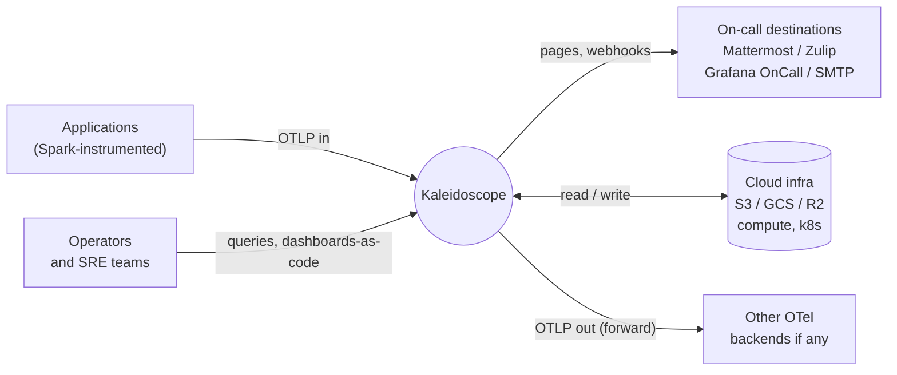
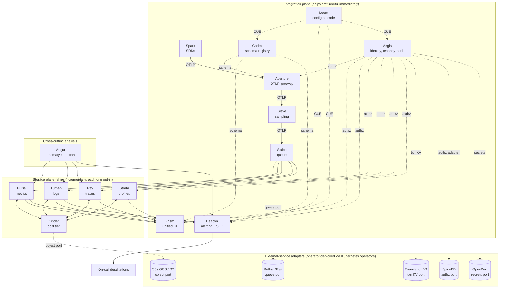

# Kaleidoscope — architectural model

> **Companion to** [`../roadmap/kaleidoscope-implementation-roadmap.md`](../roadmap/kaleidoscope-implementation-roadmap.md).
>
> The roadmap describes *when* Kaleidoscope is built. This document describes *how* it is structured. Three views that build on each other, plus an explicit phasing layer that says which parts of the structure ship first.

---

## View 1 — System context

What Kaleidoscope is at its boundary.



The boundary is OpenTelemetry. Applications emit OTLP. Operators query and configure. Cloud storage holds telemetry data. On-call destinations receive alerts. Kaleidoscope can also forward OTLP downstream so it integrates with anything OTel-compatible.

---

## View 2 — Container view, with port boundaries

The fifteen Kaleidoscope components, the OTLP wire contracts between them, and the port boundaries to external-service adapters.



Solid arrows are OTLP signal flows. Dotted arrows are port boundaries — a Kaleidoscope component on one side, a port-conformant adapter on the other.

The integration plane (top sub-graph) is what ships first. It is genuinely useful by itself, paired with any OTLP-compatible storage backend the operator already runs. The storage plane (middle sub-graph) ships incrementally afterwards, and each storage component is opt-in when it lands.

---

## View 3 — Architectural strata

Five layers, top to bottom, ordered by how Kaleidoscope-specific they are.

```
┌──────────────────────────────────────────────────────────────────┐
│              Kaleidoscope components (first-party code)          │
│  Spark · Aperture · Sieve · Sluice · Codex · Pulse · Lumen ·     │
│  Ray · Strata · Cinder · Prism · Beacon · Aegis · Loom · Augur   │
├──────────────────────────────────────────────────────────────────┤
│                    Ports (interfaces + tests)                    │
│  queue · embedded KV · transactional KV · authz · secrets ·      │
│  federation broker · object storage · query engine · schema      │
├──────────────────────────────────────────────────────────────────┤
│       Adapters (today: FOSS; tomorrow: Kaleidoscope-native)      │
│  NATS JetStream · RocksDB · FoundationDB · SpiceDB · OpenBao ·   │
│  Dex · OpenDAL → S3 / GCS / R2 · DataFusion · CUE                │
├──────────────────────────────────────────────────────────────────┤
│         Substrate (foundation libraries; not behind a port)      │
│  Apache Arrow · Apache Parquet · Apache Iceberg · Apache         │
│  DataFusion · Tokio · Hyper · Tonic · Protobuf · pprof · OTLP    │
├──────────────────────────────────────────────────────────────────┤
│              Runtime (language-level, not replaceable)           │
│  Rust std · Go std                                               │
└──────────────────────────────────────────────────────────────────┘
```

A *component* is first-party Kaleidoscope code. A *port* is an interface plus its conformance test vectors. An *adapter* is a concrete implementation of a port. *Substrate* libraries are so foundational, with so little re-licensing risk under Apache Foundation governance, that they are exempt from the port discipline. *Runtime* is the language platform itself.

The upper three layers are where Kaleidoscope's differentiation lives. The lower two are the soil.

---

## The phasing layer — what ships when

| Phase | Calendar | What ships | First useful workflow |
|---|---|---|---|
| 0 | Months 0–2 | Codex + Spark + OTLP conformance harness | Instrumented services emit standard OTLP |
| 1 | Months 2–4 | Aperture + Prism v0 | Telemetry routed through Aperture; viewable in Prism over the user's existing OTel-compatible backend |
| 2 | Months 4–6 | Beacon + Aegis + Loom v0 | SLO-backed alerting, multi-tenant access, dashboards-as-code, all on top of the user's existing storage |
| **MVP** | **Month 6** | **First deployable Kaleidoscope** | **The integration plane works in production over any existing OTel backend** |
| 3 | Months 6–10 | Lumen (first-party log engine) | Optional migration off Loki / Elasticsearch |
| 4 | Months 10–14 | Pulse (first-party metrics engine) | Optional migration off Mimir / VictoriaMetrics |
| 5 | Months 14–18 | Ray (first-party trace engine) + Sieve v1 | Optional migration off Tempo |
| 6 | Months 18–22 | Strata + cross-pillar exemplars | Full four-pillar correlation |
| 7 | Months 22–26 | Cinder + Sluice durability + DR | Production-grade retention and disaster recovery |
| 8 | Months 26–30 | Native queue (first port escape hatch) | Stops depending on Kafka / NATS |
| 9 | Months 30–36 | Native authz + Augur v0 | Stops depending on SpiceDB; ships modest anomaly detection |

Calendar is wall-clock time, not effort. The roadmap document carries the per-phase deliverables, exit criteria, and dependency graph; this document carries the structural shape and the high-level phase summary.

---

## The five things this model commits Kaleidoscope to

1. Kaleidoscope is **integration plane plus storage plane plus cross-cutting analysis**, three concentric layers of differentiation.
2. The integration plane is **shippable in six months** and useful from day one, paired with any OTel-compatible backend the operator already runs.
3. Each storage engine is **opt-in** when it ships. Operators migrate when they choose; Kaleidoscope coexists with their existing stack until they are ready.
4. **Every external dependency hides behind a port.** The day RocksDB, FoundationDB, SpiceDB, or any other dependency misbehaves, the adapter swaps; the component code stays.
5. **Substrate is locked at the Apache Foundation level.** Arrow, Parquet, DataFusion, Iceberg are exempt from port discipline because their re-licensing risk is structurally near-zero.

---

## Glossary

| Term | Definition |
|---|---|
| Component | A first-party Kaleidoscope service. There are fifteen, named after parts of an optical instrument. |
| Port | An interface a Kaleidoscope component depends on, plus a conformance test suite. Ports are the swap points where dependencies can be replaced. |
| Adapter | A concrete implementation of a port. Today's adapters bind to FOSS dependencies; tomorrow's may be Kaleidoscope-native. |
| Substrate | A foundation library so stable and structurally protected (Apache Foundation governance, open formats) that it is exempt from port discipline. |
| Integration plane | The nine components that handle ingest, schema, identity, alerting, UI, and config — everything that is not storage or analysis. Ships first. |
| Storage plane | The five components that hold the four telemetry signals and the cold tier. Ships incrementally; each is opt-in. |
| OTLP | The OpenTelemetry Protocol; Kaleidoscope's external wire contract for every signal type. |
| Operator (architectural) | The in-process boundary inside a component that mediates port traffic and allows adapter swaps. |
| Operator (deployment) | A Kubernetes-style controller that automates the lifecycle of an external-service adapter (deploy, scale, backup, restore, upgrade). |
