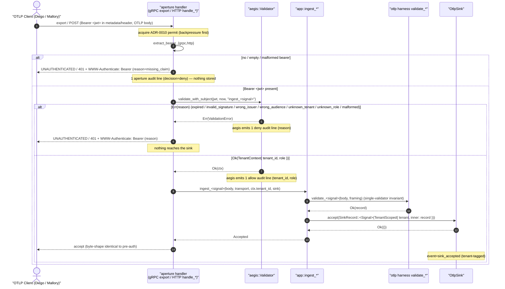

# DESIGN Decisions — aegis-ingest-auth-v0

> **Wave**: DESIGN (nWave). **Architect**: Morgan (`nw-solution-architect`).
> **Date**: 2026-06-06. **Mode**: PROPOSE (autonomous). **Paradigm**: Rust
> idiomatic (data + free functions + traits where polymorphism is genuinely
> needed) — set by CLAUDE.md, not re-asked.
> **Decision record**: **ADR-0068**
> (`docs/product/architecture/adr-0068-aegis-ingest-auth.md`).
> **Security-critical**: fail-closed posture + secret-handling are load-bearing.

This wave wires the correct-but-unwired `aegis::Validator` onto the live
`aperture` OTLP ingest path, fail-closed. It resolves the six DISCUSS
decisions DD1-DD7 and specifies the tenant ripple, the fail-closed default,
the test seam, and the semver posture. Full reasoning + alternatives live in
ADR-0068; this file is the feature-local decision summary.

## The six (+ one) decisions resolved

### DD1 — aperture config wiring; secret never logged
New TOML sub-table **`[aperture.security.auth.jwt]`** (sibling to
`[aperture.security.auth.spiffe]`), `#[serde(deny_unknown_fields)]`. Fields:
`issuer`, `audience`, `secret_file` (PATH to the HS256 bytes — **never inline**),
`catalogue_path`. Aperture reads the secret file at composition, hands the bytes
straight to `aegis::ValidatorConfig`, and **stores only `secret_file: PathBuf`**
on its `Config` — the bytes never reach a loggable field. aegis already
opaque-Debugs the key; aperture must not undo it. aperture gains a non-wildcard
`aegis = { path = "../aegis" }` dep and constructs an `Arc<aegis::Validator>`
once at composition (`load_catalogue` + `Validator::new`).

### DD2 — token extraction per transport + exact reject mapping
- **gRPC**: read `request.metadata().get("authorization")` as `Bearer <jwt>`.
  Reject → `Status::unauthenticated(<aegis reason()>)`. Missing/empty/malformed
  bearer → reason `missing_claim` decided at the extraction boundary.
- **HTTP**: read `headers.get(AUTHORIZATION)` as `Bearer <jwt>`. Reject → **401**
  + `WWW-Authenticate: Bearer error="invalid_token", error_description="<reason>"`
  (RFC 6750), body = the reason string.
- **Ordering preserved**: gRPC `permit → auth → ingest`; HTTP
  `permit → auth → content-type(415) → ingest`. Auth is the outermost gate after
  backpressure; a tokenless caller learns nothing about the body. The status/body
  carries the aegis `reason()` taxonomy verbatim — **never** the secret or the token.

### DD3 — authenticated tenant ripple
`ingest_*(body, transport, tenant: TenantId, sink)` gains the tenant parameter.
`SinkRecord` variants carry the tenant via `Logs(TenantScoped<ExportLogsServiceRequest>)`
where `pub struct TenantScoped<T> { pub tenant: TenantId, pub inner: T }` —
additive-by-composition, makes "every accepted record is tenant-tagged" a
**type-level guarantee**. `OtlpSink::accept(record)` signature unchanged (tenant
rides inside the record → no sink-implementor break). `summarise_record` is a
one-line change per arm (`req` → `&scoped.inner`). **Single-validator invariant
preserved**: that gate counts OTLP-harness `validate_*` call sites; the auth check
is a *different* symbol (`aegis::Validator::validate_with_subject`) in the
transport handler, not in `ingest_*`. Harness call-site count stays one per signal.

### DD4 — fail-closed default: refuse-to-start (mirror ADR-0061)
**Auth is on whenever the ingest listeners bind; no off switch.** Absent /
incomplete / unreadable `[aperture.security.auth.jwt]` (missing field, unreadable
`secret_file` or `catalogue_path`, unparseable catalogue) → **refuse to start** at
`RawConfig::into_config` (the ADR-0061 seam) → `ConfigError` → `main.rs` **exit 2**
→ `event=config_validation_failed` naming the missing/unreadable config **by
reference** → **no listener binds** (structural: `Config` never constructed). A
complete, readable config starts normally. **No opt-out flag** (a default-OFF flag
is the ADR-0061 silent-downgrade trap). Exit 2 = config error (distinct from
ADR-0066 exit 3 serve-failure). The SPIFFE/TLS `=true` refusals (ADR-0061) remain
independent invariants in the same validator; aegis v0 is HS256, SPIFFE is v1.

### DD5 — audit / observability: aegis owns the per-request decision event
**Aperture does NOT emit its own deny event for validated requests.** It calls
`validate_with_subject(_, _, "ingest_<signal>")`; aegis's single
`info!`(allow)/`warn!`(deny) event (`validator.rs:186-209`) — fields
`tenant_id`/`role`/`decision`/`subject`/`reason` — is the one source of truth.
Exactly one event per validated request, no double/zero-logging. **The one
pre-validate case** (no/empty/malformed bearer, decided before `validate`) is the
**only** aperture-owned authz line: `decision=deny reason=missing_claim
subject=ingest_<signal> transport=<grpc|http>`, same field shape, fires only on
that path. So the "exactly one decision event per request" invariant holds across
all paths. A `transport=` field is added to the deny axis. No secret, no raw token,
in any field.

### DD6 — scope fence + role question
**Scope**: ingest path only (gRPC + HTTP, 3 signals, full reject matrix). Read-path
auth = separate future feature. SPIFFE/RS256/JWKS/OPA = aegis v1, OUT.
**Role question — RESOLVED: v0 is authentication-only; role-gating deferred.** Any
valid token for a catalogued tenant (`viewer` OR `operator`) may ingest. aegis
still rejects `unknown_role` for free (a role that is neither). v0 does NOT reject a
valid `viewer` on the write path — that authorization decision is deferred to a
clean follow-up (the `TenantContext.role` is already threaded to the handler; the
follow-up adds one `if ctx.role != Operator { reject }` gate, no re-plumbing).
Rationale: the audit's minimum fail-closed property is authentication + tenant
tagging; role-gating is a separable authorization concern best answered with the
read-path role matrix in view, and deferring keeps the live-gateway blast radius
minimal. Satisfies US-AUTH-05 "DD6 resolved".

### DD7 — aegis "JWKS" doc overstatement: adjacent, NOT folded
`aegis/src/lib.rs:18-23,39-41` says "JWKS"; the validator is HS256 pre-shared-key
only. **Decision: flag adjacent, do NOT fold.** It touches aegis (outside this
feature's modified-file set) and would pull aegis back into the 100%-mutation scope
for a non-behavioural change. Disposition: a `docs:` fix-forward on the closed wave
or a trivial micro-wave. Correct text: "validates against a configured issuer +
audience using a pre-shared HS256 key (RS256/JWKS is v1)".

## Reuse Analysis (mandatory)

| Capability | Verdict | Source |
|---|---|---|
| HS256 validation (sig/exp/iss/aud/tenant/role) | **REUSE verbatim** | `aegis::Validator::validate(_with_subject)` |
| `TenantContext`/`TenantId`/`Role` | **REUSE verbatim** | aegis `validator.rs` |
| `ValidationError` + `reason()` (8 variants) | **REUSE verbatim** | aegis `validator.rs:74-108` |
| `Validator::new` / `ValidatorConfig` | **REUSE verbatim** | aegis `validator.rs:162` |
| `load_catalogue` / `TenantCatalogue` | **REUSE verbatim** | aegis `catalogue.rs` |
| one-audit-event-per-call + field contract | **REUSE verbatim** | aegis `validator.rs:186-209` |
| opaque-Debug for the key | **REUSE verbatim** | aegis `validator.rs:149-158` |
| refuse-to-start at config validation | **REUSE pattern** | ADR-0061 `into_config` → exit 2 |
| concurrency permit ordering | **REUSE/EXTEND** | ADR-0010 (permit → auth → ingest) |
| `Arc<dyn OtlpSink>` composition | **EXTEND** | add `Arc<Validator>` to services + `HttpState` |
| aperture config schema | **EXTEND** | `[aperture.security.auth.jwt]` table |
| ingest path | **EXTEND** | `ingest_*` + `SinkRecord` tenant via `TenantScoped` |
| transport handlers | **EXTEND** | 6 handlers extract → validate → reject/accept |
| bearer extraction + reject mapping | **CREATE** | `extract_bearer_{grpc,http}` + `reject_to_{status,http}` |
| jwt config fields | **CREATE** | HS256 secret-file/issuer/audience/catalogue-path |

## Tenant ripple map

```
gRPC export(req) / HTTP handle_*(headers, body)
  └─ permit (ADR-0010)                          [unchanged]
  └─ extract_bearer_{grpc,http}  ── miss/empty/malformed ─→ reject (reason=missing_claim) + 1 aperture audit line + nothing stored
        │  Bearer <jwt>
        └─ validator.validate_with_subject(jwt, now, "ingest_<signal>")
              ├─ Err(e) ─→ Status::unauthenticated(e.reason()) / 401+WWW-Authenticate ; 1 aegis audit line ; nothing stored
              └─ Ok(ctx) ─→ ingest_<signal>(body, transport, ctx.tenant_id, sink)
                                └─ validate_<signal>(body, framing)   [OTLP harness, single-validator invariant — 1 call site]
                                      └─ Ok(rec) ─→ sink.accept(SinkRecord::<Signal>(TenantScoped{ tenant, inner: rec }))
                                                       └─ event=sink_accepted (tenant-tagged) ; 1 aegis allow audit line
```

Touched files: `aperture/Cargo.toml` (aegis dep), `config/mod.rs` (jwt table +
`into_config` refusal), `ports/mod.rs` (`TenantScoped` + `SinkRecord` payloads),
`app.rs` (3 `ingest_*` signatures + 3 constructions + 3 `summarise_record` arms),
`transport.rs` (6 handlers + extraction fns + composition wiring),
`tests/common` (token-minting fixture + auth config). aegis: **unchanged**.

## Fail-closed posture (summary)

| Condition | Result | Event | Exit | Listener bound? |
|---|---|---|---|---|
| `[…auth.jwt]` complete + readable | Start, ingest authenticated | `startup` then `ready` | runs | Yes (4317+4318) |
| `[…auth.jwt]` absent | **Refuse** | `config_validation_failed` names missing auth config | 2 | No |
| required field missing | **Refuse** | names the missing field | 2 | No |
| `secret_file`/`catalogue_path` unreadable | **Refuse** | names the path (no secret bytes) | 2 | No |
| catalogue unparseable | **Refuse** | names the catalogue path | 2 | No |
| no/empty/malformed bearer (runtime) | **Reject**, nothing stored | 1 deny line `reason=missing_claim`/`malformed` | n/a | n/a |
| invalid token (runtime) | **Reject**, nothing stored | 1 aegis deny line, matching `reason` | n/a | n/a |
| valid catalogued token | **Accept**, tenant-tagged | 1 aegis allow line + `sink_accepted` | n/a | n/a |

## Test seam (for DISTILL)

Drive end-to-end through the **real aperture binary**; mirror `slice_02` (HTTP),
`slice_07` (config), `tests/common`. Mint HS256 tokens in-suite with the test
config's secret + a catalogued test tenant; present over gRPC metadata / HTTP
header. Assert: valid → accept (byte-shape identical) + sink record carries
`tenant_id`; each negative control (no/empty/malformed/expired/bad-sig/wrong-iss/
wrong-aud/unknown-tenant/unknown-role) → `UNAUTHENTICATED`/`401`+`WWW-Authenticate`
with matching `reason` + empty sink + exactly one deny audit line (stderr-capture
seam). Config: no-jwt-table / unreadable-secret-file → exit-2,
`config_validation_failed`, no listener, no secret bytes. Non-regression:
`invariant_single_validator` stays green; `slice_0*` green once they supply a token
+ auth config.

## Semver posture

`aperture` + `aegis` are **not** in Gate 2/3 public-API set. aperture changes are
crate-internal (`Config` fields `pub(crate)`; `ingest_*`/`SinkRecord` `pub` but only
aperture constructs them). The `ingest_*`/`SinkRecord` change is breaking to in-crate
callers only, additive-in-spirit (every record gains a guaranteed tenant). aegis
**unchanged**. Pre-1.0 for both; minor/patch-level internal evolution under 0.x.
**NEVER 1.0.0.**

## Constraints

- Reuse the aegis validator verbatim — no crypto change.
- HS256 secret never logged (Debug/Display/error/audit/reject) — structural, not discipline.
- Fail-closed: any ambiguity rejects; no token = no ingest; refuse-to-start without auth config.
- No regression of the existing ingest happy path / backpressure / shutdown / serve-loop.
- Audit field contract locked by aegis D5; one decision event per request.
- Per-feature mutation testing 100% on the **modified aperture files** (CLAUDE.md / ADR-0005 Gate 5).
- Rust idiomatic; pure trunk-based; never 1.0.0.

## Upstream Changes (DELIVER will land)

- `crates/aperture/Cargo.toml`: add `aegis = { path = "../aegis" }` (non-wildcard).
- `config/mod.rs`: `[aperture.security.auth.jwt]` schema + `Config` `PathBuf`/string fields
  + `into_config` refuse-to-start invariant + builder setters.
- `ports/mod.rs`: `TenantScoped<T>`; `SinkRecord` variants carry it.
- `app.rs`: `ingest_*` tenant parameter; `SinkRecord` construction; `summarise_record` arms.
- `transport.rs`: `extract_bearer_{grpc,http}`, `reject_to_{status,http}`, `Arc<Validator>` on
  services + `HttpState`, the 6 handler auth steps, the one pre-validate aperture audit line.
- `tests/common`: token-minting fixture + auth-config fixture; existing slice tests supply a token.
- **Adjacent (NOT this feature, DD7)**: aegis `lib.rs` "JWKS" → "HS256 pre-shared key" doc fix.

## Risks (carried from DISCUSS, design dispositions)

| ID | Risk | Design disposition |
|----|------|--------------------|
| R1 | Live gateway — auth changes WHO can write (max blast radius). | Thin slicing (WS = gRPC logs); negative control (valid token still ingests) every slice; auth-only (not role-gated) keeps the step minimal. |
| R2 | HS256 secret leaks into a log/error/Debug. | DD1 structural: config stores `PathBuf` not bytes; aegis opaque-Debug; path-only errors; no token/secret in audit. |
| R3 | Gated-OFF default ships an open gateway silently. | DD4: no opt-out flag; refuse-to-start without auth config (ADR-0061). |
| R4 | `ingest_*`/`SinkRecord` ripple regresses happy path/backpressure/shutdown. | DD3 bounded ripple; tenant rides inside record (response shape untouched); non-regression AC + existing tests green. |
| R5 | Duplicate/missing audit lines once aperture adds its own deny event. | DD5: aegis owns the validated-request event (one source of truth); aperture owns only the pre-validate no-token line. |
| R6 | No DIVERGE artifacts. | Job grounded in four-quadrants report + aegis-v0 D10 + ADR-0061 + verified code; non-blocking. |

## C4 — Sequence (the auth boundary on the ingest path)


