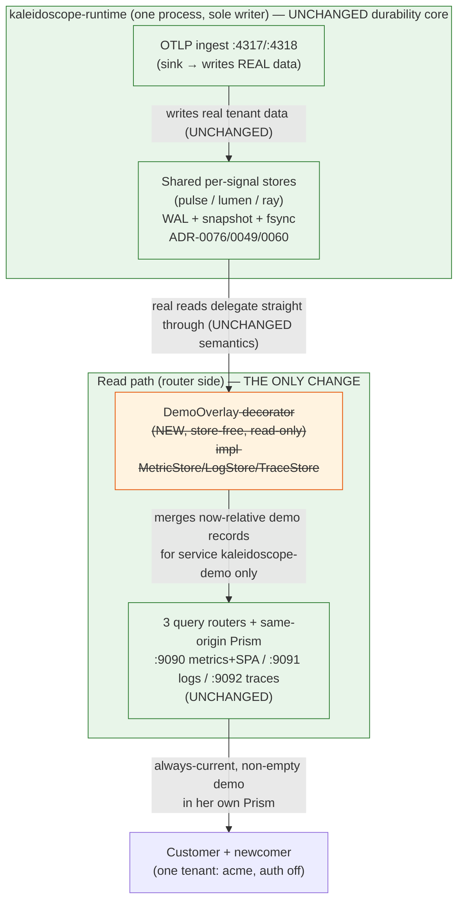

# Always-current demo lifecycle — options, trade-offs, recommendation

DESIGN wave, `always-current-demo-v0`. Author: Morgan (`nw-solution-architect`),
PROPOSE mode. Every claim is cited to source read this run (`file:line`) or named
explicitly as a DELIVER must-verify. Companion decision: ADR-0079.

## The problem, grounded

The managed consolidated-runtime instance is handed to an outsider as an
"always-current" experimentable stack. Today the demo is a **one-time** seed
(`crates/kaleidoscope-telemetrygen`) of **fixed-timestamp** telemetry — one
failed checkout span under trace `4bf92f3577b34da6a3ce929d0e0e4736`, three
healthy traces, one `request_count` metric, one `checkout failed: card declined`
cause log (`crates/kaleidoscope-telemetrygen/src/lib.rs:319-423`) — pushed once
over OTLP into the runtime. Two grounded facts make it go stale and
un-refreshable:

1. **The stores append on ingest with no dedup.** Confirmed in all three:
   - ray: `apply_ingest` does `indices.by_trace.entry(...).or_default().push(span.clone())`
     and the same into `by_service` (`crates/ray/src/file_backed.rs:335-355`).
     Re-pushing the same `span_id` appends a duplicate.
   - lumen: `bucket.extend(batch.records)` (`crates/lumen/src/file_backed.rs:230`).
   - pulse: `entry.points.extend(points)` (`crates/pulse/src/file_backed.rs:474`).
2. **There is no delete / reset / retention / purge capability on any store.**
   The three store ports — `TraceStore` (`crates/ray/src/store.rs:66-95`),
   `LogStore` (`crates/lumen/src/store.rs:76-95`), `MetricStore`
   (`crates/pulse/src/store.rs:72-99`) — expose only `ingest` + `query` +
   `query_with` + (`get_trace`). No `delete`, `reset`, `clear`, `retain`, or
   `purge` exists anywhere in `crates` (grep, this run). And the demo shares
   tenant `acme` with the Customer's OWN ingested telemetry (`compose.yaml:39`,
   `crates/kaleidoscope-telemetrygen/src/lib.rs:59`), so you cannot clear the
   demo without clearing her data. `make clean` wipes the whole shared volume
   (`Makefile:74-76`, `compose.yaml:101-103`).

**Consequence.** A newcomer opening the instance a day after seeding sees an
**empty demo** — the fixed timestamps fall outside any rolling query window — and
re-seeding to refresh it just **accumulates duplicates**.

### Load-bearing read-path finding (constrains every "separate tenant" option)

With auth **off** (the managed instance's deliberate local posture — W3,
ADR-0077; `compose.yaml:36-42`, `read_auth: None` at
`crates/kaleidoscope-runtime/src/main.rs:113`), **each query router is pinned to
ONE query tenant** resolved from the unified `KALEIDOSCOPE_TENANT`
(`crates/kaleidoscope-runtime/src/main.rs:104-109`), and Prism is served
same-origin against that one tenant (ADR-0078). A demo placed in a **separate
`demo` tenant would not be visible in the Customer's Prism** without either
turning auth on (per-request tenant on the bearer — exactly the ceremony the
local posture removed) or standing up a second query origin. **The demo must
live in the same `acme` query tenant, distinguished by service identity
(`service.name = kaleidoscope-demo`, the demo trace ids, the `request_count`
metric), not by tenant.** This single fact downgrades Option 1 substantially.

### The composition-root seam (where a read-side change can live safely)

`spawn_consolidated` coerces the **same** store `Arc` for read and write
(`crates/kaleidoscope-runtime/src/lib.rs:303-309`): the sink writes through it,
the query routers read through it — that shared-`Arc` is read-your-write
(ADR-0076 DD2). The routers are then built from `metric_dyn` / `log_dyn` /
`trace_dyn` at lines 349-384, **after** the Earned-Trust read probes at lines
320-336. This is the natural, store-free seam: a read-side decorator can wrap the
`Arc<dyn …Store>` **on the router side only**, leaving the sink/write side and the
durability path (WAL + snapshot + fsync; ADR-0076/0049/0060) entirely untouched.

## Quality attributes that drive the decision (ISO 25010)

| Driver | Why it dominates here |
|--------|-----------------------|
| **Reliability / recoverability (primary)** | The stores are the durability foundation; real tenant data must survive and must not be put at risk. Any change to ingest/WAL/snapshot for real data is sensitivity-critical. |
| **Usability / "always-current" (primary)** | A newcomer must see a non-empty, current demo on any day, with no operator action. |
| **Maintainability / blast radius (secondary)** | Trunk-based, Rust-idiomatic; prefer reuse, smallest surface, no new durability-critical code. |
| **Functional faithfulness (secondary, tradeable)** | The demo should stay close to the real ingest→store→query pipeline — but honestly tradeable against safety, per the brief. |

## Options evaluated

| # | Option | Faithfulness to real pipeline | Durability / store risk | Complexity | Delivers "current + no-accumulation + Customer untouched"? | New store capability? |
|---|--------|-------------------------------|--------------------------|------------|-------------------------------------------------------------|------------------------|
| 1 | **Tenant separation + per-tenant reset** | High (real ingest→store→query) | **High** — new WAL-logged `reset(tenant)` on all three stores; must survive recovery; touches the sole-writer durability path | **High** — *and* needs read-path tenant separation (auth-on or 2nd origin) because auth-off Prism queries ONE tenant (`main.rs:104-109`) | Partially — current+no-accum yes; Customer-untouched only if reset is provably tenant-scoped; **demo not visible in her Prism** without more work | **Yes** (durability-critical) |
| 2 | **Store-level retention / TTL** | High | **High** — background eviction by age touches the Customer's **real** durable telemetry; contradicts the "telemetry survives `make down`" promise (`Makefile:55-57`) | Medium | **No** — TTL caps accumulation but does NOT make the demo *current*; re-seed still needed; silently deletes real data | **Yes** (durability-critical) |
| 3 | **Query-time synthesis for the demo identity (READ-time, store-free)** | **Medium** — write path bypassed for the demo only; the query→Prism half the newcomer actually explores is 100% real | **None** — nothing is stored; no WAL, no snapshot, no fsync, no new trait method; durability path untouched | **Low** — a read-side decorator in the composition root + a small synth module | **Yes, by construction** — now-relative timestamps never stale; nothing stored never accumulates; demo never enters a store so Customer data is untouchable | **No** |
| 4 | **Re-seed + ingest-side dedup (upsert by identity)** | High | **Highest** — every store's `apply_ingest` becomes upsert-by-identity; changes append-only WAL semantics, snapshot, ray's no-drift dual-index guarantee + its mutation gate | High | **No** — dedup caps duplicates but identical-identity re-seed is NOT current; current re-seed (new timestamps) still accumulates unless ALSO deleted (back to #1/#2) | **Yes** (most invasive, durability-critical) |
| 5 | **Operational-only: separate throwaway demo instance/volume** | High (within the demo stack) | None (different volume) | Medium (a 2nd stack + a recreate cadence) | Partially — current (coarse, whole-stack recreate) + no-accum + Customer-untouched, but **NOT "the same instance she uses"**: demo is a different origin she never opens | No |

### Per-option notes

- **Option 1** is the most faithful but the most invasive: a `reset(tenant)`
  that is durability-honest must be WAL-logged and replayed on recovery (else a
  crash mid-reset resurrects the demo or, worse, a recovery bug touches real
  data), and it *still* leaves the demo invisible in the auth-off single-tenant
  Prism. Two hard problems to solve a soft one.
- **Option 2** is the wrong instrument: TTL is a data-retention *policy on real
  telemetry*, and the durability foundation's whole point is that real telemetry
  survives. It also does not deliver currency.
- **Option 3** trades *write-path* fidelity for *total* store safety and
  *structural* currency. The honest cost: the demo records do not exercise the
  real ingest→WAL→snapshot path. Mitigated by keeping the existing real
  `telemetrygen` push available (`make demo`) for anyone who wants to see the
  genuine write path and dogfood `spark` — synthesis is the *always-current*
  layer; the real seed remains the *real-pipeline* demonstration.
- **Option 4** puts the heaviest possible change on the most sensitive code
  (the sole-writer ingest path for real data) and still does not cleanly deliver
  currency. Highest blast radius, lowest payoff.
- **Option 5** has zero store risk but fails the literal requirement: the demo
  must be current **on the instance she uses**, in her Prism — a separate origin
  is not that.

## Recommendation — Option 3, query-time synthesis, store-free, service-scoped

**Recommend the least-invasive option that genuinely satisfies all four hard
constraints: query-time synthesis of the demo records, scoped to the demo
service identity, wired as a read-side decorator in the composition root.**

It is the only option that satisfies *all four* by construction rather than by
careful policy:

- **Always-current** — timestamps are computed `now - offset` at read time, so
  the demo always lands inside a rolling Prism window. ✓ structurally.
- **No accumulation** — nothing is ever written to a store. ✓ structurally.
- **Customer data untouched** — the demo never enters a store, never shares a
  WAL/snapshot, never needs a reset that could reach her data. This is the
  *strongest possible* form of "untouched": not "we are careful", but "the demo
  cannot physically reach her data because it has no write path". ✓ structurally.
- **Reasonably faithful** — the half a newcomer explores (the real query routers:
  PromQL subset, label matchers, by-id trace lookup, the `error=true` filter, the
  trace-with-logs join, Prism rendering) is **100% real**. Only the demo's
  *write* path is synthetic, and that is the half a newcomer never sees.

It adds **no new store capability**, touches **no durability-critical code**
(zero blast radius on ADR-0076/0049/0060), and lives entirely in a small new
read-side module plus a few lines in the composition root. A bonus property: the
demo is present even on a fresh empty volume (`make clean`), because it is
store-free — the newcomer literally cannot get an empty stack.

**Honest trade, stated plainly:** we give up "the demo exercises real
ingest+durability". We keep that demonstration alive and explicit through the
existing real `telemetrygen` push on `make demo`, which is the right tool for
*that* job.

### What changes, what does not (C4-ish container/component sketch)

- **Unchanged:** ingest/sink, all three stores, WAL/snapshot/fsync, the query
  routers, Prism, the single-tenant auth-off posture. The decorator **delegates
  every real read straight through**, so the Customer's read-your-write is
  byte-identical.
- **New:** one small read-side module — `DemoOverlay<S>` — that implements the
  same three store traits, delegates to the inner real store, and for queries
  matching the demo identity (`service.name = kaleidoscope-demo`, the demo trace
  ids, the `request_count` metric) **also** synthesises now-relative records and
  merges them into the returned `Vec`. Wired in `spawn_consolidated` between the
  shared `Arc` and the routers (around `crates/kaleidoscope-runtime/src/lib.rs:307-384`),
  on the **router side only** (the sink keeps the inner store).

### Earned Trust (principle 12) — the overlay's own probe

The overlay is a new read-side adapter, so it carries a first-class probe
obligation under the same "wire → probe → use" invariant the runtime already
enforces (`crates/kaleidoscope-runtime/src/lib.rs:320-336`). After wiring, the
composition root MUST issue a demo query through the overlay and assert the
synthetic now-relative records come back inside a rolling window; if they do not
(clock skew, timezone, window-math, or offset bug — the exact failure mode that
made the original demo go empty), the runtime **refuses to start** with a
structured `health.startup.refused`, rather than booting into a silently-empty
demo. This is cheap, in-process, and discharges the obligation honestly. The
probe must exercise the *currency* lie specifically: a demo record anchored
outside the window must fail the probe.

Enforcement (principle 11): a Rust CI static check (concrete tool chosen in
DELIVER — a `compile_fail`/trybuild guard, a custom-lint/CI gate, or an enforced
review-checklist item; ArchUnit is Java-only and has no direct Rust equivalent)
that `DemoOverlay` never calls a write/`ingest` method on its inner store (the
overlay is provably read-only) — a structural guard that keeps the "store-free,
cannot touch real data" property from eroding.

**Demo identity scope.** The synthesised set is **hardcoded** to the ADR-0077
sample vocabulary — `service.name = kaleidoscope-demo`, the failed-checkout trace
id `4bf92f3577b34da6a3ce929d0e0e4736` + the three healthy ids
(`crates/kaleidoscope-telemetrygen/src/lib.rs:95,124-140`), the `request_count`
metric, the `checkout failed: card declined` cause log. No dynamic configuration
seam; extensibility is deferred until the demo grows beyond the seed vocabulary.
The non-demo identity match is O(1) (a static `service.name` comparison / id
set-membership), and a non-demo read bypasses synthesis entirely so Customer-read
latency and semantics are unaffected.

**Clock assumption.** Currency depends on a correct, NTP-synchronised host clock.
The startup currency probe catches offset/window-math/timezone *code* bugs;
production *clock skew* beyond the window duration is out of the probe's scope and
is mitigated operationally (host NTP + the CI HTTP smoke). Slice D records this in
`compose.yaml` and the getting-started docs.

## Slice plan (thin, independently-deliverable, for DELIVER)

Each slice is shippable on its own (one signal at a time, mirroring the existing
`slice_01..05` structure in `crates/kaleidoscope-runtime/tests`) and carries a
learning hypothesis. **None touches durability-critical code — that is the
headline safety result; the one item flagged for extra review is the overlay's
read-only invariant, not a store change.**

| Slice | Scope | Learning hypothesis | Durability-critical? |
|-------|-------|---------------------|----------------------|
| **A — Trace demo overlay** | `DemoOverlay` over `dyn TraceStore`: the failed-checkout span + 3 healthy traces, now-relative `start_time`, demo trace ids + `kaleidoscope-demo` service (identity **hardcoded** to the ADR-0077 vocabulary; extensibility deferred); delegate all non-demo reads (O(1) short-circuit). Wire on the router side; add the startup currency probe; land the read-only enforcement check. AC stated Given-When-Then (currency probe, pass-through fidelity, read-only invariant — see ADR-0079). | A newcomer opening the instance on **any** day sees the failed-checkout trace (and 3 healthy) in the rolling window, with the `error=true` filter still non-vacuous. | No (store-free) — review the read-only invariant + the probe. |
| **B — Log demo overlay** | `DemoOverlay` over `dyn LogStore`: the `checkout failed: card declined` cause log, now-relative, carrying the demo trace id so the trace-with-logs join lights up. | The by-trace-id logs view shows the cause log correlated to the demo trace, always current. | No (store-free). |
| **C — Metric demo overlay** | `DemoOverlay` over `dyn MetricStore`: `request_count` synthesised as now-relative points spanning the rolling window so the chart paints a fresh line. | The metrics chart in Prism paints a current demo series on any day. | No (store-free). |
| **D — Wire-up, de-stale the seed, prove the loop** | Default the managed instance to synthesis for the always-current demo; **keep `make demo` as the real `telemetrygen` push** for dogfooding/write-path demonstration (documented split); update getting-started docs + the CI HTTP smoke (ADR-0077 F5) to assert now-relative demo data returns for all three signals; record the honest fidelity trade in `outcome-kpis.md`; record the **host-clock NTP assumption** in `compose.yaml` + getting-started docs. | One command yields a non-empty, **current** demo with zero accumulation across restarts and across days; `make clean` no longer yields an empty demo (it is store-free). | No. |

Sequencing: A → B → C are parallel-safe (independent signals); D depends on at
least A landing and ideally all three. The existing real seed/`telemetrygen`
crate is **not deleted** — it is repositioned (Slice D) from "the always-current
demo" (which it cannot be) to "the real-pipeline / dogfood demonstration".

## External integrations

**None requiring contract tests.** The overlay is first-party, in-process, and
store-free; it consumes no external API. Consistent with ADR-0076/0077, no
consumer-driven contract test is recommended.

## References

- Stores append, no dedup: `crates/ray/src/file_backed.rs:335-355`;
  `crates/lumen/src/file_backed.rs:230`; `crates/pulse/src/file_backed.rs:474`.
- No reset/delete/retention on the ports: `crates/ray/src/store.rs:66-95`;
  `crates/lumen/src/store.rs:76-95`; `crates/pulse/src/store.rs:72-99`.
- Single-tenant auth-off read path: `crates/kaleidoscope-runtime/src/main.rs:104-115`;
  `compose.yaml:36-42`; ADR-0078 (same-origin Prism).
- Shared-Arc read/write seam + probes: `crates/kaleidoscope-runtime/src/lib.rs:303-384`.
- Existing demo seed: `crates/kaleidoscope-telemetrygen/src/lib.rs:59,319-423`;
  `compose.yaml:71-99`; `Makefile:59-76`.
- Durability foundation: ADR-0076 (consolidated runtime), ADR-0049/0060 (fsync),
  ADR-0059 (WAL torn-tail). Demo seed origin: ADR-0077.
</content>
</invoke>
