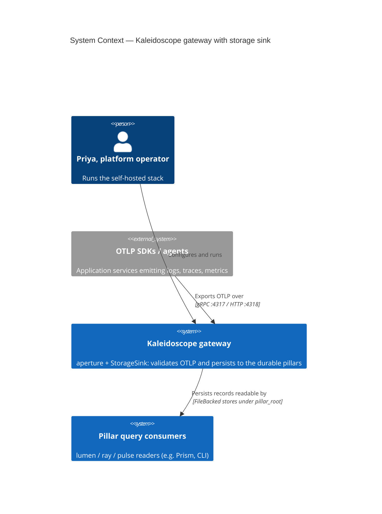
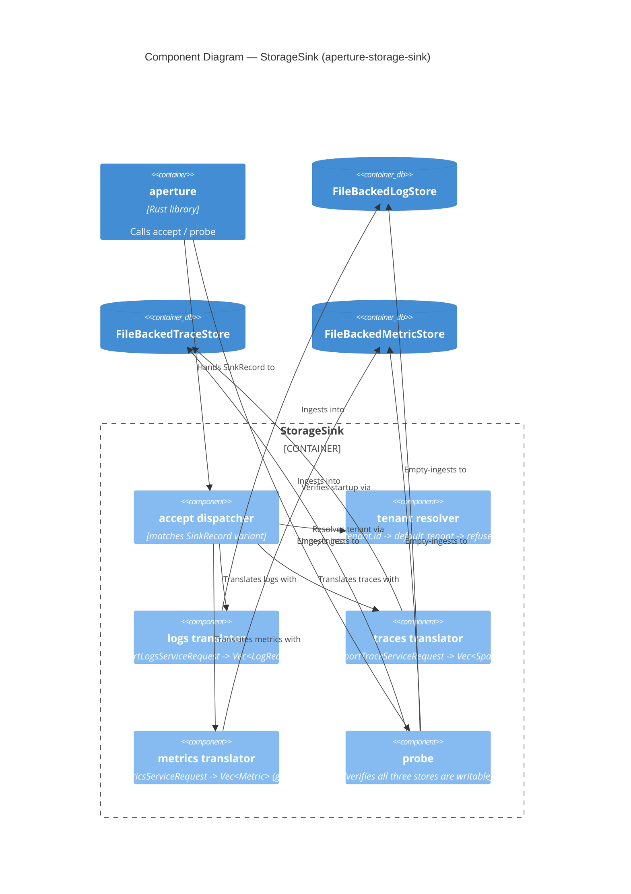
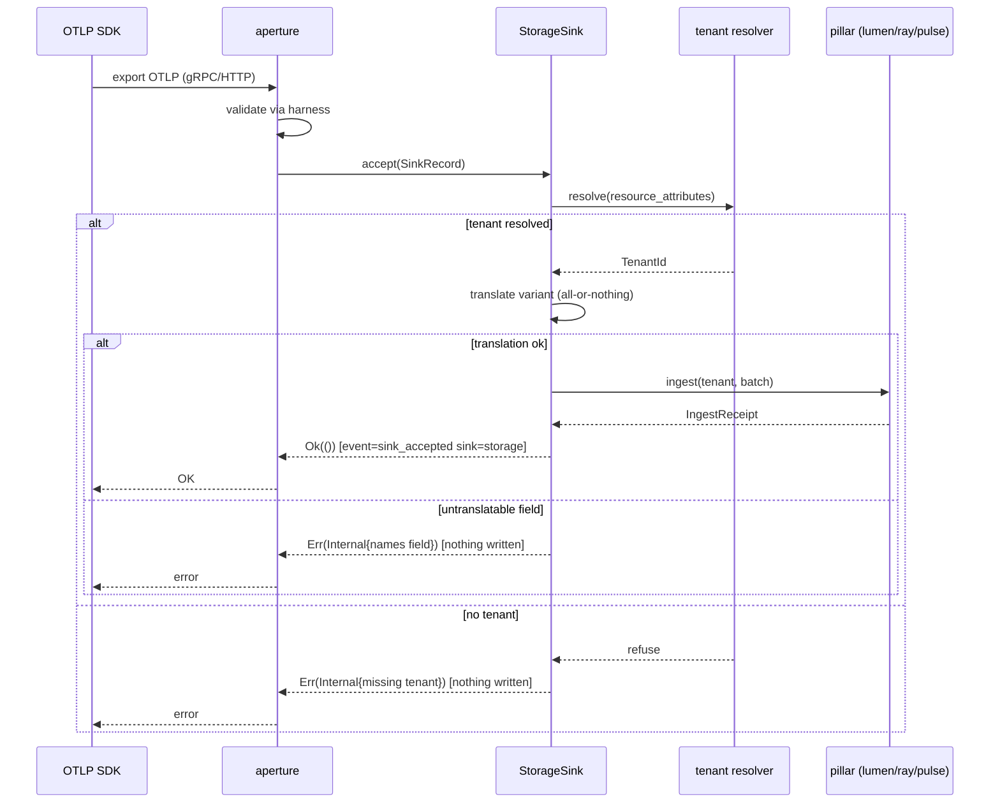
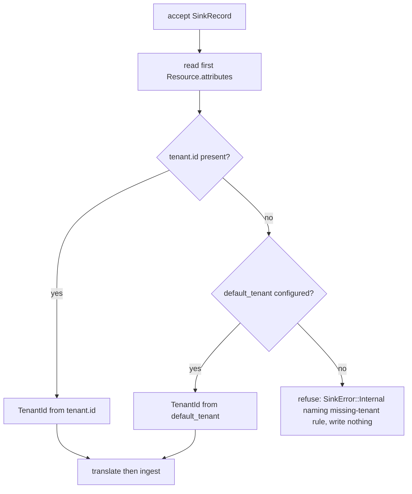

# Application Architecture: aperture-storage-sink-v0

Architect: Morgan. Date: 2026-05-21. Scope: application. British English, no em dashes.

This is the technical architecture for the third `OtlpSink`: a storage sink that
persists accepted OTLP records into the durable pillars (logs to lumen, traces to
ray, metrics to pulse). It gives ray and pulse their first production consumer and
lets the platform run end to end. Decisions DD1..DD12 live in the sibling
`wave-decisions.md`; the non-obvious decisions are in
`docs/product/architecture/adr-0041-aperture-storage-sink-translation-and-tenancy.md`.

---

## 1. System capabilities and boundaries

The `StorageSink` lives in a new crate `aperture-storage-sink` and is wired into a
running aperture instance by a host composition binary (`kaleidoscope-gateway`).
aperture remains a pure gateway with no knowledge of storage; the pillars remain
pure libraries with no knowledge of OTLP proto. The new crate is the only place
that knows both: it owns the OTLP-proto-to-pillar-type translation.

Dependency direction (inward, dependency-inversion preserved):

```
kaleidoscope-gateway (host bin)
        |
        v
aperture-storage-sink (StorageSink + 3 translators)
   |        |        |        |        \
   v        v        v        v         v
aperture  lumen     ray     pulse     aegis
(port)   (LogStore)(TraceStore)(MetricStore)(TenantId)
```

aperture has no outgoing edge to any pillar. The storage-sink crate depends on the
pillar *traits*, not the other way round.

---

## 2. C4 Level 1 — System Context



---

## 3. C4 Level 2 — Container

```mermaid
C4Container
  title Container Diagram — gateway, storage sink, durable pillars
  Person(operator, "Priya, platform operator")
  System_Ext(sdk, "OTLP SDKs / agents")

  Container_Boundary(host, "kaleidoscope-gateway (host composition binary)") {
    Container(aperture, "aperture", "Rust library", "Listens on :4317/:4318, validates via harness, hands SinkRecord to the injected OtlpSink")
    Container(storagesink, "StorageSink", "Rust (aperture-storage-sink)", "Translates SinkRecord to pillar types, resolves tenant, ingests")
  }

  ContainerDb(lumen, "lumen FileBackedLogStore", "WAL + snapshot under pillar_root", "Durable log records")
  ContainerDb(ray, "ray FileBackedTraceStore", "WAL + snapshot under pillar_root", "Durable spans")
  ContainerDb(pulse, "pulse FileBackedMetricStore", "WAL + snapshot under pillar_root", "Durable metric points")

  Rel(operator, host, "Runs with pillar_root + default_tenant")
  Rel(sdk, aperture, "Exports OTLP to", "gRPC / HTTP protobuf")
  Rel(aperture, storagesink, "Hands accepted SinkRecord to", "OtlpSink::accept")
  Rel(storagesink, lumen, "Ingests Vec<LogRecord> into", "LogStore::ingest(tenant, batch)")
  Rel(storagesink, ray, "Ingests Vec<Span> into", "TraceStore::ingest(tenant, batch)")
  Rel(storagesink, pulse, "Ingests Vec<Metric> into", "MetricStore::ingest(tenant, batch)")
```

---

## 4. C4 Level 3 — Component (StorageSink internals)

The storage sink has five collaborating internal responsibilities, justifying an
L3 view. Arrows are verbs; the diagram describes WHAT each part does, not HOW the
crafter implements it.



---

## 5. Sequence — accept fans out under a resolved tenant



---

## 6. Translation contracts (the heart)

These describe the field-by-field mapping from the real `opentelemetry-proto`
v0.27.0 types to the real pillar types. They are observable contracts (WHAT maps
to WHAT); the crafter owns the implementation. Resource attributes are read from
each `Resource.attributes` (`Vec<KeyValue>`) and folded into a
`BTreeMap<String,String>` via the shared attribute fold (see 6.4). Tenant is
resolved once per `accept` from the first resource's attributes (DD3).

### 6.1 Logs: `ExportLogsServiceRequest` -> `Vec<lumen::LogRecord>`

Iterate `resource_logs: Vec<ResourceLogs>` -> `scope_logs: Vec<ScopeLogs>` ->
`log_records: Vec<LogRecord>` (proto). For each proto `LogRecord`:

| pillar `lumen::LogRecord` field | source (proto) | mapping |
|---|---|---|
| `observed_time_unix_nano: u64` | `observed_time_unix_nano`, else `time_unix_nano` | use observed if non-zero, else event time |
| `severity_number: SeverityNumber(i32)` | `severity_number: i32` | wrap verbatim (`SeverityNumber(n)`) |
| `severity_text: String` | `severity_text: String` | verbatim |
| `body: String` | `body: Option<AnyValue>` | `AnyValue` -> String (see 6.5); `None` -> "" |
| `attributes: BTreeMap<String,String>` | `attributes: Vec<KeyValue>` | attribute fold (6.4) |
| `resource_attributes: BTreeMap<String,String>` | parent `ResourceLogs.resource.attributes` | attribute fold; carries `service.name` |
| `trace_id: Option<[u8;16]>` | `trace_id: Vec<u8>` | `Some` iff exactly 16 bytes; empty -> `None`; other length -> refuse (DD7) |
| `span_id: Option<[u8;8]>` | `span_id: Vec<u8>` | `Some` iff exactly 8 bytes; empty -> `None`; other length -> refuse |

Persist via `LogStore::ingest(&tenant, LogBatch::with_records(records))`.

### 6.2 Traces: `ExportTraceServiceRequest` -> `Vec<ray::Span>`

Iterate `resource_spans` -> `scope_spans` -> `spans: Vec<Span>` (proto). For each:

| pillar `ray::Span` field | source (proto) | mapping |
|---|---|---|
| `trace_id: TraceId([u8;16])` | `trace_id: Vec<u8>` | exactly 16 bytes -> `TraceId(arr)`; else refuse naming field (US-02 ex 3) |
| `span_id: SpanId([u8;8])` | `span_id: Vec<u8>` | exactly 8 bytes -> `SpanId(arr)`; else refuse |
| `parent_span_id: Option<SpanId>` | `parent_span_id: Vec<u8>` | empty -> `None`; 8 bytes -> `Some`; else refuse |
| `name: String` | `name` | verbatim |
| `kind: SpanKind` | `kind: i32` | 0->Unspecified,1->Internal,2->Server,3->Client,4->Producer,5->Consumer |
| `start_time_unix_nano: u64` | `start_time_unix_nano` | verbatim |
| `end_time_unix_nano: u64` | `end_time_unix_nano` | verbatim |
| `status: SpanStatus` | `status: Option<Status>` | code i32 0->Unset,1->Ok,2->Error; `message` from `Status.message`; `None` -> default Unset/"" |
| `attributes` | `attributes: Vec<KeyValue>` | attribute fold (6.4) |
| `resource_attributes` | `ResourceSpans.resource.attributes` | attribute fold; carries `service.name` |
| `events: Vec<SpanEvent>` | `events: Vec<span::Event>` | per event: `time_unix_nano`, `name`, `attributes` fold |
| `links: Vec<SpanLink>` | `links: Vec<span::Link>` | per link: `trace_id` (16 bytes -> `TraceId` else refuse), `span_id` (8 bytes -> `SpanId` else refuse), `attributes` fold |

Persist via `TraceStore::ingest(&tenant, SpanBatch::with_spans(spans))`. ray's
in-memory/file index keys the service bucket off `service.name` in
`resource_attributes`, so the fold must carry it through.

### 6.3 Metrics: `ExportMetricsServiceRequest` -> `Vec<pulse::Metric>` (gauge + sum number points)

Iterate `resource_metrics` -> `scope_metrics` -> `metrics: Vec<Metric>` (proto).
For each proto `Metric`, inspect the `data: Option<metric::Data>` oneof:

| proto `data` variant | v0 policy |
|---|---|
| `Gauge(Gauge { data_points })` | translate; `MetricKind::Gauge` |
| `Sum(Sum { data_points, .. })` | translate; `MetricKind::Sum` |
| `Histogram` / `ExponentialHistogram` / `Summary` | **skip** + emit `event=metric_point_type_skipped` (DD8); not fatal |
| `None` | skip (no data) |

For a translated gauge/sum, build one `pulse::Metric`:

| pillar `pulse::Metric` field | source | mapping |
|---|---|---|
| `name: MetricName` | proto `Metric.name` | `MetricName::new(name)` |
| `description: String` | `description` | verbatim |
| `unit: String` | `unit` | verbatim |
| `kind: MetricKind` | data oneof | Gauge or Sum (above) |
| `resource_attributes` | `ResourceMetrics.resource.attributes` | attribute fold |
| `points: Vec<MetricPoint>` | `data_points: Vec<NumberDataPoint>` | per point (below) |

Per `NumberDataPoint` -> `pulse::MetricPoint`:

| `MetricPoint` field | source | mapping |
|---|---|---|
| `time_unix_nano: u64` | `time_unix_nano` | verbatim |
| `start_time_unix_nano: u64` | `start_time_unix_nano` | verbatim (0 for gauge / delta) |
| `attributes` | `attributes: Vec<KeyValue>` | attribute fold |
| `value: f64` | `value: oneof { as_double(f64), as_int(i64) }` | `as_double` directly; `as_int` -> exact `f64` (DD11) |

Persist via `MetricStore::ingest(&tenant, MetricBatch::with_metrics(metrics))`. A
payload of only-unsupported types yields an empty `MetricBatch` (accepted, nothing
persisted, skip events emitted).

### 6.4 Attribute fold (shared)

`Vec<opentelemetry_proto...common::v1::KeyValue>` ->
`BTreeMap<String, String>`. For each `KeyValue { key, value: Option<AnyValue> }`,
insert `key -> AnyValue-as-String` (6.5). `BTreeMap` gives the deterministic
ordering the pillars assume; later duplicate keys overwrite earlier ones.

### 6.5 `AnyValue` -> `String` (shared)

`AnyValue.value: Option<any_value::Value>`:
`StringValue(s)` -> `s`; `BoolValue(b)` -> "true"/"false"; `IntValue(i)` ->
decimal; `DoubleValue(d)` -> shortest round-trip; `BytesValue(b)` -> lowercase
hex; `ArrayValue` / `KvlistValue` -> compact JSON-ish rendering; `None` -> "".
The pillar boundary is string-valued at v0 (DISCUSS D for pillar types), so this
lossy-to-string fold is the contract, not a defect.

---

## 7. Tenant resolution (DD3)



One tenant per export at v0; mixed-tenant batches deferred to v1.

---

## 8. Quality attribute strategies (ISO 25010)

- **Reliability / fault tolerance.** Atomic translation (DD7): accepted implies
  fully persisted; refused implies nothing written (KPI-5). Earned-Trust probe
  (DD5) refuses startup against a non-writable `pillar_root`.
- **Functional suitability / correctness.** Field-by-field contracts (section 6)
  read against the real types; round-trip integration tests (KPI-1/2/3) assert
  field equality after a restart.
- **Performance efficiency.** Synchronous in-process fan-out; no network. KPI-4
  p95 translate+persist <= 50 ms on ubuntu-latest. The cost is the BTreeMap folds
  and one `ingest` per signal; sort-on-ingest is the pillars' existing cost.
- **Maintainability / modularity.** Sibling adapter behind the existing port; the
  pillars and aperture are untouched. New translation logic is isolated in one
  crate.
- **Observability.** `event=sink_accepted sink=storage signal={logs,traces,metrics}`
  on accept (reusing aperture's vocabulary), `event=metric_point_type_skipped` on
  skip (DD8), `event=health.startup.refused` on probe failure (DD5).
- **Security.** No new attack surface; the sink writes only to the local
  `pillar_root`. Tenant isolation is enforced by the pillars keyed on `TenantId`;
  the sink's job is to never mis-file (DD3).

## 9. Trade-off points (ATAM)

- **Skip vs refuse for unsupported metric types** (DD8): sensitivity point for
  Functional Suitability vs Reliability. Skip favours collector-faithful liveness
  (a histogram-heavy exporter does not get its whole batch rejected) at the cost
  of silent-ish loss, mitigated by the observable skip event. This supersedes the
  DISCUSS AC; flagged for acceptance-designer.
- **Host binary vs in-aperture sink kind** (DD2): trade-off point for
  Maintainability (clean dependency graph) vs Operability (one more binary to
  run). v0 biases to the clean graph; aperture must not depend on the pillars.

## 10. Deployment

Single process: `kaleidoscope-gateway --config gateway.toml`. Binds aperture's
:4317/:4318, opens three `FileBacked*Store`s under one `pillar_root`, runs the
probe, then serves until SIGTERM with aperture's graceful drain. Restart against
the same `pillar_root` recovers all three pillars (WAL + snapshot replay), which
is what the post-restart KPIs assert.
