# Ports and Adapters Diagram — `aperture` v0 (DESIGN)

> **Wave**: DESIGN (`nw-solution-architect` / Morgan).
> **Date**: 2026-05-04.
> **Author**: Morgan.
> **Companion documents**: `architecture-overview.md`, `component-design.md`.

This document is one diagram and one short legend. The full discussion of why the hexagonal style was chosen lives in `architecture-overview.md > Architectural style`; the full type signatures live in `component-design.md > Public types and traits`.

---

## The hexagon

```mermaid
flowchart TB
    subgraph drv["Driving adapters (input)"]
        direction LR
        grpc[/"gRPC server\n(tonic, :4317)"/]
        http[/"HTTP server\n(axum, :4318)"/]
        sig[/"Signal handler\n(tokio::signal SIGTERM/SIGINT)"/]
        prb[/"Probe runner\n(at composition root, before listeners bind)"/]
    end

    subgraph core["Application core (the hexagon's interior)"]
        ingest["ingest_logs / ingest_traces / ingest_metrics\n(free async fns; only call sites of validate_*)"]
        readiness["ReadinessState\n(Starting -> Ready -> Draining)"]
        shutdown["shutdown::orchestrate\n(drain, deadline, exit)"]
        responses["responses::violation_to_*\nresponses::sink_error_to_*"]
    end

    subgraph ports["Ports (traits)"]
        sink_port[["OtlpSink\nasync fn accept(SinkRecord) -> Result<(), SinkError>"]]
        probe_port[["Probe\nasync fn probe() -> Result<(), ProbeError>"]]
    end

    subgraph drvn["Driven adapters (output)"]
        stub[\"StubSink\n(impl OtlpSink + Probe; logs to stderr)"\]
        fwd[\"ForwardingSink\n(impl OtlpSink + Probe; reqwest -> downstream)"\]
        sieve[\"future Sieve\n(Phase 1: impl OtlpSink + Probe)"\]
    end

    subgraph subs["Substrate (Apache-Foundation-stewarded; exempt from port discipline)"]
        harness[("otlp-conformance-harness\nfn validate_logs/traces/metrics\n(in-process pure fns)")]
        proto[("opentelemetry-proto\nExportLogs/Trace/MetricsServiceRequest types")]
    end

    subgraph ext["External — operator-supplied"]
        backend[("Downstream OTel backend\n(Loki / Tempo / Mimir / Collector)")]
    end

    %% Driving adapters call into the core
    grpc -->|reads body, awaits response| ingest
    http -->|reads body, awaits response| ingest
    sig -->|signals| shutdown
    prb -->|invokes at startup| probe_port
    http -->|reads| readiness
    shutdown -->|flips| readiness

    %% Core uses substrate
    ingest -->|validate_*| harness
    ingest -->|carries unwrapped types| proto

    %% Core emits responses for adapters to serialise
    ingest -.->|IngestOutcome| responses
    responses -.->|GrpcResponse / HttpResponse| grpc
    responses -.->|GrpcResponse / HttpResponse| http

    %% Core depends on the OUTPUT trait, not the impls
    ingest -->|sink.accept| sink_port

    %% Driven adapters implement the trait
    stub -.->|impl| sink_port
    fwd -.->|impl| sink_port
    sieve -.->|impl| sink_port

    %% Probe trait is implemented by every sink adapter
    stub -.->|impl| probe_port
    fwd -.->|impl| probe_port
    sieve -.->|impl| probe_port

    %% ForwardingSink talks to external; the others don't
    fwd -->|HTTP POST OTLP/protobuf| backend

    classDef coreCls fill:#e0f2ff,stroke:#0066aa,color:#000
    classDef portCls fill:#fff7d6,stroke:#aa8800,color:#000
    classDef drvnCls fill:#e6ffe6,stroke:#008800,color:#000
    classDef drvCls fill:#ffe0e0,stroke:#aa0000,color:#000
    classDef extCls fill:#f0f0f0,stroke:#666666,color:#000
    classDef subsCls fill:#f0e6ff,stroke:#6600aa,color:#000

    class ingest,readiness,shutdown,responses coreCls
    class sink_port,probe_port portCls
    class stub,fwd,sieve drvnCls
    class grpc,http,sig,prb drvCls
    class backend extCls
    class harness,proto subsCls
```



---

## Legend

| Box style | Meaning |
|---|---|
| Driving (red, `[/...\]`) | Inbound — calls into the application core. Listeners and signal handlers. |
| Core (blue) | The hexagon's interior — pure async functions, no I/O of their own. |
| Ports (yellow, `[[...]]`) | Trait definitions. Aperture's only abstract boundary. |
| Driven (green, `[\...\]`) | Outbound — implements a port. Concrete adapters that touch the world. |
| External (grey) | Operator-supplied; not built by Aperture. |
| Substrate (purple) | Apache-Foundation-stewarded crates; substrate-exempt from port discipline. |

| Arrow style | Meaning |
|---|---|
| Solid `-->` | Runtime call (one component invokes another) |
| Dotted `-.->` | Type relationship (impl, return value flow) |

---

## Dependency direction (the load-bearing property)

Dependencies point **inward**. No outer ring depends on its own ring or on a more-outer ring; everything depends on the core, and the core depends only on the ports (not on the adapters).

| Outer | Inner | Direction |
|---|---|---|
| `transport/grpc.rs` (driving adapter) | `app::ingest_*` (core fns) | calls inward |
| `transport/http.rs` (driving adapter) | `app::ingest_*` (core fns) | calls inward |
| `app::ingest_*` (core fns) | `ports::OtlpSink` (port) | depends on the trait |
| `sinks::stub`, `sinks::forwarding` (driven adapters) | `ports::OtlpSink` (port) | implements the trait |
| `app::ingest_*` (core fns) | `sinks::stub`, `sinks::forwarding` (driven adapters) | NEVER (would be wrong-direction) |

The dependency-direction invariant is enforced by the `xtask` AST walk (see `architecture-overview.md > Architectural rule enforcement`):
- `mod transport` MUST NOT `use crate::sinks::*` (transports depend on the abstract trait, not concrete sinks)
- `mod sinks` MUST NOT `use crate::transport::*` (sinks have no business knowing about transports)
- `mod app` MUST NOT `use crate::sinks::*` or `use crate::transport::*`

The composition root (`crate::compose::run`) is the **only** module that is allowed to know about both concrete sinks and concrete transports. It wires them together, which is its job.

---

## Why this style here

1. **The `OtlpSink` boundary is the future Sieve seam.** Phase 1 will plug Sieve in as `impl OtlpSink`. The trait MUST exist at v0 even though only stub and forwarding sinks are shipped, so that DESIGN-wave decisions don't accidentally couple the application core to a concrete sink.
2. **Testability.** With the trait, the application core's behaviour is unit-testable behind `RecordingSink` (see `component-design.md > Test doubles`). Adding a fourth sink (Sieve) requires zero application-core changes.
3. **Symmetry across transports.** The application core has ONE `ingest_logs` function, called from both transport adapters. The semaphore + the framing are different per transport; the core logic is shared. Without the hexagonal shape, the symmetry would have to be re-discovered at every change.
4. **Substrate exemption matches reality.** The harness and `opentelemetry-proto` are not behind ports because they are not the kind of dependencies the project might want to swap. They are the substrate the architecture document already exempts. Putting them behind a port would be ceremony for ceremony's sake.

---

## What is NOT a port

The following components are deliberately NOT ports, even though a less-disciplined design might make them so:

| Component | Why not a port |
|---|---|
| `otlp-conformance-harness` | Substrate-exempt by the architecture document. The harness is a CC0 in-tree library with no I/O; it is not a candidate for swapping. |
| `opentelemetry-proto` | Same — Apache-Foundation substrate. |
| `tracing` (logging facade) | The facade IS the abstraction; a `LogPort` would shadow it. |
| The configuration loader | Loaded once at startup; no runtime dispatch; a port would be dead weight. |
| The readiness state | Pure data + atomic ops; behaviour-free; no port shape applies. |
| The semaphore (concurrency cap) | A primitive, not a behaviour boundary. |
| The HTTP body-reader, the gRPC wire framer | Substrate plumbing; the application core sees the assembled byte slice. |

A general rule: if there is no plausible second implementation in the foreseeable lifetime of the project, the component is not a port. Putting everything behind ports turns a hexagon into a hexagonal labyrinth.

---

## Forward-looking: how Sieve plugs in (Phase 1)

```
[Sieve crate]
   |
   |  pub struct SieveSink { ... }
   |  impl OtlpSink for SieveSink { ... }
   |  impl Probe for SieveSink { ... }
   |
[Aperture crate, unchanged]
   compose::wire_sink reads config.sink.kind = "sieve"
       and constructs SieveSink instead of StubSink/ForwardingSink
```

No application-core change. No transport-adapter change. The seam is the trait; the seam was deliberately designed to be invisible to the rest of the system.

The only change Aperture itself needs is one match arm in `compose::wire_sink` mapping `SinkKind::Sieve` to `Arc::new(SieveSink::new(...))`. That is the entire integration cost.
