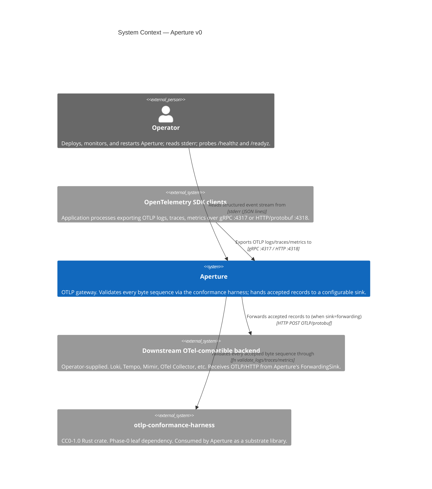
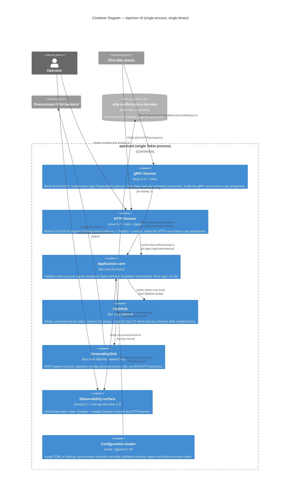
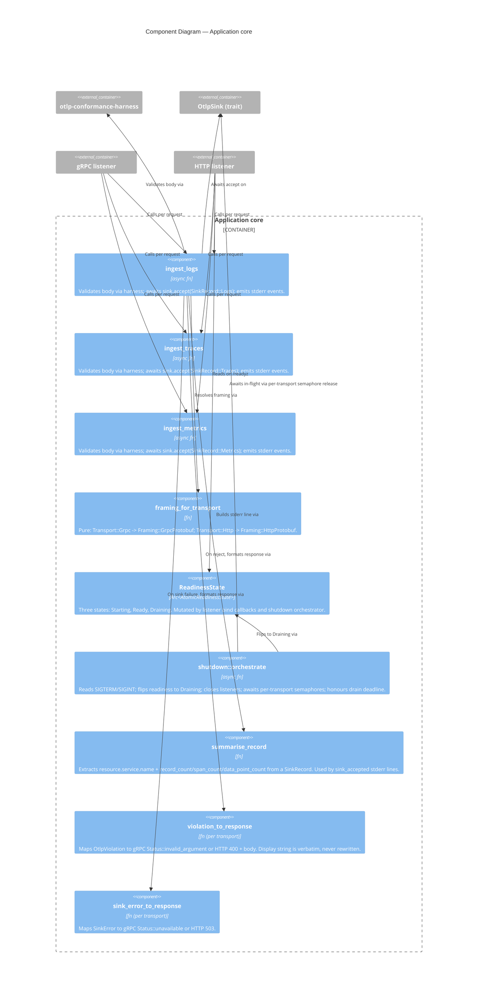
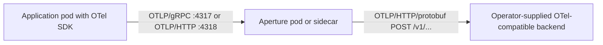

# Architecture Overview — `aperture` v0 (DESIGN)

> **Wave**: DESIGN (`nw-solution-architect` / Morgan).
> **Date**: 2026-05-04.
> **Mode**: Propose (orchestrator-decided in autonomous mode; Andrea is at dinner and trusts orchestrator decisions).
> **Author**: Morgan.
> **Companion documents**: `component-design.md`, `wave-decisions.md`, `aperture-port-and-adapter-diagram.md`, `workspace-layout.md`, ADR-0006 through ADR-0010 in [`../../../product/architecture/`](../../../product/architecture/).

---

## Purpose of this document

Lock the technology and structural shape of the `aperture` crate so that DISTILL can write executable acceptance tests against a known surface and DELIVER (`nw-software-crafter`) can drive the implementation without re-deriving any architectural decision. Every decision recorded here is a continuation of the DISCUSS contract (`../discuss/wave-decisions.md`); none re-litigates a locked DISCUSS scope item.

Aperture is a **service**, not a library. It is the integration-plane component that owns the OTLP edge — two listeners, one validator, one sink boundary — long-lived, network-facing, observable, gracefully restartable. The harness it consumes (`crates/otlp-conformance-harness/`) IS a library; the framing distinction is load-bearing for DESIGN choices.

---

## Inherited substrate (not re-derived)

Recorded for traceability; full discussion in `../discuss/wave-decisions.md > Inherited decisions`.

| Inherited decision | Source | Effect on DESIGN |
|---|---|---|
| Aperture is a service in the integration plane | `docs/architecture/kaleidoscope-architecture.md` View 2 | Long-lived process; `main.rs` binary; service-shape error handling. |
| Phase 1 deliverable, ships paired with any OTel-compatible backend | `docs/roadmap/kaleidoscope-implementation-roadmap.md` Phase 1 | `ForwardingSink` is the production sink for v0. |
| Substrate: Tokio, Tonic, Hyper, Prost, OTLP via `opentelemetry-proto` | architecture stratum diagram | These crates are substrate-exempt from port-and-adapter discipline. |
| Consumes the OTLP conformance harness | `crates/otlp-conformance-harness/src/lib.rs` | Aperture invokes `validate_logs/traces/metrics` directly; no wrapper. |
| Licence | Kaleidoscope-wide | CC0-1.0. |
| `opentelemetry-proto` exact pin | ADR-0003 (harness DESIGN) | Aperture inherits the workspace pin `=0.27.0`. |
| MSRV 1.85 | workspace `Cargo.toml` | `crates/aperture/Cargo.toml` reuses `rust-version.workspace = true`. |
| Edition 2021 | workspace `Cargo.toml` | Same. |
| British English, no human-effort estimation, trunk-based development | project conventions | All artefacts honour these. |
| No telemetry-on-telemetry | DISCUSS Q6 + roadmap A.2 | No `/metrics`, no OTLP-out from Aperture itself; CI invariant `no_telemetry_on_telemetry` enforces. |
| Single validator per signal | DISCUSS D3 | Exactly one `validate_*` call site per signal in Aperture; CI invariant `single_validator_per_signal` enforces. |

---

## Architectural style

**Hexagonal (ports-and-adapters), idiomatic Rust shape.** The locked DISCUSS contract names the primary port (`OtlpSink`); transport adapters (gRPC and HTTP) are the input adapters; the validator (the harness crate) is a domain dependency. This style is the natural fit for a transport-and-validation pipeline, matches Andrea's library-and-service shape across Kaleidoscope, and is the same style the harness DESIGN wave used for its (smaller, library-shaped) crate.

The Rust ecosystem's idiom for this style is **data + free functions + traits only where polymorphism is genuinely required**, NOT class-style hierarchies and NOT `dyn Trait` indirection where generic monomorphisation suffices. This is the same paradigm the harness uses; the project's `CLAUDE.md` mandates it.

### How the layers map onto Aperture

```
   ┌────────────────────────────────────────────────────────────────┐
   │  Driving adapters (input)                                      │
   │  - gRPC server (tonic, port 4317)                              │
   │  - HTTP/1.1 server (axum, port 4318)                           │
   │  - signal handler (tokio::signal, SIGTERM/SIGINT)              │
   └──────────────────────────┬─────────────────────────────────────┘
                              │  invokes (free functions)
                              ▼
   ┌────────────────────────────────────────────────────────────────┐
   │  Application layer (the "hexagon's interior")                  │
   │  - validate-and-route: ingest_logs/traces/metrics              │
   │  - readiness state machine                                     │
   │  - shutdown orchestrator                                       │
   │  - per-transport concurrency cap (semaphore)                   │
   └──────────────────────────┬─────────────────────────────────────┘
                              │  awaits (trait method)
                              ▼
   ┌────────────────────────────────────────────────────────────────┐
   │  Driven adapters (output) — pluggable behind OtlpSink trait    │
   │  - StubSink (logs sink summary to stderr)                      │
   │  - ForwardingSink (POSTs OTLP to downstream backend)           │
   │  (Phase 1: Sieve will be impl OtlpSink)                        │
   └────────────────────────────────────────────────────────────────┘
```

Dependencies point **inward**: adapters depend on the application layer; the application layer depends on the `OtlpSink` trait; the trait does not depend on any adapter. The harness is consumed as a substrate dependency by the application layer (Apache-Foundation-stewarded; substrate-exempt from port-and-adapter discipline by the architecture document's stratum diagram).

### What this style is NOT

- **Not microservices.** Aperture v0 is a single binary with two listeners. The crate's modules are application-internal; they are not deployable units. This is a deliberate "modular monolith" shape — the simplest viable solution for a single-process gateway with two transports.
- **Not event-driven.** No internal queue, no message broker, no event bus (DISCUSS Q4 explicitly excludes an internal queue; Sluice owns durable queueing in Phase 7).
- **Not DDD.** Aperture is a transport-and-validation pipeline, not a rich domain. No bounded contexts, no aggregates worth naming. The orchestrator brief explicitly skipped DDD modelling (`hera-architect`).

---

## C4 — Level 1: System Context



The diagram answers: *who talks to whom, and through what?*

- The **OTel SDK** is the dominant client. Every successful round-trip starts with an SDK call.
- The **operator** is a human consumer of the observability surface (stderr lines, health/readiness probes). They never call `/v1/{logs,traces,metrics}` themselves.
- The **harness** is a same-process library, drawn as an external system here only because it is a separate crate with its own contract. It does no I/O.
- The **downstream backend** is operator-provided and operator-shaped (any OTel-compatible OTLP receiver). Aperture does not bundle one.

---

## C4 — Level 2: Containers



### Why a single-binary container, not multiple containers

DISCUSS Q1 locks both transports (gRPC and HTTP/protobuf) at v0. Two transports, one validator, one sink — splitting them across processes is the wrong shape: it would force an internal RPC where one process call suffices, doubling operational surface for zero benefit. The "modular monolith" framing is the simplest viable shape.

The Container diagram lists six *internal* containers (logical units within the same process). They are NOT separate deployable units. They are listed at L2 because they are large enough to deserve their own boxes; their *internal* decomposition is at L3 below for the application core only.

---

## C4 — Level 3: Application core (the only subsystem with five-plus components)



The application core has nine components; per the `nw-architecture-patterns` skill (C4 L3 only for subsystems with 5+ components), this is the only subsystem that warrants L3 detail. The transport adapters and the sinks are simple enough to remain at L2.

---

## Phase-1 deployment model

Aperture is shipped as a single static Rust binary. The Phase-1 production deployment shape is:



- **Sidecar deployment**: Aperture runs as a sidecar to the application pod. The SDK exports to `localhost:4317`; Aperture forwards to a co-located OTel Collector or directly to a backend. This is the lightest deployment shape and what most pilot operators are expected to adopt.
- **Standalone Deployment**: Aperture runs as its own k8s `Deployment` with multiple replicas, fronted by a `Service`. SDKs export to the Service's ClusterIP. Each Aperture replica forwards independently. This is the shape for shared-tenant fleets.
- **Operator-tunable knobs at v0**: bind addresses, max-concurrent-requests per transport, sink kind (`stub` or `forwarding`), forwarding endpoint, drain deadline, max receive body size. All schema-stable across the v0.x line.

Worst-case in-flight memory footprint at v0 defaults: `1024 (cap) × 4 MiB (max_recv_msg_size) × 2 (transports) = 8 GiB`. Operators sizing pods MUST compute this product before setting `resources.limits.memory`. This is documented in the operator-facing config schema header (see `component-design.md > Configuration schema`) and called out in the operational runbook DEVOPS will write.

---

## Quality attributes addressed (ISO 25010)

Summary table; full justification per decision in the corresponding ADR.

| Attribute | Addressed by | Mechanism |
|---|---|---|
| **Functional Suitability — Correctness** | DISCUSS D3 single-validation-gate | Every accepted byte sequence flows through exactly one `validate_*` call; CI invariant `single_validator_per_signal` enforces (mechanism: AST-walk static check, ADR-0006). |
| **Functional Suitability — Completeness** | DISCUSS Q1 + slices 01–04 | All three OTLP signals × both transports lit by Slice 04. |
| **Performance Efficiency — Time behaviour** | North-Star KPI (≤50 ms p99 acceptance latency under non-overload) | Tokio async I/O; harness synchronous on Tokio's blocking-task pool only when its CPU cost demands (current measurement: harness is fast enough to run on the runtime thread; ADR-0006 sensitivity-point flag). |
| **Performance Efficiency — Resource utilisation** | DISCUSS D7 + ADR-0010 | Per-transport semaphore caps in-flight memory at `cap × max_recv_msg_size × transports`; documented for operator pod sizing. |
| **Compatibility — Interoperability** | DISCUSS Q1 (both transports), DISCUSS D3 (harness gate), DISCUSS D6 (verbatim violation display) | Standard ports `:4317` / `:4318`; standard `Content-Type: application/x-protobuf`; standard error message format from harness. SDK auto-config works out of the box. |
| **Reliability — Maturity** | tonic 0.12, axum 0.7, hyper 1.x, tokio 1.x | All canonical, all 1.x or post-1.0, all production-proven at scale across the Rust ecosystem. |
| **Reliability — Fault tolerance** | DISCUSS Q4 + ADR-0010 | Deterministic refusal-on-overload (no queue, no block, no silent drop); cap independent per transport; SDK retries handle transient saturation. |
| **Reliability — Recoverability** | DISCUSS D8 + US-AP-09 | Drain-respecting shutdown order; SIGKILL acknowledged as the only un-graceful path. |
| **Security — Confidentiality + Integrity (v0)** | DISCUSS Q5 | Plaintext at v0 by deliberate scope choice; TLS/SPIFFE schema knob present in v0 config (defaulting off). Hard-deferred to Aegis (Phase 2). |
| **Security — Integrity at v0** | DISCUSS D3 single-validation-gate | `EmptyInput`, `WireType::ProtobufDecode`, `WireType::SignalMismatch` shield the sink (and therefore downstream) from confused-deputy / cross-signal pollution. |
| **Maintainability — Modularity** | crate layout (see `component-design.md`) | Module boundaries align with hexagonal layers (`transport/grpc`, `transport/http`, `app`, `sinks`, `config`, `observability`, `shutdown`). |
| **Maintainability — Modifiability** | OtlpSink trait | Sieve plugs in as `impl OtlpSink` without crate-level changes (US-AP-03 AC). |
| **Maintainability — Testability** | Hexagonal style + StubSink | Application core can be unit-tested behind a test sink (recording vector); `OtlpSink` trait IS the seam. |
| **Maintainability — Analysability** | DISCUSS Q6 + ADR-0009 | Closed log-event vocabulary (16 names at v0); structured JSON; one event per line. |
| **Portability** | pure Rust, no `unsafe`, no platform-specific code beyond `tokio::signal::unix` | Compiles on every Tokio-supported platform. Windows works minus SIGTERM (Tokio uses Ctrl-Break instead; documented in `component-design.md`). |
| **Operational simplicity** | DISCUSS Q6 | No `/metrics`, no agent-of-an-agent setup; operator's existing log aggregator IS the observability backend. |

---

## ATAM-style sensitivity & trade-off summary

| Decision | Sensitivity to | Trade-off | Bias |
|---|---|---|---|
| Harness called synchronously on Tokio runtime threads | Performance Efficiency vs Operational Simplicity | If harness CPU cost grows (US-07 of harness lands extra rule families), it could starve the runtime | If a future profiling exercise shows it, move the call to `tokio::task::spawn_blocking` (one-line change). v0 ships without the indirection. ADR-0006. |
| `OtlpSink` async trait via `async-trait` crate vs nightly `async fn in trait` | Modifiability vs Compile-time check strength | nightly `async fn in trait` is now stable in 1.75+; could remove the `async-trait` crate dep | v0 uses `async-trait` for ergonomics in test-doubles and for `&dyn OtlpSink` storage in the runtime registry. Revisit at Phase 1 when Sieve lands. ADR-0007. |
| Per-transport concurrency cap default 1024 | Operational Simplicity vs Memory Use | 1024 × 4 MiB × 2 = 8 GiB pod memory ceiling at v0 defaults | Operators tune; default is documented and called out. DISCUSS D7. |
| Plaintext at v0 with TLS schema knob present | Security vs Time-to-Market | Real TLS is Aegis (Phase 2); v0 ships plaintext with a forward-compatible config schema | Andrea's locked Q5; the schema knob avoids a Phase-2 break. ADR-0008. |
| `axum` for HTTP rather than hand-rolled `hyper` | Maintainability vs Dependency Footprint | `axum` adds tower + tower-http to the dep tree | Routing ergonomics + middleware composition justify the modest dep-footprint cost. ADR-0006. |

No trade-off is a critical risk; each is documented and has a Phase-1+ revisit gate.

---

## Risks (DESIGN-wave register)

Carries forward the DISCUSS risk register and adds DESIGN-derived risks.

| # | Risk | Probability | Impact | Mitigation |
|---|---|---|---|---|
| R1 | `OtlpSink` shape locked here is wrong for Sieve in Phase 1 | Low | High | Async-trait + non-exhaustive `SinkRecord` and `SinkError` (ADR-0007); additive evolution non-breaking. |
| R2 | Concurrency-cap default (1024) wrong for production | Medium | Low | Operator-tunable; default documented. DISCUSS D7. |
| R3 | tonic + axum on the same Tokio runtime contend under burst load | Medium | Low | Both built on hyper; shared runtime is the standard shape. If contention shows up in a load test (KPI 5), DESIGN-revisit with a runtime-per-transport split. ADR-0006 sensitivity-point flag. |
| R4 | `validate_*` performance becomes a bottleneck under high concurrency | Low | Low | If profile shows it, move to `tokio::task::spawn_blocking`. ADR-0006 sensitivity-point flag. |
| R5 | `axum` major-version bump (0.x → 1.0) before Phase 1 | Medium | Low | Pin to caret-major-zero (`^0.7`). Track upstream. ADR-0006. |
| R6 | `figment` config edge-case allows a half-validated startup | Low | Medium | Validate the loaded config struct with `serde::Deserialize` + an explicit post-validate function; reject-fail loud at startup. ADR-0008. |
| R7 | Listener bind-ordering races against `/readyz` 200 | Low | Medium | Atomic `ReadinessState` flips to `Ready` only after BOTH `bind()` calls succeed; UAT in US-AP-01 + US-AP-02 defends. |
| R8 | `tracing-subscriber` JSON layer lazy-formatter writes partial lines on panic | Low | Low | One-event-per-line writer with explicit `\n` flush after each event; integration test asserts no partial lines on a forced panic. ADR-0009. |
| R9 | `reqwest` brings native-tls + rustls + a default user-agent that conflicts with our schema | Low | Low | Build `reqwest::ClientBuilder::new()` with `default-features = false`, only `rustls-tls` enabled, custom UA = `"aperture/{version}"`. ADR-0006. |
| R10 | A future maintainer adds a second validator without noticing the CI invariant | Low | High | `single_validator_per_signal` static check (DEVOPS-owned, enforced via AST-walk in CI) detects an additional `validate_*` call site immediately. DISCUSS D3. |
| R11 | `no_telemetry_on_telemetry` invariant regresses (a future maintainer adds a metric exporter) | Low | High | Network-namespace integration test asserts zero outbound packets except listener acks and `ForwardingSink`-to-downstream. DISCUSS D4. |

R10, R11 are the "Earned Trust" probes for the system-level architectural invariants; both have language-appropriate enforcement (per Principle 11). Sink-level Earned-Trust probes for `ForwardingSink` are documented in `component-design.md > Sinks > Earned Trust`.

---

## Earned Trust (Principle 12) — adapter probe contracts

Aperture has three driven adapters that depend on something external:

| Adapter | External dependency | Probe contract |
|---|---|---|
| **`ForwardingSink`** | Operator-configured downstream OTel-compatible backend | At startup, when `sink=forwarding`: `ForwardingSink::probe()` MUST issue an `OPTIONS` request (or a fallback `GET /healthz`-style probe per OTel Collector convention) to the configured downstream endpoint. Three outcomes: (a) `200 OK` or `204 No Content` → composition root proceeds; (b) connection refused / DNS failure / 5xx → `health.startup.refused` event written to stderr, exit 1; (c) `404` or `405` (downstream is OTel-compatible but does not implement `OPTIONS`) → degraded probe: send a `POST /v1/logs` with a known-empty `ExportLogsServiceRequest` (zero-length resource_logs); accept any 2xx as "downstream reachable", anything else → refused. The probe is **not** optional. The composition-root invariant is "wire then probe then use". |
| **gRPC listener (tonic)** | OS network stack accepting `bind(0.0.0.0:4317)` | At startup: `bind()` is the probe. Failure (port in use, permission denied, EADDRNOTAVAIL) → `event=listener_bind_failed transport=grpc` to stderr, exit 1, `/readyz` never reaches 200. UAT in US-AP-01 defends. |
| **HTTP listener (axum/hyper)** | OS network stack accepting `bind(0.0.0.0:4318)` | Same shape: `bind()` is the probe; failure → `event=listener_bind_failed transport=http_protobuf` to stderr, exit 1. UAT in US-AP-01 defends. |

For environments-known-to-lie (Docker overlayfs `fsync` no-op is irrelevant — Aperture does no disk writes; tmpfs same; WSL2 DrvFs same), the probe surface that matters is the **downstream-network** probe in `ForwardingSink`. Catalogued lie: a downstream that returns `200 OK` to the OPTIONS probe but `503` to actual `POST /v1/logs`. The degraded-probe path (zero-length POST) catches this lie at startup rather than discovering it during the first real export.

The three semantically-orthogonal enforcement layers (per Principle 12c):

- **Subtype layer**: `ForwardingSink: OtlpSink` is checked at compile time by Rust's type system; `ForwardingSink::probe()` is a method on a `pub trait Probe` that `ForwardingSink` implements; the composition root's `wire_then_probe_then_use()` is generic over `T: OtlpSink + Probe`. A non-probing sink fails to compile.
- **Structural layer**: an `xtask` AST-walking check (similar in spirit to ArchUnit) walks `crates/aperture/src/sinks/` and asserts every type implementing `OtlpSink` ALSO implements `Probe`. Pre-commit hook entry. Note: `import-linter` was investigated as an alternative — its contracts are import-graph only, with no API for method-presence enforcement. The Rust-ecosystem analogue (`cargo-arch` is unmaintained; `dependency-cruiser` is JS-only) does not exist; an `xtask` is the language-appropriate enforcement mechanism for now.
- **Behavioural layer**: a CI gold-test runner (`tests/probe_gold_runner.rs`) starts Aperture against a fixture downstream that lies (returns 200 OK to OPTIONS but 503 to POST), asserts Aperture refuses to start with `health.startup.refused`. This catalogues at least one substrate lie per probe.

A single-layer bypass (e.g. a maintainer comments out `Probe` impl) is caught by at least one of the other two: subtype layer fails at `cargo build`; structural layer fails at pre-commit; behavioural layer fails at CI.

**Self-application**: the `tests/probe_gold_runner.rs` IS the probe that probes-actually-probe. If a future maintainer reduces a `probe()` to `Ok(())`-without-network-call, the gold-test (which uses a fixture that 503s on POST) will pass when it should fail; the structural-layer check therefore additionally asserts that every `Probe` impl contains at least one network call (via `reqwest::Client` or `tonic::transport::Channel`). This is documented as a known gap in pure structural enforcement; the behavioural layer is the load-bearing defence.

---

## Architectural rule enforcement (Principle 11)

| Rule | Source | Mechanism |
|---|---|---|
| Hexagonal layer dependency direction (adapters → app → trait; never reverse) | this document | `cargo-modules` workspace check + `xtask` pre-commit AST walk over `use` statements; `mod transport` MUST NOT `use crate::sinks::*` directly (only via `dyn OtlpSink`); `mod sinks` MUST NOT `use crate::transport::*` (the trait is in `mod ports`). |
| Single validator per signal | DISCUSS D3 | `xtask` AST-walking check (DEVOPS owns the check binary) counts call sites of `otlp_conformance_harness::validate_logs/traces/metrics` and asserts ≤ 1 per signal. |
| No telemetry from telemetry | DISCUSS D4 | Network-namespace integration test (`tests/no_telemetry_on_telemetry.rs`); asserts zero outbound packets except listener acks and `ForwardingSink`→downstream. DEVOPS owns the network-namespace fixture. |
| No `println!` / no direct `eprintln!` | inherited from harness craftsmanship invariants | Clippy lint `clippy::print_stdout` + `clippy::print_stderr` set to `deny` in workspace `[lints]`; `tracing` is the only stderr-writing path. |
| Public surface stability | conventional | `cargo-public-api` runs against `crates/aperture/` (binary surface is empty; library surface is the test-doubles namespace `aperture::testing` only — see `component-design.md > Test doubles`). |
| Licence policy | inherited from workspace | `cargo-deny check` (workspace level; the harness DESIGN already mandates this gate). |
| OTLP protobuf decode is the harness's job, not Aperture's | DISCUSS D3 | `xtask` static check: `crates/aperture/src/` MUST NOT contain `prost::Message::decode` or `opentelemetry_proto::tonic::collector::*::Export*ServiceRequest::decode` calls. Decoding is exclusively the harness's responsibility. |
| Probe contract enforcement | this document, Earned Trust section | Three-layer enforcement above. |

Every rule has a language-appropriate automated enforcement mechanism. No rule is enforced only by convention or by code review.

---

## Conway's Law check

Aperture v0 is built by a single AI agent (`nw-software-crafter`) under Andrea's direction. Single team, single binary, no parallel feature development. Conway's Law check passes trivially: the architecture is a single hexagon with one boundary that matters (the `OtlpSink` trait, which is the future Sieve seam). The team boundary (one agent) and the architecture boundary (one process) align.

Forward-looking: when Sieve lands in Phase 1, it will be a separate crate consuming Aperture's `OtlpSink` trait. The team boundary at that point is "Aperture maintainers" + "Sieve maintainers"; the architecture boundary is the trait. This is the **Inverse Conway Maneuver** applied prophylactically — the trait is designed so the team boundary CAN exist when it needs to.

---

## Out-of-scope (DESIGN-explicit)

Carries forward DISCUSS's out-of-scope list and adds DESIGN-derived items:

| Item | Why out of scope at v0 |
|---|---|
| Internal request queue (Sluice's job, Phase 7) | DISCUSS Q4 explicit. |
| Adaptive concurrency caps based on load | Operator-tunable knob is the v0 answer; adaptive caps are Pulse-driven, Phase 4+. |
| Live config reload (SIGHUP) | DISCUSS Q4 implicit; config is read at startup only; restart-as-process-exit is the v0 reload. |
| Outbound retry / circuit-breaker on `ForwardingSink` | The SDK retries; double-retry is anti-pattern (DISCUSS US-AP-08 technical notes). |
| `/metrics` endpoint | DISCUSS Q6 explicit; Pulse owns telemetry-on-telemetry in Phase 4. |
| Sampling | Sieve's domain. |
| Multi-tenancy / per-tenant cap | Aegis's domain in Phase 2. |
| OTLP/JSON encoding / OTLP Profiles signal | Not stable in OTel spec at the harness's pinned version. |
| Outbound gRPC from `ForwardingSink` (HTTP-out only at v0) | DISCUSS US-AP-08 technical notes; HTTP is simpler debugging, more downstreams accept it. |
| Real TLS termination + SPIFFE / SVID validation | DISCUSS Q5; schema present, behaviour off; Aegis (Phase 2). |
| Connection pooling tuning beyond `reqwest` defaults | Operator can configure via env var if it ever matters; default is fine for v0. |
| Custom resource-attribute redaction on `sink_accepted` lines | Out of scope; the field is informational only. |

---

## Back-propagation to DISCUSS

**None required.** Every load-bearing DESIGN decision sits within the latitude DISCUSS explicitly granted. No story, AC, KPI, or event name needs to change. A `design/upstream-changes.md` file is therefore **not** created.

---

## Handoff matrix

| Recipient | Inputs they need | Where to find them |
|---|---|---|
| **DISTILL (`nw-acceptance-designer`)** | This document, `component-design.md`, `wave-decisions.md`, ADRs 0006–0010, the locked DISCUSS artefacts. | `docs/feature/aperture/design/`, `docs/product/architecture/adr-000{6..10}-*.md`. |
| **DEVOPS (`nw-platform-architect`)** | This document (for the CI invariants and architectural-rule enforcement), `wave-decisions.md`, ADR-0006 (transport choices), ADR-0010 (concurrency policy), the KPI list (`../discuss/outcome-kpis.md`). | Same paths. |
| **DELIVER (`nw-software-crafter`)** | `component-design.md` (the binding contract for module structure, types, and signatures), `workspace-layout.md`, ADRs 0006–0010. | Same paths. |

External integrations exist (the operator-supplied downstream backend consumed by `ForwardingSink`) — see the handoff annotation in `wave-decisions.md > Handoff to DEVOPS`.
