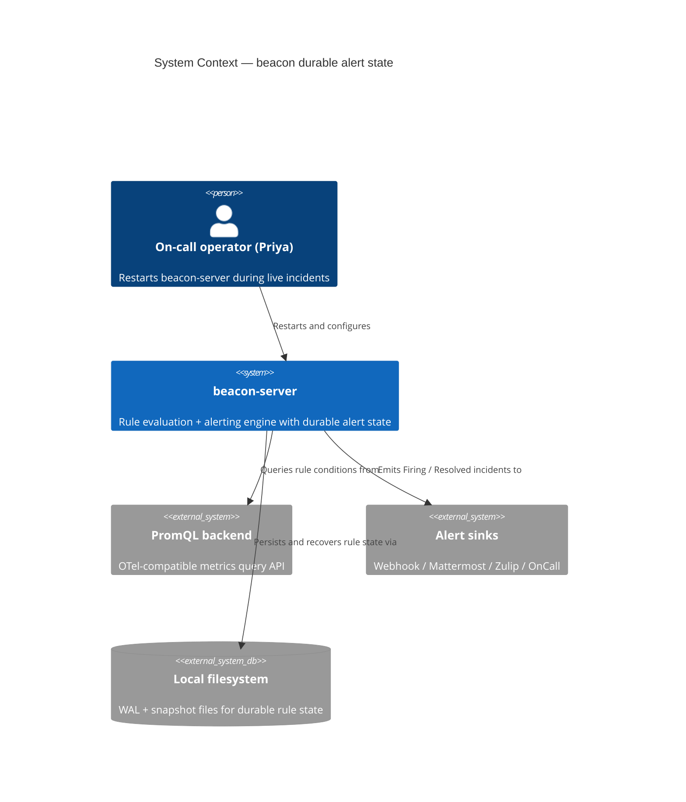
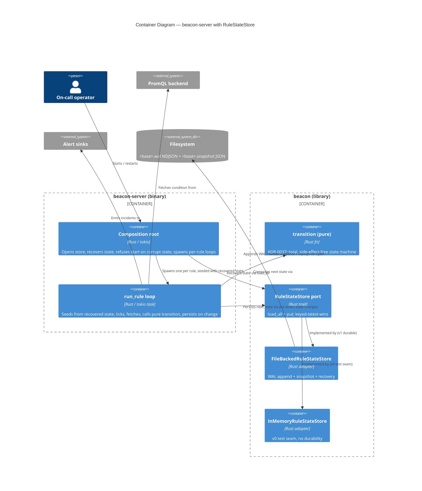
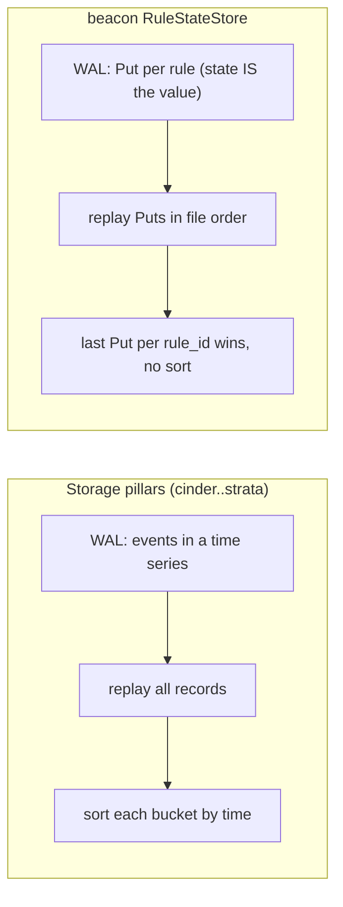

# Application Architecture — beacon-durable-alert-state-v0

DESIGN wave (nw-solution-architect / Morgan). Application scope.
British English, no em dashes. Companion to `wave-decisions.md`
(DD1..DD8) and ADR-0040.

## System context

beacon-server evaluates declarative alert rules against a PromQL HTTP
backend and emits incidents to sinks (webhook, mattermost, zulip,
oncall). Per-rule alert state (`Inactive` / `Pending { since }` /
`Firing { since }`) currently lives as a local variable in each per-rule
Tokio task and is lost on every restart. This feature relocates that
state behind a durable `RuleStateStore` port so it survives a restart,
without touching beacon's pure `transition` (ADR-0037).

The pure transition is unchanged; durability is added strictly around
it. The store **holds** state; it contains **no** transition logic.

## C4 Level 1 — System Context



## C4 Level 2 — Container



The pure `transition` and the `RuleStateStore` port are siblings inside
the beacon library. The loop calls one then the other; neither knows
about the other. This is the structural guarantee that ADR-0037 holds:
no persistence call exists inside `transition`.

## Wiring sequence — the durable loop around the pure transition

```mermaid
sequenceDiagram
    participant Main as Composition root (main.rs)
    participant Store as RuleStateStore (FileBacked)
    participant Loop as run_rule loop
    participant Tr as transition (pure)
    participant Sink as Sinks

    Main->>Store: open(path)
    alt corrupt or unreadable state
        Store-->>Main: Err(PersistenceFailed)
        Main-->>Main: log error, exit non-zero (no silent reset)
    else recovered
        Store-->>Main: Ok
        Main->>Store: load_all()
        Store-->>Main: HashMap<rule_name, RuleState>
        Main-->>Main: drop states for removed rules, log recovery line
        Main->>Loop: spawn(rule, recovered_state)
        loop every interval tick
            Loop->>Loop: state = recovered (first tick) then prior next
            Loop->>Tr: transition(state, outcome, rule, now)
            Tr-->>Loop: (next, emission)
            alt state != next
                Loop->>Store: put(rule_name, next)
            end
            Loop->>Sink: emit(incident) if emission
        end
    end
```

## Keyed-latest-wins vs append-and-sort (DD4)



The pillars treat a record as one event among many ordered events, so
recovery re-sorts. beacon treats the value as the rule's single current
state, so recovery overwrites per key and never sorts. The FileBacked
skeleton (`open` / `snapshot` / append) is reused; only the replay rule
changes from "push then sort" to "insert overwrite".

## Component responsibilities

| Component | Crate / location | Responsibility | Boundary rule |
|-----------|------------------|----------------|---------------|
| `transition` | `beacon::state_machine` | Pure state machine (ADR-0037) | No I/O, never imports `state_store` |
| `RuleStateStore` | `beacon::state_store` (new, DD1) | Port: `load_all` + `put` (DD3) | No transition logic; values only |
| `InMemoryRuleStateStore` | `beacon::state_store` | v0 test seam (DD5) | Loses state on restart, by design |
| `FileBackedRuleStateStore` | `beacon::state_store` | v1 durable adapter (DD5) | WAL + snapshot + keyed-latest-wins recovery |
| `RuleStateStoreError` | `beacon::state_store` | Additive `PersistenceFailed` (DD6) | InMemory never returns it |
| Composition root | `beacon-server::main` | open + load_all + seed + refuse-on-corrupt (DD8) | Owns wiring, not the port |
| `run_rule` loop | `beacon-server::main` | Seed, tick, transition, persist-on-change (DD8) | Calls transition then store, never fuses them |

## Architecture enforcement (principle 11)

The ADR-0037 invariant "no persistence inside the pure transition" is
enforceable in Rust without a third-party arch-rule crate: `state_machine.rs`
must not `use crate::state_store`. A `#![forbid]`-style guard is not
available for imports, so the enforcement is a small `compile_fail` or a
grep-based pre-commit check asserting `state_machine.rs` contains no
reference to `state_store`. Recommend the software-crafter add a focused
test in `beacon` asserting the module dependency direction (a
`tests/arch_state_machine_is_pure.rs` that fails if `state_machine`
gains a store import). This is the language-appropriate analogue of
ArchUnit for this single, load-bearing rule.

## Quality attribute scenarios (ATAM-style)

| Attribute | Scenario | Response measure |
|-----------|----------|------------------|
| Recoverability | beacon-server restarts mid-incident | 100% rule states recovered incl. `since`; 0 spurious re-fires (KPI 1/2) |
| Recoverability | snapshot truncated by full disk | `open()` returns `PersistenceFailed`, startup refuses, no silent reset |
| Performance | persist a transition | p95 <= 2 ms on ubuntu-latest (KPI 3) |
| Performance | recover 10000 states at startup | p95 <= 1.5 s on ubuntu-latest (KPI 4) |
| Maintainability | swap durable adapter for test double | `InMemoryRuleStateStore` substitutes via the trait, no loop change |
| Reliability | transient WAL write failure mid-run | `put` Err logged warn-level, loop continues in-memory (degrade, not silence) |

## Deployment

No deployment change and no new operator-visible CLI surface (a
System Constraint in `user-stories.md`). The state file base path is
**derived**, not a new `--flag`: beacon-server resolves it from the
existing rules directory location (or a fixed convention beside it),
keeping the binary's argument surface unchanged. The WAL/snapshot files
are local filesystem artifacts inheriting the operator's process
permissions. No new network surface, no new container, no new external
dependency. The only new operator-visible output is the startup
recovery log line.
