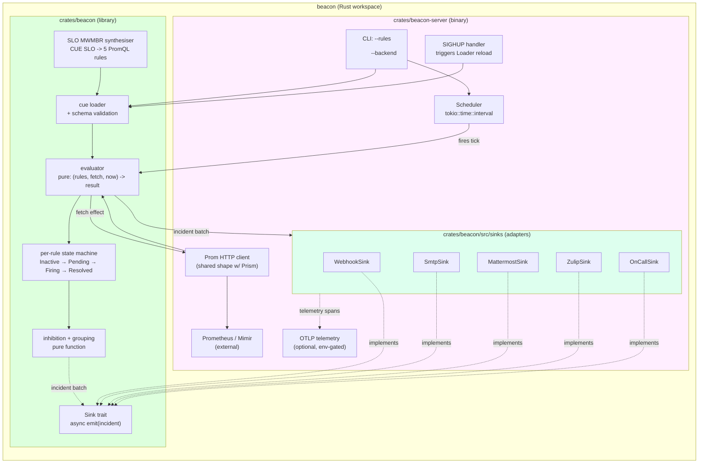

# Beacon v0 — C4 Container

## Module shape

| Module | Role | Pure / IO |
|---|---|---|
| `beacon::loader` | Parse `.cue` → `Rule` / `Slo` structs | Pure (file IO at boundary) |
| `beacon::evaluator` | `(rules, fetch_fn, now)` → `EvaluationResult` | Pure |
| `beacon::state_machine` | Per-rule state transitions | Pure |
| `beacon::inhibition` | Apply inhibition + grouping | Pure |
| `beacon::sinks::*` | Adapter implementations | IO (async) |
| `beacon::slo` | MWMBR synthesis from CUE SLO | Pure |
| `beacon_server::scheduler` | `tokio::time::interval` tick loop | IO |
| `beacon_server::http` | PromQL HTTP client (`reqwest`) | IO |
| `beacon_server::signal` | `SIGHUP` reload trigger | IO |
| `beacon_server::telemetry` | OTLP exporter wiring | IO |

## Library vs binary split

The `beacon` crate is a library. Its public API is the
evaluator + sink trait + CUE loader. Consumers (the
`beacon-server` binary, future embedders) wire the IO concerns
(scheduler, HTTP client, signal handler) at the binary layer.

This mirrors the Aperture split (library + service) and is the same
shape as Prism's reducer + Scheduler seam. The benefit is that the
load-bearing logic — rule evaluation, inhibition, SLO synthesis —
is testable as pure functions, and the IO concerns are testable
independently with mocks.

## Concurrency model

The evaluator is single-threaded per rule set. The scheduler ticks
on a `tokio::time::interval`; each tick spawns a per-rule task that
issues the PromQL fetch via `reqwest` and posts the result back to
the main evaluator via a Tokio channel. The evaluator processes
results serially and emits sink calls; each sink emission is its
own task. Sinks are independent — a slow Mattermost API cannot
block webhook delivery to other rules.

Bounded channels with backpressure. If sink emission queues grow
beyond a configured limit, the evaluator emits a telemetry warning
and drops oldest. The contract is: "every incident is best-effort
delivered; persistent failures are recorded but do not block the
evaluator".
