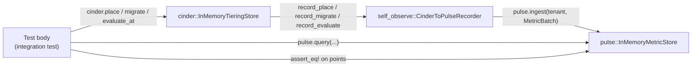
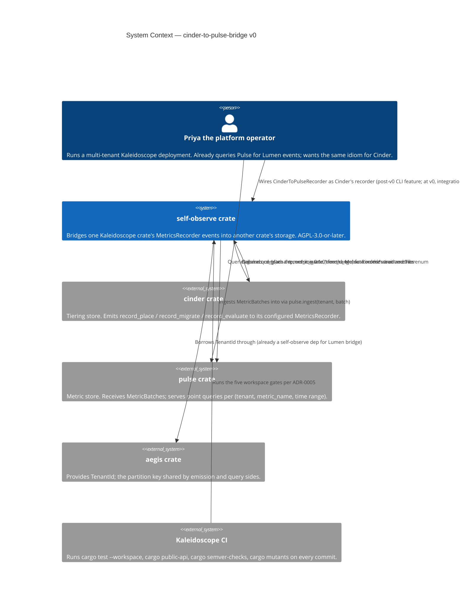
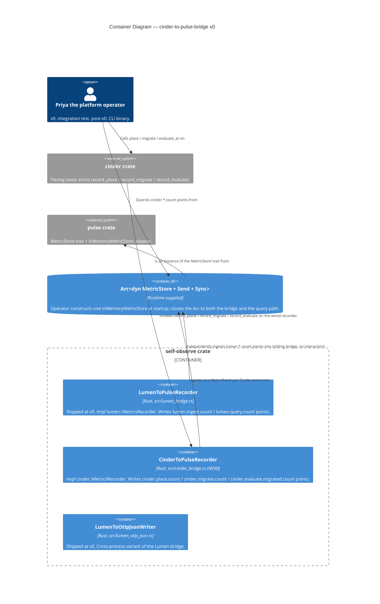

# Application Architecture — `cinder-to-pulse-bridge-v0`

**Author**: `nw-solution-architect` (Morgan)
**Date**: 2026-05-18
**Mode**: PROPOSE (per pre-wave Decision 1)
**Feature scope**: a new file `crates/self-observe/src/cinder_bridge.rs`
exposing `CinderToPulseRecorder`, an `impl cinder::MetricsRecorder` that
writes each Cinder tier event as a single-point Pulse `MetricBatch`.

> This document walks each load-bearing decision as a 2-3 option
> trade-off study, recommending one option per decision with the
> rationale grounded in the DISCUSS artefacts and the worked precedent
> (`crates/self-observe/src/lumen_bridge.rs`). The decisions land in
> `design/wave-decisions.md` (decision log) and ADR-0038 (formal record).

## The problem in one sentence

Cinder's `MetricsRecorder` events (`record_place` / `record_migrate` /
`record_evaluate`) need to land as queryable points in a Pulse
`MetricStore`, partitioned per tenant, with metric names mirroring the
existing Lumen bridge's convention (`cinder.<event>.count`) and with the
tier topology surfaced as point attributes.

## Why the design space is narrow

The DISCUSS wave produced seven D-decisions (D1-D7 in
`discuss/wave-decisions.md`) that collapse the design space to one
shape that compiles:

- Three separate metrics, not one combined metric with an `event`
  attribute (D1).
- `record_evaluate` value = `migrated_count`, not `value=1` (D2).
- Dual emission (per-item migrate + per-tenant evaluate) preserved
  unchanged from Cinder's own behaviour (D3).
- Tier topology as POINT attribute, lowercased (D4).
- Best-effort emission (D5).
- No CLI in v0 (D6).
- No SSOT modification (D7).

The remaining DESIGN-side load-bearing decisions are four (test seam,
module file location, public-surface shape, ADR scope). Each is walked
below.

---

## Load-bearing decision 1: Acceptance-test seam shape

The acceptance tests under
`crates/self-observe/tests/cinder_to_pulse.rs` must demonstrate that
Cinder events become Pulse points. Three test-seam shapes were
considered.

### Option A — Drive the bridge directly

```rust
// sketch (not to be implemented)
let pulse = Arc::new(InMemoryMetricStore::new(Box::new(PulseNoopRecorder)));
let bridge = CinderToPulseRecorder::new(pulse.clone() as Arc<dyn MetricStore + Send + Sync>);
bridge.record_place(&tenant("acme"), Tier::Hot);
let points = pulse.query(&tenant("acme"), &MetricName::new("cinder.place.count"), TimeRange::all()).unwrap();
assert_eq!(points.len(), 1);
```

- **Pros**: Smallest test surface; no Cinder behaviour entangled with
  bridge assertion. Tightest possible scoping ("only the bridge").
- **Cons**: Cannot express the dual-emission contract (D3). Calling
  `bridge.record_evaluate(&acme, 5)` does *not* cause five
  `record_migrate` invocations; that cascade lives inside
  `InMemoryTieringStore::evaluate_at`
  (`crates/cinder/src/store.rs:200-232`). Option A would split the
  dual-emission test into two unconnected assertions, losing the
  cross-event-type property the user story names (US-03 AC 3: "the
  per-item `cinder.migrate.count` points from US-02 remain emitted by
  the same `evaluate_at` call").
- **Diverges from precedent**: the Lumen bridge tests
  (`crates/self-observe/tests/lumen_to_pulse.rs:56-202`) drive
  `InMemoryLogStore::new(Box::new(bridge))`, not the bridge directly.

### Option B — Drive Cinder's store, the bridge is the recorder *(RECOMMENDED)*

```rust
// sketch
let pulse = Arc::new(InMemoryMetricStore::new(Box::new(PulseNoopRecorder)));
let bridge = CinderToPulseRecorder::new(pulse.clone() as Arc<dyn MetricStore + Send + Sync>);
let cinder = InMemoryTieringStore::new(Box::new(bridge));
cinder.place(&tenant("acme"), &item("trade-001"), Tier::Hot, SystemTime::now());
let points = pulse.query(&tenant("acme"), &MetricName::new("cinder.place.count"), TimeRange::all()).unwrap();
assert_eq!(points.len(), 1);
```

- **Pros**: Mirrors the Lumen bridge test pattern exactly. Exercises
  the realistic operator wiring described in US-01's Elevator Pitch
  ("Priya replaces `NoopRecorder` with the bridge"). Naturally
  expresses the dual-emission contract: a single
  `cinder.evaluate_at(t_now, &policy)` call in the test body causes
  both per-item `record_migrate` invocations and per-tenant
  `record_evaluate` invocations to land in Pulse, and both metrics
  can be queried in the same test.
- **Cons**: A regression in Cinder's `evaluate_at` cascade would make
  the bridge's evaluate-test red even if the bridge itself is
  correct. *This is the desired behaviour*: Cinder's cascade *is* the
  contract the bridge inherits per DISCUSS D3. Confusing a Cinder
  regression with a bridge regression is impossible because Cinder
  ships its own evaluate-cascade tests in-tree.

### Option C — `CapturingRecorder` as an additional assertion target

Use `cinder::CapturingRecorder` to verify what Cinder *intends* to
emit, separately from the bridge's emission. This was the third
option considered.

- **Pros**: Decouples Cinder's emission-intent contract from the
  bridge's emission-effect contract. Three layers of assertion
  (Cinder intends → bridge converts → Pulse stores) are each
  verifiable independently.
- **Cons**: Asserts the wrong thing. Cinder's own crate tests already
  pin Cinder's emission-intent contract using `CapturingRecorder`
  (this is exactly what `crates/cinder/src/metrics.rs:57-110`
  exists for). The bridge's contract is "Cinder emission becomes
  queryable Pulse points" — adding a `CapturingRecorder` assertion
  in the bridge's tests would duplicate Cinder's own coverage
  without adding bridge-specific evidence.

### Recommendation: Option B

Mirrors the precedent, expresses the dual-emission contract naturally,
keeps the bridge's tests focused on the bridge's contract (Cinder
emission → Pulse points) without redundant coverage of Cinder's own
behaviour.



The test wires four nodes: test body, Cinder's store, the bridge, the
Pulse store. The bridge is the *only* unit-under-test; Cinder and
Pulse are infrastructure used to drive and observe it. This is
identical to the Lumen bridge test shape, modulo crate names.

---

## Load-bearing decision 2: Module file location

### Option A — File-flat: `crates/self-observe/src/cinder_bridge.rs` *(RECOMMENDED)*

Sibling to `lumen_bridge.rs` and `lumen_otlp_json.rs`. `lib.rs` gains
one line: `mod cinder_bridge;` plus the re-export `pub use
cinder_bridge::CinderToPulseRecorder;`.

- **Pros**: Matches the established pattern (`lib.rs:51-52` already
  uses file-flat). No new directory; no `mod.rs`; no visual surprise
  for a reader who knows the Lumen bridge.
- **Cons**: At ~8-10 bridge files (when Sluice/Augur/Ray/Strata
  bridges and their OTLP-JSON variants ship), the crate root will
  hold ~10 `mod xxx_bridge;` declarations. The visual weight will
  warrant a `bridges/` subdirectory at that point.

### Option B — Subdirectory: `crates/self-observe/src/bridges/cinder.rs`

Introduces a `bridges/` subdirectory under `src/` with a `mod.rs` that
re-exports each bridge module. `lib.rs` declares `mod bridges;` and
re-exports `pub use bridges::CinderToPulseRecorder;`.

- **Pros**: Anticipates the eventual file-count growth. Single
  refactoring done once; future bridges drop into place.
- **Cons**: Over-organisation at N=3 files. Forces a *retrospective*
  move of `lumen_bridge.rs` and `lumen_otlp_json.rs` (or accepts an
  inconsistency where Lumen bridges live at crate root and others
  live under `bridges/`). Either choice is worse than the file-flat
  status quo.

### Recommendation: Option A

The deferred refactoring (Option B done later, when the threshold is
reached) is mechanically straightforward and contained. This feature
should not pay the cost of a workspace-wide layout change for a
single file addition.

---

## Load-bearing decision 3: Public surface shape

The public surface is *substantially* fixed by the requirement to
implement `cinder::MetricsRecorder` and to mirror
`LumenToPulseRecorder` byte-equivalently for the field, the
constructor, and the constructor's argument shape. Three internal
shape choices remain.

### Option A — Byte-equivalent clone with attribute-extended `emit` helper *(RECOMMENDED)*

```rust
// crates/self-observe/src/cinder_bridge.rs (sketch — crafter writes the body)

use std::collections::BTreeMap;
use std::sync::Arc;

use aegis::TenantId;
use cinder::{MetricsRecorder as CinderRecorder, Tier};
use pulse::{Metric, MetricBatch, MetricKind, MetricName, MetricPoint, MetricStore};

pub struct CinderToPulseRecorder {
    pulse: Arc<dyn MetricStore + Send + Sync>,
}

impl CinderToPulseRecorder {
    pub fn new(pulse: Arc<dyn MetricStore + Send + Sync>) -> Self {
        Self { pulse }
    }

    fn emit(
        &self,
        tenant: &TenantId,
        metric_name: &str,
        value: f64,
        attributes: BTreeMap<String, String>,
    ) {
        // Body: build Metric { kind: Sum, unit: "1", ... } with one MetricPoint
        // carrying `value` + `attributes`. let _ = self.pulse.ingest(tenant, batch).
        // Mirror the lumen_bridge.rs body exactly, parameterised by `attributes`.
    }
}

impl CinderRecorder for CinderToPulseRecorder {
    fn record_place(&self, tenant: &TenantId, tier: Tier) {
        let mut attrs = BTreeMap::new();
        attrs.insert("tier".to_string(), tier_attr(tier).to_string());
        self.emit(tenant, "cinder.place.count", 1.0, attrs);
    }

    fn record_migrate(&self, tenant: &TenantId, from: Tier, to: Tier) {
        let mut attrs = BTreeMap::new();
        attrs.insert("from".to_string(), tier_attr(from).to_string());
        attrs.insert("to".to_string(), tier_attr(to).to_string());
        self.emit(tenant, "cinder.migrate.count", 1.0, attrs);
    }

    fn record_evaluate(&self, tenant: &TenantId, migrated: usize) {
        self.emit(tenant, "cinder.evaluate.migrated.count", migrated as f64, BTreeMap::new());
    }
}

fn tier_attr(tier: Tier) -> &'static str {
    match tier {
        Tier::Hot => "hot",
        Tier::Warm => "warm",
        Tier::Cold => "cold",
    }
}
```

> The above is a **design sketch**, not a normative implementation.
> The crafter writes the actual Rust source during DELIVER. What is
> locked is the *public surface*: the struct, its single field name,
> the constructor's name and signature, the three trait-method
> dispatches, the three metric-name string literals, and the
> lowercase-tier attribute values.

- **Pros**: Byte-equivalent to `LumenToPulseRecorder` for the public
  surface. The single `tier_attr` helper enforces the lowercase
  convention from one place. The single `emit` helper enforces the
  Sum-kind, unit-"1", best-effort emission convention from one
  place.
- **Cons**: The `emit` helper has one more parameter than the Lumen
  bridge's `emit` (which takes no attributes because Lumen events
  have none). This divergence is required by the domain; it is not a
  violation of the byte-equivalence rule, which applies to the
  public surface.

### Option B — One method body per metric, no shared `emit` helper

Each `record_*` method builds and ingests its own `MetricBatch`
without a shared helper.

- **Pros**: No internal abstraction; each method reads top-to-bottom
  as one Pulse interaction.
- **Cons**: Three copies of the `SystemTime::now().duration_since(UNIX_EPOCH)`
  + `MetricBatch::with_metrics(vec![metric])` boilerplate. Drift
  risk: a future change to "all bridges in this crate use
  `MetricKind::Gauge` for evaluate" requires three edits, not one.

### Option C — Generic helper across metric kinds and units

A reusable `fn emit_generic(kind: MetricKind, unit: &str, ...)` to
preserve flexibility for future metric shapes.

- **Pros**: Bridges that emit non-Sum metrics later get the helper
  for free.
- **Cons**: Speculative. Every bridge in scope today emits Sum kind
  with unit `"1"` (Lumen does, Cinder does, future Sluice/Augur/Ray
  likely do because they are all event-count bridges). Genericising
  for a non-existent caller is YAGNI.

### Recommendation: Option A

Locks the public surface to byte-equivalence with the precedent.
Centralises the two convention-bearing concerns (lowercase tier
strings + emission shape) in one helper each. The crafter may rename
internal symbols, may use a different lowercase-strategy (string
allocation vs `&'static str`), may inline the helpers — all are
behaviourally equivalent and not contract-bearing.

---

## Load-bearing decision 4: ADR scope

### Option A — Zero new ADRs

The DISCUSS-wave `wave-decisions.md` document plus the worked
precedent (`lumen_bridge.rs` shipped at v0 of self-observe) capture
every design choice that affects the contract.

- **Pros**: Less paperwork. ADRs were historically reserved for
  decisions with non-obvious rationale.
- **Cons**: Inconsistent with the Phase-1+ convention. Every
  crate-public-API-and-layout decision since ADR-0011 (spark) has
  earned its own ADR; the *self-observe* crate currently has none
  because it shipped before the convention crystallised. Recording
  one ADR now establishes the convention for the crate's second
  public type and pays the cost forward for future bridge additions.

### Option B — One ADR: `adr-0038-cinder-to-pulse-bridge-public-api-and-crate-layout.md` *(RECOMMENDED)*

Follows the established pattern: ADR-0011 (spark), ADR-0018 (sieve),
ADR-0022 (codex), ADR-0026 (prism), ADR-0033 (beacon).

- **Pros**: Convention-consistent. Pins the public surface as an
  audit-trail artefact. Lockable by `cargo public-api` (Gate 2) and
  `cargo semver-checks` (Gate 3) at CI time.
- **Cons**: One more file in `docs/product/architecture/`. The cost is
  marginal.

### Option C — Three ADRs (layout + cross-bridge test-seam convention + lowercase-tier convention)

Separately lock each of the three identified concerns.

- **Pros**: Maximum traceability.
- **Cons**: Two of the three (cross-bridge test seam, lowercase-tier
  convention) are *speculative cross-feature conventions* that would
  pin a pattern with only two exemplars (Lumen at v0, Cinder at v0).
  Better to wait for a third bridge to confirm the convention before
  ADRing it.

### Recommendation: Option B

One ADR (`adr-0038`) for the bridge's public surface + crate layout +
file location. The test-seam convention is captured operationally in
the test file and in this design's DD1. The lowercase-tier convention
is captured in DISCUSS D4 + the `tier_value` row of
`shared-artifacts-registry.md` + the acceptance-test string-equality
asserts in Slices 01 and 02. Both conventions are recorded *informally*
and can be promoted to dedicated ADRs when a third bridge tests them.

---

## C4 Level 1 — System Context



The new system shape is identical to the Lumen bridge's: the bridge
sits between two existing crates and translates one crate's
`MetricsRecorder` events into the other's `MetricStore` ingestion. The
operator (at v0, the integration tests; post-v0, the CLI) wires the
bridge as Cinder's recorder and queries Pulse for the produced points.

## C4 Level 2 — Container View



The container view shows three sibling bridges inside `self-observe`,
one of which (`CinderToPulseRecorder`) is new. The two existing bridges
are shown for context — they share the same `Arc<dyn MetricStore>`
shape and are mutually independent. The Pulse store is a single
runtime-supplied `Arc` cloned to all bridges and to the query path; the
shared-artifacts-registry's `pulse_store` MEDIUM-risk invariant
("operator must wire one Arc, not two instances") is satisfied by this
shape.

## C4 Level 3 — Component View

**Explicitly skipped.** The new container (`CinderToPulseRecorder`) is
a single Rust source file with one struct, one constructor, three trait
methods, and two private helpers (the `emit` helper and the
lowercase-tier helper). A four-box component diagram for ~90 LOC is
ceremonial. The L2 Container view already captures the dispatch shape
(Cinder → bridge → Pulse store) and the L1 System Context view
captures the actor relationships.

Per the SA agent principle ("Component (L3) only for complex
subsystems"), L3 is explicitly skipped for this feature. If a future
v0.1 adds (for example) batching of multiple Cinder events into one
`MetricBatch`, or per-tenant rate limiting, or attribute
canonicalisation across bridges, an L3 diagram would be appropriate at
that point.

## Quality attributes (ISO 25010 alignment)

| Attribute | How the architecture addresses it |
|-----------|-----------------------------------|
| **Functional Suitability — Correctness** | Three `record_*` methods each map to one metric name + one attribute set per DISCUSS D1/D4. The lowercase-tier helper enforces D4 from one location. The dual-emission contract (D3) is inherited from Cinder's `evaluate_at` cascade and exercised by Slice 03's tests. |
| **Performance Efficiency** | One `BTreeMap<String, String>` allocation per event (at most three entries). One `Vec<MetricPoint>` of length 1 per event. One `Mutex` acquisition inside `InMemoryMetricStore::ingest`. No async, no I/O, no network. Latency is negligible against the operator-visible signal-shape time scale; KPI scoping defers to outcome-kpis.md. |
| **Compatibility — Interoperability** | Bridge consumes `cinder::MetricsRecorder` (Cinder's port) and produces `pulse::MetricBatch` (Pulse's port). Both are upstream trait shapes; the bridge does not wrap, rename, or shadow. Adapter swap is mechanical: a future `CinderToOtlpJsonWriter` implements the same trait against a different sink. |
| **Reliability — Maturity** | The bridge has no internal state beyond the `Arc<dyn MetricStore>` field; no panics on user input. The best-effort emission posture (D5) means a future loud-failing `MetricStoreError` does not propagate to Cinder (whose trait methods return `()`). |
| **Security — Integrity** | Tenant identity is the partition key on both sides; the bridge forwards `&TenantId` unchanged (shared-artifacts-registry's HIGH-risk `tenant_id` invariant). Two-tenant isolation is asserted in all three slices' tests. |
| **Maintainability — Modularity, Testability** | One file, ~90 LOC, three trait methods. Each method has at least one acceptance test in its slice plus a per-tenant-isolation test plus a no-event-no-point test. Mutation-testing target: 100% kill rate scoped to `cinder_bridge.rs` (per ADR-0005 Gate 5). |
| **Maintainability — Modifiability** | Public surface locked by `cargo public-api` (Gate 2) and `cargo semver-checks` (Gate 3); any breaking change requires a major-version bump on the `self-observe` crate. |
| **Portability** | Pure Rust, no platform-specific code, no `unsafe`. Inherits the crate's `#![forbid(unsafe_code)]` posture. Builds on every platform Rust targets. |

ATAM sensitivity points:

1. The `migrated as f64` cast on `record_evaluate` (D2). Exact for
   counts up to 2^53; operationally impossible to exceed per
   evaluate call (Cinder's in-memory store cannot hold 2^53 items).
   Locked in shared-artifacts-registry `migrated_count` row as LOW
   risk.
2. The lowercase serialisation of `Tier` (D4). The bridge is the
   single point where `Tier::Hot/Warm/Cold` becomes the lowercase
   strings `"hot"`/`"warm"`/`"cold"`. A typo in any of the three
   string literals breaks operator queries. Defended by Slice 01's
   three-tier serialisation test (one assertion per tier value).

ATAM trade-off points:

1. Best-effort emission (D5) sacrifices error visibility to Cinder
   (whose `record_*` methods return `()`) for forward compatibility
   with a future non-empty `MetricStoreError`. The trade is right:
   the v0 emission cannot fail (`MetricStoreError` is empty), and the
   v1 behaviour is "log + drop" which is the operationally correct
   posture for self-observability. A loud-failing variant is a
   separate type (`CinderToPulseRecorderStrict`), not a flag.

## Earned Trust (Principle 12) — adapter posture

The bridge depends on the world only through the runtime-supplied
`Arc<dyn MetricStore + Send + Sync>`. There is no filesystem, no
network, no vendor SDK, no subprocess, no `tokio` runtime semantics.
The only substrate-touching call is `SystemTime::now()` for the
`time_unix_nano` field on each emitted `MetricPoint`.

The probe contract is the acceptance-test suite under
`crates/self-observe/tests/cinder_to_pulse.rs`:

1. **Subtype-check layer**: `cargo public-api` (Gate 2) and the
   compile-time `assert_send_sync::<CinderToPulseRecorder>()` test
   (Slice 01) guarantee the public surface and the `Send + Sync`
   trait bounds at CI time.
2. **Structural-check layer**: the three trait methods are each
   exercised by at least one acceptance test that asserts the metric
   name (string-equality), the value, and the attribute set against a
   real `InMemoryMetricStore`. A regression in any of the three
   string literals breaks the corresponding slice's test.
3. **Behavioural-check layer**: the dual-emission test in Slice 03
   exercises the cross-method contract (one `evaluate_at` call
   produces both `cinder.migrate.count` points *and* a
   `cinder.evaluate.migrated.count` point). This is the
   highest-information-density probe in the suite.

For a no-substrate adapter, the three layers reduce to two (subtype
and behavioural) plus the structural sanity check; this is the
minimum the principle permits. Same posture as the OTLP harness
(per ADR-0001's Earned-Trust section).

## External integrations

**None at runtime.** The bridge has no external network surface, no
third-party API consumption, no webhooks, no OAuth providers, no
subprocess. The only dependencies are in-workspace path dependencies:
`aegis`, `cinder`, `pulse`. No contract-test recommendation applies.

## Conway's Law check

This is a single-author crate addition built by a single AI agent (the
DELIVER wave's `nw-software-crafter`). The bridge sits inside the
`self-observe` crate, which is owned by Andrea. The architecture's
file-flat layout is for *readability and audit*, not for parallel team
development. Conway's Law is satisfied trivially.

## Recommendations summary (for fast skim)

| Decision | Recommended option | Rationale (one-liner) | ADR |
|----------|--------------------|------------------------|-----|
| Test seam | Drive Cinder, the bridge is the recorder (Option B / DD1) | Mirrors Lumen bridge precedent; expresses dual-emission contract naturally | ADR-0038 §3 |
| File location | `crates/self-observe/src/cinder_bridge.rs` (Option A / DD2) | File-flat matches the established sibling pattern; over-organisation at N=3 | ADR-0038 §4 |
| Public surface | Byte-equivalent clone + attribute-extended `emit` helper (Option A / DD3) | Locks the public surface to the Lumen precedent; centralises lowercase + emission conventions | ADR-0038 §1, §2 |
| ADR scope | One ADR (Option B / DD4) | Convention-consistent with Phase-1+ Phase pattern (every crate's public surface gets one ADR) | ADR-0038 itself |

## Cross-references

- **DISCUSS-wave decisions**: `discuss/wave-decisions.md` (D1-D7)
- **User stories**: `discuss/user-stories.md` (US-01/02/03)
- **Shared artefacts**: `discuss/shared-artifacts-registry.md`
- **BDD scenarios**: `discuss/journey-observe-cinder-tier-transitions.feature`
- **Slices**: `slices/slice-{01,02,03}-*.md`
- **Worked precedent**: `crates/self-observe/src/lumen_bridge.rs` + `tests/lumen_to_pulse.rs`
- **DESIGN-wave decision log**: `design/wave-decisions.md` (this feature)
- **ADR**: `docs/product/architecture/adr-0038-cinder-to-pulse-bridge-public-api-and-crate-layout.md`
- **Brief append**: `docs/product/architecture/brief.md > ## Application Architecture — cinder-to-pulse-bridge-v0`
- **SSOT journey** (orthogonal, unmodified): `docs/product/journeys/incident-response.yaml`

## Handoff

Next agent: `nw-platform-architect` (DEVOPS wave). See
`design/wave-decisions.md > Handoff` for the full handoff package
contents and the DEVOPS-side annotations (paradigm, external
integrations, CI gates, workspace changes, mutation-testing scope).
