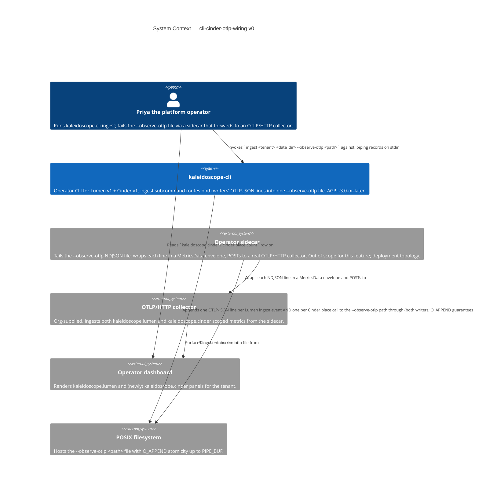

# Application Architecture — `cli-cinder-otlp-wiring-v0`

Author: `@nw-solution-architect` (Morgan), DESIGN wave, 2026-05-18.
Mode: PROPOSE.

The architectural question this feature must answer:

> Two writers (`LumenToOtlpJsonWriter` and `CinderToOtlpJsonWriter`),
> each holding its own `Arc<Mutex<W>>` per ADR-0039 §1 and §2, must
> share a single sink at `<path>` such that cross-writer NDJSON
> validity (OK6) is structurally guaranteed under concurrent emission.
> The writers' public API is locked (ADR-0039 §1, DISCUSS D6); the
> sharing mechanism must work with the existing `new(W)` constructor
> that takes ownership of a `W: Write + Send`.

The decision is **`File::try_clone`**: open the operator-supplied
path exactly once with
`OpenOptions::new().create(true).append(true).open(path)`, then call
`file.try_clone()?` to obtain a second `File` handle pointing at the
same underlying file description. Pass the original `File` into
`LumenToOtlpJsonWriter::new(file)` and the cloned `File` into
`CinderToOtlpJsonWriter::new(file_clone)`. Each writer owns its own
`Mutex<File>` (unchanged from ADR-0039 §2). Cross-writer atomicity is
the OS-level POSIX `O_APPEND` guarantee: each `write(2)` is atomic up
to `PIPE_BUF` (4096 bytes on Linux and macOS), which exceeds the
worst-case OTLP-JSON line size (`cinder.migrate.count` at roughly
540 bytes). Full rationale, rejected alternatives, and quality-
attribute alignment in `design/wave-decisions.md > DD1` and in the
ADR-0039 §8 extension.

## C4 — System Context (Level 1)



The system context view shows the operator-visible value chain. The
change this feature ships is confined to the `kaleidoscope-cli`
node: the Cinder writer joins the Lumen writer at the
`--observe-otlp <path>` file boundary. Everything downstream (the
sidecar, the collector, the dashboard) is unchanged — that is the
operational value the feature delivers. Priya's existing sidecar +
collector + dashboard chain gains a new `kaleidoscope.cinder` scope
without any configuration change.

## C4 — Container View (Level 2)

```mermaid
C4Container
  title Container Diagram — cli-cinder-otlp-wiring v0
  Person(operator, "Priya the platform operator")
  Container_Boundary(cli, "kaleidoscope-cli crate") {
    Container(main, "main.rs (binary)", "Rust, src/main.rs", "Parses --observe-otlp <path>; dispatches to ingest subcommand.")
    Container(ingest, "ingest function", "Rust, src/lib.rs:139-212", "Reads NDJSON records; batches; flushes per batch_size. Per batch: Lumen ingest event + Cinder place call. Opens --observe-otlp file ONCE with O_APPEND; try_clone()s the handle; constructs both writers against the two handles.")
    Container(lumen_writer, "LumenToOtlpJsonWriter<File>", "Rust, self-observe::lumen_otlp_json", "Owns Mutex<File>. Emits `lumen.ingest.count` lines on each record_ingest. Per-emission: write_all(body) + write_all(b\"\\n\") + flush inside the Mutex guard. Public API locked by self-observe v0.")
    Container(cinder_writer, "CinderToOtlpJsonWriter<File>", "Rust, self-observe::cinder_otlp_json", "Owns Mutex<File>. Emits `cinder.place.count` lines on each record_place (and migrate/evaluate, unreachable from ingest loop per DISCUSS D1). Per-emission triple identical to Lumen writer. Public API locked by ADR-0039 §1.")
  }
  Container_Boundary(stores, "Storage adapters") {
    Container(lumen_store, "FileBackedLogStore", "Rust, lumen crate", "Wires the LumenToOtlpJsonWriter as its MetricsRecorder; calls record_ingest on each batch ingest.")
    Container(cinder_store, "FileBackedTieringStore", "Rust, cinder crate", "Wires the CinderToOtlpJsonWriter as its MetricsRecorder; calls record_place on each tier placement.")
  }
  ContainerDb(otlp_file, "--observe-otlp <path>", "POSIX file, O_APPEND", "Single NDJSON file. Receives interleaved Lumen and Cinder OTLP-JSON lines. Kernel guarantees cross-writer atomicity up to PIPE_BUF (4 KiB). Line size worst case ~540 bytes.")
  System_Ext(sidecar, "Operator sidecar", "Tails NDJSON; forwards to OTLP/HTTP collector.")

  Rel(operator, main, "Invokes with --observe-otlp <path>")
  Rel(main, ingest, "Dispatches to (otlp_log_path = Some(path))")
  Rel(ingest, otlp_file, "Opens once with OpenOptions::create(true).append(true) AND try_clone()s for the second handle through")
  Rel(ingest, lumen_writer, "Constructs `LumenToOtlpJsonWriter::new(file)` from the original handle and boxes as Lumen recorder")
  Rel(ingest, cinder_writer, "Constructs `CinderToOtlpJsonWriter::new(file_clone)` from the cloned handle and boxes as Cinder recorder")
  Rel(ingest, lumen_store, "Wires lumen_writer into via FileBackedLogStore::open")
  Rel(ingest, cinder_store, "Wires cinder_writer into via FileBackedTieringStore::open")
  Rel(lumen_store, lumen_writer, "Calls record_ingest on per batch flush")
  Rel(cinder_store, cinder_writer, "Calls record_place on per batch flush")
  Rel(lumen_writer, otlp_file, "write_all(body) + write_all(b\"\\n\") + flush via Mutex<File> guard to")
  Rel(cinder_writer, otlp_file, "write_all(body) + write_all(b\"\\n\") + flush via Mutex<File> guard to")
  Rel(sidecar, otlp_file, "Tails NDJSON lines from")
```

The container view shows the two writers sharing one OS file
description through two distinct `File` handles obtained via
`try_clone`. Each writer's per-emission triple (`write_all(body) +
write_all(b"\n") + flush`) is serialised within that writer by its
own `Mutex<File>` — the within-writer NDJSON-validity guarantee
inherited from ADR-0039 §2. The **cross-writer** guarantee is the
new property this feature ships: it is provided by the kernel's
`O_APPEND` atomicity for sub-`PIPE_BUF` writes, which composes the
two writers' independently-serialised triples into a byte stream
where no line interleaves with another. Each writer remains
unaware of the other; the only shared state is the underlying file
description (a kernel object, not a userspace one).

The acceptance test exercises the cross-writer property directly:
the `cross_writer_ndjson_validity_under_concurrent_random_pauses`
test spawns one thread driving the Lumen writer and one thread
driving the Cinder writer against `File::try_clone`-paired handles
onto the same real `tempfile`-style path, with random `[0, 5]` ms
pauses between calls. Post-join the test reads back the file and
asserts every non-empty line parses as `serde_json::Value`, the
file ends with `\n`, and the per-writer line counts match the
expected 100 + 100. This is the substrate-lie probe for the
`O_APPEND` atomicity claim in the deployment substrate Priya
actually runs on (POSIX, Docker Linux per the recent `Dockerfile`
work).

## C4 — Component View (Level 3)

**Not produced.** The change inside `ingest` is one match-arm
substitution (the Cinder recorder construction at
`crates/kaleidoscope-cli/src/lib.rs:163` becomes a parallel `match
otlp_log_path { ... }`) plus one `try_clone()?` call inside the
existing `Some(path) => { … }` arm at lines 147-160. The new
acceptance test is one new file mirroring `observe_otlp_flag.rs`.
Per the SA principle ("Component (L3) only for complex subsystems"),
L3 is **explicitly skipped** for this feature. Reification conditions:
L3 would become appropriate if (a) a `MultiWriter` / `SharedFile` /
`Tee` abstraction were introduced (which DD1 rejected), (b) the
`ingest` function grew sub-components for the writer construction
(it does not — the construction is five lines of std-lib calls), or
(c) a third writer landed in the same sink path (out of scope; would
trigger an architectural reconsideration of the file-sharing
mechanism). None apply at v0.
