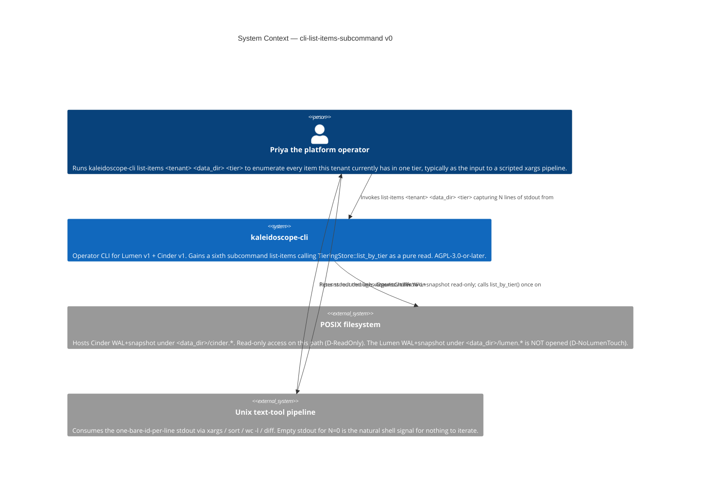
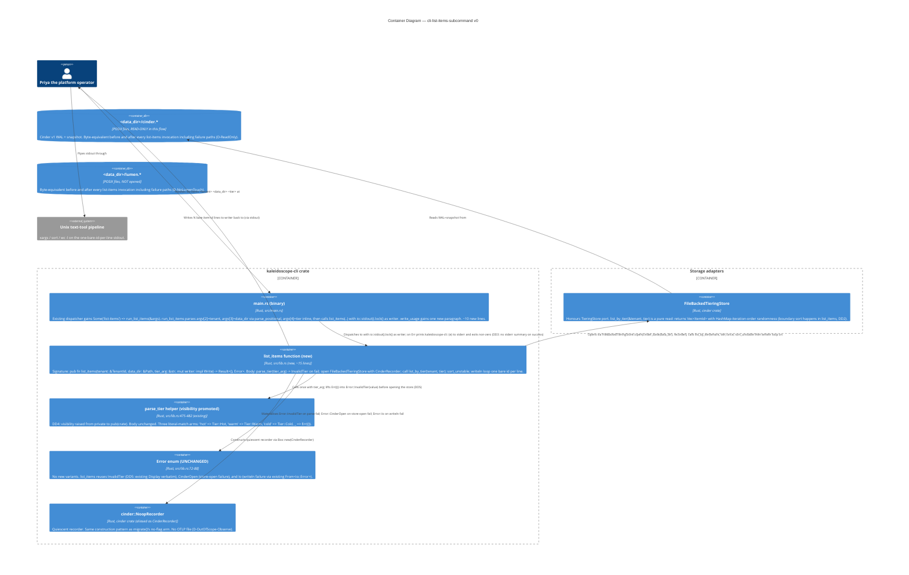

# Application Architecture — `cli-list-items-subcommand-v0`

Author: `@nw-solution-architect` (Morgan), DESIGN wave, 2026-05-19.
Mode: PROPOSE.

**Question**: how does `list-items <tenant> <data_dir> <tier>`
join `kaleidoscope-cli` as a sixth subcommand, faithful to the
existing read-only `TieringStore::list_by_tier` port, with no
Lumen-side touch and no Cinder mutation?

**Decision**: new `pub fn list_items(...)` free function (DD1)
reusing the existing `parse_tier` helper (visibility promoted
to `pub(crate)`, DD4); `sort_unstable` lexicographic boundary
sort (DD2); no stderr summary (DD3); existing `Error` variants
reused verbatim (DD5). Full rationale in
`design/wave-decisions.md > DD1..DD5`.

## C4 — System Context (Level 1)

The change is confined to the `kaleidoscope-cli` node. The
filesystem container gains zero new write access patterns
(D-ReadOnly: Cinder WAL+snapshot is byte-equivalent across all
paths). The Lumen container is unchanged (D-NoLumenTouch).

## C4 — Container View (Level 2)

`list_items()` is the sixth sibling of `ingest`, `read`,
`stats`, `stats_with_tiers`, `migrate`. It composes the
Cinder store-open pattern from `migrate()`'s no-flag arm
with one existing port call (`list_by_tier`) and one
boundary sort. The Lumen container is absent by
construction (D-NoLumenTouch).

## C4 — Component View (Level 3)

**Not produced.** Four-step linear flow (parse → open →
list_by_tier → sort → writeln loop) with no branch fan-out
beyond the three reused error variants. **Reification
conditions**: (a) cross-tenant aggregate (D-OutOfScope-
CrossTenant reversal) introducing a `list_tenants()` step;
(b) pagination (D-OutOfScope-Pagination reversal)
introducing a windowing component; (c) `--at <timestamp>`
historical reconstruction (D-OutOfScope-Historical
reversal). None expected in v0.
