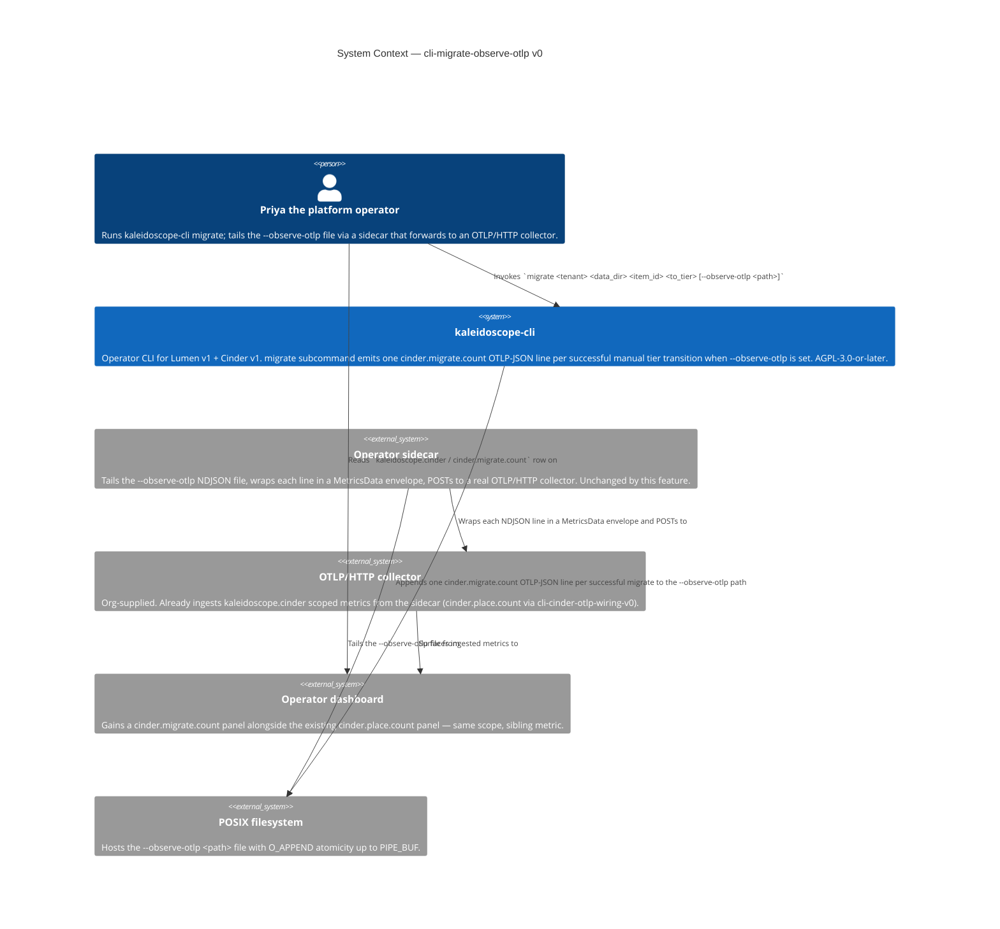
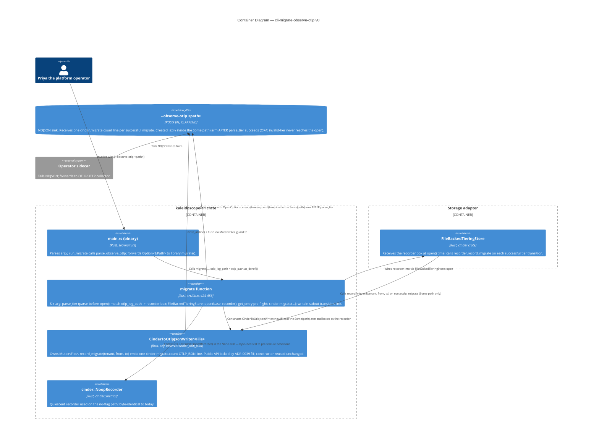

# Application Architecture — `cli-migrate-observe-otlp-v0`

Author: `@nw-solution-architect` (Morgan), DESIGN wave, 2026-05-19.
Mode: PROPOSE.

Architectural question: how does `kaleidoscope-cli migrate` emit a
`cinder.migrate.count` OTLP-JSON line into the operator's
`--observe-otlp <path>` file when set, while preserving byte-for-byte
stdout and locked-test outcomes when absent? Answer (DD1+DD2): grow
`migrate(...)` by one trailing `Option<&Path>` parameter; dispatch
internally on `match otlp_log_path` that yields
`CinderToOtlpJsonWriter::new(file)` in `Some` and `CinderRecorder` in
`None`, both passed to `FileBackedTieringStore::open(...)`.

## C4 — System Context (Level 1)

The system context shows the migrate event joining the same value
chain ingest-side place events already use. Operationally Priya
gains a queryable audit trail of state-mutating manual migrations
with zero configuration change to the sidecar or collector.

## C4 — Container View (Level 2)

The container view shows the single-writer shape (contrast with the
two-writer + `try_clone` shape in `cli-cinder-otlp-wiring-v0`'s
ingest path). Only the Cinder store is opened; Lumen is never
touched on the migrate path (D-NoLumenTouch inherited from
`cli-migrate-subcommand-v0`). The within-writer NDJSON-validity
guarantee from ADR-0039 §2 covers the single-writer case
trivially — no cross-writer composition is needed because there is
no second writer.

## C4 — Component View (Level 3)

**Not produced.** The change inside `migrate()` is one match-arm
insertion (the recorder construction at
`crates/kaleidoscope-cli/src/lib.rs:434` becomes a `match
otlp_log_path { ... }` over two arms) plus one signature parameter
addition. The acceptance test is one new file mirroring
`migrate_subcommand.rs`. Per the SA principle "L3 only for complex
subsystems (5+ components)", L3 is explicitly skipped. Reification
conditions: L3 would become appropriate only if (a) a sink-fanout
abstraction were introduced (rejected by DD2 of this wave and DD1
of `cli-cinder-otlp-wiring-v0`), (b) the `migrate()` body grew
sub-components for the writer construction (it does not — the
construction is five lines of std-lib calls), or (c) a third
writer landed on the same path (out of scope).
