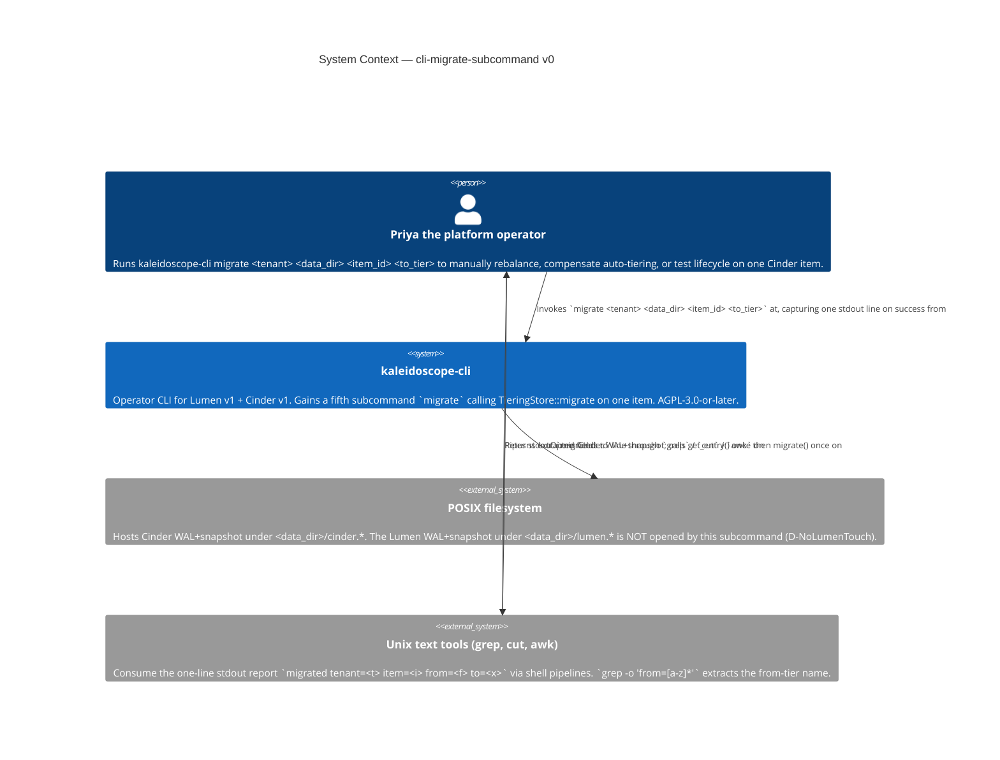
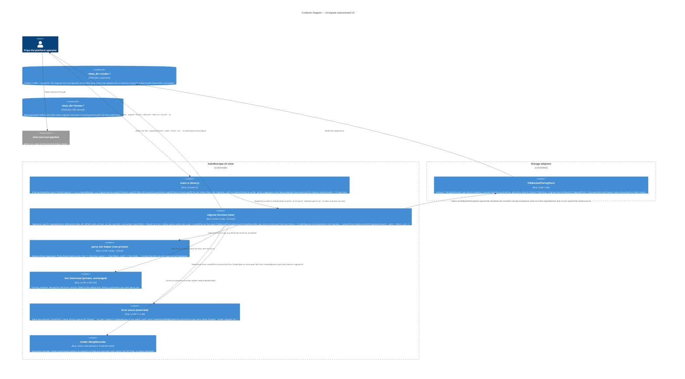

# Application Architecture — `cli-migrate-subcommand-v0`

Author: `@nw-solution-architect` (Morgan), DESIGN wave, 2026-05-19.
Mode: PROPOSE.

**Question**: how does `migrate <tenant> <data_dir> <item_id> <to_tier>`
join `kaleidoscope-cli` as a fifth subcommand, faithful to the
underlying idempotent API, with no Lumen-side touch?

**Decision**: new `pub fn migrate(...)` free function (DD1) with
private `parse_tier` (DD3, inverse of `tier_lowercase`); pre-flight
`get_entry` discovers `from` tier (DD2); two new `Error` variants —
`InvalidTier { value }` and `CinderMigrate(_)` (DD4). Full rationale
in `design/wave-decisions.md > DD1..DD6`.

## C4 — System Context (Level 1)

The change is confined to the `kaleidoscope-cli` node. The
filesystem container gains one new write access pattern
(`<data_dir>/cinder.*` mutation via the `migrate` trait method).
The Lumen container is unchanged — `<data_dir>/lumen.*` is byte-
equivalent before and after every invocation including the
failure paths.

## C4 — Container View (Level 2)

`migrate()` is the fifth sibling of `ingest`, `read`, `stats`,
`stats_with_tiers`. It composes the Cinder store-open pattern
from `ingest()`'s no-flag arm with the two new constructs
`parse_tier` and the extended `Error` enum. The Lumen container
is absent from this diagram by construction (D-NoLumenTouch).

## C4 — Component View (Level 3)

**Not produced.** Four-step linear flow (parse → open →
get_entry → migrate → render) with no branch fan-out beyond the
four error variants. **Reification conditions**: (a) `--dry-run`
flag reversal (DD7); (b) bulk migration (D-OutOfScope-Bulk
reversal); (c) quiescent-recorder helper extraction (rule of
three passes with `migrate`; deferred).
