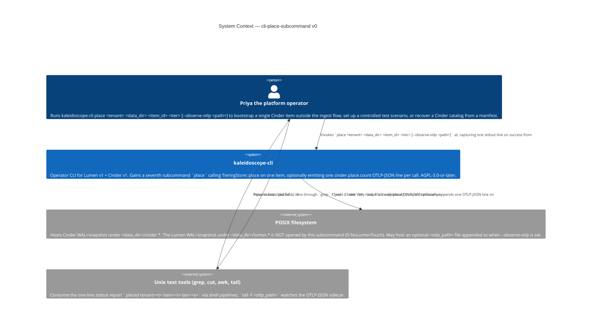
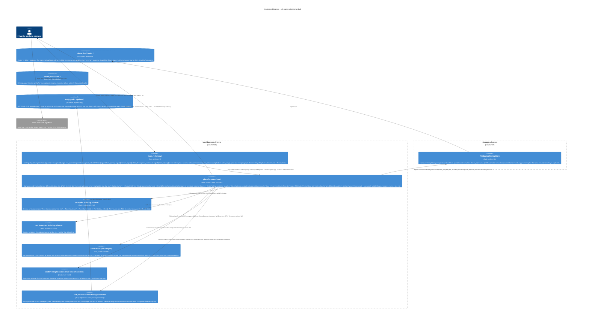

# Application Architecture — `cli-place-subcommand-v0`

Author: `@nw-solution-architect` (Morgan), DESIGN wave, 2026-05-19.
Mode: PROPOSE.

**Question**: how does `place <tenant> <data_dir> <item_id> <tier>
[--observe-otlp <path>]` join `kaleidoscope-cli` as a seventh
subcommand, faithful to `TieringStore::place`'s overwrite-semantics,
with optional Cinder-side OTLP-JSON emission, and no Lumen-side
touch?

**Decision**: new `pub fn place(...)` free function (DD1) mirroring
`migrate()`'s six-parameter shape; recorder construction copied
byte-for-byte from `migrate()`'s `match otlp_log_path` arms (DD2);
NO new `Error` variant (the trait method returns `()`; DD3);
existing `parse_tier`, `tier_lowercase`, `Error::InvalidTier`,
`Error::CinderOpen`, `Error::Io` reused without modification (DD4).
Full rationale in `design/wave-decisions.md > DD1..DD5`.

## C4 — System Context (Level 1)

The change is confined to the `kaleidoscope-cli` node. The
filesystem container gains one new write access pattern
(`<data_dir>/cinder.*` mutation via the `place` trait method, plus
an optional append to `<otlp_path>` when `--observe-otlp` is set).
The Lumen container is unchanged — `<data_dir>/lumen.*` is byte-
equivalent before and after every invocation including the
failure paths.

## C4 — Container View (Level 2)

`place()` is the seventh sibling of `ingest`, `read`, `stats`,
`stats_with_tiers`, `migrate`, `list_items`. It composes the Cinder
store-open pattern from `migrate()`'s shape (including the
`Some(path) => CinderToOtlpJsonWriter / None => CinderRecorder`
recorder match) with a simpler body (no `get_entry` pre-flight; no
`Result` lift on the trait call). The Lumen container is absent
from this diagram by construction (D-NoLumenTouch).

## C4 — Component View (Level 3)

**Not produced.** Four-step linear flow (parse → construct
recorder → open store → place → render) with no branch fan-out
beyond the three reused error variants and the two recorder arms.
Simpler than `migrate()`'s flow (which has the additional
`get_entry` pre-flight branch). **Reification conditions**: (a)
`--placed-at` flag reversal (D-Timestamp); (b) bulk placement
(D-OutOfScope-Bulk reversal); (c) `--no-overwrite` flag
introduction (D-Overwrite reversal) which would add a pre-flight
`get_entry` branch and a new `Error::AlreadyPlaced { item }`
variant; (d) recorder-construction helper extraction at the third
single-writer site (rule of three; today only `migrate()` and
`place()` share the shape).
