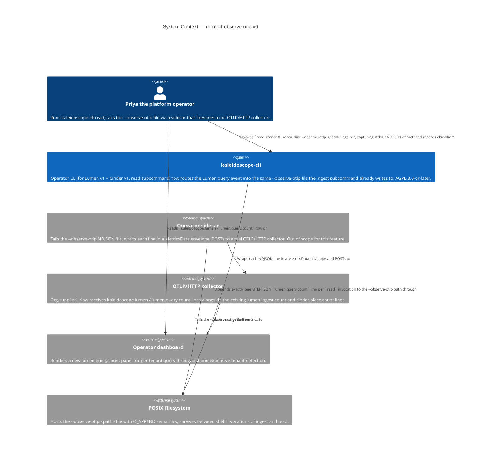
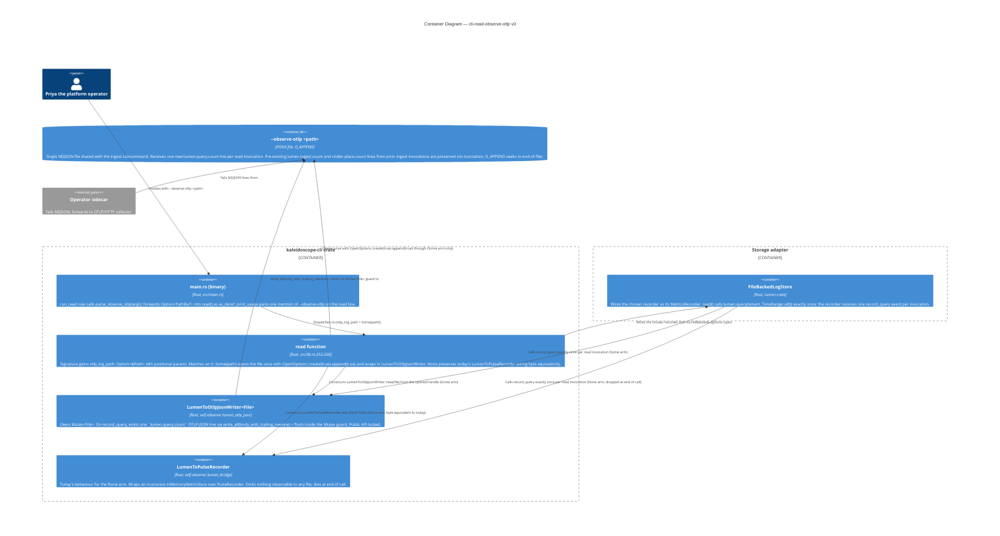

# Application Architecture — `cli-read-observe-otlp-v0`

Author: `@nw-solution-architect` (Morgan), DESIGN wave, 2026-05-19.
Mode: PROPOSE.

The architectural question this feature must answer:

> The `read()` function constructs exactly one writer (the Lumen
> recorder) and emits exactly one OTLP-JSON line per invocation
> (one `lumen.query.count` event). How does the wiring open the
> operator-supplied `--observe-otlp <path>` file for that single
> writer, and does the open mechanism reuse the `try_clone`
> machinery from ADR-0039 §8?

The decision is **single-handle `OpenOptions::append`, no `try_clone`**:
open the path exactly once with
`std::fs::OpenOptions::new().create(true).append(true).open(path)`
and pass the resulting `File` directly into
`LumenToOtlpJsonWriter::new(file)`. The `try_clone` step in §8 was
specifically motivated by the two-writer ingest case (Lumen + Cinder
over one shared file description); with one writer there is no second
owner to produce a clone for, so the call is elided. Cross-invocation
append safety (the OK3 ingest-then-read shell-session symmetry) is
inherited for free from POSIX `O_APPEND` semantics, which seek to
end-of-file on every `write(2)` regardless of which process opened the
file first. Full rationale, rejected alternatives, and the Reuse
Analysis in `design/wave-decisions.md > DD1, DD2, DD4`.

## C4 — System Context (Level 1)

The system context view shows the operator-visible value chain. The
change this feature ships is confined to the `kaleidoscope-cli` node:
the `read` subcommand joins `ingest` at the `--observe-otlp <path>`
file boundary. Everything downstream (the sidecar, the collector, the
dashboard) is unchanged — that is the operational value the feature
delivers. Priya's existing chain gains the read-side metric type
without any configuration change.

## C4 — Container View (Level 2)

The container view shows the single writer feeding one file. Unlike
the ingest container view (where two writers shared one file
description via `try_clone`), here only the Lumen writer participates
— the `read()` function does not construct a Cinder store at all
(DISCUSS D2). The within-writer NDJSON-validity guarantee (ADR-0039
§2: single coalesced `write_all` of body + `\n` inside the
`Mutex<File>` guard) is inherited unchanged. No cross-writer atomicity
question arises in this feature because no second in-process writer
exists. The OK3 ingest-then-read symmetry is a SEQUENTIAL-process
property: the prior `ingest` invocation's lines are already on disk
when `read` opens the file; `O_APPEND` ensures the new
`lumen.query.count` line lands after them without disturbing the
existing content.

## C4 — Component View (Level 3)

**Not produced.** The change inside `read()` is one match expression
over `otlp_log_path` (two arms, four lines per arm), and one positional
parameter added to the function signature. The change inside `main.rs`
is one `parse_observe_otlp(args)?` call and one `print_usage` line
edit. The new acceptance test is one file mirroring
`observe_otlp_flag.rs`. Per the SA principle ("Component (L3) only
for complex subsystems"), L3 is **explicitly skipped** for this
feature. Reification conditions: L3 would become appropriate if (a) a
shared `open_observe_otlp_file` helper were extracted (which DD2
rejected on rule-of-three grounds), (b) a second internal call site
emerged inside `read` itself (it does not — the recorder construction
is the only file-touching site), or (c) the recorder match grew a
third arm (e.g. a `read --observe-pulse` variant). None apply at v0.
