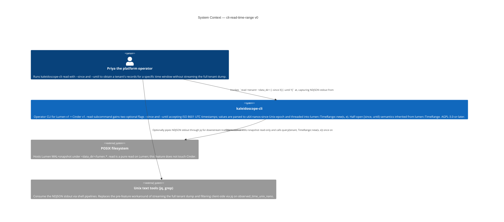
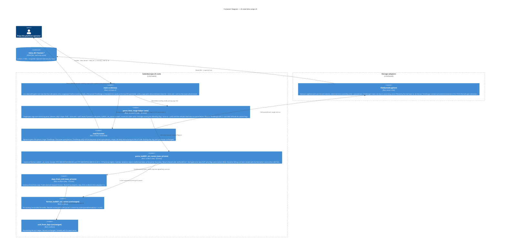

# Application Architecture — `cli-read-time-range-v0`

Author: `@nw-solution-architect` (Morgan), DESIGN wave, 2026-05-19.
Mode: PROPOSE.

**The architectural question**: the `kaleidoscope-cli read`
subcommand today always queries `lumen.query(tenant, TimeRange::all())`
at `crates/kaleidoscope-cli/src/lib.rs:284`. How does the operator
drive an arbitrary `TimeRange::new(s, e)` into that call site via
two optional CLI flags `--since` and `--until` that take ISO 8601 UTC
strings, WITHOUT breaking the locked OK2 tests (`observe_otlp_read_flag.rs`,
`observe_otlp_flag.rs`) and WITHOUT pulling in `chrono` / `time` /
`jiff`?

**The decision**: extend `read()` from 4 args to 5 by appending an
explicit `range: TimeRange` parameter (DD1); add a private library
function `parse_iso8601_utc_nanos` next to its inverse
`format_iso8601_utc_nanos` plus a private library helper
`days_from_civil` next to its inverse `civil_from_days` (DD2);
add a binary-side `parse_time_range` helper that does the argv
scan and constructs the stderr error message naming the offending
flag (DD2). The parser accepts the two shapes `YYYY-MM-DDTHH:MM:SSZ`
and `YYYY-MM-DDTHH:MM:SS.D..DZ` with 1..=9 fractional digits;
calendar validation rejects malformed dates at the parser boundary
(DD3). No new external crate; the no-`chrono`-no-`time` posture
inherited from `cli-stats-subcommand-v0` DD1 is preserved. Full
rationale and the Reuse Analysis in `design/wave-decisions.md`.

## C4 — System Context (Level 1)

The change is confined to the `kaleidoscope-cli` node. Before this
feature, Priya answered the bounded-window question via
`read <tenant> <data_dir> | jq 'select(.observed_time_unix_nano >= NNN
and .observed_time_unix_nano < MMM)'`, hand-converting the ISO 8601
window edges into nanosecond literals. After it, the same answer
falls out of the existing `read` invocation directly from the
storage layer.

## C4 — Container View (Level 2)

The parser pair (`parse_iso8601_utc_nanos`, `days_from_civil`)
cohabits in `lib.rs` next to its already-shipped inverse pair so
the round-trip property AC is a single-file local check.
`parse_time_range` is the binary wrapper that adds CLI-flag-name
context to the parser's typed error (same split shape as
`parse_observe_otlp` + `Option<&Path>` on `read()`). The `read()`
body changes by one token: `TimeRange::all()` → `range`.

## C4 — Component View (Level 3)

**Not produced.** The parser body is a fixed-position digit-walker
+ calendar validation + `days_from_civil` call + fractional-digit
left-pad; the `read()` body change is one token; `run_read_with` is
one line. L3 reification conditions: (a) parser extended to accept
non-`Z` offsets (DD3 forward-compat hook); (b) `IsoParseError`
escapes private surface (future library caller wants typed errors);
(c) `parse_time_range` generalised across multiple flag pairs.
