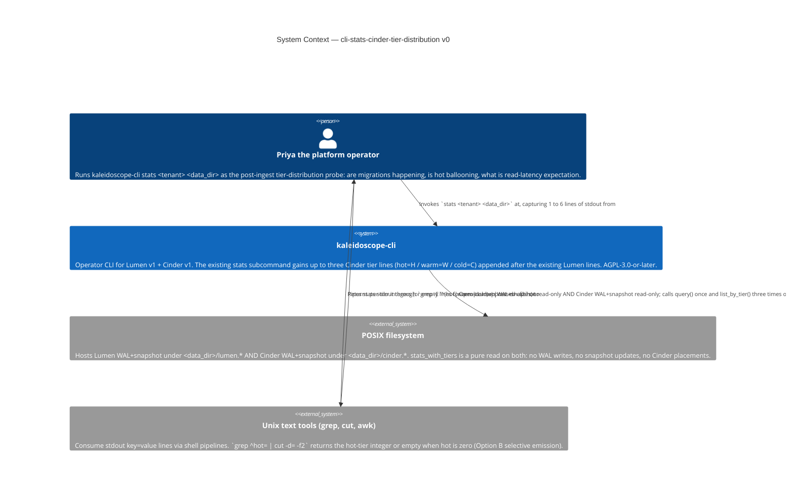
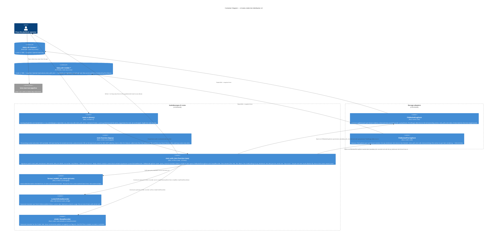

# Application Architecture — `cli-stats-cinder-tier-distribution-v0`

Author: `@nw-solution-architect` (Morgan), DESIGN wave, 2026-05-19.
Mode: PROPOSE.

**The architectural question**: the `kaleidoscope-cli` `stats`
subcommand today emits Lumen-side lines only (`records=N`,
`earliest=`, `latest=`). How does the Cinder tier distribution
(`hot=H`, `warm=W`, `cold=C`) join the stdout shape WITHOUT modifying
the locked `tests/stats_subcommand.rs` file (DISCUSS D10) and WITHOUT
breaking the predecessor's byte-equivalent contract for tenants with
zero Cinder placements (OK4)?

**The decision**: add a new sibling free function `stats_with_tiers`
that reuses `stats()`'s Lumen body and appends a Cinder-side loop
over `[Tier::Hot, Tier::Warm, Tier::Cold]` emitting one line per
non-zero tier; repoint `main.rs::run_stats` from `stats` to
`stats_with_tiers`; leave `stats()` itself untouched (DD1). The
quiescent recorder pattern from `ingest()`'s no-flag arm is reused
for the Cinder side (DD3). Full rationale, alternatives, and the
Reuse Analysis in `design/wave-decisions.md > DD1, DD2, DD3, DD5`.

## C4 — System Context (Level 1)

The change is confined to the `kaleidoscope-cli` node. Before this
feature, Priya answered the tier-distribution question via a one-off
Rust harness around `list_by_tier(tenant, ..)`. After it, the same
answer falls out of the existing `stats` invocation appended to the
Lumen lines in `grep`-friendly key=value shape. The filesystem
container gains one new read access pattern (`<data_dir>/cinder.*`);
no Cinder WAL writes occur.

## C4 — Container View (Level 2)

`stats_with_tiers()` is the fourth sibling of `ingest`, `read`,
`stats`. It composes `stats()`'s Lumen body verbatim with the Cinder
store-open pattern from `ingest()`'s no-flag arm. The legacy `stats`
is retained as the byte-level test oracle for OK4 (DD1). The Cinder
container appears here as this feature's single new outbound dep.

## C4 — Component View (Level 3)

**Not produced.** The change inside `stats_with_tiers()` is one
inherited `(first, last)` match plus a three-iteration `for` loop
with an `if count > 0` guard and a `match tier` to key string. L3 is
explicitly skipped per the SA principle. **Reification conditions**:
(a) the quiescent recorder construction is extracted into a shared
helper (rule of three passed; extraction deferred); (b) a future
`--json` flag (DD5 reversal) introduces a `TierCounts` public struct;
(c) `Tier::all()` lands on `cinder` (DD2 reversal) and the loop
switches from the hardcoded array.
