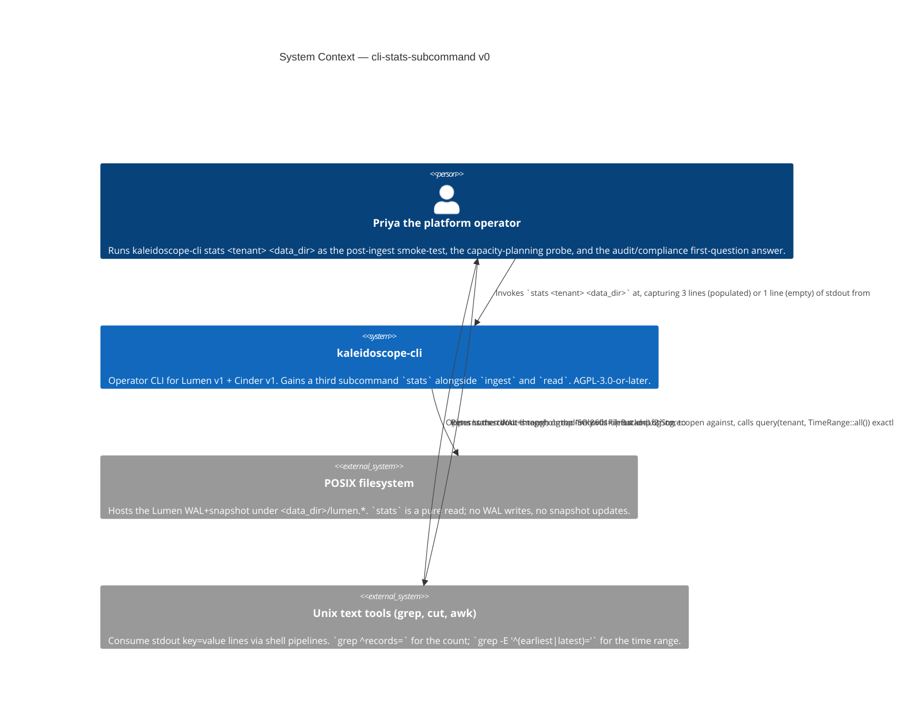
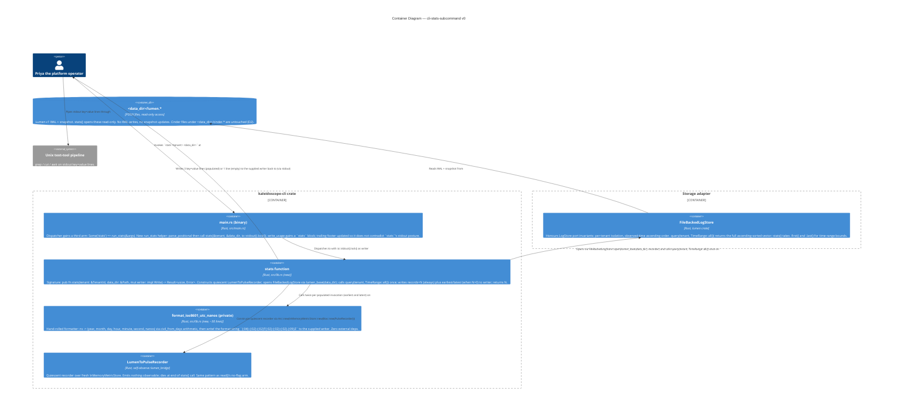

# Application Architecture — `cli-stats-subcommand-v0`

Author: `@nw-solution-architect` (Morgan), DESIGN wave, 2026-05-19.
Mode: PROPOSE.

The architectural question:

> The `kaleidoscope-cli` binary today dispatches two subcommands
> (`ingest`, `read`), each a free function that opens
> `FileBackedLogStore`, performs one Lumen operation, and writes to a
> supplied writer. How does a third subcommand `stats` join the
> shape: which constructs does it reuse, how is its single rendering
> concern (ISO 8601 formatting) realised, and what is the minimal
> new surface?

The decision is **third subcommand arm, mirrors `read()`'s shape,
hand-rolled ISO 8601 formatter, no new external dependency**.
`stats()` constructs the same quiescent `LumenToPulseRecorder` that
`read()`'s no-flag arm constructs
(`crates/kaleidoscope-cli/src/lib.rs:275-279`); opens
`FileBackedLogStore` via the existing `lumen_base(data_dir)` helper
(line 118-120); calls `lumen.query(tenant, TimeRange::all())` once,
relying on the `LogStore` port's documented ascending-order invariant
(`crates/lumen/src/store.rs:67-75`) to take `records.first()` and
`records.last()` in O(1); writes three (or one) key=value lines via a
private formatter; returns `Result<usize, Error>`. Full rationale,
rejected alternatives, and the Reuse Analysis in
`design/wave-decisions.md > DD1, DD2, DD3, DD4`.

## C4 — System Context (Level 1)

The system context view shows the operator-visible value chain.
Before this feature, Priya answered "is there data for this tenant,
across what window?" via four invocations of `kaleidoscope-cli read`
piped through `wc -l`, `head -1`, `tail -1`, plus manual `jq` and
manual nanos-to-ISO-8601 conversion; each invocation materialised the
full record set just to throw it away. After this feature, one
`stats` invocation prints exactly the information the pipeline was
reducing to, without materialising the records anywhere. The change
is confined to the `kaleidoscope-cli` node.

## C4 — Container View (Level 2)

`stats()` is the third sibling of `ingest()` and `read()`, sharing
the recorder construction pattern with `read()`'s no-flag arm. The
hand-rolled ISO 8601 formatter is a private helper visible only
within `lib.rs`; it has no public surface and is exercised end-to-end
through the acceptance test's deterministic seed. The Lumen storage
container is reused unchanged. The Cinder container is **absent from
the diagram on purpose**: `stats()` does not construct
`FileBackedTieringStore` and never touches `<data_dir>/cinder.*`
(DISCUSS D2).

## C4 — Component View (Level 3)

**Not produced.** The change inside `stats()` is one match on
`(records.first(), records.last())` plus a private formatter call per
populated timestamp. The change inside `main.rs` is one new
`run_stats` helper (parse, call, return) and one extended
`print_usage` block. The new test file mirrors
`observe_otlp_read_flag.rs`'s harness shape (DISCUSS D9 keeps it
inline-duplicated).

Per the SA principle ("Component (L3) only for complex subsystems"),
L3 is **explicitly skipped**.

**Reification conditions** — L3 becomes appropriate if any of:

(a) The hand-rolled ISO 8601 formatter is extracted into a shared
helper consumed by more than one subcommand.

(b) The quiescent recorder construction is extracted into a shared
helper — rule of three triggers here (`stats()` is the third site
after `ingest`'s and `read`'s no-flag arms); DISCUSS does not
mandate the extraction at v0, and this wave does not propose it.

(c) A future `--json` / `--csv` flag (DISCUSS D4 reversal) introduces
a `StatsSummary` public struct (DD2 reversal); the formatter then
sits on the boundary between data shape and rendering shape.

None apply at v0. L3 stays unproduced.
