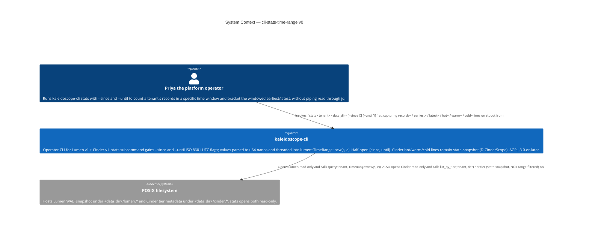
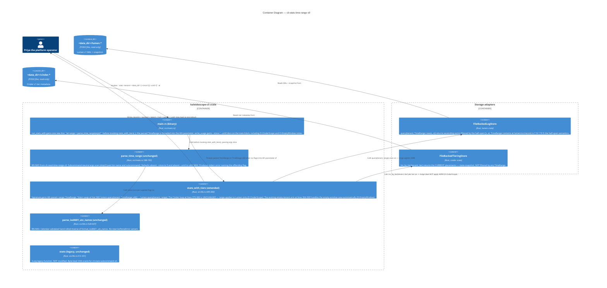

# Application Architecture — `cli-stats-time-range-v0`

Author: `@nw-solution-architect` (Morgan), DESIGN wave, 2026-05-19.
Mode: PROPOSE.

**The architectural question**: the `stats` subcommand today always
queries `lumen.query(tenant, TimeRange::all())` inside
`stats_with_tiers` at `crates/kaleidoscope-cli/src/lib.rs:359-361`.
How does the operator drive an arbitrary `TimeRange::new(s, e)` into
that call site via two optional flags `--since` / `--until`, WITHOUT
breaking the locked OK4 tests, WITHOUT touching the Cinder loop at
lines 375-380 (D-CinderScope), reusing every parsing construct
already shipped by `cli-read-time-range-v0`?

**The decision**: extend `stats_with_tiers()` from 3 args to 4 by
appending `range: TimeRange` (DD1); thread it ONLY into the Lumen
call — option (a), one function, Cinder branch ignores the param
(DD2); confirm the existing empty-tenant arm handles the empty-window
case naturally (DD3); mechanically update the five
`stats_with_tiers(...)` call sites in
`tests/stats_cinder_tier_distribution.rs` with `TimeRange::all()`
as the new 4th arg, leaving `tests/stats_subcommand.rs` untouched
because it exercises only the legacy 3-arg `stats()` (DD4). Reuses
every parser construct from the predecessor unchanged; no new
library function, no new helper, no new type, no new external crate
(DD5). Full rationale in `design/wave-decisions.md`.

## C4 — System Context (Level 1)

The change is confined to the `kaleidoscope-cli` node. The Cinder
branch's behaviour is INVARIANT to the new flags — that invariance
is the principal new contract this feature introduces (D-CinderScope)
and is empirically probed by OK3.

## C4 — Container View (Level 2)

The asymmetry on the two storage adapters is the principal
architectural contract this feature introduces: `range` flows into
the Lumen call but is structurally absent from the Cinder loop.
This is the source-level encoding of D-CinderScope. OK3 probes the
asymmetry empirically (two invocations with two different
`TimeRange` values; assert Cinder lines byte-identical, Lumen lines
differ).

## C4 — Component View (Level 3)

**Not produced.** Sub-component scale: one new positional parameter;
one token swap; one new line in `run_stats_with`. L3 reification
conditions: (a) Cinder time-bound queries become a real feature; (b)
`stats_with_tiers` grows additional Lumen filters warranting a
`StatsOptions` builder; (c) the test harness rule-of-three refactor
lands.
