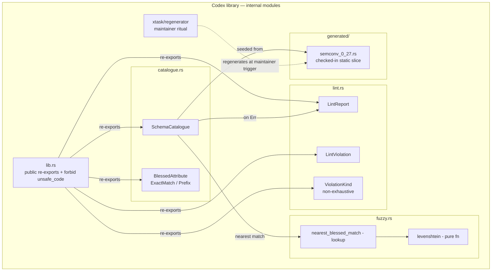

# Codex v0 — C4 L3 (Component)

L3 decomposition of the Codex library. Spark's container is left at
L2; the cross-feature integration is documented in ADR-0025.

## Component responsibilities

| Component | Responsibility |
|---|---|
| `lib.rs` | Public re-export surface: five types per ADR-0022. `#![forbid(unsafe_code)]`. Nothing else. |
| `catalogue.rs::SchemaCatalogue` | Public type. Holds the seeded corpus. Exposes `new() -> Self` and `validate(&[(&str, &str)]) -> Result<(), LintReport>`. |
| `catalogue.rs::BlessedAttribute` | Public type. Records one entry in the catalogue: name + match kind (`ExactMatch` or `Prefix`). |
| `lint.rs::LintReport` | Public type. Carries one or more `LintViolation`s. `Display` impl renders human-readable text. |
| `lint.rs::LintViolation` | Public type. One offending attribute: name, `ViolationKind`, optional `nearest_blessed_match`. |
| `lint.rs::ViolationKind` | Public `#[non_exhaustive]` enum. v0 variants: `Unknown`. v1+ may add `Deprecated`, `Misnamed`, etc. |
| `fuzzy.rs::levenshtein` | `pub(crate)` pure function. Two-row DP matrix. Used by `nearest_blessed_match` lookup. |
| `fuzzy.rs::nearest_blessed_match` | `pub(crate)` function. For an unknown attribute name, walks the corpus and returns `Some(closest)` when min distance ≤ 2, else `None`. |
| `generated/semconv_0_27.rs` | Checked-in `static` slice of `BlessedAttribute` records. Regenerated by the xtask ritual when the OTel semconv pin moves. |
| `xtask/regenerator` (separate crate) | Maintainer-trigger ritual. Reads `opentelemetry-semantic-conventions =0.27` and emits `generated/semconv_0_27.rs`. Not in the runtime closure. |

## Earned-Trust three-layer enforcement

Per ADR-0022, the public surface stays at five types. Three
enforcement layers:

1. **Subtype (compile-time)**: `forbid(unsafe_code)` in `lib.rs`;
   re-exports tightly scoped; no `pub use` of internal modules.
2. **Structural (CI)**: `cargo public-api -p codex` (Gate 2)
   confirms the surface against the locked baseline; `cargo
   semver-checks -p codex` (Gate 3) catches breaking additions.
3. **Behavioural (tests)**: slice 01-05 integration tests exercise
   the surface end-to-end through the public types; slice 06
   exercises Spark's integration path.
