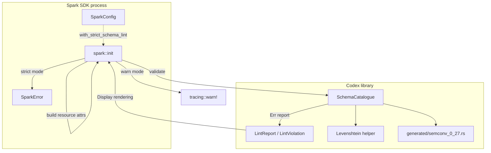

# Codex v0 — C4 L2 (Container)

Two containers in the Codex v0 design:

1. **Codex library** (`crates/codex`): pure Rust library. No I/O, no
   network, no async. The `SchemaCatalogue` is built lazily once per
   process (`OnceLock` per ADR-0025); the generated corpus file is
   the source of blessed-attribute data.

2. **Spark SDK process** (`crates/spark`): existing Spark library
   gains a Codex runtime dep. `spark::init` calls
   `SchemaCatalogue::validate(...)` after Resource composition and
   surfaces violations either as a `tracing::warn!` event (default)
   or as `Err(SparkError::SchemaValidation(report))` (opt-in
   strict).

The integration is in-process: Codex's `validate` returns a typed
`Result<(), LintReport>` synchronously; Spark consumes the report
and shapes the operator-facing surface.
