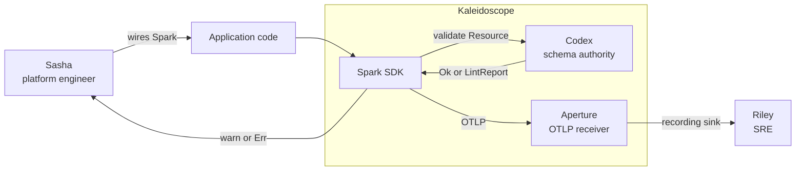

# Codex v0 — C4 L1 (System Context)

Codex sits inside the Kaleidoscope deployment as a library Spark
consumes at init time. The principal user-visible surface is Sasha's
boot-time integration of Spark; Riley benefits indirectly because
typo'd attributes never reach her dashboards.

External integrations: zero. Codex v0 has no network surface and no
external services.
