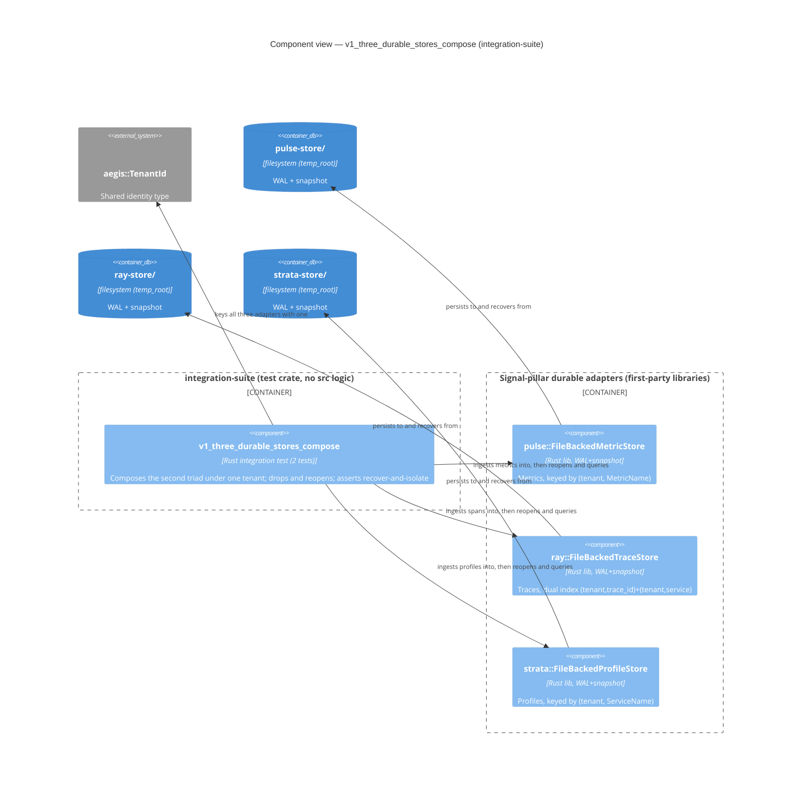
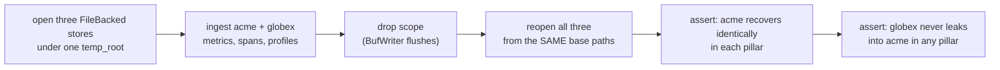

# Application Architecture: durable-stores-integration-v0

> **Author**: `nw-solution-architect` (Morgan), DESIGN wave, 2026-05-21.
> **Feature**: second-triad durable composition guarantee. Test-only, inside the
> existing `crates/integration-suite` crate. No production `src/` change.

## What this feature is, architecturally

This feature adds no new component. It adds one piece of **integration
evidence**: a test that wires the three signal-pillar durable adapters
(`pulse::FileBackedMetricStore`, `ray::FileBackedTraceStore`,
`strata::FileBackedProfileStore`) under a single `aegis::TenantId`, exercises a
drop-and-reopen, and asserts composed durability and tenant isolation. It is the
exact peer of the first-triad test that already proves cinder + sluice + lumen
compose under restart.

The "architecture" of a test-only feature is the composition graph it exercises:
which adapters share which identity, and which durable path each one writes to.

## Component view (C4 Component, Mermaid)

The diagram shows the new test binary as the driver composing three driven
durable adapters, each owning its own base path under one shared temp root, all
keyed by one `aegis::TenantId`. Arrows are labelled with verbs.

## Composition invariant exercised

The write path equals the reopen path (false-PASS guard). The drop is the only
durability event under test; no explicit flush call is made, mirroring the
first-triad precedent.

## Earned Trust note (probing the durable boundary)

Each adapter depends on the **filesystem**, the highest-risk external dependency
in this design. This test IS the empirical probe for the composed durable path:
it does not assume the three stores honour their durability contract together, it
demonstrates it by writing, dropping the process scope, and reopening from disk.
The per-pillar v1 suites already probe each adapter's WAL+snapshot+replay in
isolation; this feature probes that the three honour it **simultaneously under one
tenant** with **no cross-bucket leakage** — the property no per-crate suite can
observe alone. The error/boundary scenario (a pillar returning fewer records than
written) is the catalogued substrate-lie this probe is designed to catch via a
clear count-mismatch assertion.

## Boundaries and ownership

- This DESIGN wave produces specifications only. The test source under
  `crates/integration-suite/tests/` is authored in the DELIVER wave by
  `@nw-software-crafter` (per project CLAUDE.md).
- No production crate is modified. pulse, ray, strata, aegis are consumed
  read-only through their public surfaces.
- Cargo.toml gains two path dev-deps (`ray`, `strata`) and one `[[test]]` block
  (`v1_three_durable_stores_compose`); see DD2.
