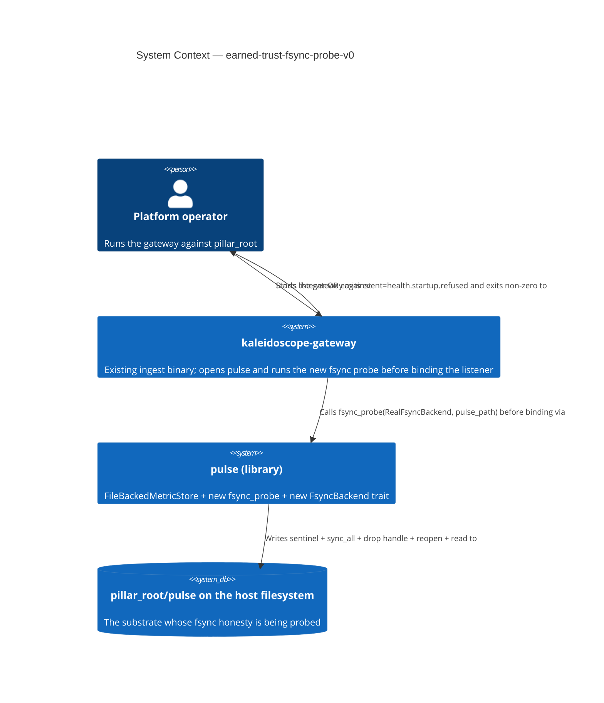
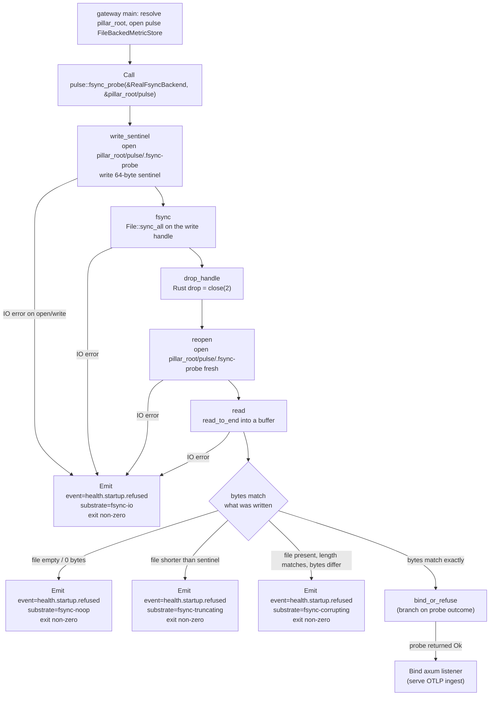

# Application Architecture: earned-trust-fsync-probe-v0

Author: `@nw-solution-architect` (Morgan), DESIGN wave, 2026-05-27.
Interaction mode: propose. British English. No em dashes.

This slice is the walking-skeleton fsync-honesty probe for the pulse
pillar, plus the missing `sync_all` calls on the pulse WAL append and
snapshot rename paths that Luna verified during DISCUSS. The probe
runs at startup in the `kaleidoscope-gateway` composition root (the
binary that opens pulse, since pulse is library-only) and refuses to
bind the listener on a substrate whose fsync is a no-op, a truncator,
or a byte-flipper. Decisions are recorded in `wave-decisions.md` and
`docs/product/architecture/adr-0049-earned-trust-honour-fsync.md`.

## C4 Level 1 — System Context



## C4 Level 2 — Probe path (in-process flow)

The probe is one free function over a small trait. The flow is the
pinned orchestration the user stories describe (US-01 Scenarios 1-3):
write a sentinel, fsync, drop the handle, reopen, read back, compare,
refuse or proceed. The diagram captures every observable arc.



L3 is **NOT produced**: the probe is one free function over one
trait (`FsyncBackend`) with one real implementation and a `Lying*`
test double, plus three surgical additions in `file_backed.rs`. The
read-API precedents (ADR-0042, ADR-0047, ADR-0048) also produced no
L3 for the same shape; the four-arrow L2 above is the complete
picture.

## Module layout

```
crates/pulse/
├── Cargo.toml                       # UNCHANGED (no new dep)
├── src/
│   ├── lib.rs                       # CHANGED: pub mod fsync_probe;
│   │                                #   pub use fsync_probe::{FsyncBackend,
│   │                                #     RealFsyncBackend, fsync_probe};
│   ├── file_backed.rs               # CHANGED: sync_all on append_wal
│   │                                #   per record; sync_all + parent
│   │                                #   directory fsync on snapshot
│   ├── fsync_probe.rs               # NEW: FsyncBackend trait,
│   │                                #   RealFsyncBackend, fsync_probe()
│   │                                #   free function, LyingFsyncBackend
│   │                                #   test double in #[cfg(test)] mod
│   │                                #   tests with three lie modes
│   ├── metric.rs                    # UNCHANGED
│   ├── metrics.rs                   # UNCHANGED
│   ├── predicate.rs                 # UNCHANGED
│   └── store.rs                     # UNCHANGED (no trait change)
└── tests/
    └── slice_01_fsync_probe.rs      # NEW: acceptance suite for the
                                     #   three lie classes plus the
                                     #   honest case

crates/kaleidoscope-gateway/
└── src/
    └── main.rs                      # CHANGED: call pulse::fsync_probe
                                     #   on pillar_root/pulse before
                                     #   binding the listener; emit
                                     #   event=health.startup.refused
                                     #   with substrate descriptor on Err
```

## Changes Per File / New Files

The table enumerates every modified / new line locus. Implementation
details (exact Rust syntax, error variant names, internal helper
decomposition) are the crafter's during GREEN; this table fixes the
public surface and the exact call sites.

| File | New / Changed | What | Line locus |
|---|---|---|---|
| `crates/pulse/src/fsync_probe.rs` | **NEW** | `pub trait FsyncBackend` with the minimum surface for the probe (the crafter owns the exact method set, but at minimum: open-write-sync, drop-and-reopen, read-back); `pub struct RealFsyncBackend` implementing the trait via `std::fs::File` + `File::sync_all`; `pub fn fsync_probe(backend: &dyn FsyncBackend, probe_dir: &Path) -> Result<(), String>` that orchestrates write_sentinel -> fsync -> drop_handle -> reopen -> read -> compare and returns a typed Err with a substrate descriptor (fsync-noop / fsync-truncating / fsync-corrupting / fsync-io) on failure; `#[cfg(test)] mod tests` with a `LyingFsyncBackend` double covering three lie modes (no-op, truncating, byte-flipping) mirroring `LyingLogStore` / `LyingTraceStore`. | new file |
| `crates/pulse/src/lib.rs` | CHANGED | Add `mod fsync_probe;` and `pub use fsync_probe::{FsyncBackend, RealFsyncBackend, fsync_probe};` to expose the new surface. Update the crate-level `//!` doc comment to list the new public items under "Public surface". | after line 55 (the existing `mod` declarations); the `pub use` additions follow the existing block (lines 57-61). |
| `crates/pulse/src/file_backed.rs` | CHANGED — **the Luna finding** | In `append_wal` (the free function starting at line 354), after the existing `wal.write_all(b"\n").map_err(io)?;` and the existing `wal.flush().map_err(io)?;`, add `wal.get_ref().sync_all().map_err(io)?;` so the WAL record is durable per record (`sync_all` syncs data AND metadata; the WAL grows and recovery reads its length). | inside `append_wal`, immediately after the existing `wal.flush()` on line 358. |
| `crates/pulse/src/file_backed.rs` | CHANGED | In `snapshot` (the method starting at line 163), after `serde_json::to_writer(&mut writer, &snap).map_err(parse)?;` and the existing `writer.flush().map_err(io)?;` (line 184), add `writer.get_ref().sync_all().map_err(io)?;` so the snapshot bytes are durable before the WAL is truncated. Then, after the snapshot is closed (`drop(writer);` on line 185) and BEFORE the WAL truncate / recreate (lines 187-193), fsync the parent directory: `File::open(self.base_path.parent().unwrap_or_else(\|\| Path::new(".")))?.sync_all()?` (mapped through `io`). The crafter owns the exact Rust shape; the requirement is one parent-directory fsync between snapshot persistence and WAL truncate so that on POSIX, the snapshot's directory entry is durable before the WAL truncate that depends on it. | inside `snapshot`, between line 184 (`writer.flush()`) and line 187 (`OpenOptions::new()` recreating the WAL). |
| `crates/pulse/src/file_backed.rs` | CHANGED | In `snapshot`, after the WAL is recreated (the truncate-and-create at lines 187-193 followed by `state.wal = BufWriter::new(wal_file)` on line 193), add a second parent-directory `sync_all` so the WAL truncation is durable (the directory entry size changed). One call, mapped through `io`. | inside `snapshot`, after line 193 (`state.wal = BufWriter::new(wal_file);`), before `Ok(())` on line 195. |
| `crates/pulse/tests/slice_01_fsync_probe.rs` | **NEW** | Acceptance suite for the slice: (a) honest substrate (real tempdir) passes the probe and the call returns `Ok(())` (US-01 Scenario 1, US-02 Domain 1); (b) no-op fsync (via `LyingFsyncBackend` mode) makes the probe return `Err` and the error names `substrate=fsync-noop` (US-01 Scenario 2, US-02 Domain 2); (c) truncating fsync (via `LyingFsyncBackend` mode) makes the probe return `Err` and the error names `substrate=fsync-truncating` (US-01 Scenario 3, US-02 Domain 3); (d) byte-flipping fsync makes the probe return `Err` and the error names `substrate=fsync-corrupting`; (e) `MetricStore` trait surface is byte-identical to the prior tag (US-01 Scenario 5 — gate-2-public-api guard at the workspace level; this is an assertion that the test file does not import any new trait method). The crafter writes the exact assertions. | new file |
| `crates/kaleidoscope-gateway/src/main.rs` | CHANGED | After the existing `pulse_path = pillar_root.join(PULSE_SUBDIR)` (line 60) and the open of `FileBackedMetricStore::open(&pulse_path, ...)` (verify the exact line in the current `main.rs`), and BEFORE the listener bind, add a call: `match pulse::fsync_probe(&pulse::RealFsyncBackend, &pulse_path) { Ok(()) => { /* proceed */ } Err(reason) => { /* emit event=health.startup.refused with substrate descriptor from reason; std::process::exit(non-zero) */ } }`. The existing `composition::probe()` patterns in the read APIs (`crates/log-query-api/src/composition.rs:73`) are the shape to mirror for the emission. The crafter owns the exact emission helper (a `tracing::error!` line, an `eprintln!`, or a small free function). | in `main()` after line 60 (`let pulse_path = ...`) and BEFORE the aperture spawn / listener bind. |
| `crates/pulse/Cargo.toml` | UNCHANGED | No new dependency; `std::fs::File::sync_all` is std. | n/a |
| `crates/pulse/src/store.rs` | UNCHANGED | `MetricStore` trait surface is byte-identical. | n/a |
| `crates/pulse/src/metric.rs`, `metrics.rs`, `predicate.rs` | UNCHANGED | Unaffected. | n/a |
| `crates/lumen/**`, `crates/ray/**`, `crates/cinder/**`, `crates/strata/**`, `crates/sluice/**`, `crates/beacon-server/**` | UNCHANGED | Slice 01 covers ONE pillar (pulse). Later slices extend the same `FsyncBackend` and `fsync_probe` surface to these pillars symmetrically. | n/a |
| `crates/log-query-api/**`, `crates/trace-query-api/**`, `crates/query-api/**` | UNCHANGED | The read APIs keep their existing `composition::probe()` (open-and-read); they will gain a `pulse::fsync_probe` call in a successor slice that wires the same probe through their composition root. Out of scope for slice 01. | n/a |
| Workspace `Cargo.toml` (members) | UNCHANGED | No new crate. | n/a |

## Reuse note (pattern, not types)

The probe pattern (a free function over a port, with a real
implementation and a `Lying*` double, called from a composition root
BEFORE the listener binds) is REPRODUCED from the proven
`composition::probe()` in `log-query-api` (ADR-0047 Decision 6) and
`trace-query-api` (ADR-0048 Decision 8) and the originating ADR-0042
Decision 8. The `event=health.startup.refused` vocabulary is REUSED
VERBATIM, with a new informational `substrate=<descriptor>` payload
field. The `LyingFsyncBackend` test double pattern mirrors
`LyingLogStore` / `LyingTraceStore`. **No code is shared across
crates**: the trait, the real impl, the probe function, and the
double all live inside `crates/pulse` (the pillar that owns the write
path); the pattern is recognised by future contributors without a
cross-crate dependency. **This is the FIRST clone of the
`composition::probe()` pattern to the write-side**, not the
rule-of-three trigger (that lives on the read-API side, recorded in
ADR-0048 as a forward-looking `query-http-common` extraction).

## Quality attribute coverage (ISO 25010)

| Attribute | How addressed |
|---|---|
| Reliability | The probe runs BEFORE the listener binds (wire-then-probe-then-use, ADR-0042 Decision 8 preserved); a fsync-lying substrate refuses to start rather than serving fabricated durability; on the WAL append, the new `sync_all` makes the durability claim honest at the byte level; the snapshot rename gains parent-directory durability so the recovery invariant of ADR-0040 (snapshot wins, WAL replays) survives a crash. |
| Functional Suitability | Three lie classes (no-op, truncating, byte-corrupting) are distinguished in the substrate descriptor; the probe is deterministic over identical inputs (same sentinel, same path); on success, the probe returns `Ok(())` and the gateway proceeds unchanged. |
| Maintainability | One new small module in pulse; one small private trait; four surgical additions in `file_backed.rs` (one in `append_wal`, three in `snapshot`); no trait change; per-feature mutation testing scoped to the diff at 100% kill rate (ADR-0005 Gate 5; CLAUDE.md). |
| Security | The probe path `pillar_root/pulse/.fsync-probe` is FIXED and overwritten on every run; no accumulating state; the path is under the operator-controlled `pillar_root`, not `/tmp`. The substrate descriptor in the event payload names the LIE class, not credentials or filesystem options. |
| Performance Efficiency | The probe runs ONCE at startup: 64-byte write + one `sync_all` + reopen + read. Bounded and unobservable in operational latency. The per-record `sync_all` on `append_wal` is a real cost; batched fsync is a documented later optimisation behind the same call site (recorded as a successor feature). |
| Portability | `std::fs::File::sync_all` and `File::open` are portable; the probe works on Linux/macOS/Windows alike. |
| Compatibility | No change to the WAL or snapshot file formats; ADR-0040 recovery semantics are preserved (and now actually honoured by the substrate, which they implicitly assumed). |

## Earned-Trust enforcement (three orthogonal layers)

Reproduced from ADR-0042 Decision 8 / ADR-0047 Decision 6 / ADR-0048
Decision 8, applied to the new fsync probe. The principle is that
**every adapter contract must include a compile-time-enforced probe
contract, not a convention** (CLAUDE.md principle 12); a single-layer
bypass is caught by at least one of the other two.

| Layer | What it answers | How |
|---|---|---|
| Subtype check at composition-root boundary | Is the probe being consumed through its declared port? | The gateway's `main.rs` calls `pulse::fsync_probe(&pulse::RealFsyncBackend, &pulse_path)`; `RealFsyncBackend` satisfies `FsyncBackend` by `impl FsyncBackend for RealFsyncBackend`; if the implementation is removed, compilation fails. |
| AST structural pre-commit check | Does the binary CALL the probe before binding the listener? | A pre-commit hook scans `crates/kaleidoscope-gateway/src/main.rs` for a call to `pulse::fsync_probe` ABOVE the `axum::serve` / listener-bind call; if the order is inverted, the hook fails. (The exact hook script is Apex's during DEVOPS.) |
| Behavioural gold-test | Does the probe DETECT a lying substrate? | A test in `crates/pulse/tests/slice_01_fsync_probe.rs` exercises the three lie classes via `LyingFsyncBackend` and asserts the probe returns `Err` with the correct substrate descriptor; if a regression silently turns `!=` into `==`, the test fails. |

`import-linter` was investigated and rejected for this enforcement
(per CLAUDE.md principle 12): its contracts are import-graph only,
with no API for method-presence enforcement on classes; the AST
pre-commit hook covers the structural layer instead.

## Handoffs

DISTILL (`@nw-acceptance-designer`): translate the slice-01 ACs
(US-01 Scenarios 1-5 in `discuss/user-stories.md`, plus US-02
Scenarios 1-4) into `#[test]` functions driving `pulse::fsync_probe`
against a real tempdir AND against the `LyingFsyncBackend` test
double. The honest test mirrors
`probe_succeeds_against_a_readable_store_with_a_tenant`
(`crates/log-query-api/src/composition.rs:196`); the lying tests
mirror `probe_refuses_when_the_store_cannot_be_read`
(`crates/log-query-api/src/composition.rs:185`). Required reading:
this document; `wave-decisions.md`; ADR-0049; the DISCUSS user
stories and `discuss/wave-decisions.md`.

DEVOPS (`@nw-platform-architect`, Apex): see the DEVOPS Handoff
Annotation in `wave-decisions.md`. Summary: NO new crate, NO new
external dependency, the existing `gate-5-mutants-pulse` job covers
the changed files via `--in-diff`, the existing
`event=health.startup.refused` is reused (no new event name), and
the slice-01 work is scoped to ONE pillar with the rest recorded as
successor slices.
