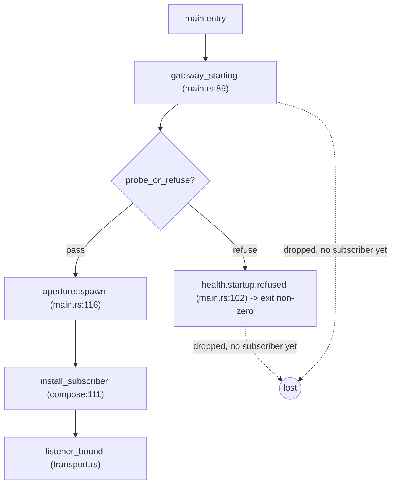
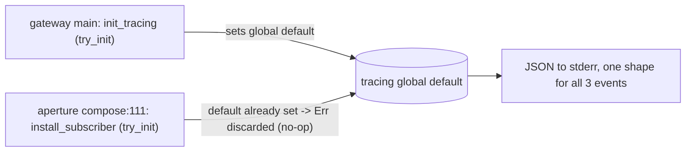

# Application Architecture — gateway-tracing-subscriber-v0

Write-side operability fix for `kaleidoscope-gateway`. The gateway already
runs the aperture OTLP gateway with the Kaleidoscope `StorageSink` injected
through `aperture::spawn`. This feature moves one observability seam earlier
in the composition root so the gateway's own lifecycle renders on stderr.

## The ordering gap

The gateway emits three lifecycle events, but only one renders today. The
JSON-to-stderr tracing subscriber is installed by aperture INSIDE
`aperture::spawn` (`crates/aperture/src/compose.rs:111`, the first statement
of `compose::spawn`). Anything the gateway emits before that call is dropped,
because no subscriber is active to render it.

| Event | Site | Fires relative to install | Renders today |
|---|---|---|---|
| `gateway_starting` | main.rs:89 | BEFORE `aperture::spawn` | NO — dropped |
| `health.startup.refused` | main.rs:102 (probe fail arm) | BEFORE `aperture::spawn` | NO — dropped |
| `listener_bound` | aperture transport.rs:62/127, inside `spawn` | AFTER install | YES |

The refusal event is the sharper half of the gap: the `probe_or_refuse` fail
arm at `main.rs:102` returns `Err(...)` and exits non-zero WITHOUT ever
reaching `aperture::spawn` at `main.rs:116`. An install that lived inside
`spawn` could never render it. The install must precede line 102.



## The fix

Install an idempotent JSON-to-stderr subscriber as the FIRST statement of the
gateway's `main`, before `create_dir_all` (main.rs:65) and well before the
`gateway_starting` emission and the `health.startup.refused` fail arm. The
builder is aperture's posture replicated inline (the read tier did the same
in `query-http-common::init_tracing`), keyed off `RUST_LOG`. No dependency on
`query-http-common`; no change to aperture.

```rust
// First statement of main, before any fallible step.
init_tracing();

// ... unchanged: resolve pillar root, open stores, build sink ...
// gateway_starting (main.rs:89) now renders.
// health.startup.refused (main.rs:102) now renders before the non-zero exit.
// aperture::spawn (main.rs:116) re-runs install_subscriber -> no-op via try_init.

/// Idempotent JSON-to-stderr subscriber install (aperture posture, RUST_LOG
/// filter). OnceLock + try_init so the second install (aperture's, inside
/// spawn) is a silent no-op and never panics.
fn init_tracing() {
    static INSTALLED: OnceLock<()> = OnceLock::new();
    INSTALLED.get_or_init(|| {
        let filter = EnvFilter::try_from_default_env()
            .unwrap_or_else(|_| EnvFilter::new("info"));
        let _ = tracing_subscriber::registry()
            .with(filter)
            .with(
                tracing_subscriber::fmt::layer()
                    .json()
                    .with_writer(std::io::stderr)
                    .flatten_event(true)
                    .with_current_span(false)
                    .with_span_list(false)
                    .with_target(false),
            )
            .try_init();
    });
}
```

Double-install resolution: aperture's `compose:111` install is ALSO
`OnceLock`-guarded and uses `try_init` (`observability.rs:145-163`). Once the
gateway has set the global default, aperture's `try_init` observes a default
already present, returns `Err`, and aperture discards it with `let _ =`. No
panic; the gateway's subscriber is the effective one on the gateway path.
Both subscribers are built with the same layer set, so `listener_bound`
renders with an identical envelope regardless. aperture standalone, which
never runs the gateway code, keeps its own install as the first and only one.



## Events

The verifier (verifier-007) asserts only the rendered shape on stderr. After
this feature all three render as JSON, flattened, `event` field, no
target/span noise — the read-tier and aperture line shape.

| Event | Level | Fields | After this feature |
|---|---|---|---|
| `gateway_starting` | info | `pillar_root` | renders on every clean start |
| `health.startup.refused` | error | `substrate`, `reason` | renders before the non-zero exit on a probe refusal |
| `listener_bound` | info | `transport`, `addr` | unchanged — regression guard that the stream and shape are preserved |

`substrate` values on the refusal: `sink`, `fsync-noop`, `fsync-truncating`,
`fsync-corrupting`, `fsync-io` (from `CompositionError::substrate_descriptor`,
`composition.rs:59`, delegating to pulse's `FsyncProbeError`). `error`-level
events survive any filter floor at `warn` or laxer, so the refusal is never
hidden by a raised `RUST_LOG`.

## Changes Per File

| File | Change | Notes |
|---|---|---|
| `crates/kaleidoscope-gateway/src/main.rs` | Add `init_tracing()` as the first statement of `main`; add the inline `init_tracing` fn (~12 LOC, OnceLock + try_init, RUST_LOG). The pre-subscriber window becomes empty (DD3), so the `create_dir_all`/`open` failures now render as structured lines rather than bare `Err`. | The existing `gateway_starting` and `health.startup.refused` call sites are unchanged; they simply now have a live subscriber. |
| `crates/kaleidoscope-gateway/Cargo.toml` | Add `tracing-subscriber = { version = "0.3", default-features = false, features = ["fmt", "json", "env-filter", "registry"] }`. | Matches aperture's line verbatim. Per-crate dep, no workspace promotion. |
| `crates/kaleidoscope-gateway/src/composition.rs` | NOT touched. | Pure probe seam; lifecycle install belongs in `main`. |
| `crates/aperture/**` | NOT touched. | Double-install is already safe via aperture's existing `try_init`; no coordinated change needed (see wave-decisions.md Upstream Changes). |

## Verification

Black-box subprocess verification, the verifier's method. No new test harness
needed; the gate-5 mutation job `gate-5-mutants-kaleidoscope-gateway`
(`.github/workflows/ci.yml:2318`) already covers the crate.

- **Clean start (US-01):** spawn `kaleidoscope-gateway <writable-pillar>`
  with `KALEIDOSCOPE_DEFAULT_TENANT` set; grep stderr for a JSON line with
  `event=gateway_starting` carrying `pillar_root`, then at least one
  `event=listener_bound` line carrying `transport` and `addr`. Both must be
  present (was: only `listener_bound`).
- **Fail-closed (US-02):** spawn the gateway against a substrate that fails
  the Earned-Trust composition probe (a lying-fsync volume or a read-only
  pillar directory); grep stderr for a JSON `event=health.startup.refused`
  line carrying `substrate` and `reason`, assert it PRECEDES the non-zero
  exit, and assert the exit is non-zero.
- **Filter floor (US-01/US-02):** with `RUST_LOG=warn`, assert the two info
  lines are absent on a clean start AND the error-level
  `health.startup.refused` is still present on the failing run.
- **Idempotence unit (double-install):** a unit test calls `init_tracing()`
  twice and asserts it never panics (mirrors the read tier's
  `test_init_tracing_is_idempotent_and_never_panics`), pinning the `OnceLock`
  guard against mutation.
- **Anti-coupling (US-03):** `cargo tree -p kaleidoscope-gateway | grep
  query-http-common` returns nothing.
- **aperture regression:** none required — aperture source is untouched, so
  its existing slice tests (`slice_01..08`) remain the standalone guard.
  Line-shape parity between the gateway and aperture stderr is asserted by
  the shared JSON envelope (flattened, `event`, no target/span).
