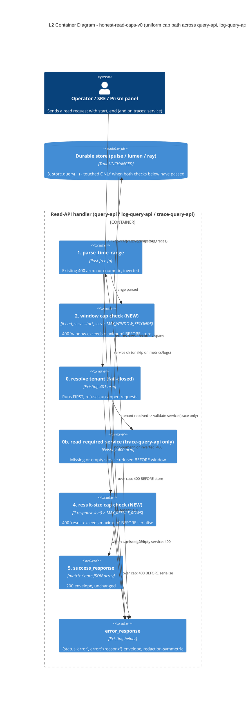

# Application Architecture: honest-read-caps-v0 (DESIGN)

British English. No em dashes. No emoji.

Author: `@nw-solution-architect` (Morgan), DESIGN wave, 2026-05-27.

This document is the per-feature companion to the platform-level
section at `docs/product/architecture/brief.md`
(`## Application Architecture — honest-read-caps-v0`). It carries the
C4 diagram for the cap path and the Changes Per File table the
crafter and the acceptance-designer both need. The four flags resolved
by DESIGN are in `wave-decisions.md` of this same folder; the new
ADR-0050 records the cross-cutting refinement.

## Scope recap

ONE walking-skeleton slice. THREE crates (`query-api`,
`log-query-api`, `trace-query-api`). TWO compile-time caps per crate
(`MAX_WINDOW_SECONDS = 86_400`, `MAX_RESULT_ROWS = 100_000`). The same
uniform refusal envelope (`{status:"error", error:"<reason>"}` at
status 400) on either cap breach. NO new crate, NO new dependency, NO
new CI job, NO new event name.

## C4 — Container View (Level 2): the cap path across the three read APIs

The three crates have the SAME shape; the diagram below shows the
flow ONCE, parameterised over the crate-specific store, and notes the
one structural divergence on `trace-query-api` (the required `service`
parameter validated BEFORE the window).

Notes on the diagram (verbs on every arrow):

- "GET /api/v1/{...}" enters at the top.
- The tenant check (existing) is the FIRST gate.
- The service check (existing, `trace-query-api` only) is the second
  gate on traces; the diagram parameterises it as "skip on metrics /
  logs".
- `parse_time_range` is the third gate (existing 400 arm for
  non-numeric / inverted).
- **The window-cap check is the NEW fourth gate**. It runs BEFORE the
  store. The lying-store acceptance test wires a
  `LyingMetricStore` / `LyingLogStore` / `LyingTraceStore` whose
  `query()` always returns `PersistenceFailed`; if the window-cap
  check were AFTER the store, the response would be the 500 from the
  lying store; the cap-fires-before-store invariant is the carpaccio
  taste-test 1 in the DISCUSS wave-decisions.
- The store is touched ONLY if all prior checks pass. The trait
  signatures are UNCHANGED.
- **The result-cap check is the NEW fifth gate**, AFTER the store
  returns and AFTER any in-handler filtering (matrix translation for
  `query-api`) but BEFORE `success_response`. The JSON encoding cost
  of an over-cap result is not paid.
- Every 4xx arm emits the existing `{status:"error", error:"..."}`
  envelope via the existing `error_response` helper.

The flow is the SAME across all three crates; the divergences are:

1. `query-api` runs `selector::parse` and `matrix::build_filter`
   between window-cap and store (steps 3a, 3b in the handler text),
   producing two additional 400 arms; the result-cap is on the
   post-`matrix::to_matrix` matrix-entry count.
2. `log-query-api` has no in-handler filtering; the result-cap is on
   the raw store-returned `Vec<LogRecord>`.
3. `trace-query-api` runs `read_required_service` BEFORE
   `parse_time_range`; the result-cap is on the raw store-returned
   `Vec`.

L3 is **not produced**. The change per handler is two `if` statements
and two new `pub const` lines; the read-API precedents
(ADR-0042 / 0047 / 0048 / 0049) also produced no L3 for slices of this
scale.

## Changes Per File

Three crates; the same surgical pattern in each. The exact line
numbers are illustrative against the current `main` and may drift by
a handful of lines during DELIVER.

### `crates/query-api`

| File | Change kind | Description |
|---|---|---|
| `crates/query-api/src/lib.rs` | EXTEND | Add `pub const MAX_WINDOW_SECONDS: u64 = 86_400;` and `pub const MAX_RESULT_ROWS: usize = 100_000;` near the top of `lib.rs`, alongside the existing `QUERY_RANGE_ROUTE` / `INDEX_HTML` constants (around line 66-71). |
| `crates/query-api/src/lib.rs` | EXTEND | In `handle_query_range`, after `parse_time_range` returns `Ok(range)` (around line 162) and BEFORE `selector::parse` (around line 166): compute `let window_secs = (range.end_unix_nano - range.start_unix_nano) / 1_000_000_000;` (or equivalent against the parsed seconds, depending on the crafter's choice) and `if window_secs > MAX_WINDOW_SECONDS { return error_response(StatusCode::BAD_REQUEST, "window exceeds maximum"); }`. **The window cap is checked AFTER `parse_time_range` succeeds; the existing 400 arm for non-numeric / inverted still fires first on those classes of input.** |
| `crates/query-api/src/lib.rs` | EXTEND | In `handle_query_range`, AFTER `let result = matrix::to_matrix(rows);` and BEFORE `success_response(result)` (around line 183-184): `if result.len() > MAX_RESULT_ROWS { return error_response(StatusCode::BAD_REQUEST, "result exceeds maximum"); }`. **The cap is on the final matrix-entry count, NOT on the upstream row count; the count is what the user observes.** |
| `crates/query-api/src/lib.rs` | EXTEND (tests) | Add inline unit tests in `#[cfg(test)] mod tests` for the boundary cases: `window_cap_boundary_inclusive_at_max_window_seconds` (kills `<=` -> `<` mutant); `window_cap_boundary_exclusive_at_max_window_seconds_plus_one` (kills the converse). Same for the result cap: `result_cap_boundary_inclusive_at_max_result_rows`; `result_cap_boundary_exclusive_at_max_result_rows_plus_one`. The two new cap-error redaction tests live in the DISTILL acceptance suite at `crates/query-api/tests/slice_05_honest_caps.rs` (DISTILL-wave output, not DESIGN-wave). |

### `crates/log-query-api`

| File | Change kind | Description |
|---|---|---|
| `crates/log-query-api/src/lib.rs` | EXTEND | Add `pub const MAX_WINDOW_SECONDS: u64 = 86_400;` and `pub const MAX_RESULT_ROWS: usize = 100_000;` near the top of `lib.rs`, alongside the existing `LOGS_ROUTE` constant (around line 63). |
| `crates/log-query-api/src/lib.rs` | EXTEND | In `handle_logs`, after `parse_time_range` returns `Ok(range)` (around line 119) and BEFORE `state.store.query(...)` (around line 123): the window-cap check, identical shape to `query-api`. The crafter computes the window in seconds against the parsed value (or against `range.start_unix_nano` / `range.end_unix_nano` divided by 1e9, whichever the crafter judges clearer); the named reason is "window exceeds maximum". |
| `crates/log-query-api/src/lib.rs` | EXTEND | In `handle_logs`, in the `Ok(records)` arm of the `state.store.query(...)` match (around line 124): `if records.len() > MAX_RESULT_ROWS { return error_response(StatusCode::BAD_REQUEST, "result exceeds maximum"); }` BEFORE `success_response(records)`. |
| `crates/log-query-api/src/lib.rs` | EXTEND (tests) | Same boundary tests as `query-api`. The new acceptance suite at `crates/log-query-api/tests/slice_02_honest_caps.rs` is a DISTILL-wave output. |

### `crates/trace-query-api`

| File | Change kind | Description |
|---|---|---|
| `crates/trace-query-api/src/lib.rs` | EXTEND | Add `pub const MAX_WINDOW_SECONDS: u64 = 86_400;` and `pub const MAX_RESULT_ROWS: usize = 100_000;` near the top of `lib.rs`, alongside the existing `TRACES_ROUTE` constant (around line 64). |
| `crates/trace-query-api/src/lib.rs` | EXTEND | In `handle_traces`, after `parse_time_range` returns `Ok(range)` (around line 141) and BEFORE `state.store.query(...)` (around line 145): the window-cap check, identical shape to `query-api`. **The existing `read_required_service` 400 arm at line 133 STILL FIRES FIRST on missing or empty `service`; the handler order is preserved.** The cap-reason redaction inherits the stricter `trace-query-api` posture: the body must NOT contain "SECRET" or "Bearer" anywhere. |
| `crates/trace-query-api/src/lib.rs` | EXTEND | In `handle_traces`, in the `Ok(spans)` arm of the `state.store.query(...)` match (around line 146): `if spans.len() > MAX_RESULT_ROWS { return error_response(StatusCode::BAD_REQUEST, "result exceeds maximum"); }` BEFORE `success_response(spans)`. |
| `crates/trace-query-api/src/lib.rs` | EXTEND (tests) | Same boundary tests as the other two. Plus a `the_missing_service_400_still_fires_before_the_window_cap_400` boundary test that pins handler order (a request with NO `service` and `end - start > MAX_WINDOW_SECONDS` returns the `service is required` 400, NOT the cap 400). The acceptance suite at `crates/trace-query-api/tests/slice_02_honest_caps.rs` is a DISTILL-wave output. |

### Workspace-level

| File | Change kind | Description |
|---|---|---|
| `docs/product/architecture/adr-0050-earned-trust-read-side-caps.md` | CREATE NEW | The cross-cutting refinement ADR; sole new file at the workspace level. Cites ADR-0042 / 0047 / 0048 / 0049 as precedents, NOT modified. |
| `docs/product/architecture/brief.md` | EXTEND | New section `## Application Architecture — honest-read-caps-v0` appended at the bottom, mirroring the `earned-trust-fsync-probe-v0` precedent at line 3166. |
| `docs/feature/honest-read-caps-v0/design/wave-decisions.md` | CREATE NEW | This DESIGN wave's decisions; companion to this document. |
| `docs/feature/honest-read-caps-v0/design/application-architecture.md` | CREATE NEW | This file. |

**Total surface**: six new `pub const` lines (two per crate); six new
`if` arms (two per handler); two new named reason strings shared by
the three crates; the new ADR-0050; the appended brief section.
**Total new source code in `crates/`**: well under the residuality
analysis's "~30 LOC per crate" estimate (closer to 6 LOC per crate
for the cap-checks plus a handful for the inline boundary tests).

## Acceptance-test seam (handoff to DISTILL)

The slice's acceptance tests are DISTILL-wave outputs, but the seams
they exercise are DESIGN-wave inputs. The crafter and the
acceptance-designer both need the seam list:

- **The two new constants are `pub`**. Tests address them by name
  (`query_api::MAX_WINDOW_SECONDS`, `log_query_api::MAX_RESULT_ROWS`,
  etc.) so a future re-tune of the value does not require re-writing
  the boundary tests.
- **The cap-check fires BEFORE the store on the window path**.
  Wire a `LyingMetricStore` / `LyingLogStore` / `LyingTraceStore`
  whose `query()` returns `PersistenceFailed`; an over-window request
  must return the cap 400, NOT the 500.
- **The cap-check fires BEFORE serialisation on the result path**.
  Seed the real `FileBackedMetricStore` / `FileBackedLogStore` /
  `FileBackedTraceStore` with `MAX_RESULT_ROWS + 1` records inside an
  in-cap window; the request must return the cap 400, NOT a truncated
  200, NOT a 200 with `X-Truncated`, NOT a silent 200 `[]`.
- **The boundary is `>`, not `>=`**. A window of exactly
  `MAX_WINDOW_SECONDS` is served; one second wider is refused. A
  result of exactly `MAX_RESULT_ROWS` is served; one row larger is
  refused. The two cap-`>` checks must be `>`, NOT `>=`; the boundary
  tests pin this.
- **The reason redaction**. Each crate's existing redaction posture
  applies to the new cap reasons (D7 in `wave-decisions.md`).
  `trace-query-api` stays stricter.

## What this DESIGN explicitly does NOT do

- Does NOT write Rust source. No code is added to `crates/`. DELIVER
  (the crafter) owns the GREEN / REFACTOR pass.
- Does NOT run `cargo` (no `cargo build`, no `cargo test`, no `cargo
  mutants`). The crafter and CI own those.
- Does NOT add a config struct, an env override, or a runtime-tunable
  cap. Compile-time constants only.
- Does NOT introduce a new trait, a new module, or a new file in
  `src/`. The constants live alongside the existing `LOGS_ROUTE` /
  `TRACES_ROUTE` / `QUERY_RANGE_ROUTE` constants.
- Does NOT push the cap into the store. The store traits and their
  callers are byte-identical to the prior tag.
- Does NOT modify ADR-0042, ADR-0047, ADR-0048, or ADR-0049. All
  four are CITED as precedents.

## Open questions for DISTILL / DELIVER

None at slice 01. The four DISCUSS flags are all resolved. The
remaining decisions (the exact reason wording within the named-class
constraint, the exact line-by-line crafter implementation choices)
belong to DELIVER's GREEN / REFACTOR pass and to DISTILL's translation
of US-01 through US-05's scenarios into `#[test]` functions.
