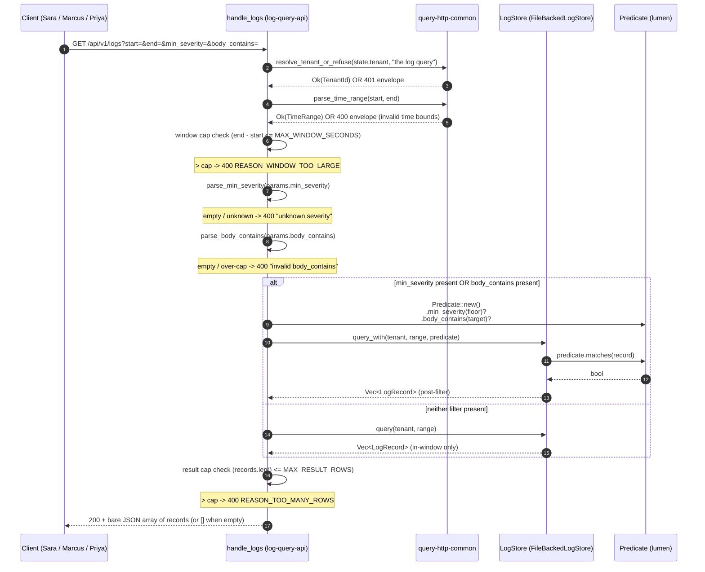
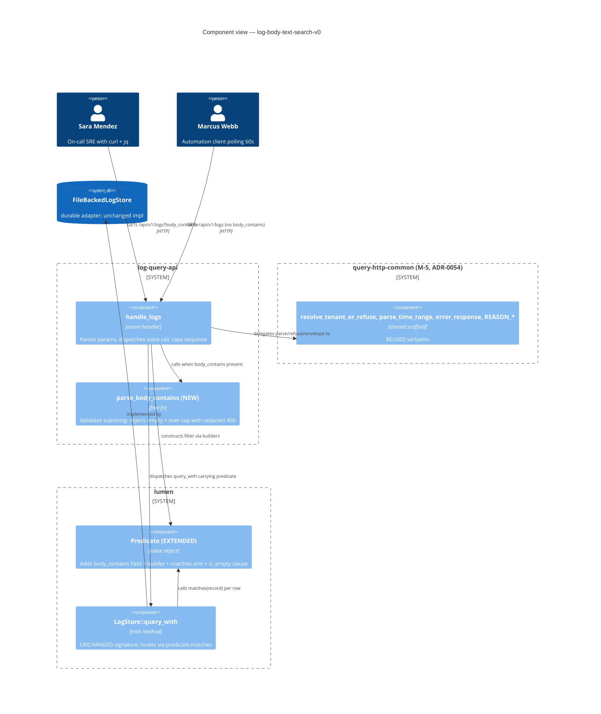

# Application Architecture — log-body-text-search-v0

Author: `nw-solution-architect` (Morgan), DESIGN wave, 2026-05-27.
Mode: propose.

## System Context

Brownfield additive slice on the existing `crates/log-query-api`
HTTP read endpoint (`GET /api/v1/logs`). The boundary, the bare
JSON array success shape, the `{status:"error", error:"<reason>"}`
envelope, the fail-closed tenancy seam, the half-open window, the
window cap, and the result cap are ALL preserved unchanged (ADR-0047,
ADR-0050, ADR-0052, ADR-0054). The slice grows the read contract by
ONE optional query-string parameter `body_contains=<string>` that
narrows the in-window record set to those whose `body` field
contains the supplied substring, byte-wise, case-sensitive. The
filter composes conjunctively with the existing `min_severity`
optional parameter when both are present. The lumen `LogStore`
trait signatures stay byte-identical; the `Predicate` value-object
grows ONE additive field, ONE builder method, ONE `matches` arm,
and ONE `is_empty` clause. No new crate, no new module, no new
external dependency, no new HTTP status code, no new envelope
shape, no new tag.

## Sequence Diagram

The handler order is pinned: tenancy refusal first (fail-closed
before the store), then window parse (refusal before the cap),
then window cap (refusal before the store), then `min_severity`
parse (refusal before the store), then `body_contains` parse
(refusal before the store), then dispatch the store call carrying
both filters in the composed predicate (or `query` when neither
filter is present), then result cap (refusal before serialisation
on the post-filter vector), then `success_response`. The store is
NEVER touched on any 400 path.

## Component Diagram (C4 Level 3)

The slice touches two internal components (`log-query-api` HTTP
boundary and `lumen` predicate). External actors and the durable
store are unchanged.

## Changes Per File

| Path | Kind | Summary | LOC delta |
|---|---|---|---|
| `crates/log-query-api/src/lib.rs` | EXTEND | Add `body_contains: Option<String>` to `LogsParams`; add `fn parse_body_contains(raw: &str) -> Result<String, &'static str>`; add a parse step in `handle_logs` after the `min_severity` parse and before the dispatch; extend the dispatch arm so the predicate carries both `min_severity` and `body_contains` when present; the `None`-arm trigger condition becomes "both filters absent". | < 30 net new lines (KPI-3 budget) |
| `crates/log-query-api/src/lib.rs` (tests `mod`) | EXTEND | Add inline unit tests for `parse_body_contains`: simple match, no match, empty rejection, over-cap rejection, unicode, redaction on the 400 reason text. | ~30 new lines (test-only, not in KPI-3 budget) |
| `crates/lumen/src/predicate.rs` | EXTEND | Add `body_contains: Option<String>` field to `Predicate`; add `pub fn body_contains(mut self, s: impl Into<String>) -> Self`; add one new arm at the top of `matches` (or between the two existing arms — conjunction is commutative): `if let Some(target) = self.body_contains.as_deref() { if !record.body.contains(target) { return false; } }`; extend `is_empty` to AND the new field's `is_none()`. | ~10 new lines |
| `crates/lumen/src/predicate.rs` (tests `mod`, if present) | EXTEND | Add unit coverage for the new arm: matches when body contains substring, rejects when body lacks substring, empty `body_contains` field skipped (composition with `is_empty`), conjunctive composition with `min_severity` and `service`. | ~20 new lines (test-only) |
| `crates/log-query-api/tests/slice_01_body_contains.rs` | NEW | Acceptance suite for the six user stories: happy path, calm empty, default unchanged, empty 400, case-sensitive pin, cross-tenant isolation. | new file, written by DISTILL/DELIVER (not by Morgan) |
| `crates/lumen/src/store.rs` | UNCHANGED | Trait + InMemoryLogStore: `query_with` already routes via `predicate.matches(r)`; the extended predicate's new arm fires automatically. | 0 |
| `crates/lumen/src/file_backed.rs` | UNCHANGED | `FileBackedLogStore::query_with` already routes via `predicate.matches(r)`; same. | 0 |
| `crates/lumen/src/lib.rs` | UNCHANGED | `Predicate` re-export is unchanged; the new builder is reachable via the existing `pub use predicate::Predicate;`. | 0 |
| `crates/lumen/src/record.rs` | UNCHANGED | `LogRecord.body: String` exists today; no shape change. | 0 |
| `crates/query-http-common/src/lib.rs` | UNCHANGED | The shared scaffold is byte-identical; the slice is its first post-extraction real-world consumer. | 0 |
| `docs/product/architecture/adr-0055-log-body-text-search.md` | NEW | The ADR pinning the contract growth (one optional parameter, the lumen predicate extension, the case-sensitive byte-wise match, the empty-and-over-cap 400, the length cap value, the filter-BEFORE-cap interaction). | ~110 lines |
| `docs/product/architecture/brief.md` | EXTEND | Append `## Application Architecture — log-body-text-search-v0` section with links to the four design artefacts. | ~25-40 lines |
| `docs/feature/log-body-text-search-v0/design/wave-decisions.md` | NEW | This DESIGN wave's decisions summary (the seven DD pins, the reuse table, the handoff). | ~250 lines |
| `docs/feature/log-body-text-search-v0/design/application-architecture.md` | NEW | This file. | ~150 lines |
| `docs/feature/log-body-text-search-v0/design/parse-helper-spec.md` | NEW | The `parse_body_contains` signature, the error cases, the named acceptance test set. | ~50 lines |

Net production code lines added: < 30 in `log-query-api`
(KPI-3 CI-enforced budget); ~10 in `lumen`. Net acceptance code
added: one new file `tests/slice_01_body_contains.rs` in
`log-query-api`. No production code line removed.

## Error Contract

| Arm | HTTP status | Body | Trigger | Source |
|---|---|---|---|---|
| Missing tenant | 401 | `{"status":"error","error":"no tenant resolvable: the log query service refuses unscoped requests"}` | `state.tenant` is `None` | UNCHANGED, ADR-0047 Decision 1 via `query_http_common::resolve_tenant_or_refuse` |
| Invalid time bounds | 400 | `{"status":"error","error":"invalid time bounds: end is earlier than start"}` (or per the bounds parser) | `parse_time_range(start, end)` returns `Err` | UNCHANGED, ADR-0050 / ADR-0054, `REASON_INVALID_TIME_RANGE` |
| Window too large | 400 | `{"status":"error","error":"window exceeds 86400 seconds"}` | `end_secs - start_secs > MAX_WINDOW_SECONDS` | UNCHANGED, ADR-0050 Decision 1, `REASON_WINDOW_TOO_LARGE` |
| Unknown severity | 400 | `{"status":"error","error":"unknown severity"}` | `params.min_severity` present and `parse_min_severity` returns `Err` | UNCHANGED, ADR-0052 Decision 5 |
| **Empty `body_contains`** | **400** | **`{"status":"error","error":"invalid body_contains"}`** | **`params.body_contains == Some("")`** | **NEW, DD4 / DD5 — literal envelope; raw value NEVER interpolated** |
| **Oversize `body_contains`** | **400** | **`{"status":"error","error":"invalid body_contains"}`** | **`params.body_contains.as_ref().map(\|s\| s.len()).unwrap_or(0) > 1024`** | **NEW, DD6 — same literal envelope as the empty arm; raw value NEVER interpolated** |
| Too many rows | 400 | `{"status":"error","error":"result exceeds 100000 rows"}` | `records.len() > MAX_RESULT_ROWS` AFTER the predicate is applied | UNCHANGED, ADR-0050 Decision 2, `REASON_TOO_MANY_ROWS`; the cap measures the post-filter vector |
| Store failure | 500 | `{"status":"error","error":"the backing log store could not be read"}` | `LogStore::query` or `LogStore::query_with` returns `Err(LogStoreError::PersistenceFailed)` | UNCHANGED, ADR-0047 |
| Success | 200 | bare JSON array of `LogRecord`s in ascending `observed_time_unix_nano` order; `[]` when empty | predicate matched zero or more records | UNCHANGED, ADR-0047 Decision 1 |

## Pin enforcement

The following pins MUST be honoured by the DISTILL acceptance
suite and the DELIVER implementation; any deviation invalidates
the design:

1. **Handler order (PIN)**: `parse_time_range` -> window cap ->
   `resolve_tenant_or_refuse` -> presence check on
   `params.body_contains` -> `parse_body_contains` ->
   compose-predicate-and-dispatch -> result cap on the post-filter
   vector -> JSON success. The tenant refusal arm runs BEFORE the
   bounds parser per the existing post-M-5 shape at
   `crates/log-query-api/src/lib.rs:120` (UNCHANGED). The new
   parse step is its own gate; it is NOT folded into
   `parse_min_severity` or `parse_time_range`.
2. **Predicate seam (PIN)**: `lumen::Predicate` grows ONE field
   (`body_contains: Option<String>`), ONE builder
   (`pub fn body_contains(mut self, s: impl Into<String>) -> Self`),
   ONE arm in `matches`
   (`if let Some(target) = self.body_contains.as_deref() { if !record.body.contains(target) { return false; } }`),
   and ONE clause in `is_empty` (joined via AND). The `LogStore`
   trait signatures stay byte-identical. Both adapters
   (`InMemoryLogStore`, `FileBackedLogStore`) are unchanged at
   the impl level.
3. **Cap interaction (PIN)**: `MAX_RESULT_ROWS` applies AFTER the
   filter. The store's `query_with` returns the post-filter
   `Vec<LogRecord>`; the handler caps that vector. An operator
   running `body_contains=kafka` against a tenant with 200_000
   non-matching records and 50 matching records receives the 50
   matches, NOT a cap-400. Symmetric with ADR-0052 Decision 4 /
   ADR-0050 Decision 4.
4. **Anti-echo (PIN)**: the 400 body on the empty arm AND on the
   oversize arm is the LITERAL envelope
   `{"status":"error","error":"invalid body_contains"}`. The raw
   `body_contains` value is NEVER interpolated. An acceptance
   scenario asserts byte-equality against the literal envelope on
   both arms (the over-cap arm uses a 2048-byte value and asserts
   the response body does NOT contain any byte of the value).

## Quality attribute scenarios

- **Maintainability**: the slice grows production code by <30
  lines in `log-query-api` and ~10 lines in `lumen`; the diff is
  reviewable in one sitting. The predicate-extension pattern
  follows the existing `service` and `min_severity` builders
  byte-for-byte in shape (one field, one builder, one `matches`
  arm); a future filter (e.g. `body_starts_with`, `service_regex`)
  follows the same shape.
- **Testability**: the parser is a pure free function returning
  `Result<String, &'static str>`; mutation-test surface is small
  and concentrated. The predicate's new `matches` arm is a pure
  fn on owned data; mutation-test surface fits the existing
  `gate-5-mutants-lumen` workflow shape via `--in-diff`.
- **Backward compatibility (KPI-2)**: a parameter-less request
  is byte-equal to the slice-prior response; the existing
  acceptance suites in `tests/slice_01_logs_read.rs`,
  `tests/slice_02_caps.rs`, and `tests/slice_01_severity_filter.rs`
  stay green unchanged.
- **Reliability**: the store is NEVER touched on any 400 path
  (tenancy 401, time-bounds 400, window-cap 400, severity 400,
  body-contains-empty 400, body-contains-oversize 400); the cap
  measures post-filter records; the cross-tenant isolation
  invariant from ADR-0047 holds (the tenant-bucket lookup at
  `crates/lumen/src/store.rs:166-172` and
  `crates/lumen/src/file_backed.rs:236-242` precedes any
  predicate evaluation, so the new filter cannot widen the tenant
  scope).
- **Security**: the redaction posture is preserved (no raw
  parameter value echoed; the literal envelope on both 400 arms
  is byte-equal to the constant); the length cap of 1024 bytes
  refuses oversize abuse before the store is touched.
- **Performance**: substring matching on a `String` body is
  `O(len(body) * len(target))` worst case (Rust std uses
  Two-Way for non-tiny needles); on the InMemoryLogStore the
  filter is applied per record during the existing linear scan,
  adding constant work per record; on the FileBackedLogStore the
  recovery-time sort is unchanged and the query-time scan is the
  same linear shape. No new index, no new background work, no
  new heap allocation beyond the predicate's owned `String`.

## External-integration handoff

**None.** The parse helper is in-process string matching; the
store call uses an in-process trait method against a first-party
library. No third-party API consumed; no consumer-driven contract
test recommendation. The slice does not change the existing
ADR-0047 Earned-Trust startup probe.
