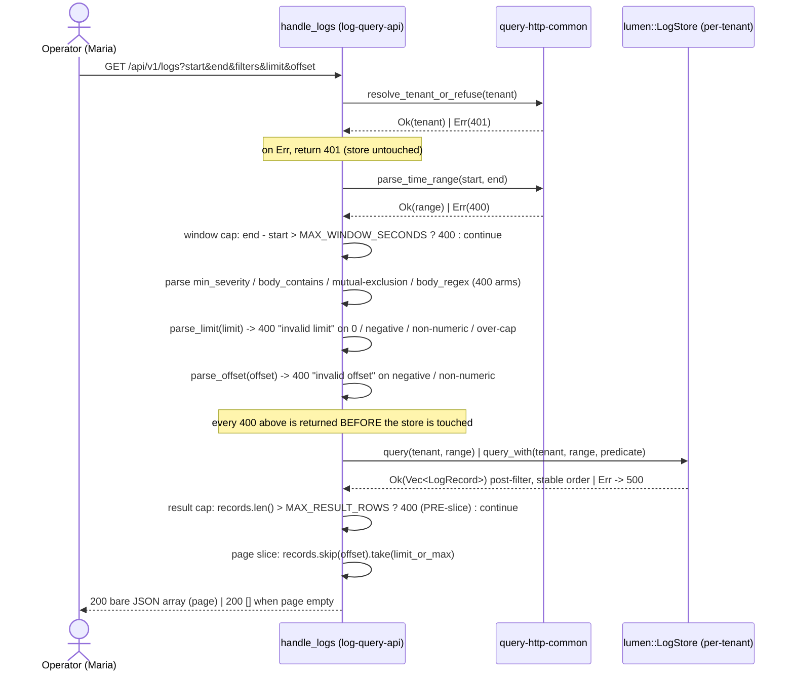

# Application Architecture - log-query-pagination-v0

Morgan (nw-solution-architect), application scope. This document pins the
handler-internal pipeline for the two new optional parameters `limit` and
`offset` on `GET /api/v1/logs`, the error contract, and the pagination
honesty argument. It accompanies the slice's wave-decisions and ADR-0057.

## System Context

The system context is UNCHANGED. `log-query-api` remains the read-side
driving adapter that serves `GET /api/v1/logs?start=&end=` out of the
durable Lumen store, read-only, for the resolved tenant, returning a
bare JSON array of `LogRecord`s in ascending `observed_time_unix_nano`
order (ADR-0047). The single driving port is `router`; the single driven
port is `lumen::LogStore`. This slice adds no new actor, no new
collaborator, no new boundary: `limit` and `offset` are two further
optional query-string parameters parsed in the same handler that already
parses `start`, `end`, `min_severity`, `body_contains`, and `body_regex`.
The page slice is applied handler-side over the `Vec<LogRecord>` the
store already returns; the `lumen::LogStore` trait, the
`lumen::Predicate`, the error envelope, the tenancy seam, and both caps
are all reused unchanged.

## Sequence Diagram

The cap-then-slice order is explicit: the result cap (`records.len() >
MAX_RESULT_ROWS`) is measured on the post-filter vector BEFORE the page
slice, so a window whose matched set exceeds the cap is refused exactly
as today, and the page slice runs only on a vector that has already
passed the cap.

## Changes Per File

| File | Change | Public surface |
|------|--------|----------------|
| `crates/log-query-api/src/lib.rs` | EXTEND `LogsParams` with `limit: Option<String>` and `offset: Option<String>`. ADD `fn parse_limit(raw: &str) -> Result<usize, &'static str>` and `fn parse_offset(raw: &str) -> Result<usize, &'static str>`. ADD two parse arms in `handle_logs` after the `body_regex` parse and before the store dispatch. ADD the `skip(offset).take(limit)` slice after the result-cap check and before `success_response`. | None. `LogsParams` is private; both new fields are private; both helpers are private. Gate 2 `cargo public-api` shows zero drift on `log-query-api`. |
| `crates/lumen/src/store.rs` | NONE. | Byte-identical to the prior tag. |
| `crates/lumen/src/predicate.rs` | NONE. | Byte-identical to the prior tag. |
| `crates/query-http-common/src/lib.rs` | NONE (consumed only). | Byte-identical. |
| `Cargo.toml` (any crate) | NONE. | No dependency change; no `Cargo.lock` diff. |

## Error Contract

| Input | Outcome | Reason literal |
|-------|---------|----------------|
| `limit=0` | HTTP 400 | `invalid limit` |
| `limit=-5` (negative) | HTTP 400 | `invalid limit` |
| `limit=abc` (non-numeric) | HTTP 400 | `invalid limit` |
| `limit=100001` (strictly over `MAX_RESULT_ROWS`) | HTTP 400 | `invalid limit` |
| `limit=100000` (at the cap, inclusive) | HTTP 200, page served | n/a |
| `offset=-1` (negative) | HTTP 400 | `invalid offset` |
| `offset=abc` (non-numeric) | HTTP 400 | `invalid offset` |
| `offset=0` (first page) | HTTP 200, no records skipped | n/a |
| `offset` >= matched count (past end) | HTTP 200, calm empty bare array `[]` | n/a |
| post-filter matched set > `MAX_RESULT_ROWS` | HTTP 400 (existing cap, PRE-slice) | `result exceeds 100000 rows` |
| neither `limit` nor `offset` present | HTTP 200, unchanged (every matched record up to the cap) | n/a |

Every 400 arm in this table is emitted via
`query_http_common::error_response` with the existing envelope
`{"status":"error","error":"<reason>"}`. The raw `limit` / `offset`
value is NEVER echoed in the body (redaction, symmetric with ADR-0052 /
ADR-0055 / ADR-0056). The store is NEVER touched on any of the
parse-time 400 arms. The `offset`-past-end case is NOT an error: it is a
well-formed request for a page that legitimately has no rows, served as
the same calm empty `[]` the contract uses for a filter that matches
nothing.

## Pagination honesty note

Skip/offset pagination is honest only if the page boundaries align
exactly: page `k` ends where page `k+1` begins, with no overlap and no
omission. Two facts of the existing system make this guaranteed for a
fixed result set.

1. **Stable order.** `InMemoryLogStore::ingest` sorts each tenant bucket
   by `observed_time_unix_nano` on every ingest (`store.rs:136`,
   `sort_by_key`, a STABLE sort), and `query` / `query_with` iterate that
   bucket in order and collect (`store.rs:150-156`, `store.rs:173-179`).
   The returned `Vec<LogRecord>` is therefore deterministically ordered
   for a fixed tenant, window, and filter set. Two records sharing an
   identical `observed_time_unix_nano` keep their relative ingest order
   (stable sort), so the order is total and reproducible. The slice
   introduces no new sort and no tie-breaker.

2. **Offset counts records consumed.** `offset` is the number of records
   to drop from the front of the ordered vector
   (`skip(offset)`), NOT a 1-based index. Page `k` of size `N` is
   therefore `offset=k*N`, and `take(N)` returns exactly the next `N`
   (or fewer at the tail). The boundary at an exact multiple is clean:
   record at position `N` (0-indexed `N-1`) appears only in page 0;
   record at position `N+1` (0-indexed `N`) appears only in page 1.

Together these give the partition guarantee: for a fixed result set, the
ordered concatenation of `(offset=0, limit=N)`, `(offset=N, limit=N)`,
`(offset=2N, limit=N)`, ... equals the full result set in order, with NO
duplicate and NO gap. Because the page slice runs handler-side AFTER the
store applied the predicate, the vector sliced is ALREADY the
post-filter, post-order, per-tenant set; filter-before-page and
tenant-scope-before-page are automatic (US-06, US-07) and need no extra
wiring. The honesty guarantee is scoped to a FIXED result set: the slice
does NOT promise snapshot isolation across requests (a record ingested
between page fetches may shift subsequent pages). Immunity to
concurrent-ingest drift is the deferred cursor-pagination concern.
