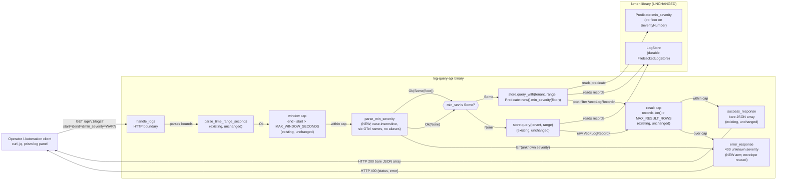

# Application Architecture: log-query-severity-filter-v0

Author: `@nw-solution-architect` (Morgan), DESIGN wave, 2026-05-27.
Mode: propose.

A thin parse + wire growth on `crates/log-query-api`. ONE optional
query-string parameter `min_severity` on `GET /api/v1/logs` that
filters returned `LogRecord`s by minimum OTel severity, using the
existing `lumen::LogStore::query_with` seam and the existing
`lumen::Predicate::min_severity` builder. No lumen change. No new
module. No new envelope. Full design rationale in
`wave-decisions.md` and ADR-0052.

## C4 — Level 2 — request flow

The flow encodes the four pinned decisions:

- **FLAG 1 / Decision 1 (`min_severity`)**: the wire parameter
  spelling matches the lumen builder name.
- **FLAG 2 / Decision 2 (case-insensitive, no aliases)**:
  `parse_min_severity` matches the six OTel names with
  `eq_ignore_ascii_case`; any other value returns `Err("unknown
  severity")`.
- **FLAG 3 / Decision 4 (filter BEFORE cap)**: the filter rides
  inside the store via `query_with`; the cap measures the
  post-filter `Vec::len()`.
- **FLAG 4 / Decision 4 (ADR-0052)**: the growth lands in a new
  ADR with cross-references to ADR-0047 (the read-side contract
  the parameter grows) and ADR-0050 (the cap interaction the
  parameter inherits).

L1 is **not produced**: the system context for the logs pillar is
inherited from the platform-level container view in
`docs/architecture/kaleidoscope-architecture.md` and from
ADR-0047's container diagram for `log-query-api`. The slice does
not introduce a new actor, a new external system, or a new
deployable unit.

L3 is **not produced**: the slice is one new free function
(`parse_min_severity`) and one branched dispatch inside an
existing handler. The L2 above carries the necessary detail; a
component-level decomposition would add no information beyond
the handler's existing internal shape.

## Changes Per File

The table below lists every file the slice touches, classified
by verb (REUSE / EXTEND / CREATE). Files NOT in the table are
NOT touched by this slice.

| File | Verb | Change |
|---|---|---|
| `crates/log-query-api/src/lib.rs` | EXTEND | Add `min_severity: Option<String>` to `LogsParams` (line 107 today). Add free function `fn parse_min_severity(raw: &str) -> Result<SeverityNumber, String>` next to `parse_time_range_seconds` (after line 197 today). Add new parse step in `handle_logs` after the window-cap check (line 143 today) and before the existing store call (line 147 today). Branch the store call on the resolved `Option<SeverityNumber>`: `Some(floor)` -> `state.store.query_with(&tenant, range, &Predicate::new().min_severity(floor))`; `None` -> existing `state.store.query(&tenant, range)`. Add inline unit tests next to the existing parse tests (after line 305 today) covering the six accepted names, case-insensitivity, the unknown-name rejection, the empty-string rejection, and the redaction substring. NO change to `MAX_WINDOW_SECONDS`, `MAX_RESULT_ROWS`, the result-cap check at line 153, `error_response`, `success_response`, `seconds_to_nanos`, `parse_epoch_seconds`, `parse_time_range_seconds`, `LOGS_ROUTE`, `ApiState`, or `router`. |
| `crates/lumen/src/store.rs` | UNCHANGED (REUSE `LogStore::query_with`) | The predicate-carrying seam at line 89 is used for the first time on the HTTP boundary; ADR-0047 Decision 5 stated `query_with(predicate)` exists but is NOT used in slice 01 of `lumen-query-api-v0`; ADR-0052 records the first HTTP-boundary use. No method added, removed, or re-signed. Gate 2 `cargo public-api` confirms byte identity. |
| `crates/lumen/src/predicate.rs` | UNCHANGED (REUSE `Predicate::new` + `Predicate::min_severity`) | The builder pattern and the `>=` semantics at lines 33, 46, 60-63 are reused as designed. No new builder method, no new field, no semantic change. |
| `crates/lumen/src/record.rs` | UNCHANGED (REUSE `SeverityNumber` constants) | The six OTel constants at lines 32-39 are the mapping target for `parse_min_severity`. No constant added, no value changed. |
| `crates/lumen/src/file_backed.rs` | UNCHANGED (REUSE `FileBackedLogStore::query_with`) | The durable adapter's existing `query_with` implementation is reused. No change. |
| `crates/log-query-api/src/composition.rs` | UNCHANGED | Composition root, Earned-Trust startup probe, tenant resolution: all unchanged. |
| `crates/log-query-api/src/main.rs` | UNCHANGED | Thin binary: unchanged. |
| `crates/log-query-api/tests/slice_01_logs_read.rs` | UNCHANGED (NOT EDITED) | DISCUSS Decision 8 pin: the existing acceptance suite stays green unchanged; no addition, no deletion. |
| `crates/log-query-api/tests/slice_02_caps.rs` | UNCHANGED (NOT EDITED) | DISCUSS Decision 8 pin: the existing cap acceptance suite stays green unchanged; the `BulkLogStore` pattern at line 86 is referenced (NOT edited) by the new slice's filter-BEFORE-cap scenario via the new test file. |
| `crates/log-query-api/tests/slice_01_severity_filter.rs` | CREATE (DISTILL output, NOT DESIGN output) | The new acceptance suite is authored by `@nw-acceptance-designer` during DISTILL using the existing `mod common` helpers (`open_durable_store`, `tenant`, `seed`, `record`, `record_at_nanos`, `rich_record`, `logs_request`, `records_array`, `record_bodies`, `is_error_envelope`) and the established one-at-a-time outer-loop convention. The DESIGN wave records the scenarios it must encode; it does NOT create the file. |
| `docs/feature/log-query-severity-filter-v0/design/wave-decisions.md` | CREATE | DESIGN-wave output; this file's sibling. |
| `docs/feature/log-query-severity-filter-v0/design/application-architecture.md` | CREATE | DESIGN-wave output; this file. |
| `docs/product/architecture/adr-0052-log-query-severity-filter.md` | CREATE | New ADR-0052; cites ADR-0047 and ADR-0050 as precedents, neither modified. |
| `docs/product/architecture/brief.md` | EXTEND | Append `## Application Architecture — log-query-severity-filter-v0` section under existing precedent sections; matches the section style of the immediately preceding feature sections (e.g. `pulse-cardinality-watermark-v0`). |

The slice's blast radius is ONE source file
(`crates/log-query-api/src/lib.rs`), ONE new acceptance test
file (DISTILL output), THREE new docs files (this DESIGN wave),
and ONE appended docs section (this DESIGN wave). The lumen
crate is consumed at the call-site level only; no lumen source
file is edited.

## Quality attribute coverage (ISO 25010)

| Attribute | How addressed |
|---|---|
| Functional Suitability | The filter semantics (`>=` on `SeverityNumber`) are the substrate's existing semantics, preserved verbatim at the HTTP boundary; the parser accepts the six OTel names case-insensitively, rejects every other value; the default (parameter absent) is the existing behaviour, byte-equal for the same inputs; the unknown-severity 400 is the existing envelope with a new reason class. |
| Performance Efficiency | The filter runs inside the store via `query_with`, so below-floor records never enter the returned vector and never pay JSON serialisation cost; the result cap measures the post-filter vector, so an operator's narrowed read receives the matching records up to the cap, not a cap-400 caused by upstream noise; the parse helper is one trim + six case-insensitive comparisons (bounded constant cost); KPI-1 targets a 5x payload reduction on a representative INFO-heavy fixture. |
| Maintainability | One free function added; one struct field added; one branched dispatch added; no new module, no new crate, no new file under `crates/log-query-api/src/` or `crates/lumen/src/`; the parse helper sits next to the existing parse helpers with the same shape; per-feature mutation testing at 100% kill rate (ADR-0005 Gate 5; CLAUDE.md) covers the changed file via the existing `gate-5-mutants-log-query-api` workflow with `--in-diff`. |
| Reliability | The unknown-severity 400 path NEVER touches the store (acceptance scenario US-05 with no-store-call assertion); the filter-BEFORE-cap interaction preserves the result-cap's "measures what the user observes" invariant (ADR-0050 Decision 4); the existing Earned-Trust startup probe continues to run unchanged; the existing `LogStore::query` call on the no-parameter path is unchanged, so the default-unchanged backward-compat guarantee (KPI-2) is preserved by construction. |
| Security | The unknown-severity 400 reason text NEVER echoes the raw parameter value (ADR-0047 Decision 1 redaction posture preserved; symmetric with ADR-0050 Decision 7); the parse helper trims input but does not log or surface the raw value anywhere; the case-insensitive matcher uses `eq_ignore_ascii_case` (ASCII-range only, no Unicode-fold side effect); A-U3 (header echo in error bodies) stays blocked at the new 400 arm. |
| Portability | No platform-specific syscalls; pure string matching on the six OTel names and pure arithmetic on the existing `u64` window and `usize` result count; portable across Linux, macOS, and Windows. |
| Compatibility | No change to the route (`/api/v1/logs`); no change to the response envelope (bare JSON array on 200; existing `{status, error}` on 400); no change to the `lumen::LogStore` trait signatures (Gate 2 `cargo public-api` confirms byte identity); no change to the existing parameter set (`start`, `end`); the new parameter is OPTIONAL and DEFAULTS to no-filter, so every existing client receives byte-equal responses for the same inputs (KPI-2). |

## Relationship to ADR-0047 and ADR-0050

ADR-0047 is the originating read-side contract for logs: the
bare JSON array success shape (Decision 1), the
`{status:"error", error}` envelope (Decision 1), the redaction
posture (Decision 1), the route `/api/v1/logs` (Decision 3), and
the existence-but-non-use of `query_with(predicate)` (Decision
5). ADR-0052 GROWS this contract by one optional parameter
(`min_severity`) and FIRST-USES `query_with` on the HTTP
boundary; the envelope, the redaction, the route, and the
success shape are PRESERVED verbatim. ADR-0047 is CITED, NOT
modified.

ADR-0050 is the read-side Earned-Trust caps: the window cap
(Decision 1), the result cap (Decision 2), the REFUSE-not-
TRUNCATE discipline (Decision 3), the result-cap location
("measures what the user observes ... not the upstream raw row
count", Decision 4). ADR-0052 honours all four: the window cap
fires unchanged BEFORE the new severity parse; the result cap
fires unchanged AFTER the store returns and BEFORE
serialisation; the cap measures the post-filter `Vec::len()`
when the parameter is present, which is exactly what Decision 4
specifies. ADR-0050 is CITED, NOT modified.

The slice does NOT extract `query-http-common` (ADR-0048
Decision 5, M-5 deferral HONOURED). The new
`parse_min_severity` helper is `log-query-api`-local and a
natural future inhabitant of the deferred shared crate.

## Handoffs

DISTILL (`@nw-acceptance-designer`): translate the six Gherkin
scenarios in `discuss/user-stories.md` into `#[test]` functions
in the NEW file `crates/log-query-api/tests/slice_01_severity_filter.rs`.
Reuse the `mod common` helpers from
`tests/slice_01_logs_read.rs` and the `BulkLogStore` pattern
from `tests/slice_02_caps.rs:86`. Encode the no-store-call
assertion on the unknown-severity 400 path using a test double
that counts calls to `query` and `query_with`. Encode the
per-name acceptance assertions (the six OTel names, each in at
least one canonical case; at least two case forms for
`WARN`/`warn` to kill the case-insensitivity mutant). Pin the
walking-skeleton scenario first; the remaining four follow the
existing one-at-a-time outer-loop convention. Required reading:
ADR-0052, this file, `wave-decisions.md`,
`discuss/user-stories.md`, `discuss/wave-decisions.md`.

DEVOPS (`@nw-platform-architect`, Apex): **NO new crate, NO new
external dependency, NO new CI workflow, NO new graduation
tag.** The existing `gate-5-mutants-log-query-api` covers the
modified file `crates/log-query-api/src/lib.rs` via `--in-diff`
at the 100% kill-rate gate (ADR-0005 Gate 5; CLAUDE.md). The
existing `gate-2-public-api` confirms the `lumen::LogStore`
trait signatures are byte-identical and the `log-query-api`
`pub` surface is byte-identical (the `LogsParams` field
addition is private). No external integration, no
consumer-driven contract test recommendation. The slice ships
on a normal feature commit on `main` per the trunk-based
posture.

DELIVER (`@nw-software-crafter`): the GREEN / REFACTOR
internals belong to the crafter. This design pins ONLY: the
wire parameter name (`min_severity`); the case-insensitive
match against the six OTel names with NO aliases; the parse
helper name and signature
(`fn parse_min_severity(&str) -> Result<SeverityNumber, String>`);
the `Err` reason text (`"unknown severity"`); the dispatch
shape (branched on `Option<SeverityNumber>`: `Some` ->
`query_with`, `None` -> `query`); the order of checks (tenancy
-> window parse -> window cap -> severity parse -> store call
-> result cap -> serialise); the cap location (unchanged); the
LogsParams field name and type (`min_severity: Option<String>`).
Everything else (the GREEN code shape, the REFACTOR target,
the inline test composition, the match macro vs the
hand-rolled `if`-chain) is the crafter's call. Rust idiomatic
per CLAUDE.md (data + free functions; no trait introduced;
composition over inheritance).
