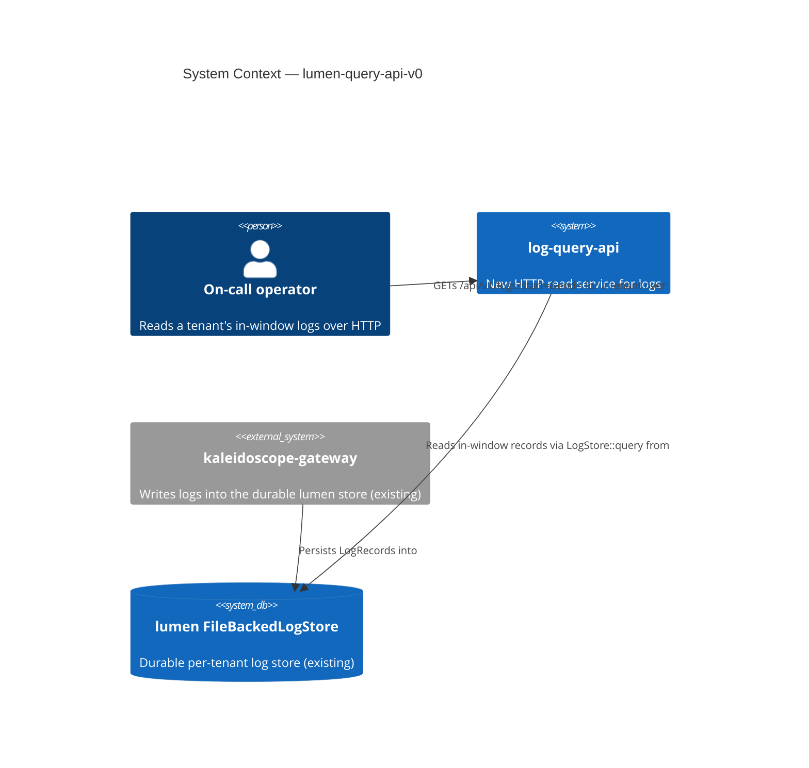
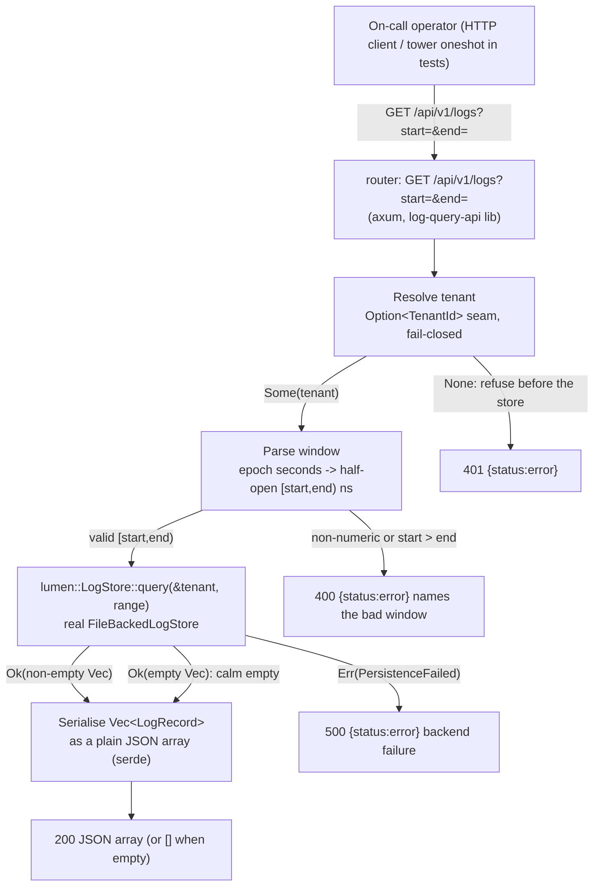

# Application Architecture: lumen-query-api-v0

Author: `@nw-solution-architect` (Morgan), DESIGN wave, 2026-05-22.
Interaction mode: propose. British English. No em dashes.

This is the read half of the logs pillar: an HTTP endpoint that, given a
resolved tenant and a half-open window `[start, end)`, returns the in-window
`LogRecord`s as a plain JSON array, read from the real durable lumen
`FileBackedLogStore` through the existing `LogStore::query`. Decisions are
recorded in `docs/product/architecture/adr-0047-lumen-log-query-api-contract-and-crate-layout.md`
and `wave-decisions.md` in this directory.

## C4 Level 1 — System Context



## C4 Level 2 — Container / handler flow

The whole change lives inside the new `log-query-api` container, reading the
existing `lumen` store. The flow is the pinned orchestration: resolve tenant
(fail-closed) -> parse window -> query -> serialise.



L3 (component) is NOT produced: the crate is a thin lib + binary with one
handler, one fail-closed seam, one bounds parser, and one serialise step over
the existing store trait, not a multi-component subsystem. ADR-0042's metrics
endpoint, the directly analogous precedent, also did not need an L3 for the same
shape.

## Crate layout (recommended)

```
crates/
└── log-query-api/                 # NEW thin crate, lib + binary
    ├── Cargo.toml
    ├── src/
    │   ├── lib.rs                  # pub fn router(store, tenant) -> Router;
    │   │                           #   handle_logs handler; parse_time_range;
    │   │                           #   success (plain array) + error_response
    │   ├── composition.rs          # resolve_tenant / resolve_pillar_root /
    │   │                           #   resolve_addr / probe (testable seam)
    │   └── main.rs                 # thin composition root: open
    │                               #   FileBackedLogStore, resolve tenant,
    │                               #   probe, bind axum listener
    └── tests/
        └── slice_01_logs_walking_read.rs   # tower oneshot acceptance suite
```

## Changes Per File / New Files

| File | New / Changed | What |
|---|---|---|
| `crates/log-query-api/Cargo.toml` | NEW | New workspace crate; deps axum 0.7 + hyper + tokio + serde + serde_json + tracing + mutants (all already in the workspace lock), `lumen` and `aegis` by path; dev-dep tower (oneshot). No `regex`, no `pulse`. |
| `crates/log-query-api/src/lib.rs` | NEW | `pub fn router(store: Arc<dyn LogStore + Send + Sync>, tenant: Option<TenantId>) -> Router` over route `GET /api/v1/logs`; `handle_logs` handler (resolve tenant -> parse bounds -> query -> serialise); `parse_time_range` (epoch seconds, float-tolerant, inversion check, produces `lumen::TimeRange`); `success` (plain JSON array); `error_response` (`{status,error}`). |
| `crates/log-query-api/src/composition.rs` | NEW | Testable composition seam: `resolve_tenant` (`KALEIDOSCOPE_LOG_QUERY_TENANT`, fail-closed), `resolve_pillar_root`, `resolve_addr`, `probe` (trivial empty-range query against the resolved tenant before binding). |
| `crates/log-query-api/src/main.rs` | NEW | Thin composition root: open durable `FileBackedLogStore` at `pillar_root/lumen`, resolve tenant, run `probe` (wire -> probe -> use, `health.startup.refused` on failure), bind axum listener. `#[mutants::skip]` on `main` (unkillable wiring mutant). |
| `crates/log-query-api/tests/slice_01_logs_walking_read.rs` | NEW | tower `oneshot` acceptance suite: ingest in/out-of-window records into a real `FileBackedLogStore`, query, assert in-window only / ascending order / field fidelity (US-01); calm empty `[]` for empty window and unknown tenant (US-02); two-tenant isolation + no-tenant 401 (US-03); bad-window 400, `PersistenceFailed` 500, header-redaction (US-04). |
| Workspace `Cargo.toml` (members) | CHANGED | Add `crates/log-query-api` to the workspace members list. |
| `crates/lumen/src/store.rs` | UNCHANGED | `LogStore::query` is reused as-is; NO trait change. |
| `crates/query-api/**` | UNCHANGED | The metrics crate is not touched; logs are a separate domain in a separate crate. |

## Reuse note (pattern, not types)

The lib+binary split, the fail-closed `Option<TenantId>` router seam, the
`error_response` shape, the epoch-seconds bounds parser, the tower `oneshot`
test posture, and the wire-then-probe-then-use composition root are all
REPRODUCED from the proven `query-api` precedent (ADR-0042), not imported: the
metrics types (`MetricStore`, the PromQL `selector`, the `matrix` translator,
the Prometheus envelope) are NOT reused. The ~30 genuinely shared lines are
duplicated, not extracted, because the surface is tiny and the two `TimeRange`
types differ; a shared crate is a clean later refactor once a third HTTP read
pillar appears. See the Reuse Analysis table in `wave-decisions.md`.

## Quality attribute coverage (ISO 25010)

| Attribute | How addressed |
|---|---|
| Functional Suitability | In-window records returned in ascending `observed_time` order via `LogStore::query`; half-open `[start,end)` boundary (start included, end excluded); every `LogRecord` field round-trips via the existing `serde::Serialize` derive, no hand-written mapping to drift. |
| Reliability | Honest three-way distinction: a calm 200 `[]` for empty, a 400 for a bad window (no store query run), a 500 for `PersistenceFailed` that never fabricates an empty success; no panic on bad input. |
| Security | Fail-closed tenancy (no tenant -> 401, refused before the store); zero cross-tenant leak; the error text never echoes a forwarded header/credential value (DD redaction symmetry with ADR-0042 / ADR-0027 §6). |
| Maintainability | One thin new crate, clean domain boundary from the metrics `query-api`; the only polymorphism is the `Arc<dyn LogStore>` seam; per-feature mutation testing scoped to the diff at 100% kill rate (ADR-0005 Gate 5). |
| Performance Efficiency | The read path is a single `LogStore::query` over the store's natural ascending order plus a serde serialise; no per-row super-linear step; slice 01 adds no filtering. |
| Portability | Pure-Rust deps already in the workspace lock; no new external substrate, no platform-specific code. |
| Compatibility | Plain JSON array is consumable by any HTTP client; no speculative consumer envelope; Loki-shaping can be added behind the same route, additively, when a consumer needs it. |

## Handoffs

DISTILL (`@nw-acceptance-designer`): translate the slice-01 ACs (US-01 in-window
+ ordering + field fidelity, US-02 calm empty, US-03 tenant scoping + fail-closed,
US-04 bad-window 400 + store-failure 500 + redaction) into `#[test]` functions
driving `router` via tower `oneshot` against a real `FileBackedLogStore` and a
failing store double. Required reading: this document; `wave-decisions.md`;
ADR-0047; the DISCUSS user stories and `discuss/wave-decisions.md`.

DEVOPS (`@nw-platform-architect`, Apex): see the DEVOPS Handoff Annotation in
`wave-decisions.md` (new `gate-5-mutants-log-query-api` job, new per-crate tag at
graduation, no new external dependency, new Earned-Trust probe, per-feature
mutation 100%, external integrations none).
