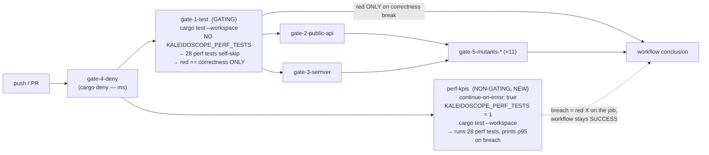

# Wave Decisions — perf-kpi-ci-non-gating-v0 (DEVOPS)

- **Wave**: DEVOPS (nWave)
- **Agent**: Apex (`nw-platform-architect`)
- **Date**: 2026-06-06
- **Mode**: Autonomous. **SLIM / CI-config** wave — this feature IS a CI-gating
  restructure, so DEVOPS is the CORE wave. But per nWave order, DEVOPS DESIGNS
  and OPERATIONALISES the restructure; it does NOT yet edit `ci.yml` (that is the
  DELIVER act). This wave produces `environments.yaml` + this file and the EXACT
  job spec DELIVER implements. No commit (Andrea commits). `docs/evolution/`
  untouched.
- **Inputs read**: `docs/product/architecture/adr-0070-perf-kpi-non-gating-ci.md`
  (the authoritative restructure decision); `design/wave-decisions.md` (Morgan,
  F1-F6 resolved); `docs/product/architecture/brief.md`
  (§"Application Architecture — perf-kpi-ci-non-gating-v0", incl. the
  For-Acceptance-Designer + DEVOPS handoff notes); `discuss/outcome-kpis.md`
  (KPI-1..4 + DEVOPS handoff); `.github/workflows/ci.yml` (gate-1-test FULLY:
  env block :140-141, steps :142-242, invocation :184; the gate graph; gate-4,
  gate-2/3, the eleven gate-5-mutants-* jobs); ADR-0005 (the five-gate contract);
  `scripts/hooks/{pre-commit,pre-push}`; CLAUDE.md + MEMORY; the slim-DEVOPS
  sibling `aperture-serve-loop-error-surfacing-v0/devops`.

## Prior Wave Consultation (+/- checklist)

| Artefact | + (used) | − (gap / flag) |
|---|---|---|
| ADR-0070 | The whole restructure: §1 (remove env from gate-1-test); §2 (new perf-kpis job sets the var, runs the family); §3 (continue-on-error: true, with `\|\| true` and separate-workflow rejected); §4 (every-push trigger, nightly rejected, DEVOPS owns placement + needs:); §5 (keep asserts, p95 prints on breach via the existing message); §6 (durable-op honesty note); §7 (no hook change); §8 (no crate change). The MANDATORY Reuse Analysis. | − ADR-0070 §4 explicitly DELEGATES the `needs:` wiring and the job-vs-separate-file placement to this DEVOPS wave — resolved in D3/D6 + the Infrastructure Summary below. |
| `design/wave-decisions.md` | F1 (the exact restructure); F2 (supersede ADR-0058 §3, a DESIGN act already done); F3 (keep asserts; the `:282-285` assert-message seam); F4 (ADR-only honesty note); F5 (whole family by env presence; one lever de-gates all 28); F6 (no hook change); the Reuse verdict (EXTEND ci.yml; CREATE only the perf-kpis job + ADR-0070); the test seam (the CI env IS the seam). | − none; DESIGN's peer-review verdict was APPROVED; the absent ci.yml change is the EXPECTED nWave-order state, not a finding. |
| `brief.md` perf-kpi section | The one-paragraph decision; the C4 mermaid gate graph (gating vs non-gating perf); the For-Acceptance-Designer structural-acceptance list (the DISTILL seam); the DEVOPS handoff (the exact two-part ci.yml edit; needs: at DEVOPS discretion; NO version bump / NO Cargo change / NO new gate / NO hook change / external integrations none). | − none. |
| `discuss/outcome-kpis.md` | KPI-1 north star (0 perf-attributable gate-1 reds / 30 days); KPI-2 (100% of runs produce readable p95 on the perf job log); KPI-3 (every Gate-1 red is correctness); KPI-4 guardrail (0 threshold-raise commits); the DEVOPS handoff (log-only surface, no dashboard at v0, no alerting/paging — must never fail the workflow, capture first runs as informal baseline). | − none; the trend dashboard is an explicit future follow-up, out of this wave. |
| ADR-0005 (five gates) | Gate 1 (test), Gate 2 (public-api), Gate 3 (semver), Gate 4 (deny), Gate 5 (mutants, 100% kill). The perf-kpis job is a NON-GATING job ALONGSIDE these five, NOT a sixth gate (ADR-0070 §2 / brief). | − Gate 5 is split into eleven per-package `--in-diff` jobs — none touched by this feature (none set or read the perf var). |
| `.github/workflows/ci.yml` | gate-1-test FULLY: the env block (:140-141), `needs: gate-4-deny` (:139), checkout (:143-144), dtolnay/rust-toolchain stable (:146-153), actions/cache cargo-stable (:155-164), the invocation `cargo test --workspace --all-targets --locked` (:184), the KPI-4 artefact steps (:196-242). The gate graph: gate-4 → gate-1 → {gate-2, gate-3} → eleven gate-5-mutants-*. The NIGHTLY_PIN job-level-literal pattern (gates 2/3, :263 :368) — the precedent for the perf job's hardcoded literal. | − none; the perf job MIRRORS gate-1-test's setup exactly (same runner, same toolchain step, same cache, same needs) plus continue-on-error + the env. |
| `scripts/hooks/{pre-commit,pre-push}` | pre-commit:92-93 = `cargo test --workspace --all-targets --locked` with NO env (perf self-skips locally); pre-push = Gate 2/Gate 3 only, zero perf references. | − none; both confirmed UNCHANGED (F6/C6). |

## Headline

**The change is two edits to one file, both routed to Apex (platform-architect)
at DELIVER, not to the crafter.** (1) Delete the job-level `env:` block (and its
single `KALEIDOSCOPE_PERF_TESTS: "1"` entry) from `gate-1-test`
(`.github/workflows/ci.yml:140-141`). (2) Add one new NON-GATING `perf-kpis` job
that sets the variable, mirrors gate-1-test's setup, runs the family, and is
`continue-on-error: true`. No crate source, no test body, no `Cargo.toml`, no new
gate, no new dependency, no new toolchain, no hook change, no deploy surface.

**nWave-order note (for the reviewer):** in nWave, DEVOPS runs BEFORE DISTILL and
DELIVER, so at DEVOPS time the `ci.yml` change does NOT yet exist. That absence is
the EXPECTED and CORRECT state — it is not a finding. This wave's job is to
DESIGN/operationalise the ADR-0070 restructure and hand DELIVER an exact,
paste-ready job spec; review THAT spec, not the non-existence of the edit.

**Trunk-based posture (project memory `project_kaleidoscope_pure_trunk_based`).**
`main` has no required-status-checks and no `enforce_admins`: CI is feedback, not
a hard merge gate. A non-gating, feedback-only perf signal is the natural fit —
`continue-on-error: true` is the GitHub-native expression of "visible feedback,
never a block."

## Decision summary (D1-D9)

| # | Topic | Decision | Rationale |
|---|-------|----------|-----------|
| D1 | Deployment target | **N/A — CI-config change** | No deploy surface. The "environments" are CI job execution contexts (gate-1-build, perf-kpis) + local hooks, not deploy targets. Kaleidoscope deploys nothing. |
| D2 | Container orchestration | **N/A** | No container, no orchestration artefact. |
| D3 | CI/CD platform | **Existing — GitHub Actions per ADR-0005** | EXTEND `.github/workflows/ci.yml`: one env-block removal + one new job. No new workflow file (recommended; ADR-0070 §3 rejected separate-file for this single job; co-location with the gates on one run page is the point). |
| D4 | Existing infrastructure | **REUSE-heavy; CREATE one job** | REUSE: the ADR-0058 presence-based self-skip guard (unchanged), the existing assert-message got-value print (the free visibility-on-breach seam), the `continue-on-error: true` GitHub primitive, the NIGHTLY_PIN job-level-literal env pattern, gate-1-test's checkout/toolchain/cache step shapes. CREATE: only the single `perf-kpis` job. |
| D5 | Observability | **Existing convention — the job log IS the surface** | No new metric, dashboard, or stack (per outcome-kpis.md). The perf-kpis job log carries the p95 on breach (the existing assert message). No alerting, no paging — the job is non-gating and MUST never fail the workflow. First runs captured as the informal baseline (a reading after DELIVER, not a wave artefact). |
| D6 | Deployment strategy | **N/A — rollback = git revert** | No rollout. The only artefact is the workflow edit; a revert restores gate-1-test setting the var and removes the perf job. No data, wire format, crate version, or consumer affected; the 28 test files untouched in both directions. |
| D7 | Continuous learning | **Human trend judgement on the perf-kpis log** | No live telemetry loop. The KPIs are CI-run-history classifications (KPI-1/3) and job-log p95 presence (KPI-2), reviewed on a rolling 30-day window by the maintainer — the K6 raw-observation idiom, scored deterministically downstream, not in the agent. |
| D8 | Security / supply chain | **No change** | No new action, no new tool, no new toolchain, no new permission. The perf job reuses the pinned `actions/checkout` / `dtolnay/rust-toolchain` / `actions/cache` SHAs already in the file. Default read-only `permissions:` unchanged. The perf tests are in-process tempdir I/O — no network, no secret, no external service. |
| D9 | Mutation testing strategy | **Unchanged — per-feature, 100% kill (ADR-0005 Gate 5)** | This feature touches NO `crates/*/src` and NO test body, so there is nothing to mutate. The eleven `gate-5-mutants-*` `--in-diff` jobs path-filter on `crates/<name>/**`; a CI-only + docs-only change produces an empty diff for every one of them and they short-circuit to a zero-second exit. Gate 5 is wholly unaffected. The project's CLAUDE.md per-feature 100%-kill strategy stands; no re-ask, no CLAUDE.md edit. |

## Infrastructure Summary — the restructured CI gate graph

The five ADR-0005 gates are UNCHANGED in shape. This feature removes perf from
the gating Gate 1 and adds ONE non-gating sibling job that carries the perf
signal in parallel, off the same fast fail-first gate (gate-4-deny), so it never
sits on the gate-1 → gate-2/3 → gate-5 critical path and never blocks the merge
signal.



- **Solid arrows into `concl`** are gating: a red blocks the workflow conclusion
  (the feedback signal). **The dotted arrow from `perf`** is non-gating: a breach
  is visible (red X on the job) but the conclusion stays success.
- **`perf-kpis` is a sibling of `gate-1-test`** off `gate-4-deny`, not a child of
  it. The two run in PARALLEL after the fast deny gate. The perf job is off the
  critical path entirely.

## The EXACT perf-kpis job spec (for DELIVER to implement)

DELIVER pastes this job into `.github/workflows/ci.yml`, immediately after the
`gate-1-test` job (so the gating and non-gating cousins sit adjacent on the run
page). It MIRRORS gate-1-test's setup — same `runs-on`, same toolchain-install
step, same cache, same `needs: gate-4-deny` — and adds `continue-on-error: true`
plus the perf env. It does NOT carry the KPI-4 verdict-counts artefact steps
(those are Gate 1's, not the perf job's).

```yaml
  # =====================================================================
  # perf-kpis — NON-GATING wall-clock p95 KPI signal (ADR-0070)
  #
  # NOT a sixth ADR-0005 gate. A separate, visible-but-non-blocking job
  # that runs the 28 wall-clock KPI tests the gating Gate 1 no longer
  # runs. It sets KALEIDOSCOPE_PERF_TESTS so the ADR-0058 self-skip guard
  # lets the whole guarded family execute; `continue-on-error: true`
  # makes a perf breach a red X on THIS job while the overall workflow
  # conclusion stays success. Per ADR-0070 §6 the durable-op budgets
  # (place 200 us, enqueue 300 us, the WAL ingest family) are
  # DEV-INDICATIVE, not CI-contractual: on shared ubuntu-latest storage
  # the per-record sync_all (ADR-0049/0060) makes fsync p95
  # milliseconds, so a breach here reads as durable cost, NOT a
  # regression. Threshold-raising is NOT the fix
  # (project_p95_wallclock_flakes_overnight). The local pre-commit hook
  # deliberately does NOT set this variable (the perf tests self-skip
  # locally — same guard).
  # =====================================================================
  perf-kpis:
    name: perf-kpis (non-gating wall-clock p95 signal)
    runs-on: ubuntu-latest
    needs: gate-4-deny
    continue-on-error: true   # the non-gating lever: breach = red X on the job, workflow stays success
    env:
      # Hardcoded literal at job level, per the ADR-0058 §3 note: GitHub
      # Actions does not reliably evaluate ${{ env.X }} in a job-level
      # env block, the same reason gates 2/3 inline NIGHTLY_PIN.
      KALEIDOSCOPE_PERF_TESTS: "1"
    steps:
      - name: Check out repository
        uses: actions/checkout@de0fac2e4500dabe0009e67214ff5f5447ce83dd # v6.0.2

      - name: Install stable Rust toolchain (pinned via rust-toolchain.toml)
        uses: dtolnay/rust-toolchain@e97e2d8cc328f1b50210efc529dca0028893a2d9 # v1
        with:
          toolchain: stable

      - name: Cache Cargo registry, git index and target/
        uses: actions/cache@27d5ce7f107fe9357f9df03efb73ab90386fccae # v5.0.5
        with:
          path: |
            ~/.cargo/registry
            ~/.cargo/git
            target
          key: ${{ runner.os }}-cargo-stable-${{ hashFiles('**/Cargo.lock') }}
          restore-keys: |
            ${{ runner.os }}-cargo-stable-

      - name: cargo test --workspace --all-targets --locked (perf KPIs active)
        # Identical invocation to gate-1-test; the ONLY difference is
        # this job's KALEIDOSCOPE_PERF_TESTS env, which flips the 28
        # wall-clock tests from self-skip to measure-and-assert. The
        # env-var presence runs the WHOLE guarded family across all 11
        # crates, so a future guarded test is picked up for free. On a
        # breach the existing assert message prints the measured p95
        # (e.g. "...got {p95_us} µs ..."), satisfying visibility-on-breach
        # with no test change.
        run: cargo test --workspace --all-targets --locked
```

Notes for DELIVER:
- **Cache key** is the SHARED `cargo-stable` namespace (same as gate-1-test), so
  the perf job warms from / contributes to the same cache — no new cache
  namespace, no contention concern (read-mostly).
- **No `timeout-minutes`** is specified to match gate-1-test (which has none);
  add one only if a future perf hang is observed. Being `continue-on-error`, a
  hang would not block the workflow anyway.
- **Placement = inside `ci.yml`, after gate-1-test.** A separate workflow file is
  the allowed-but-not-recommended variant (ADR-0070 §3/§4); choose it only with
  rationale, keeping the contract (non-gating, every-push, whole family, var set,
  breach visible).

## The gate-1-test edit (for DELIVER to implement)

A two-line deletion in the `gate-1-test` job. Remove the job-level `env:` key and
its single entry at `.github/workflows/ci.yml:140-141`:

```diff
   gate-1-test:
     name: Gate 1 — cargo test (all targets, locked)
     runs-on: ubuntu-latest
     needs: gate-4-deny
-    env:
-      KALEIDOSCOPE_PERF_TESTS: "1"
     steps:
       - name: Check out repository
```

Everything else in `gate-1-test` is UNCHANGED: the checkout, the
`dtolnay/rust-toolchain` stable step, the cargo-stable cache, the invocation
`cargo test --workspace --all-targets --locked` (ci.yml:184), and the KPI-4
verdict-counts artefact steps (ci.yml:196-242). With the env removed, the 28
wall-clock tests hit the ADR-0058 early-return preamble and self-skip; the job
goes green iff the non-perf correctness suite passes (C2; US-03 negative
control).

## Single-setter confirmation (the load-bearing safety check)

**Does removing `KALEIDOSCOPE_PERF_TESTS` from `gate-1-test` affect any other job
or hook? NO.**

- **Repo-wide grep** `grep -rn KALEIDOSCOPE_PERF_TESTS .github/ scripts/`
  returns EXACTLY ONE match: `.github/workflows/ci.yml:141` (the gate-1-test
  job-level env). gate-1-test is the ONLY current setter and the ONLY reader of
  the variable's presence in CI.
- **After this feature** the setter set moves from `{gate-1-test}` to
  `{perf-kpis}` — gate-1-test stops setting it, the new perf-kpis job becomes the
  second-and-only setter. Never empty, never doubled.
- **Other CI jobs unaffected**: Gate 4 (gate-4-deny), Gate 2 (gate-2-public-api),
  Gate 3 (gate-3-semver), and all eleven `gate-5-mutants-*` jobs neither set nor
  read the variable. **Gate 5 mutation testing is unaffected.**
- **Hooks unaffected**: `scripts/hooks/pre-commit` (no env, line 92-93) and
  `scripts/hooks/pre-push` (zero references) already omit the variable. They are
  NOT modified; the variable MUST NOT be added (F6/C6) — adding it would
  re-introduce the local overnight flake ADR-0058 fixed.

## Constraints (all hold)

- **C1 Durability not weakened** — no `sync_all` removed; CI-only change.
- **C2 Correctness gating not loosened** — gate-1-test still runs `cargo test
  --workspace --all-targets --locked` (ci.yml:184, unchanged); every non-perf
  test still executes and asserts; US-03 negative control demonstrated at DISTILL.
- **C3 No threshold chasing** — no budget literal, sample count, warm-up loop, or
  percentile index changed.
- **C4 Visibility preserved** — the perf-kpis job runs the family; the existing
  assert message prints the p95 on breach; breach = non-blocking red X.
- **C5 Whole family** — env-var presence runs all 28 tests / 11 crates; one env
  key removed de-gates all 28 at once.
- **C6 Local hook already correct** — no change; variable not added (both hooks
  confirmed clean).
- **C7 Trunk-based posture** — non-gating job aligns with "CI is feedback, not a
  gate" (`project_kaleidoscope_pure_trunk_based`).
- **C8 No crate version impact** — CI + docs only; no `crates/*/src`, no test
  body, no `Cargo.toml`/`Cargo.lock`, no SemVer/public-api surface change; never
  1.0.0.
- **C9 British English; em dashes structural only** — honoured.

## Upstream Changes

- **None.** The relevant upstream is the predecessor `perf-kpi-ci-gating-v0` /
  ADR-0058 (corrected here) plus ADR-0049 / ADR-0060 (the durability features
  whose per-record `sync_all` is the root cause). The **supersede of ADR-0058 §3
  is a DESIGN act already done** (ADR-0070 header `Supersedes: ADR-0058 §3`); this
  DEVOPS wave does not re-decide it, it operationalises it.
- **No back-propagation to DISCUSS required**: the DISCUSS facts (the 28-test
  inventory, the `ci.yml:140-141` env, the `ci.yml:184` invocation, the `:256`
  guard, the `:282-285` assert message, the `:92-93` hook, the `:433` fsync) were
  re-verified this wave and hold.

## DELIVER routing — workflow YAML, written by Apex, NOT the crafter

Per CLAUDE.md: "the crafter agent is the only agent that writes production source
under `crates/<name>/src/`. All other agents write specifications, ADRs, peer
reviews, or workflow YAML." The DELIVER act for this feature is purely
`.github/workflows/ci.yml` (the env removal + the new perf-kpis job) — **workflow
YAML**. It is therefore routed to **@nw-platform-architect (Apex)**, NOT to the
software-crafter. There is NO crate source, NO test body, NO `Cargo.toml` change
in this feature; the crafter has nothing to do here.

## DISTILL seam (the acceptance-designer's hook — for after DELIVER)

DISTILL writes a STRUCTURAL acceptance test that parses `ci.yml` and asserts:
1. `gate-1-test` has NO `KALEIDOSCOPE_PERF_TESTS` key in its job-level `env`.
2. A `perf-kpis` job exists, sets `KALEIDOSCOPE_PERF_TESTS: "1"`, runs
   `cargo test --workspace`, and carries `continue-on-error: true`.

Plus one behavioural NEGATIVE CONTROL: a deliberately failing non-perf
correctness test still reds `gate-1-test` (de-gating perf must provably NOT
de-gate correctness — US-03 / C2). Full structural-acceptance list in the brief's
"For Acceptance Designer" note.

## Peer-review verdict

platform-architect-reviewer applied as a STRUCTURED SELF-REVIEW against the
platform reviewer's dimensions (nested sub-agent invocation unavailable in this
autonomous context; slim-DEVOPS precedent). See `devops/self-review.md`.
Verdict: **APPROVED_PENDING_INDEPENDENT_REVIEW** — 0 blocking, 0 high. Iteration
1; no revisions required.
