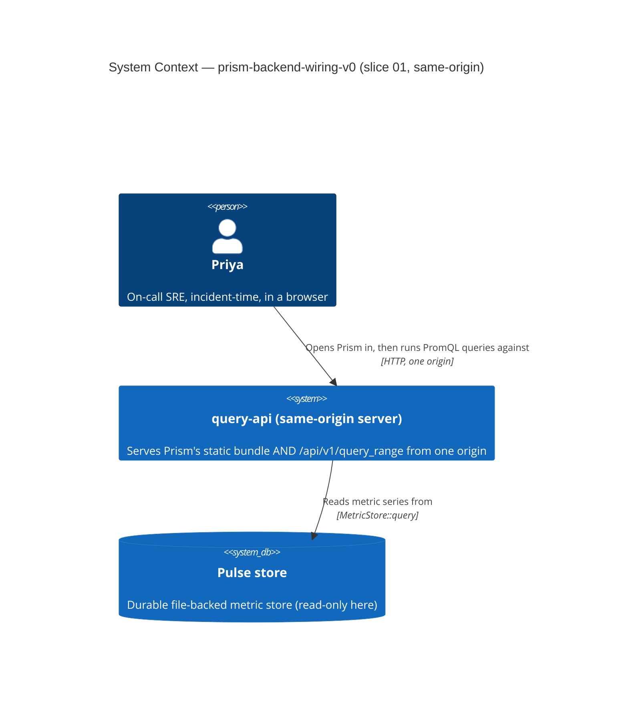
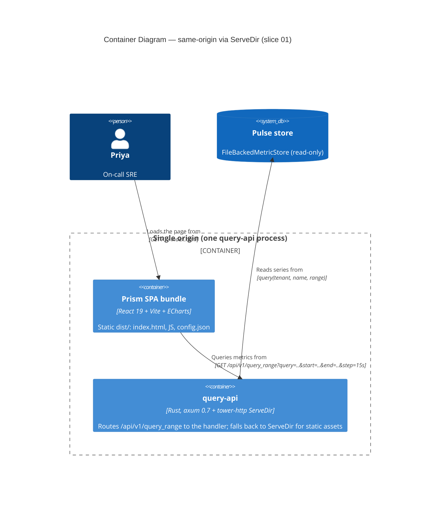
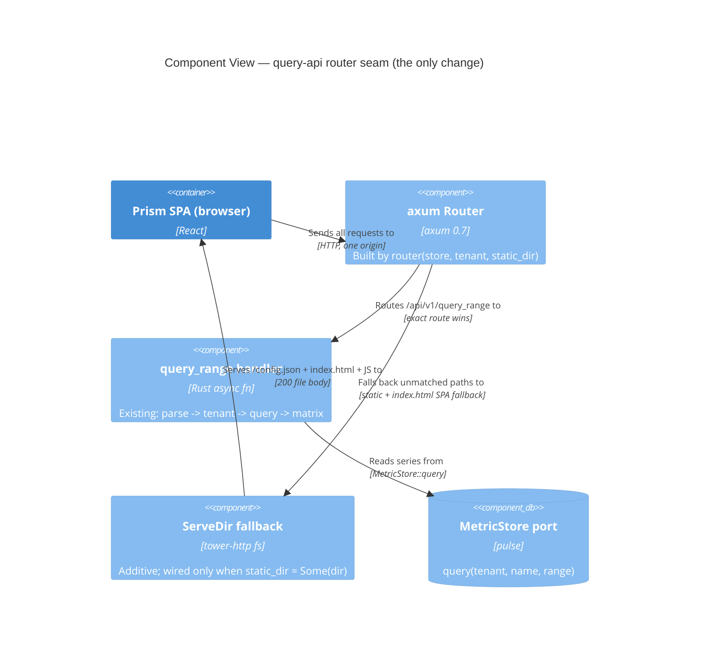

# Application Architecture: prism-backend-wiring-v0 (Slice 01)

- **Author**: `nw-solution-architect` (Morgan), DESIGN wave, 2026-05-21
- **Mode**: propose
- **Scope**: Slice 01 — a browser-served Prism mounts its QueryPanel and plots
  one metric series read from query-api over the durable Pulse store.
- **Topology**: same-origin via `tower-http` `ServeDir` (DD1). No CORS.
- **Decisions**: see `wave-decisions.md` (DD1-DD7) and ADR-0043.

This section sits under `## Application Architecture` of the platform brief by
reference; it is feature-scoped and does not re-derive platform decisions.

## System Context (C4 L1)

The operator (Priya, on-call SRE) opens Prism in a browser. The browser is the
only external actor. query-api reads the durable Pulse store. No third-party
SaaS, no auth provider, no TLS at v0.



## Container View (C4 L2)

One origin. The browser fetches `/config.json` and `index.html` (static, served
by `ServeDir`) and `/api/v1/query_range` (the API handler) from the same
query-api process. The API route always wins; any unmatched path falls through
to the static fallback with `index.html` as the SPA fallback.



`spa` and `qapi` are drawn as distinct containers for clarity, but at runtime
the SPA is *static files served by* qapi's `ServeDir` — they share one process
and one origin. That co-location is precisely what removes CORS.

## Component View (C4 L3) — query-api router

query-api has fewer than five internal components, so a full L3 is not mandated.
This focused L3 shows only the routing seam the feature touches: the additive
`ServeDir` fallback and where it sits relative to the existing API route. The
parser/translator/store internals (ADR-0042) are unchanged and elided.



When `static_dir = None` (default), the `ServeDir` component is absent and the
router is byte-for-byte today's API-only router. The read-only `query-range-api-v0`
behaviour does not regress.

## Request flow — the read loop made visible

```mermaid
sequenceDiagram
  participant B as Browser (Prism)
  participant Q as query-api (one origin)
  participant P as Pulse store
  B->>Q: GET / (same origin)
  Q-->>B: 200 index.html (ServeDir SPA fallback)
  B->>Q: GET /config.json
  Q-->>B: 200 {backend:{url:"/api/v1",label:"Pulse (durable)"},prism:{version:"0.1.0"}}
  Note over B: loadConfig -> {kind:'ok'}; QueryPanel mounts
  B->>Q: GET /api/v1/query_range?query=up&start=..&end=..&step=15s
  Note over Q: API route wins over ServeDir fallback
  Q->>P: query(tenant, "up", [start,end))
  P-->>Q: Vec<(Metric, MetricPoint)>
  Q-->>B: 200 {status:"success",data:{resultType:"matrix",result:[...]}}
  Note over B: one series plotted; footer "1 series • N points • M ms"
```

The browser never crosses an origin, so no preflight `OPTIONS` and no
`Access-Control-Allow-Origin` appear in this flow. That absence is the point:
the simplest honest mechanism removes a failure class rather than configuring
it.

## The `backend.url` `/api/v1` reconciliation (visible in the flow)

`buildUrl` joins `${backend.url}/query_range`. With the committed
`backend.url = "/api/v1"`, the browser issues `GET /api/v1/query_range`,
resolved against the page's own origin. query-api's `QUERY_RANGE_ROUTE` is
`/api/v1/query_range`. The join lands on the route -> 200 matrix, not a 404.
ADR-0027 §5's prose (which read `${backend.url}/api/v1/query_range`) is corrected
by ADR-0043 to match the shipped `buildUrl`: the `/api/v1` lives *inside*
`backend.url`.

## Quality attributes (ISO 25010, slice-scoped)

| Attribute | How addressed |
|---|---|
| Functional suitability | config.json validates against Prism's real loader (3 error arms preserved); 200 matrix resolves, not a 404; empty result is the calm empty arm |
| Performance efficiency | no CORS preflight on the incident-time path (one round-trip per query); query latency captured as a guardrail (measured, not gated at v0) |
| Compatibility | one origin, one cert, one log stream (ADR-0027 §5 posture); the existing matrix JSON contract is unchanged |
| Reliability | Earned-Trust probe unchanged (wire-then-probe-then-use): query-api refuses to start if the store cannot be read or no tenant resolves (`health.startup.refused`) |
| Security | fail-closed tenancy preserved (unresolved tenant -> 401 status:error); header-redaction invariant (ADR-0027 §6) untouched; no auth/TLS introduced (out of scope, documented) |
| Maintainability | additive, behind-config `ServeDir`; default-off so the API-only path is unchanged; testable via `oneshot` (no port bound) |
| Portability | origin-relative `backend.url` makes the same bundle portable across hosts under same-origin serving |

## Earned-Trust posture (principle 12)

The new `ServeDir` fallback is a driven adapter onto the filesystem (it reads
`dist/` and serves bytes). It does not change the composition root's existing
probe: `composition::probe` still asserts the store is readable and a tenant
resolves before the listener binds. The `ServeDir` itself is exercised
empirically by the slice-01 RED test (DD6): a `oneshot` against a temp dir
asserts `/config.json` and `index.html` are actually served and that the API
route wins over the static fallback — the adapter demonstrates it can honour its
contract against a real (temp) filesystem rather than by convention. If the
static dir is misconfigured (path absent), `ServeDir` returns 404 for static
paths and the API path still works; the browser's loader then surfaces
`fetch-failed` and keeps the panel dark (correct refusal, not a silent mount).
```
