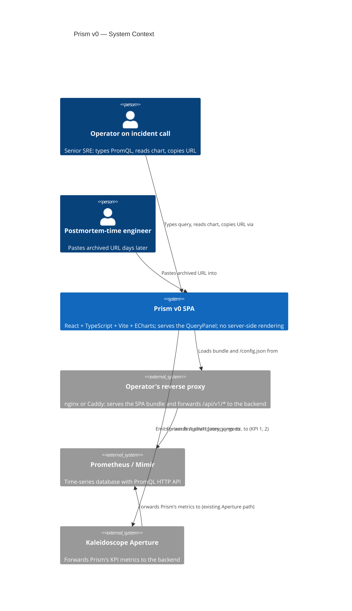
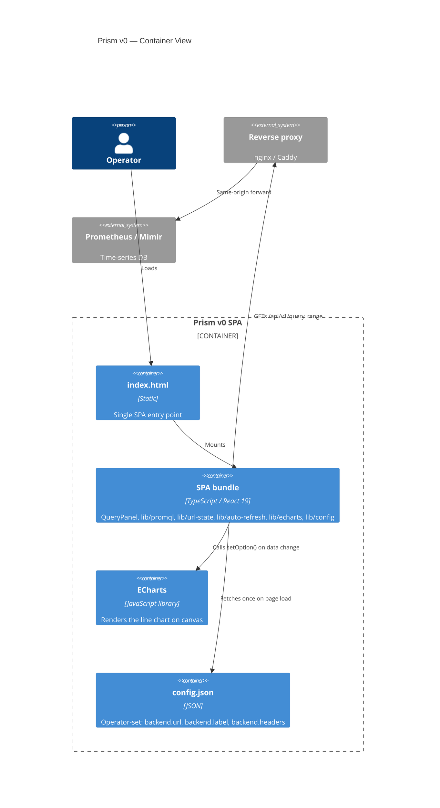
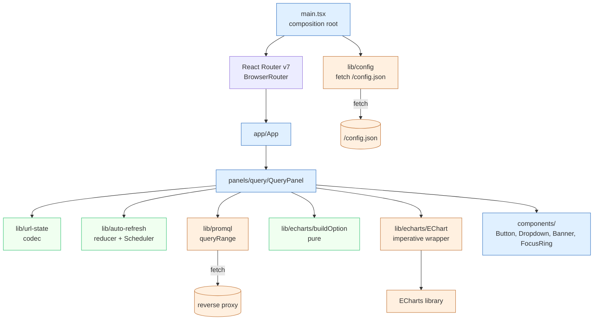
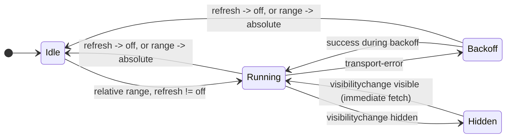

# Prism v0 — Component design

- **Wave**: DESIGN
- **Author**: `@nw-solution-architect` (Morgan, dispatched by Bea)
- **Date**: 2026-05-07
- **Inputs**: 13 DISCUSS files in `docs/feature/prism-v0/discuss/` and
  `docs/feature/prism-v0/slices/`; SSOT (`incident-response.yaml`,
  `incident-response-visual.md`, `jobs.yaml`); Bea's pre-locked stack
  decisions (pnpm, `apps/prism/`, React Router v7, Vite, native fetch,
  ECharts direct import, no state management library, CSS modules,
  ESLint+Prettier, AGPL).
- **Companion ADRs**: ADR-0026 component layout, ADR-0027 backend
  HTTP client, ADR-0028 URL state, ADR-0029 auto-refresh state machine,
  ADR-0030 ECharts integration, ADR-0031 workspace tooling, ADR-0032
  licence headers.
- **Companion documents**: `workspace-layout.md`, `wave-decisions.md`.

---

## 1. System context (C4 L1)



The reverse proxy is part of the operator's deployment, not part of
Prism. The same-origin posture (ADR-0027 § 5) means Prism never sees
a CORS preflight in production. The Aperture link is the existing
Phase 1 capability — Prism is a Spark-instrumented client that emits
its own metrics through the same path every Kaleidoscope service does.

---

## 2. Container view (C4 L2)



Containers inside Prism: `index.html` (immutable bootstrap), the SPA
bundle (everything written under `apps/prism/src/`), ECharts (third-
party library imported and tree-shaken into the bundle), and
`/config.json` (operator-deployed alongside the bundle).

---

## 3. Component view (C4 L3) — the SPA bundle



Three colour bands: driving (UI), driven (adapters / external), pure
(no I/O, no React, fully testable as functions).

---

## 4. Module catalogue

| Module | Files (illustrative) | Public surface | Slice introduced |
|---|---|---|---|
| `app/` | `App.tsx`, `RootProviders.tsx` | `<App>` component | 01 |
| `panels/query/` | `QueryPanel.tsx`, `QueryInput.tsx`, `RangePicker.tsx`, `RefreshPicker.tsx`, `RunButton.tsx`, `ChartArea.tsx`, `StatusLine.tsx`, `ErrorBanner.tsx`, `EmptyState.tsx`, `Footer.tsx`, `MalformedUrlBanner.tsx` | `<QueryPanel>` | 01 (Input, Run, ChartArea, Footer); 02 (RangePicker relative); 03 (ErrorBanner, EmptyState); 04 (RefreshPicker, StatusLine); 05 (RangePicker absolute); 06 (a11y polish across all) |
| `lib/promql/` | `client.ts`, `types.ts`, `parse.ts` | `queryRange(req, ctx) => Promise<QueryOutcome>`; types | 01 |
| `lib/url-state/` | `codec.ts`, `types.ts`, `result.ts` | `decode`, `encode`, `UrlState`, `UrlParseError` | 01-05 (incremental) |
| `lib/auto-refresh/` | `reducer.ts`, `events.ts`, `effects.ts`, `scheduler.ts` | `reduce`, `AutoRefreshState`, `AutoRefreshEvent`, `Scheduler` | 04 |
| `lib/config/` | `loader.ts`, `types.ts` | `loadConfig() => Promise<Result<RuntimeConfig, ConfigError>>` | 01 |
| `lib/echarts/` | `buildOption.ts`, `EChart.tsx`, `instance.ts`, `palette.ts` | `buildOption`, `<EChart>`, palette tokens | 01 (basic); 06 (palette + a11y) |
| `components/` | `Button.tsx`, `Dropdown.tsx`, `Banner.tsx`, `FocusRing.tsx` | atom components | 01 onward |
| `styles/` | `theme.module.css`, `global.css` | CSS custom properties | 01 onward |

---

## 5. Initialisation sequence (page load)

```mermaid
sequenceDiagram
    participant Browser
    participant HTML as index.html
    participant Main as main.tsx
    participant Cfg as lib/config
    participant URL as lib/url-state
    participant App as <App>
    participant Panel as <QueryPanel>
    participant PromQL as lib/promql
    participant Backend as Prometheus
    participant ECharts as lib/echarts

    Browser->>HTML: GET /
    HTML->>Main: load /assets/main-XXX.js
    Main->>Cfg: loadConfig()
    Cfg->>Cfg: fetch /config.json
    Cfg-->>Main: ok(RuntimeConfig) | err(ConfigError)
    alt config error
        Main->>HTML: render <ConfigErrorBanner>; abort
    else ok
        Main->>URL: decode(window.location.search)
        URL-->>Main: ok(UrlState) | err(invalid fields list)
        Main->>App: mount with ConfigContext + UrlState
        App->>Panel: render
        Panel->>Panel: derive query, range, refresh from UrlState
        opt q is non-empty
            Panel->>PromQL: queryRange({q, range}, {backend, AbortSignal})
            PromQL->>Backend: GET /api/v1/query_range?...
            Backend-->>PromQL: 200 { status:"success", data:{result:[...]}}
            PromQL-->>Panel: QueryOutcome.success
            Panel->>ECharts: buildOption(outcome) -> EChartsOption
            Panel->>ECharts: <EChart option={...}/>
            ECharts->>Browser: paint canvas
        end
        Panel->>Browser: paint chrome (backend label, version)
    end
```

Five integration points worth calling out:

1. The composition root in `main.tsx` is the only place that reads
   `/config.json`. Other modules see the parsed `RuntimeConfig` via
   React context. (ADR-0026 § 5.)
2. The URL state is decoded once at mount, then derived per render
   via `useSearchParams` from React Router. The QueryPanel never
   parses the URL itself.
3. `queryRange` is only issued when the query is non-empty. A fresh
   load with `?q=` (empty) lands on the empty-state pre-fetch
   rendering.
4. The `AbortSignal` carried into `queryRange` belongs to the
   auto-refresh state machine's effect runner (Slice 04). At Slice 01
   the signal is `undefined`; at Slice 04 it is the live controller.
5. The chrome (backend label, Prism version, malformed-URL banner if
   any) renders independently of the chart fetch; it is visible even
   on `transport-error: network`.

---

## 6. Auto-refresh state machine (Slice 04)

The reducer's full state diagram is in ADR-0029 § 1. Summary:



Backoff sub-states (`backoff-0`, `backoff-1`, `backoff-2`) collapse
to one rectangle in this summary. The retry counter advances with
each consecutive transport failure; delays are 5/10/20/30 s capped.
Application errors (parse, empty) do NOT enter backoff (per ADR-0029
§ 4).

---

## 7. Error mapping flow (Slice 03)

```mermaid
flowchart TD
    Run[Operator presses Run] --> Fetch[lib/promql/queryRange]
    Fetch --> Result{outcome.kind}
    Result -->|success| Success[Chart renders<br/>footer: N series, M points, Q ms]
    Result -->|empty| Empty[Calm 'No data for {range}'<br/>NO warning banner]
    Result -->|parse-error| Parse[Inline warning banner with verbatim backend.error<br/>Chart area: 'Backend rejected this query']
    Result -->|transport-error.network| Net[Inline warning naming backend.label<br/>Body: 'Last successful fetch: T'<br/>Previous chart dropped]
    Result -->|transport-error.http-status| Http[Same as Net: name backend.label and HTTP status<br/>Previous chart dropped]
    Result -->|transport-error.invalid-json| Inv[Same as Net: 'Backend returned invalid JSON'<br/>Previous chart dropped]
    Result -->|transport-error.shape| Shp[Same as Net: 'Backend response missing data.result'<br/>Previous chart dropped]
    Result -->|transport-error.aborted| Abrt[NO rendering; tick was cancelled]
    Success --> URLWrite[history.replaceState with current UrlState]
    Empty --> URLWrite
    Parse --> URLWrite
    Net --> URLWrite
    Http --> URLWrite
    Inv --> URLWrite
    Shp --> URLWrite
```

Six rendering arms (success, empty, parse-error, transport-error
collapsed into four sub-arms by `cause.kind`, plus the silent
`aborted`). The URL write is independent of the rendering arm; even
broken-state queries are shareable (Slice 03 § AC and Slice 06 KPI 5).

---

## 8. URL state schema (ADR-0028)

| Parameter | Type | Default | Encoded | Slice |
|---|---|---|---|---|
| `q` | URL-encoded PromQL string | `""` | always | 01 |
| `from` | `-5m`/`-15m`/`-1h`/`-6h`/`-24h` OR ISO-8601 | `-15m` | always | 01 (relative); 05 (absolute) |
| `to` | `now` (relative) OR ISO-8601 (absolute) | `now` | always | 01; 05 |
| `refresh` | `5s`/`10s`/`30s`/`1m` | `off` (absent) | only when set and range is relative | 04 |

URL writes go through `history.replaceState` (not `pushState`), so the
back button leaves the SPA cleanly rather than undoing keystrokes.

---

## 9. Configuration shape

`/config.json` (loaded once at boot):

```jsonc
{
  "backend": {
    "url": "https://prom.acme-observability.internal",
    "label": "prom-prod",
    "headers": {
      "X-Tenant-Id": "acme"
    }
  }
}
```

The schema is locked at v0:

| Key | Type | Required | Default | Source-of-truth row |
|---|---|---|---|---|
| `backend.url` | string (URL) | yes | none | `prism.backend.url` |
| `backend.label` | string | no | `"(unconfigured)"` | `prism.backend.label` |
| `backend.headers` | object<string,string> | no | `{}` | `prism.backend.headers` |

The fetcher (`lib/config/loader.ts`) validates and produces a typed
`RuntimeConfig` or a typed `ConfigError`. `ConfigError` is non-recoverable;
the SPA refuses to render the QueryPanel if config cannot be loaded
(per ADR-0026 § 5). The shape comes from
`shared-artifacts-registry.md`'s configuration-sourced section.

---

## 10. Quality attributes (ISO 25010)

| Attribute | Strategy | Verification |
|---|---|---|
| **Performance efficiency** — KPI 1 (first-chart < 2s p95) | Vite tree-shaking, ECharts modular import, no state-management library, no axios/ky | DEVOPS' synthetic CI fixture (Playwright) measures p95 across 20 runs |
| **Performance efficiency** — KPI 2 (iterate < 800 ms p95) | Pure option builder, `setOption({ notMerge: true })` without re-mount | Same fixture |
| **Reliability** — KPI 5 (page-stays-usable) | Total-function `QueryOutcome` (no throws); React error boundary at `<App>` root; calm-banner fallback on malformed URL | Playwright drives the four failure modes; KPI 5 asserts 100% non-blank |
| **Maintainability** — modularity | Ports-and-adapters split (driving panel, driven adapters, pure libs); `eslint-plugin-boundaries` enforces (ADR-0031) | CI ESLint pass; visual review of module graph |
| **Maintainability** — testability | Pure functions for `lib/url-state`, `lib/echarts/buildOption`, `lib/auto-refresh/reduce`. Driven adapters injectable via `fetchFn` and `Scheduler` seams | Vitest unit tests + Playwright E2E + KPI 4 byte-equality assertion |
| **Security** — confidentiality | `backend.headers` redaction is structural (test asserts no header value appears in any `QueryOutcome` field) | Vitest unit test (ADR-0027 § 6) |
| **Security** — non-encroachment | No localStorage / cookie / IndexedDB. The URL is the only state container | URL-state codec test; CI grep for `localStorage` / `document.cookie` / `IndexedDB` in `apps/prism/src/` and fail if matched outside `lib/` allow-list |
| **Usability** — accessibility | WCAG 2.2 AA covered in Slice 06; CSS-property-driven palette swap; Okabe-Ito + Tableau 10; `prefers-reduced-motion` honoured; ECharts `AriaComponent` + SR-only `<table>` | Slice 06 audit: Lighthouse a11y >= 95, axe-core zero AA violations |
| **Compatibility** — browser matrix | Chrome / Firefox / Safari latest two stable. No legacy support | Playwright runs all three engines in CI (DEVOPS owns) |
| **Portability** — backend swap | `lib/promql/` is parametrised by `backend.url` and `backend.headers`; same SPA bundle works against Prometheus, Mimir, VictoriaMetrics, Grafana Cloud (any backend honouring the `/api/v1/query_range` API) | Slice 01 demo against local Prometheus; v0.1+ smoke tests against Mimir |
| **Functional suitability** — completeness | 30 ACs across 7 stories all mapped to slices and modules | DISCUSS requirements-completeness 1.00 |

---

## 11. Earned-Trust posture (principle 12)

Prism v0 has three driven adapters in the principle-12 sense:

1. **`lib/promql/` — backend HTTP client**. The "lie surface" is "the
   backend honours the `/api/v1/query_range` API exactly as we expect".
   Probe shape: a startup-time health check is **not** appropriate (the
   operator may legitimately have an empty Prometheus on first launch);
   instead, the Slice 01 walking-skeleton demo is the probe — Slice 01
   does not pass without a real round-trip succeeding. The contract
   tests (ADR-0027 External-integration handoff) extend the probe into
   CI: the Pact-JS or container-fixture runner exercises the four
   known response shapes against a real Prometheus.
2. **`lib/config/` — `/config.json` fetcher**. The lie surface is "the
   operator-deployed config has the keys we expect". Probe: the
   loader's parse function rejects any config that fails the schema;
   the composition root refuses to start. This is the "wire then probe
   then use" invariant for an SPA: if `loadConfig` fails, the SPA
   renders a calm error UI and never tries to fetch the backend.
3. **`lib/echarts/EChart` — ECharts wrapper**. The lie surface is
   "ECharts honours `setOption({notMerge:true})` without merging stale
   series". Probe: the slice 04 Playwright test asserts DOM-node
   identity preservation across ticks AND data identity (via the
   visual-regression baseline). Mutation tests on the option builder
   plus the byte-equality assertion (KPI 3) are the runtime probe.

The composition root invariant ("wire then probe then use") is honoured:
`main.tsx` loads `/config.json` first, refuses to mount `<App>` on
config error, and only then issues backend fetches. The principle-12
self-application — "the probe must verify that probes exist" — is
covered by ESLint rules that fail if a new driven adapter ships
without a typed total-function return type (no throws).

---

## 12. Slice → ADR → module mapping

| Slice | Stories | ADR(s) primary | Modules touched |
|---|---|---|---|
| 01 walking skeleton | US-PR-01, US-PR-02 (default), US-PR-03 (fidelity), US-PR-06 | ADR-0026, ADR-0027, ADR-0028, ADR-0030 | `app/`, `panels/query/` (Input, Run, ChartArea, Footer), `lib/promql/`, `lib/url-state/` (q/from/to default), `lib/echarts/`, `lib/config/`, `components/` |
| 02 relative presets | US-PR-02 (relative) | ADR-0028 | `panels/query/RangePicker`, `lib/url-state/` (relative range) |
| 03 errors and empty | US-PR-03 (errors), US-PR-04 (URL preserved) | ADR-0027 | `panels/query/ErrorBanner`, `panels/query/EmptyState`, `panels/query/MalformedUrlBanner` |
| 04 auto-refresh | US-PR-05 | ADR-0029 | `lib/auto-refresh/`, `panels/query/RefreshPicker`, `panels/query/StatusLine` |
| 05 absolute range + permalink | US-PR-02 (absolute), US-PR-04 (postmortem) | ADR-0028 (absolute) | `panels/query/RangePicker` (Custom mode), `lib/url-state/` (absolute) |
| 06 accessibility | US-PR-07 | ADR-0030 (palette + a11y) | `lib/echarts/palette.ts`, `lib/echarts/buildOption` (a11y fields), `styles/theme.module.css`, every `panels/query/*` (focus ring, ARIA), `components/FocusRing` |

---

## 13. Cross-references

- **Component layout source-of-truth**: ADR-0026.
- **HTTP error type hierarchy**: ADR-0027 § 2-3.
- **URL parameter vocabulary**: ADR-0028 (and `shared-artifacts-registry.md`).
- **Auto-refresh transitions**: ADR-0029 § 1-7.
- **ECharts option-builder invariants**: ADR-0030 § 2.
- **Workspace and CI**: ADR-0031 + DEVOPS' workflow file.
- **Licence header text and enforcement**: ADR-0032.

---

## 14. Open items routed to crafter

The following are deliberately left to the crafter during DISTILL /
DELIVER, NOT to DESIGN:

- The exact Vite plugin set (e.g. `@vitejs/plugin-react`, plus any
  visualiser plugin for the bundle-size measurement). DESIGN locks
  the bundle gate (300 KB gzipped); the crafter picks the plugin
  shape.
- The exact CSS approach within `styles/theme.module.css` (CSS custom
  properties at `:root` vs scoped per panel). DESIGN locks "CSS
  modules + custom properties for theming"; the crafter picks the
  scope.
- The `useReducer` vs custom-hook shape inside `lib/auto-refresh/`.
  DESIGN locks the reducer signature (pure `(state, event) => (next,
  effects)`); the crafter picks `useReducer` vs Zustand-free hand-rolled.
- The Playwright fixture's local-Prometheus version pin. DEVOPS
  picks; DESIGN's only requirement is "real Prometheus, not a mock".
