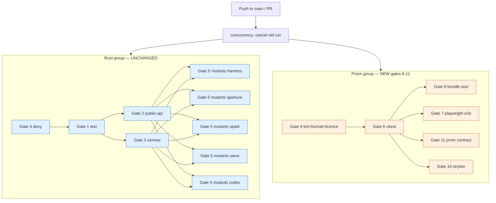

# Prism v0 — CI/CD pipeline

- **Wave**: DEVOPS
- **Author**: `@nw-platform-architect` (Apex, dispatched by Bea)
- **Date**: 2026-05-08
- **Inputs**: ADR-0031 § 9 (CI contract extension), ADR-0027
  § External-integration handoff (contract testing for Prometheus /
  Mimir routed to Apex), `outcome-kpis.md` (KPIs 1-5 + cross-KPI
  guardrails), existing CI workflow `.github/workflows/ci.yml`.
- **Companion**: `environments.yaml`, `platform-architecture.md`,
  `branching-strategy.md`, `wave-decisions.md`.

---

## 1. Existing pipeline (unchanged)

The current 9-job Rust workflow stays exactly as it is. Quoting the
job names so this document can stand on its own:

| Existing job | Trigger | Stage | Type |
|---|---|---|---|
| `gate-4-deny` | push to main, PR | commit | blocking (CI) |
| `gate-1-test` | needs gate-4-deny | commit | blocking (CI) |
| `gate-2-public-api` | needs gate-1-test | commit | blocking (CI) |
| `gate-3-semver` | needs gate-1-test | commit | blocking (CI) |
| `gate-5-mutants-harness` | needs gate-2 + gate-3 | acceptance | blocking (CI) |
| `gate-5-mutants-aperture` | needs gate-2 + gate-3 | acceptance | blocking (CI) |
| `gate-5-mutants-spark` | needs gate-2 + gate-3 | acceptance | blocking (CI) |
| `gate-5-mutants-sieve` | needs gate-2 + gate-3 | acceptance | blocking (CI) |
| `gate-5-mutants-codex` | needs gate-2 + gate-3 | acceptance | blocking (CI) |

The Prism gates (6-11) are added as **parallel jobs** alongside the
Rust group. They have no `needs:` dependency on the Rust gates and
the Rust gates have no `needs:` dependency on them — the two groups
live in the same workflow file but execute independently. Cancel-in-
progress is shared (`concurrency.cancel-in-progress: true`); a new
push cancels the old run for both groups.

Per the project's pure-trunk-based memory and `branching-strategy.md`,
**none of these gates are required-status-checks**. CI is feedback,
not a gate. Failures trigger fix-forward / post-merge correction;
Andrea pushes the fix and notes it in the relevant `wave-decisions.md`.

---

## 2. Gate flow diagram (full workflow after Prism v0)



The Prism group's internal ordering: Gate 9 (cheapest) first; Gate 6
(unit + integration tests) next, becoming the prerequisite for
Gates 7, 8, 10, 11 because all four downstream gates need the
build/test artefacts Vitest produces (or rebuilds against) and a
red Vitest immediately invalidates them.

The Rust group's internal ordering is unchanged.

---

## 3. New gates — full specification

Each gate is specified with: trigger, expected duration, parallelism,
artefact uploads, retention, and three-layer Earned-Trust enforcement
(subtype / structural / behavioural).

### 3.1 Gate 6 — Prism unit + integration (Vitest)

| Field | Value |
|---|---|
| Job name | `gate-6-prism-vitest` |
| Trigger | push to main; pull_request to main |
| `needs:` | `gate-9-prism-lint-format` (lint cheaper; fail-fast) |
| Runner | ubuntu-latest |
| Stage | commit |
| Type | blocking (CI feedback; not required-status-check per project posture) |
| Command | `pnpm install --frozen-lockfile && pnpm --filter prism vitest run` |
| Expected duration | 1-3 minutes (small unit suite, JSdom environment) |
| Timeout | 10 minutes |
| Parallelism | runs on its own runner |
| Artefacts | `apps/prism/reports/junit/` (JUnit XML for CI integrations); `apps/prism/coverage/` (lcov for trend visibility) |
| Retention | 14 days (junit), 30 days (coverage) |

**Earned-trust three-layer**:

- **Subtype**: TypeScript strict mode; `@typescript-eslint/recommended-type-checked` covers ill-typed assertions at lint time.
- **Structural**: this gate; the test runner refuses to pass with any test failure or any uncaught console error in any test.
- **Behavioural**: every Vitest test exercises a real code path (not a mock-only test); KPI 3's byte-equality assertion (NaN-bearing fixture) and the URL roundtrip property test live here.

**Specification of intent** (the crafter writes the YAML at Slice 01):

```yaml
gate-6-prism-vitest:
  name: Gate 6 — Prism unit + integration (vitest)
  runs-on: ubuntu-latest
  needs: gate-9-prism-lint-format
  timeout-minutes: 10
  steps:
    - uses: actions/checkout@de0fac2e4500dabe0009e67214ff5f5447ce83dd
    - uses: actions/setup-node@<pinned-by-crafter>
      with:
        node-version-file: .nvmrc
    - uses: pnpm/action-setup@<pinned-by-crafter>
      with:
        version: 9
    - name: Restore pnpm store
      uses: actions/cache@27d5ce7f107fe9357f9df03efb73ab90386fccae
      with:
        path: ~/.local/share/pnpm/store
        key: ${{ runner.os }}-pnpm-${{ hashFiles('**/pnpm-lock.yaml') }}
        restore-keys: |
          ${{ runner.os }}-pnpm-
    - name: Install dependencies
      run: pnpm install --frozen-lockfile
    - name: Run Vitest
      run: pnpm --filter prism vitest run --reporter=default --reporter=junit --outputFile=reports/junit/vitest.xml
      working-directory: .
    - name: Upload JUnit
      if: success() || failure()
      uses: actions/upload-artifact@043fb46d1a93c77aae656e7c1c64a875d1fc6a0a
      with:
        name: prism-vitest-junit
        path: apps/prism/reports/junit/
        retention-days: 14
    - name: Upload coverage
      if: success() || failure()
      uses: actions/upload-artifact@043fb46d1a93c77aae656e7c1c64a875d1fc6a0a
      with:
        name: prism-coverage
        path: apps/prism/coverage/
        retention-days: 30
```

### 3.2 Gate 7 — Prism Playwright E2E (browser matrix)

| Field | Value |
|---|---|
| Job name | `gate-7-prism-playwright-e2e` |
| Trigger | push to main; pull_request to main |
| `needs:` | `gate-6-prism-vitest` |
| Runner | ubuntu-latest |
| Stage | acceptance |
| Type | blocking (CI feedback) |
| Command | `pnpm --filter prism playwright install --with-deps && pnpm --filter prism e2e` |
| Expected duration | 8-15 minutes (3 engines × 6 specs × ~30s each, plus container startup) |
| Timeout | 30 minutes |
| Parallelism | three engines run as Playwright projects on a single runner with `workers: 3` |
| Artefacts | `apps/prism/playwright-report/` (HTML report + traces on failure) |
| Retention | 30 days |

**External fixture**: a Prometheus container started in
`playwright.config.ts > globalSetup`. Image digest-pinned (see
`environments.yaml > external_fixtures`). The seeded metrics (`up`,
`prism_test_high_cardinality`, `prism_test_nan_bearing`) populate
within 5 seconds of container start; `globalSetup` polls
`/-/ready` until it returns 200, then proceeds.

**Earned-trust three-layer**:

- **Subtype**: Playwright's own TS types catch malformed test
  authoring at compile time.
- **Structural**: this gate; the runner refuses to pass with any
  failed spec, any uncaught console error during a passing spec
  (KPI 5's no-uncaught-errors assertion), or any unrouted POST that
  is not a known telemetry endpoint.
- **Behavioural**: every E2E spec drives a real browser engine
  against the real Prometheus fixture. KPI 4 (URL roundtrip
  fidelity) and KPI 5 (page-stays-usable) are Playwright-only by
  KPI definition.

**Specification of intent**:

```yaml
gate-7-prism-playwright-e2e:
  name: Gate 7 — Prism Playwright E2E (browser matrix)
  runs-on: ubuntu-latest
  needs: gate-6-prism-vitest
  timeout-minutes: 30
  steps:
    - uses: actions/checkout@de0fac2e4500dabe0009e67214ff5f5447ce83dd
    - uses: actions/setup-node@<pinned>
      with:
        node-version-file: .nvmrc
    - uses: pnpm/action-setup@<pinned>
      with:
        version: 9
    - name: Restore pnpm store
      uses: actions/cache@27d5ce7f107fe9357f9df03efb73ab90386fccae
      with:
        path: ~/.local/share/pnpm/store
        key: ${{ runner.os }}-pnpm-${{ hashFiles('**/pnpm-lock.yaml') }}
    - name: Restore Playwright browsers
      uses: actions/cache@27d5ce7f107fe9357f9df03efb73ab90386fccae
      with:
        path: ~/.cache/ms-playwright
        key: ${{ runner.os }}-playwright-${{ hashFiles('**/pnpm-lock.yaml') }}
    - run: pnpm install --frozen-lockfile
    - name: Install Playwright browsers
      run: pnpm --filter prism exec playwright install --with-deps chromium firefox webkit
    - name: Build Prism for E2E
      run: pnpm --filter prism build
    - name: Run Playwright (3 engines, real Prometheus fixture)
      # globalSetup starts the prom/prometheus container; globalTeardown
      # stops it. Workers: 3 (one per engine).
      run: pnpm --filter prism e2e
    - name: Upload Playwright report
      if: success() || failure()
      uses: actions/upload-artifact@043fb46d1a93c77aae656e7c1c64a875d1fc6a0a
      with:
        name: prism-playwright-report
        path: apps/prism/playwright-report/
        retention-days: 30
```

### 3.3 Gate 8 — Prism bundle size

| Field | Value |
|---|---|
| Job name | `gate-8-prism-bundle-size` |
| Trigger | push to main; pull_request to main |
| `needs:` | `gate-6-prism-vitest` |
| Runner | ubuntu-latest |
| Stage | commit (build stage) |
| Type | blocking (CI feedback) |
| Command | `pnpm --filter prism build && node apps/prism/scripts/check-bundle-size.js` |
| Expected duration | 1-2 minutes |
| Timeout | 5 minutes |
| Parallelism | runs on its own runner; could share a runner with Gate 11 if cost matters |
| Artefacts | `apps/prism/dist/bundle-size-report.json` (per-chunk sizes) |
| Retention | 30 days |

**Bundle ceiling**: 300 KB gzipped main JS bundle (per DISCUSS
cross-KPI guardrail). The script (DESIGN routed to Apex; the crafter
writes the actual JS at Slice 01) walks `apps/prism/dist/assets/`
and asserts the gzipped sum of `*.js` chunks under the entry-point
graph is ≤ 300 KB. CSS chunks are tracked but not gated; ECharts
ships zero CSS.

**Bundle-size script contract** (the crafter implements this; Apex
specifies it):

```javascript
// apps/prism/scripts/check-bundle-size.js (contract — crafter writes the body)
//
// Inputs:
//   - apps/prism/dist/assets/*.js (Vite-emitted)
//   - apps/prism/dist/index.html  (entry point manifest)
// Outputs:
//   - apps/prism/dist/bundle-size-report.json (per-chunk + total)
//   - exit 0 if total gzipped JS ≤ 300 KB; exit 1 otherwise
//
// Reasoning: walk index.html, collect all <script type="module"
// src="..."> URLs, walk those for nested imports, sum gzipped sizes.
// Use zlib.gzipSync from Node's stdlib (no third-party dep).
```

**Bundle-size report JSON schema** (CRITICAL-2 fix from Forge iter-1
review). The artefact is published to GitHub Actions with 30-day
retention so future trend-analysis tooling can deserialise reliably:

```typescript
// apps/prism/dist/bundle-size-report.json — schema contract
//
// 300 KB = 307200 bytes; the constant is named both as bytes (for
// arithmetic) and as the human-readable "300 KB gzipped" label.
interface BundleSizeReport {
  /** Sum of all entry-point JS chunks (gzipped, bytes). */
  total_gzipped_bytes: number;
  /** Hard ceiling: 307200 (= 300 × 1024). */
  limit_gzipped_bytes: number;
  /** True iff total_gzipped_bytes ≤ limit_gzipped_bytes. */
  passed: boolean;
  /** Per-chunk breakdown ordered by gzipped_bytes desc. */
  chunks: Array<{
    /** Path relative to apps/prism/dist/, e.g. "assets/main-abc123.js". */
    path: string;
    /** Gzipped size in bytes. */
    gzipped_bytes: number;
    /** percentage_of_limit = (gzipped_bytes / limit_gzipped_bytes) * 100. */
    percentage_of_limit: number;
  }>;
  /** Vite build timestamp from package.json + git rev-parse HEAD. */
  built_at: string;     // ISO-8601
  built_from_sha: string; // 40-char git SHA
}
```

A trend-analysis pipeline (post-v0) consumes the artefact via the
GitHub Actions API; the schema's stability is the contract.

**Earned-trust three-layer**:

- **Subtype**: TS strict mode prevents the bundle from accidentally
  importing dev-only code (e.g. the dev-mode Vite proxy lives in
  `vite.config.ts`, never compiled into the bundle).
- **Structural**: this gate; the script asserts a hard ceiling on
  every build. The 300 KB number is a single source of truth that
  matches DISCUSS guardrails.
- **Behavioural**: the bundle is the production artefact; if it
  exceeds the ceiling, KPI 1 (first-chart latency) is at risk.
  Slice 01's Playwright fixture measures KPI 1 against the real
  bundle — they are coupled gates.

**Specification of intent**:

```yaml
gate-8-prism-bundle-size:
  name: Gate 8 — Prism bundle size (≤ 300 KB gzipped)
  runs-on: ubuntu-latest
  needs: gate-6-prism-vitest
  timeout-minutes: 5
  steps:
    - uses: actions/checkout@de0fac2e4500dabe0009e67214ff5f5447ce83dd
    - uses: actions/setup-node@<pinned>
      with:
        node-version-file: .nvmrc
    - uses: pnpm/action-setup@<pinned>
      with:
        version: 9
    - name: Restore pnpm store
      uses: actions/cache@27d5ce7f107fe9357f9df03efb73ab90386fccae
      with:
        path: ~/.local/share/pnpm/store
        key: ${{ runner.os }}-pnpm-${{ hashFiles('**/pnpm-lock.yaml') }}
    - run: pnpm install --frozen-lockfile
    - name: Build Prism (production)
      run: pnpm --filter prism build
    - name: Assert gzipped bundle ≤ 300 KB
      run: node apps/prism/scripts/check-bundle-size.js
    - name: Upload bundle-size report
      if: success() || failure()
      uses: actions/upload-artifact@043fb46d1a93c77aae656e7c1c64a875d1fc6a0a
      with:
        name: prism-bundle-size-report
        path: apps/prism/dist/bundle-size-report.json
        retention-days: 30
```

### 3.4 Gate 9 — Prism lint + format + licence-header

| Field | Value |
|---|---|
| Job name | `gate-9-prism-lint-format` |
| Trigger | push to main; pull_request to main |
| `needs:` | none (cheapest gate; runs first to fail-fast) |
| Runner | ubuntu-latest |
| Stage | commit |
| Type | blocking (CI feedback) |
| Command | `pnpm --filter prism lint && pnpm --filter prism format:check` |
| Expected duration | 30-60 seconds |
| Timeout | 5 minutes |
| Parallelism | runs on its own runner |
| Artefacts | none (lint output goes to job log) |
| Retention | n/a |

**What this gate enforces**:

- ESLint with `@typescript-eslint/recommended-type-checked` profile
  (ADR-0031 § 7).
- `eslint-plugin-boundaries` (ADR-0026 module boundaries).
- `eslint-plugin-license-header` (ADR-0032 AGPL header on every
  source file in scope).
- `prettier --check` (consistent formatting).

**Earned-trust three-layer**:

- **Subtype**: TS strict mode enforced by `tsc --noEmit` (the
  `typecheck` script). Prism's `lint` script runs ESLint with the
  type-checked profile, which performs full type-checking inside
  ESLint's pass.
- **Structural**: this gate; pipeline halts on lint or format error
  on any file in scope. Boundaries plugin enforces the module split
  from ADR-0026.
- **Behavioural**: a failing licence header is observable to a human
  reviewer at PR time (the diff comment lists which file lacks the
  header). Auto-fix (`pnpm lint --fix`) is one command away.

> **HIGH-3 note (Forge iter-1)**: Gate 9 enforces AGPL headers on
> source files but does NOT gate transitive npm dependency licences.
> `cargo deny check` (Gate 4) covers Rust crates only. `pnpm audit`
> is informational at v0, not a gate. v0 risk is bounded because
> the core npm dependencies (React, Vite, ECharts, react-router,
> Vitest, Playwright) are all MIT/Apache-2.0/BSD; transitive drift
> is the unmonitored surface. v0.x graduation: adopt
> `license-checker` or `license-report` to gate transitive licence
> drift; trigger condition = first npm-audit warning that flags a
> non-allow-listed transitive licence in production builds. If an
> incompatible dependency is discovered, open a new feature to
> address — do not block Prism v0 DELIVER on this.

**Specification of intent**:

```yaml
gate-9-prism-lint-format:
  name: Gate 9 — Prism lint + format + licence header
  runs-on: ubuntu-latest
  timeout-minutes: 5
  steps:
    - uses: actions/checkout@de0fac2e4500dabe0009e67214ff5f5447ce83dd
    - uses: actions/setup-node@<pinned>
      with:
        node-version-file: .nvmrc
    - uses: pnpm/action-setup@<pinned>
      with:
        version: 9
    - name: Restore pnpm store
      uses: actions/cache@27d5ce7f107fe9357f9df03efb73ab90386fccae
      with:
        path: ~/.local/share/pnpm/store
        key: ${{ runner.os }}-pnpm-${{ hashFiles('**/pnpm-lock.yaml') }}
    - run: pnpm install --frozen-lockfile
    - name: ESLint (type-checked + boundaries + licence-header)
      run: pnpm --filter prism lint
    - name: Prettier (format:check)
      run: pnpm --filter prism format:check
    - name: TypeScript typecheck
      run: pnpm --filter prism typecheck
```

### 3.5 Gate 10 — Prism mutation testing (StrykerJS)

| Field | Value |
|---|---|
| Job name | `gate-10-prism-mutants-stryker` |
| Trigger | push to main; pull_request to main |
| `needs:` | `gate-6-prism-vitest` |
| Runner | ubuntu-latest |
| Stage | acceptance |
| Type | blocking (CI feedback) — 100% kill rate per ADR-0005 Gate 5 |
| Command | `pnpm --filter prism stryker run --incremental --since=origin/main` (with the same baseline cascade the gate-5-mutants-* jobs use) |
| Expected duration | 5-25 minutes (depends on diff size) |
| Timeout | 30 minutes (mirror of the cargo-mutants gate) |
| Parallelism | runs on its own runner |
| Artefacts | `apps/prism/reports/mutation/` (HTML + JSON) |
| Retention | 30 days |

**Why StrykerJS, not another tool**: StrykerJS is the JS-ecosystem
analogue of `cargo-mutants`. Jester (the only credible alternative)
has a smaller user base, weaker Vitest integration, and lacks the
`--since` baseline-diff feature. Stryker also publishes its own
HTML report viewer that mirrors `mutants.out/` in shape (per-file
killed/survived/timeout counts).

**Baseline cascade** (mirror of the gate-5-mutants-* jobs in the
existing CI):

1. If `origin/main` exists and differs from `HEAD`: diff against
   `origin/main` (typical PR / pre-merge case).
2. Else if `HEAD~1` exists: diff against `HEAD~1` (push-to-main
   case where origin/main IS the new HEAD by construction).
3. Else fall through to a full mutation run.

If the diff touches no files under `apps/prism/`, the gate exits in
zero seconds with a clear log line ("no Prism-touching changes vs
$BASELINE; skipping mutation testing").

**100% kill rate**: per ADR-0005 Gate 5 (mirrored in CLAUDE.md's
mutation-testing strategy section). Any surviving mutant fails the
gate. The first DELIVER slice (Slice 01) is the gate's earliest
trigger; before Slice 01 lands, the gate is wired but the diff is
empty so the gate is a no-op.

**Earned-trust three-layer**:

- **Subtype**: TS strict mode + exhaustive switch (`never` default)
  on `QueryOutcome.kind` makes mutation-resistant code structurally
  preferable.
- **Structural**: this gate; the runner asserts kill rate is exactly
  100% (matches the cargo-mutants posture).
- **Behavioural**: surviving mutants are surface evidence that a
  branch lacks a behavioural test. The gate's failure points the
  crafter at the missing test.

**Specification of intent**:

```yaml
gate-10-prism-mutants-stryker:
  name: Gate 10 — Prism mutation testing (StrykerJS, in-diff)
  runs-on: ubuntu-latest
  needs: gate-6-prism-vitest
  timeout-minutes: 30
  steps:
    - uses: actions/checkout@de0fac2e4500dabe0009e67214ff5f5447ce83dd
      with:
        fetch-depth: 0    # for the baseline diff
    - uses: actions/setup-node@<pinned>
      with:
        node-version-file: .nvmrc
    - uses: pnpm/action-setup@<pinned>
      with:
        version: 9
    - name: Restore pnpm store
      uses: actions/cache@27d5ce7f107fe9357f9df03efb73ab90386fccae
      with:
        path: ~/.local/share/pnpm/store
        key: ${{ runner.os }}-pnpm-${{ hashFiles('**/pnpm-lock.yaml') }}
    - run: pnpm install --frozen-lockfile
    - name: Run StrykerJS (in-diff, 100% kill rate gate)
      # Baseline cascade: origin/main → HEAD~1 → full
      # An empty Prism-touching diff short-circuits to zero seconds.
      # The wrapper script in apps/prism/scripts/run-stryker.sh
      # selects the baseline per the pseudocode below (CRITICAL-1
      # response, Forge iter-1 review).
      run: bash apps/prism/scripts/run-stryker.sh
```

#### Gate 10 baseline cascade pseudocode (CRITICAL-1 fix)

The crafter at slice 01 implements `apps/prism/scripts/run-stryker.sh`
following this exact contract. The script chooses a baseline in three
tiers and short-circuits cleanly when no Prism-touching changes
exist. Exit-code semantics: 0 = pass or skip-no-changes, 1 = fail,
2 = unrecoverable infra error (rare).

```bash
#!/usr/bin/env bash
# apps/prism/scripts/run-stryker.sh
# StrykerJS baseline-cascade wrapper for Gate 10.
#
# Mirrors the Rust-side gate-5-mutants-*'s cargo-mutants --in-diff
# cascade: origin/main → HEAD~1 → full. Short-circuits to exit 0
# when no Prism-touching changes exist vs the chosen baseline.
#
# Stale-fork PRs can have origin/main older than HEAD~1; in that case
# we fall through to HEAD~1 to keep the diff bounded. A full-suite
# run (no baseline) only fires when neither origin/main nor HEAD~1
# is reachable (e.g. shallow checkout with no parent).

set -euo pipefail

BASELINE=""

# Tier 1 — origin/main if it exists and the diff vs HEAD has any
# apps/prism/ touch. Cheapest case, most common case.
if git rev-parse --verify origin/main >/dev/null 2>&1; then
  if [ "$(git rev-parse origin/main)" = "$(git rev-parse HEAD)" ]; then
    echo "[skip] HEAD is origin/main; no diff to mutate."
    exit 0
  fi
  if git diff --quiet origin/main HEAD -- 'apps/prism/' ; then
    echo "[skip] no apps/prism/ changes vs origin/main; exit 0"
    exit 0
  fi
  BASELINE="origin/main"
  echo "[info] baseline: origin/main"
fi

# Tier 2 — HEAD~1 fallback (stale-fork PRs, recent local rebases).
if [ -z "$BASELINE" ] && git rev-parse --verify HEAD~1 >/dev/null 2>&1; then
  if git diff --quiet HEAD~1 HEAD -- 'apps/prism/' ; then
    echo "[skip] no apps/prism/ changes vs HEAD~1; exit 0"
    exit 0
  fi
  BASELINE="HEAD~1"
  echo "[info] baseline: HEAD~1"
fi

# Tier 3 — full-suite run when no baseline is reachable.
if [ -z "$BASELINE" ]; then
  echo "[info] no baseline reachable; running full mutation suite"
  pnpm --filter prism stryker run
else
  pnpm --filter prism stryker run --incremental --since="$BASELINE"
fi
```

The script's exit code is the gate's pass/fail. The 100% kill-rate
threshold is enforced by StrykerJS's own `thresholds.high = 100,
break = 100` configuration in `apps/prism/stryker.config.json` —
the script does not need a separate kill-rate check.

```yaml
    # (continuation of the YAML below)
    - name: Upload mutation report
      if: success() || failure()
      uses: actions/upload-artifact@043fb46d1a93c77aae656e7c1c64a875d1fc6a0a
      with:
        name: prism-mutation-report
        path: apps/prism/reports/mutation/
        retention-days: 30
```

### 3.6 Gate 11 — Prism Prometheus contract test (container-fixture)

| Field | Value |
|---|---|
| Job name | `gate-11-prism-prometheus-contract` |
| Trigger | push to main; pull_request to main |
| `needs:` | `gate-6-prism-vitest` |
| Runner | ubuntu-latest |
| Stage | acceptance |
| Type | blocking (CI feedback) |
| Command | `pnpm --filter prism vitest run --config vitest.contract.config.ts` against a real Prometheus container |
| Expected duration | 2-4 minutes |
| Timeout | 10 minutes |
| Parallelism | runs on its own runner |
| Artefacts | `apps/prism/reports/contract/` (JUnit + recorded fixtures of the four response shapes) |
| Retention | 30 days |

**Recommendation: container-fixture, not Pact-JS** (per the
orchestrator's brief).

ADR-0027 § External-integration handoff explicitly routes the
choice to Apex. Two viable options:

| Option | Pros | Cons | Verdict |
|---|---|---|---|
| **Pact-JS** (consumer-driven contracts via a Pact Broker) | Cross-team contract visibility; broker-mediated handoff | Heavy setup (broker hosting, contract publication, provider verification side); overkill for one consumer (Prism) and one externally-maintained provider (Prometheus / Mimir) at v0; broker is a new infra component to operate | Reject at v0 |
| **Container-fixture**: start a known-good `prom/prometheus@<digest>` container in CI, run contract tests against its real `/api/v1/query_range` responses | Single-binary fixture; matches Aperture's "real local" Strategy C pattern (existing project posture); zero new infra; the digest pin IS the contract | Does not catch a real-world Prometheus version-skew without a deliberate digest bump | **Recommend at v0** |

Container-fixture matches the existing project shape — Aperture's
test fixtures use the same `prom/prometheus` container Strategy C
pattern. Reusing the pattern keeps the project's CI vocabulary
stable.

**What this gate asserts**:

The four known response shapes from ADR-0027 § 4 parse without
falling into the `transport-error: shape` arm:

1. Success (200, `status: success`, non-empty `data.result`).
2. Empty (200, `status: success`, `data.result: []`).
3. Parse-error (400, `status: error`, `errorType` + `error` fields).
4. Transport-error / `shape` (any 200 with malformed body — this
   is asserted as the negative case: a real Prometheus never
   produces this, so the contract test asserts the real container
   does not emit a response classified as `shape`).

The contract test is a Vitest suite distinct from the unit suite
(separate config file `vitest.contract.config.ts`) so the unit
suite stays JSdom-only and fast; the contract suite is Node-only
and talks to a real socket.

**Migration to Pact-JS at v0.x**: documented in
`wave-decisions.md > D11`. Trigger conditions: when Prism gains a
second backend (Mimir-specific, VictoriaMetrics, Grafana Cloud), or
when a second consumer of the same backend joins the project (e.g.
Loom v0). Until then, the container-fixture is the lighter shape.

**Earned-trust three-layer**:

- **Subtype**: `QueryOutcome` discriminated union types every arm;
  a missing arm in the contract test would fail TS exhaustiveness
  check (the unit test covers the arm signature; the contract test
  covers the wire shape).
- **Structural**: this gate; CI fails if the contract assertions
  fail or if the Prometheus container fails to start.
- **Behavioural**: real Prometheus binary returns the responses;
  if Prometheus changes the response shape in a future minor, the
  digest bump triggers explicit reconciliation in a single-PR event.

**Specification of intent**:

```yaml
gate-11-prism-prometheus-contract:
  name: Gate 11 — Prism Prometheus contract test (container-fixture)
  runs-on: ubuntu-latest
  needs: gate-6-prism-vitest
  timeout-minutes: 10
  services:
    prometheus:
      image: prom/prometheus@sha256:<digest-pinned-by-crafter>
      ports:
        - 9090:9090
      options: >-
        --health-cmd "wget -q -O - http://localhost:9090/-/ready || exit 1"
        --health-interval 1s
        --health-timeout 3s
        --health-retries 30
      volumes:
        - ${{ github.workspace }}/apps/prism/e2e/fixtures/prometheus.yml:/etc/prometheus/prometheus.yml
  steps:
    - uses: actions/checkout@de0fac2e4500dabe0009e67214ff5f5447ce83dd
    - uses: actions/setup-node@<pinned>
      with:
        node-version-file: .nvmrc
    - uses: pnpm/action-setup@<pinned>
      with:
        version: 9
    - name: Restore pnpm store
      uses: actions/cache@27d5ce7f107fe9357f9df03efb73ab90386fccae
      with:
        path: ~/.local/share/pnpm/store
        key: ${{ runner.os }}-pnpm-${{ hashFiles('**/pnpm-lock.yaml') }}
    - run: pnpm install --frozen-lockfile
    - name: Wait for Prometheus to seed sample metrics
      run: |
        for i in {1..30}; do
          if curl -sf 'http://localhost:9090/api/v1/query?query=up' | grep -q '"status":"success"'; then
            echo "Prometheus seeded"
            exit 0
          fi
          sleep 1
        done
        echo "Prometheus did not seed in 30s"
        exit 1
    - name: Run contract suite
      run: pnpm --filter prism vitest run --config vitest.contract.config.ts
    - name: Upload contract report
      if: success() || failure()
      uses: actions/upload-artifact@043fb46d1a93c77aae656e7c1c64a875d1fc6a0a
      with:
        name: prism-contract-report
        path: apps/prism/reports/contract/
        retention-days: 30
```

---

## 4. Pre-commit hook contract

The existing `scripts/hooks/pre-commit` runs Rust gates only. It
gains a TS section conditional on `apps/prism/package.json` existing
so Rust-only contributors do not pay the TS gate cost. Apex
specifies the contract; the crafter writes the actual Bash at
DELIVER's first slice.

### 4.1 Behavioural contract

The hook adds these steps **only if** `apps/prism/package.json`
exists in the working tree:

| Step | Command | Equivalent CI gate | Expected wall-clock |
|---|---|---|---|
| TS-1 | `pnpm --filter prism lint` | Gate 9 (lint portion) | 5-15 s |
| TS-2 | `pnpm --filter prism format:check` | Gate 9 (format portion) | 2-5 s |
| TS-3 | `pnpm --filter prism typecheck` | Gate 9 (typecheck portion) | 5-15 s |
| TS-4 | `pnpm --filter prism vitest run` | Gate 6 | 30-90 s |

Per the existing hook's posture (skip-with-yellow-warning when a tool
is missing), the TS section emits a yellow `[skip] pnpm not
installed; install: corepack enable && corepack install` if `pnpm`
is absent.

### 4.2 What the hook does NOT run

- Playwright E2E (Gate 7) — requires browser binaries and the
  Prometheus fixture; too expensive for a pre-commit.
- Bundle-size check (Gate 8) — requires a full `pnpm build`; lives
  in pre-push instead.
- Mutation testing (Gate 10) — CI-only by ADR-0005's Gate 5
  posture, mirrored from cargo-mutants.
- Contract testing (Gate 11) — requires the Prometheus container.

The shape mirrors the Rust hook's "fast subset locally; slow gates in
CI / pre-push" posture.

### 4.3 Hook contract pseudocode

```bash
# scripts/hooks/pre-commit (added section — crafter writes at Slice 01)
#
# Step 5: pnpm gates (TS) — conditional on apps/prism/package.json
if [ -f apps/prism/package.json ]; then
  echo "→ pnpm --filter prism lint && format:check && typecheck && vitest"
  if command -v pnpm >/dev/null 2>&1; then
    if ! pnpm --filter prism lint; then
      red "[fail] pnpm lint"
      exit 1
    fi
    if ! pnpm --filter prism format:check; then
      red "[fail] pnpm format:check"
      exit 1
    fi
    if ! pnpm --filter prism typecheck; then
      red "[fail] pnpm typecheck"
      exit 1
    fi
    if ! pnpm --filter prism vitest run; then
      red "[fail] pnpm vitest run"
      exit 1
    fi
  else
    yellow "[skip] pnpm not installed"
    yellow "      install: corepack enable && corepack install"
  fi
fi
```

The crafter implements this at Slice 01. Apex does NOT modify the
hook file at this DEVOPS wave; the contract is the deliverable.

### 4.4 Pre-push hook (no Prism additions at v0)

Pre-push currently runs `cargo public-api` (Gate 2) and
`cargo semver-checks` (Gate 3). These are nightly-toolchain-bound.
The TS ecosystem has no analogue:

- `cargo public-api` gates the published library API surface. An
  SPA has no published library API.
- `cargo semver-checks` gates SemVer compliance on a published
  crate. An SPA has no SemVer surface.

Hence no Prism additions to pre-push at v0. Revisit if `packages/ui/`
emerges as a published TS library (Loom v0 + Aegis frontend share
components).

---

## 5. CI workflow YAML contract — extension shape

The existing `.github/workflows/ci.yml` (978 lines, 9 jobs) gains
six new jobs as parallel additions. The crafter writes the actual
YAML at DELIVER's first slice; Apex specifies the structural
contract.

### 5.1 What changes

- A workflow-level `env` addition: nothing new (Node version comes
  from `.nvmrc`; pnpm version comes from `packageManager` in
  `package.json`).
- Six new jobs, each with the YAML structure shown in §§ 3.1-3.6.
- No changes to existing jobs.
- No changes to `concurrency:`, `permissions:`, `on:` triggers.

### 5.2 What does NOT change

- The 9 Rust jobs.
- The trigger set (`push: [main]`, `pull_request: [main]`).
- The cancel-in-progress concurrency.
- The default read-only permissions.
- The cache action SHAs (the existing pinned SHAs are reused).

### 5.3 Action SHA pinning posture

All third-party actions are SHA-pinned in the existing workflow
(per the project's posture). The new jobs reuse the same SHAs:

- `actions/checkout@de0fac2e4500dabe0009e67214ff5f5447ce83dd # v6.0.2`
- `actions/cache@27d5ce7f107fe9357f9df03efb73ab90386fccae # v5.0.5`
- `actions/upload-artifact@043fb46d1a93c77aae656e7c1c64a875d1fc6a0a # v7.0.1`
- `actions/setup-node@<pinned-by-crafter>` (latest stable; new dep)
- `pnpm/action-setup@<pinned-by-crafter>` (latest stable; new dep)

The two new actions (`setup-node`, `pnpm/action-setup`) are pinned by
the crafter at Slice 01 to the latest stable digest at that time.

### 5.4 Job-level env

Per project memory ("Hardcode env in GitHub Actions job-level env"):
job-level env values are inlined as literals, never referencing
workflow-level `${{ env.X }}`. This is the existing workflow's
posture for `RUSTUP_TOOLCHAIN: nightly-2026-04-15`; the Prism jobs
inherit the same discipline (currently no job-level env values to
inline; if added later, hardcode them).

---

## 6. Summary table — gate by stage

| Stage | Existing gates (Rust) | New gates (Prism) | Notes |
|---|---|---|---|
| Pre-commit (local) | fmt, clippy, deny, test | lint, format:check, typecheck, vitest | All conditional on language-presence |
| Pre-push (local) | public-api, semver-checks | (none at v0) | Pre-push is nightly-toolchain-bound; SPA has no analogue |
| Commit (CI) | gate-4-deny, gate-1-test, gate-2-public-api, gate-3-semver | gate-9, gate-6, gate-8 | Prism's cheapest gates first |
| Acceptance (CI) | gate-5-mutants-* (×5 crates) | gate-7 (Playwright E2E), gate-10 (Stryker), gate-11 (Prometheus contract) | Two groups run in parallel |
| Capacity (CI) | (none) | (none) | Performance is measured inside Gate 7 (KPI 1, 2 fixture); a separate capacity stage is not warranted at v0 |
| Production (deploy) | (no Kaleidoscope-side production) | (operator-deployed; out of scope) | Static SPA; the operator does the rolling reverse-proxy reload |

---

## 7. Cross-references

- **Branching strategy**: `branching-strategy.md` (pure trunk-based,
  no required-status-checks).
- **Mutation testing strategy**: ADR-0005 Gate 5; CLAUDE.md
  `## Mutation Testing Strategy`.
- **External-integration handoff for Prometheus**: ADR-0027
  § External-integration handoff (routed to Apex; Apex chose
  container-fixture).
- **Bundle-size script contract**: § 3.3 above; the crafter writes
  `apps/prism/scripts/check-bundle-size.js` at Slice 01.
- **KPI fixture mapping**: `kpi-instrumentation.md`.
