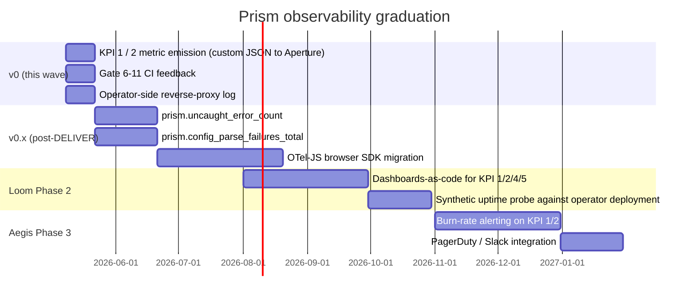

# Prism v0 — Monitoring and alerting

- **Wave**: DEVOPS
- **Author**: `@nw-platform-architect` (Apex, dispatched by Bea)
- **Date**: 2026-05-08
- **Inputs**: `outcome-kpis.md`; `observability-design.md`; pre-resolved
  decision (Loom Phase 2 owns dashboards-as-code; Aegis Phase 3 owns
  alerting-as-code).
- **Companion**: `kpi-instrumentation.md`,
  `platform-architecture.md`, `wave-decisions.md`.

---

## 1. Posture at v0 — minimal, deferred to Loom / Aegis

Prism v0 has no production monitoring or alerting that Kaleidoscope
operates. This is by design:

- **No Kaleidoscope-side production deployment**. Prism is a static
  bundle the operator deploys behind their reverse proxy. Availability
  monitoring is the operator's responsibility, served by their
  existing reverse-proxy access logs and their existing uptime
  monitoring against the operator's domain.
- **No on-call rotation**. Andrea is the project; on-call is "Andrea
  reads the metric stream when convenient".
- **No alerting tier**. Aegis (Phase 3) is the natural home for
  alerting-as-code; v0 emits raw metrics and stops there.

This document records the v0 minimal posture and the post-v0
graduation roadmap so Loom and Aegis inherit a clean handoff.

---

## 2. What v0 monitors

### 2.1 Browser-emitted metrics (production-runtime visibility)

Two metrics flow from operators' browsers through Aperture to the
operator's Prometheus / Mimir backend (per `observability-design.md`):

- `prism.first_chart_latency_ms` — KPI 1 (gauge, per-emit).
- `prism.iterate_latency_ms` — KPI 2 (gauge, per-emit).

The operator can build their own dashboard panels against these
metrics if they wish. Kaleidoscope-side visualisation is deferred
to Loom Phase 2.

### 2.2 CI-fixture metrics (build-time visibility)

Three metrics surface in CI artefact form, not as production telemetry:

- **Bundle size**: `apps/prism/dist/bundle-size-report.json` from
  Gate 8. The 300 KB gzipped ceiling is the gate; the report is
  retained 30 days for trend visibility.
- **Mutation kill rate**: `apps/prism/reports/mutation/` from
  Gate 10. The 100% kill rate is the gate; the report is retained
  30 days.
- **Playwright pass rate** (per engine): `apps/prism/playwright-
  report/` from Gate 7. Retained 30 days.

These are CI artefacts, not production metrics. They live in GitHub
Actions' artefact store and surface in Andrea's terminal when he
runs `gh run view <id>` or downloads the artefact.

---

## 3. What v0 does NOT monitor

| Concern | v0 posture | Graduation |
|---|---|---|
| Prism availability (is the bundle reachable from operator browsers?) | Operator's reverse-proxy log / uptime check | Loom Phase 2: a synthetic Playwright probe against the operator's deployed Prism URL, on a cadence |
| Prism error rate (uncaught JS exceptions in operator browsers) | None — KPI 5 invariant says zero uncaught errors; CI Playwright tests gate this. Production ad-hoc visibility via the operator's existing JS-error-tracking tool (Sentry, Bugsnag) which Prism does not integrate with at v0 | v0.x: a `prism.uncaught_error_count` gauge added to the emitter, joining `first_chart_latency_ms` |
| Prism backend reachability | Implicit — every emit-failed-fetch is a transport-error in the SPA's UI; the operator sees the inline warning banner on every tick | Loom Phase 2 dashboards graph `prism.iterate_latency_ms` failure rate per `backend_label` |
| KPI 3 violations (data fidelity in production) | None — Vitest unit test gates this; no production telemetry | Stays gated at CI; KPI 3 is a structural invariant not subject to operator-side variation |
| KPI 4 violations (URL roundtrip in production) | None — Playwright E2E gates this | Stays gated at CI for the same reason |
| KPI 5 violations (page-stays-usable in production) | Partial — KPI 5's CI fixture covers four named failure modes; production may surface novel failures | v0.x: the `prism.uncaught_error_count` metric named above |
| Bundle size in deployed asset | None — CI gate is the only enforcement | Stays gated at CI; the deployed asset is a copy of the gated artefact |
| `config.json` parse failures in production | Operator sees the calm error UI (ADR-0026 § 5); not telemetry-ed | v0.x: a `prism.config_parse_failures_total` counter |

---

## 4. Alerting tier — v0 has none

Per the project's operator-deployed posture:

| Tier | v0 | Graduation owner | Graduation form |
|---|---|---|---|
| Page (immediate) | none | Aegis Phase 3 | PagerDuty / Opsgenie integration |
| Urgent (15 min) | none | Aegis Phase 3 | Slack `#kaleidoscope-incidents` |
| Warning (1 hour) | none | Aegis Phase 3 | Email / Slack |
| Info | CI artefacts in GitHub Actions UI | stays as-is | n/a |

The CI gates (Gates 6-11) ARE the v0 alerting posture in disguise:
when a gate fails, the workflow run goes red, and a Andrea-checking-
GitHub-on-his-cadence-pattern surfaces it. There is no synchronous
notification; the project's posture is async-by-design.

---

## 5. Operator-side telemetry surface (the operator's responsibility)

What the operator can do with their own infrastructure if they want
production visibility into Prism:

| Question | Source | Mechanism |
|---|---|---|
| Is the bundle being served? | Reverse-proxy access log | `nginx -t` config + log analysis (existing operator tool) |
| Is `/api/v1/query_range` resolving? | Prometheus / Mimir's own metrics + reverse-proxy log | Operator's existing Prometheus monitoring |
| What is KPI 1 / 2 looking like? | The browser-emitted metrics through Aperture | Operator builds a dashboard against `prism.first_chart_latency_ms`; sample PromQL: `histogram_quantile(0.95, rate(prism_first_chart_latency_ms_bucket[5m]))` (when Aperture's `/v1/metrics` ingest path produces histogram-shaped metrics — v0 emits gauges, so the equivalent is `quantile_over_time(0.95, prism_first_chart_latency_ms[5m])`) |
| Are operators hitting auth-fail? | Browser console (operator-side); not telemetry-ed | Operator's existing browser-error tracking (Sentry, Bugsnag); Prism does not integrate at v0 |

The operator-side telemetry surface is intentionally minimal at v0
to keep Prism's own bundle small and the operator's onboarding
trivial.

---

## 6. Graduation roadmap

The roadmap is illustrative — the actual cadence depends on Andrea's
sequencing across Loom and Aegis features. The key invariants:

- Loom Phase 2 inherits the KPI metric stream from Prism v0
  unchanged. No back-propagation needed.
- Aegis Phase 3 inherits the dashboards from Loom unchanged. No
  back-propagation needed.
- Each graduation step is additive; v0's posture remains valid as
  the lower-bound shape.

---

## 7. v0 → Loom handoff annotation

When Loom Phase 2 starts, this v0 handoff annotation is the entry
point:

> **Prism v0 monitoring inputs to Loom**:
>
> - Two browser-emitted metrics (`prism.first_chart_latency_ms`,
>   `prism.iterate_latency_ms`) live in the operator's Prometheus /
>   Mimir backend, forwarded by Aperture from a same-origin
>   `/v1/metrics` POST endpoint.
> - Metric attributes: `backend_label`, `browser`, `page_load`,
>   `iterate_count`, `session_id`.
> - Recommended Loom dashboard panels: p50/p95/p99 over a 7-day
>   rolling window per metric, broken down by `backend_label` and
>   `browser`. Add a panel for "session count" (cardinality of
>   `session_id`) as a usage proxy.
> - Gauge-shaped at v0; histogram-shaped post-OTel-JS migration.
>   Loom's PromQL templates should accommodate either via a feature
>   flag.

---

## 8. v0 → Aegis handoff annotation

When Aegis Phase 3 starts, this v0 handoff annotation is the entry
point:

> **Prism v0 alerting inputs to Aegis**:
>
> - The two KPI metrics above; the SLO targets are KPI 1 < 2 s p95
>   and KPI 2 < 800 ms p95.
> - Recommended burn-rate alerts:
>   - **Fast burn**: KPI 1 p95 > 2 s for 1 hour → page (Aegis-tier
>     "Page").
>   - **Slow burn**: KPI 1 p95 > 2 s for 6 hours OR > 1.5 s for 24
>     hours → ticket (Aegis-tier "Urgent").
>   - **Budget exhausted**: 50% of weekly error budget consumed →
>     warning (Aegis-tier "Warning").
> - The on-call surface and the routing (PagerDuty vs Slack vs email)
>   is Aegis' decision; Prism v0 has no opinion.

---

## 9. Cross-references

- **Browser-emitted metric path**: `observability-design.md` § 3.
- **CI gate artefacts**: `ci-cd-pipeline.md` §§ 3.1-3.6.
- **KPI table and targets**: `outcome-kpis.md` (DISCUSS).
- **No-CI-gate posture (CI is feedback, not enforcement)**:
  `branching-strategy.md`; project memory.
