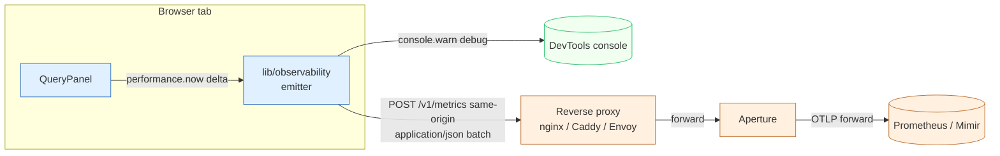
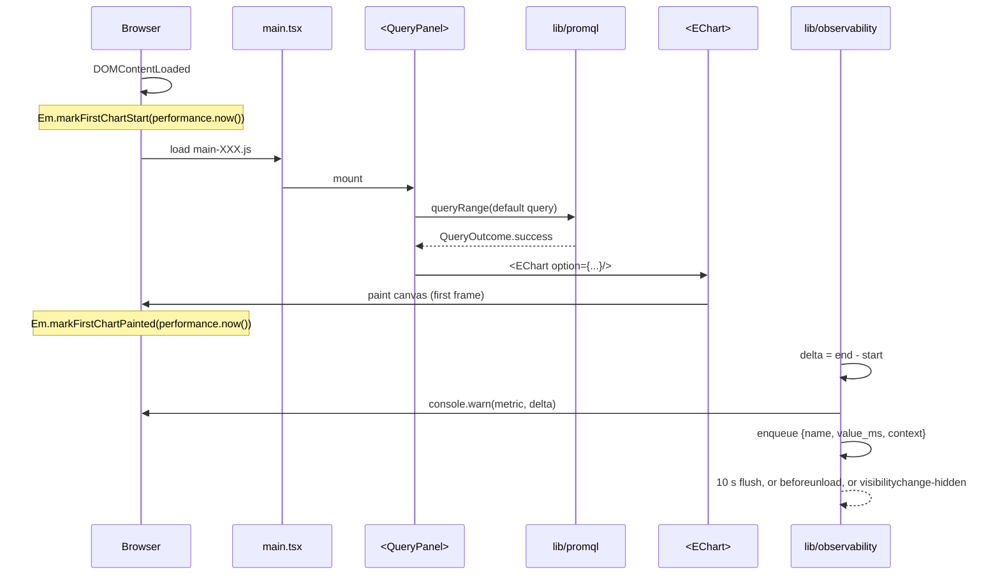

# Prism v0 — Observability design

- **Wave**: DEVOPS
- **Author**: `@nw-platform-architect` (Apex, dispatched by Bea)
- **Date**: 2026-05-08
- **Inputs**: `outcome-kpis.md` § KPI 1, KPI 2 (latency emission);
  ADR-0027 § 5 (CORS posture); pre-resolved decision (no OTel-JS
  browser SDK at v0).
- **Companion**: `kpi-instrumentation.md`, `monitoring-alerting.md`,
  `platform-architecture.md`, `wave-decisions.md`.

---

## 1. Scope of this document

Two browser-emitted metrics carry KPI 1 and KPI 2 from the operator's
running Prism tab back to the operator's Prometheus / Mimir backend
through Aperture:

- `prism.first_chart_latency_ms` — KPI 1: page-open → first chart
  paint.
- `prism.iterate_latency_ms` — KPI 2: Run-press → chart updated.

This document picks the emission path between three candidates,
justifies the choice against the dev-mode-vs-production split, and
pins the contract surface (endpoint, payload shape, batching,
backpressure, redaction) for the crafter.

KPI 3 (data fidelity), KPI 4 (URL roundtrip), and KPI 5 (page-stays-
usable) are not browser-emitted at v0 — they are CI-fixture-asserted
(Vitest unit + Playwright E2E). Detailed mapping in
`kpi-instrumentation.md`.

---

## 2. The three candidate emission paths

The orchestrator's brief enumerates the candidates explicitly:

| # | Path | Dev-mode shape | Production shape |
|---|---|---|---|
| A | Browser → `console.warn` only (debug) | Visible in DevTools | Vanishes; operator cannot see KPI |
| B | Browser → `fetch POST /v1/metrics` on the SPA's host (production) | Vite proxy forwards to Aperture | Reverse proxy forwards to Aperture |
| C | Browser → Aperture directly (cross-origin) | Cross-origin from `:5173` to Aperture's host | Cross-origin from operator's Prism host to Aperture's host |

### 2.1 Path A — `console.warn` only

**Dev mode**: contributor sees the latency in DevTools console.
**Production**: vanishes. No persistent record.

**Verdict**: insufficient as the v0 path. Operators cannot tune
their query workload against KPI 1 / 2 without persistence; the
DISCUSS handoff explicitly names "metrics through Aperture to the
operator's backend" as the spec.

**Reuse note**: Path A IS the v0 debugging shape — `console.warn`
fires alongside the network emission so a contributor running
locally can see the deltas without inspecting the network tab. It
is a **complement** to Path B, not a substitute.

### 2.2 Path B — `fetch POST /v1/metrics` on the SPA's host

The SPA POSTs to a same-origin endpoint. The operator's reverse
proxy forwards `/v1/metrics` to Aperture. Aperture forwards via
OTLP to the operator's Prometheus / Mimir backend (the existing
Phase 1 capability).

**Dev mode**: Vite's `server.proxy` forwards `/v1/metrics` from
`:5173` to a local Aperture (or to a stub `nc -l` for contributors
without a full Kaleidoscope deployment locally). The crafter's
`vite.config.ts` adds the proxy entry; contributors who do not run
Aperture locally see emit-failures in DevTools but the SPA continues
to function (KPI 5: page-stays-usable).

**Production**: same-origin, no CORS preflight. The operator's
reverse-proxy config forwards `/v1/metrics` to Aperture's HTTP
listener (or to whatever Aperture-fronted ingress they prefer).

**Verdict**: **selected**. Same-origin posture matches ADR-0027
§ 5; no CORS headache; reuses the operator's existing reverse proxy
for routing; degradation is graceful (failure to emit does not break
the SPA).

### 2.3 Path C — Browser → Aperture directly (cross-origin)

The SPA POSTs to `https://aperture.acme/v1/metrics` directly.

**Dev mode**: cross-origin from `:5173` to wherever the contributor
is running Aperture; the contributor must configure Aperture's CORS
allow-list to include `localhost:5173`.

**Production**: cross-origin from the operator's Prism host to
Aperture's host; Aperture must serve `Access-Control-Allow-Origin`
headers; preflight on every emit.

**Verdict**: **rejected**. Same reasons ADR-0027 rejects cross-
origin Prometheus: every CORS preflight is an extra round-trip;
auth-proxy fronting Aperture would fail preflights silently;
operator now owns CORS configuration on Aperture's side.

---

## 3. Selected emission path — Path B (same-origin, with Path A as debug complement)

### 3.1 Architecture



### 3.2 Why this path

Justification table:

| Property | Path A only | **Path B (selected)** | Path C |
|---|---|---|---|
| Persists in production | NO | **YES** | YES |
| Dev-mode visibility | YES (console only) | **YES (console + network)** | YES (network only) |
| CORS preflight in production | n/a | **NO** (same-origin) | YES |
| Bundle weight | minimal | **minimal** (50-line emitter) | minimal |
| Operator-owned routing | n/a | **YES** (their reverse proxy) | NO (Aperture owns CORS) |
| Failure mode | nothing breaks | **graceful** (POST fails, SPA continues) | preflight fail = no emit + console errors |
| Reuses Phase 1 Aperture path | NO | **YES** | YES |

Path B is the smallest design that satisfies the persistence
requirement, the CORS-free posture, and the bundle ceiling.

### 3.3 Endpoint contract

The browser POSTs to:

- **Production**: `${window.location.origin}/v1/metrics`
- **Dev mode**: `${window.location.origin}/v1/metrics` — same shape;
  Vite's `server.proxy` forwards it.

The endpoint is **same-origin by construction**. Nothing in
`lib/observability/` reads the configured Aperture URL; the
operator's reverse proxy is the routing surface.

### 3.4 Payload shape

The payload is a small custom JSON shape, NOT OTLP-wire-format. The
v0 emitter writes:

```json
{
  "schema_version": 1,
  "emitted_at_ms": 1714867200000,
  "session_id": "uuid-v4-per-tab",
  "metrics": [
    {
      "name": "prism.first_chart_latency_ms",
      "value_ms": 1247.3,
      "context": {
        "backend_label": "prom-prod",
        "browser": "chromium",
        "page_load": true
      }
    },
    {
      "name": "prism.iterate_latency_ms",
      "value_ms": 412.1,
      "context": {
        "backend_label": "prom-prod",
        "browser": "chromium",
        "iterate_count": 3
      }
    }
  ]
}
```

`backend_label` is sourced from `RuntimeConfig.backend.label` (the
operator-set string from `config.json`); it is the only string
identifying which backend the operator is running against. **No
header values from `backend.headers` are ever included in the
emitter payload** — this is a structural redaction property
mirroring ADR-0027 § 6.

`session_id` is a per-tab UUID v4 generated at SPA mount; it lets
the operator group emit-events per tab without persistent identity.
It is NOT a user identifier; it does NOT survive a tab reload (the
URL roundtrip + a fresh session_id is the postmortem-time pattern).

`schema_version` is an integer that bumps on any breaking payload
change. The receiver (Aperture's `/v1/metrics` ingestion path) reads
the version and routes accordingly. v0 is `schema_version: 1`.

### 3.5 Aperture-side translation

Aperture receives the JSON payload and translates each metric into
an OTLP-encoded `Metric` with:

- `metric.name` = the JSON `name`
- `metric.value` (gauge) = the JSON `value_ms`
- `metric.attributes` = the JSON `context` flattened into OTLP
  attribute key-value pairs

This translation is Aperture's responsibility, not Prism's. Prism
emits a small operator-readable JSON; Aperture re-shapes for the
backend. The emitter's bundle weight stays small (no OTLP encoding
in the browser).

The Aperture ingestion shape is documented as a follow-on for the
Aperture team in `wave-decisions.md > D6 (upstream-changes flag)`.
v0 ships with a stub: if Aperture has no `/v1/metrics` ingest path
yet, the operator's reverse proxy can `return 204` for the endpoint
and the SPA's emit attempts succeed silently (the `console.warn`
in dev mode is the contributor's signal). The persistence path
graduates when Aperture's ingest lands.

### 3.6 Batching, debouncing, and backpressure

The emitter batches:

- Up to 16 metrics per POST.
- A flush every 10 seconds, OR on `beforeunload` (synchronous
  `navigator.sendBeacon` for the in-flight batch), OR on `visibility-
  change → hidden` (same `sendBeacon` shape).
- A maximum of 64 unsent metrics queued; oldest evicted when full.

Backpressure: a failed POST (4xx, 5xx, network error) is logged via
`console.warn` in dev mode and silently dropped in production. The
emitter does NOT retry — KPI 5 (page-stays-usable) requires the
emitter not contend with the operator's incident-time work for
network bandwidth.

### 3.7 Performance budget

The emitter must never contribute > 5% to any of the latency budgets
it measures. Implementation invariant:

- `performance.now()` capture at `DOMContentLoaded` and at first
  `series.setData`: < 0.1 ms each (timer read only).
- POST `/v1/metrics` is fire-and-forget (`fetch(...).catch(() => {})`).
  The `.catch` handler ensures a failed network call never floats
  to the browser as an unhandled rejection (KPI 5 invariant).
- Batch flush via `setInterval(10_000, flush)` is the only timer
  beyond the auto-refresh state machine's. Cleanup on SPA unmount.

### 3.8 Dev-mode-vs-production split

| Aspect | Dev mode | Production |
|---|---|---|
| Endpoint | `localhost:5173/v1/metrics` | operator's origin `/v1/metrics` |
| Routing | Vite `server.proxy` forwards to local Aperture (or stub) | Operator reverse proxy forwards to Aperture |
| CORS | n/a (same-origin via Vite proxy) | n/a (same-origin via reverse proxy) |
| Visibility | `console.warn` + network tab | network tab (production browsers may not have console open) |
| Failure handling | log to console; continue | silent; continue |
| Stub-mode (Aperture not running) | Vite proxy returns 502; emitter swallows | reverse proxy returns 204; emitter no-ops |

The split is invisible to the SPA's emitter code. Vite's
`server.proxy` is the only difference and lives in
`vite.config.ts` (compiled out of the production bundle).

---

## 4. SLO posture

Prism is a static SPA. SLOs in the traditional service sense (availability,
error rate at the service layer) do not directly apply — the operator's
reverse proxy carries the availability surface.

### 4.1 What Prism's "SLO" is at v0

Prism's "SLO equivalent" is the KPI table from DISCUSS:

| KPI | Target | Burn evidence |
|---|---|---|
| KPI 1 first-chart latency p95 | < 2 s | 95th percentile of `prism.first_chart_latency_ms` over a 7-day rolling window (Loom Phase 2 produces this dashboard; v0 produces the raw metric stream) |
| KPI 2 iterate latency p95 | < 800 ms | 95th percentile of `prism.iterate_latency_ms` same window |
| KPI 3 data fidelity | 100% | Vitest unit test gates this; no production telemetry |
| KPI 4 URL roundtrip | 100% | Playwright E2E gates this; no production telemetry |
| KPI 5 page-stays-usable | 100% | Playwright E2E gates this; no production telemetry at v0 (revisit at v0.x: a `prism.uncaught_error_count` metric) |

### 4.2 Why no traditional SLOs at v0

A traditional SLO requires:

- A service the team owns the availability of (Prism is operator-
  hosted; Kaleidoscope owns the bundle, not the runtime).
- A burn-rate alerting path (Aegis Phase 3 owns alerting-as-code; v0
  emits raw metrics, defers alerting).
- An on-call rotation (Andrea is the project; on-call is "Andrea
  reads the metric").

The Loom v0 dashboard (Phase 2) is the natural home for SLO-style
visualisation; Aegis (Phase 3) owns the alerting evolution.
`monitoring-alerting.md` documents the v0 → Loom → Aegis graduation.

---

## 5. Three pillars of observability — Prism v0 mapping

| Pillar | Prism v0 instance | Forwarder | Backend |
|---|---|---|---|
| **Metrics** | `prism.first_chart_latency_ms`, `prism.iterate_latency_ms` (browser-emitted) | Aperture (translation from JSON to OTLP) | Prometheus / Mimir |
| **Logs** | Browser `console.warn` only (no production log shipping at v0); Slice 03 error states are operator-visible in the UI | n/a | n/a (Loom Phase 2 may add a browser-error log path) |
| **Traces** | None at v0. Each emit is a single gauge value, not a span | n/a | n/a (revisit at v0.x if multi-step user-flow tracing matters) |

The minimal-three-pillars posture matches the bundle gate (300 KB)
and the v0 emit-but-do-not-trace decision (no OTel-JS browser SDK).

---

## 6. Earned-trust three-layer posture

| Element | Subtype check | Structural check | Behavioural check |
|---|---|---|---|
| **Browser-emitted metric payload** | TS type for the payload struct (`MetricBatch`); no `any` | Vitest test asserts no `Authorization` header value from `lib/promql` appears in any emitter payload (parallel to ADR-0027 § 6) | Playwright Slice 01 asserts a POST to `/v1/metrics` happens within 100 ms of first chart paint |
| **Same-origin invariant** | n/a | grep CI step asserts no absolute URLs in the emitter (only `/v1/metrics` relative paths) | Slice 01 Playwright observes no CORS preflight in network log |
| **Failure isolation** | Promise-typed return + `.catch(() => {})` discipline | ESLint rule (or hand-rolled assertion) catches any uncaught Promise from emitter code | KPI 5 Playwright test injects a 502 on `/v1/metrics` and asserts the SPA continues to render |
| **Backpressure (queue cap)** | TS type for the queue with a `maxQueueSize` const | Vitest unit test exercises the eviction policy | n/a (queue cap is observable only at high load; v0 does not exercise it) |

---

## 7. KPI 1 / KPI 2 capture sequence

### 7.1 KPI 1 — first-chart-rendered latency



Emit point: when the first ECharts canvas paint happens after a
successful fetch on initial page load. Two markers:

- **Start**: `DOMContentLoaded` event — the earliest reliable timestamp.
- **End**: the React `useEffect` callback inside `<EChart>` that
  fires immediately after `chart.setOption(option, { notMerge: true })`
  on first mount with a successful outcome. The next animation frame
  is the chart paint; the timer captures within ~16 ms of the actual
  paint, which is inside the KPI 1 measurement noise budget.

If the page loads with no query (`q=` empty), no fetch is issued and
no first-chart event fires. The metric is not emitted in that case;
the 5-run average ignores empty-query loads.

### 7.2 KPI 2 — iterate latency

Emit point: when the operator presses Run (or auto-refresh tick
fires) AND a `setOption` call subsequently lands. Two markers:

- **Start**: the synthetic event handler on the Run button (or the
  auto-refresh tick effect issuing the fetch).
- **End**: the same `useEffect` callback as KPI 1 — but a non-first-
  mount call.

The two metrics share the same end-marker; they differ in the
start-marker and a `page_load: true | false` flag in `context`.

---

## 8. Open items routed forward

To **Aperture's team** (in practice, Andrea wearing the Aperture
DEVOPS hat at v0.x):

- Implement Aperture's `/v1/metrics` JSON ingestion path. The
  contract is § 3.4 above. The translation to OTLP is Aperture's
  responsibility.

To **Loom (Phase 2)**:

- Build the dashboard panels for `prism.first_chart_latency_ms` and
  `prism.iterate_latency_ms`. Recommended panels: p50 / p95 / p99
  over a 7-day rolling window, broken down by `backend_label` and
  `browser`.

To **Aegis (Phase 3)**:

- Define alerting on the KPI metrics (e.g. burn-rate alert on KPI 1
  exceeding 2 s for > 1% of session_ids in a 1-hour window).
  v0's `monitoring-alerting.md` documents the graduation path; Aegis
  is the owner.

---

## 9. Cross-references

- **CORS posture**: ADR-0027 § 5.
- **Header redaction property**: ADR-0027 § 6 (Prism's emitter
  inherits the same invariant).
- **KPI fixture mapping (CI vs production)**: `kpi-instrumentation.md`.
- **Aperture Phase 1 forwarding capability**: existing crate at
  `crates/aperture/`; `/v1/metrics` ingest is a v0.x extension.
- **Bundle ceiling**: 300 KB gzipped, enforced by Gate 8.
