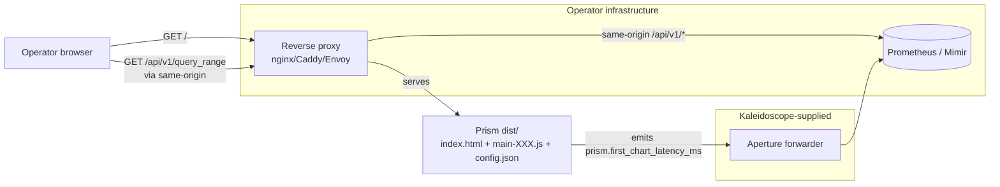
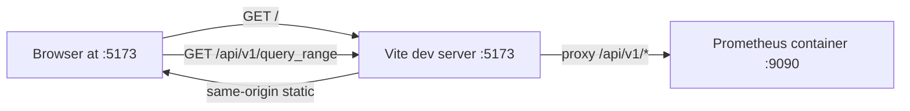

# Prism v0 — Platform architecture

- **Wave**: DEVOPS
- **Author**: `@nw-platform-architect` (Apex, dispatched by Bea)
- **Date**: 2026-05-08
- **Inputs**: ADR-0026 to ADR-0032 (DESIGN); `outcome-kpis.md` (DISCUSS,
  parallel-handoff posture); existing CI workflow
  (`.github/workflows/ci.yml`); pre-commit / pre-push hooks at
  `scripts/hooks/`.
- **Companion documents**: `environments.yaml`, `ci-cd-pipeline.md`,
  `observability-design.md`, `monitoring-alerting.md`,
  `branching-strategy.md`, `kpi-instrumentation.md`,
  `wave-decisions.md`.

---

## 1. Deployment shape — static SPA behind operator's reverse proxy

Prism v0 is **not** a service Kaleidoscope deploys. It is a static
asset bundle that drops behind any operator-supplied reverse proxy
(nginx, Caddy, Envoy, Apache HTTPd). The operator's existing
infrastructure does the load balancing, the TLS termination, the
same-origin `/api/v1/*` forwarding to Prometheus / Mimir, and the
log aggregation.



The fact that Prism is "just a bundle" is the smallest possible operator
surprise. Same observation Grafana's frontend, Prometheus' own UI, and
every other Prometheus-fronted SPA reaches: the operator already has
a reverse proxy; the SPA reuses it.

### 1.1 What the operator deploys

1. The output of `pnpm --filter prism build` (a folder named `dist/`).
2. A `config.json` adjacent to `index.html` carrying `backend.url`,
   `backend.label`, optional `backend.headers`.
3. A reverse-proxy config that:
   - Serves `/` (and `/assets/*`) from the bundle.
   - Forwards `/api/v1/*` to the Prometheus / Mimir backend on the
     same origin.
   - Optionally forwards `/v1/traces`, `/v1/metrics`, `/v1/logs` to
     Aperture (for the KPI 1 / KPI 2 metric emission, see
     `observability-design.md`).

### 1.2 What the operator does NOT deploy

- A Node runtime (Prism is client-side only, no SSR).
- A Docker container of Prism (a static bundle is the artefact).
- A Kubernetes manifest for Prism (deferred to Loom / Aegis when
  they introduce dashboards-as-code in Phase 2).
- A Helm chart (same).
- A separate TLS certificate (same-origin posture; the operator's
  existing Prometheus cert covers it).

### 1.3 Why no container orchestration at v0

The pre-resolved decision (locked at DESIGN, mirrored in
`wave-decisions.md > D1`):

> **Container orchestration: NONE at v0.** Prism is a static SPA
> built by `pnpm build` to `dist/`. The operator's reverse proxy
> serves it directly. No Docker, no Kubernetes manifests, no Helm
> chart. Phase-2-onwards manifests deferred to Loom / Aegis.

Three rejected alternatives:

| Alternative | Rejected because |
|---|---|
| `nginx:alpine + COPY dist /` Docker image shipped by Kaleidoscope | Adds a release artefact whose only content is what the operator already has on disk after `pnpm build`. Five-line Dockerfile is documentation, not a deliverable. |
| Kubernetes manifest set (Deployment + Service + Ingress) | Operators run Prism behind their existing reverse proxy. K8s manifests would force the operator to choose between their reverse proxy and our manifest's Ingress. |
| Helm chart | Same as above; chart values would re-derive `config.json`'s shape. The single source of truth (`config.json`) is operator-deployed. |

Loom v0 (Phase 2) introduces dashboards-as-code, which is the natural
home for K8s manifests; Aegis (Phase 3) introduces alerting-as-code
and inherits the same posture.

---

## 2. Dev-mode posture — Vite dev server + local Prometheus container

A contributor working on Prism runs:

```bash
pnpm --filter prism dev   # starts Vite on http://localhost:5173
docker run --rm -d \
  --name prism-prom-fixture \
  -p 9090:9090 \
  -v "$(pwd)/apps/prism/e2e/fixtures/prometheus.yml:/etc/prometheus/prometheus.yml" \
  prom/prometheus@sha256:<digest>
```

Vite's `server.proxy` block forwards `/api/v1/*` from `:5173` to
`localhost:9090`, which the Prometheus container answers. The
contributor's browser sees a single origin (Vite's `:5173`); CORS
preflights never happen (per ADR-0027 § 5).



The dev mode mirrors the production same-origin posture. The dev
mode's Vite proxy ships zero code to production; it lives in
`apps/prism/vite.config.ts` only.

### 2.1 Local Prometheus seeded data

The fixture seeds three metrics:

- `up` — the canonical "is Prometheus alive" metric. Slice 01's
  walking-skeleton query.
- `prism_test_high_cardinality` — ten distinct series, used for the
  legend-rendering check and the KPI 3 multi-series byte-equality
  test.
- `prism_test_nan_bearing` — the five-point fixture for the KPI 3
  unit test. NaN-bearing on purpose so the no-interpolation invariant
  is observable.

The fixture's `prometheus.yml` declares a 1-second scrape interval
against itself for 24 hours of retention; the seeded metrics
populate within seconds of container start.

---

## 3. Prism-emitted KPI metrics flowing to Aperture

KPI 1 (first-chart-rendered latency) and KPI 2 (query-to-chart-update
latency) are measured at the browser. The emission path:

```mermaid
flowchart LR
    Browser[Browser running Prism]
    Browser -->|performance.now() delta| Emitter[lib/observability<br/>tracing-shaped emitter]
    Emitter -->|fetch POST /v1/metrics<br/>same-origin| RP[Reverse proxy]
    RP -->|forward| Aperture[Aperture]
    Aperture -->|OTLP forward| Backend[(Prometheus / Mimir)]
```

The browser-side emitter is intentionally minimal at v0: a small
custom function that batches `performance.now()` deltas and POSTs
them via `fetch` to a same-origin `/v1/metrics` endpoint that the
operator's reverse proxy forwards to Aperture. Detailed contract in
`observability-design.md` and `kpi-instrumentation.md`.

The pre-resolved decision (mirrored in `wave-decisions.md > D5`):

> **Observability**: OpenTelemetry. Prism emits its own diagnostics
> through `tracing::warn!`-shaped browser-side instrumentation that
> flows through Aperture to the operator's backend. v0 does NOT
> introduce a new browser-side telemetry library; it uses
> `console.warn` plus a small custom emitter.

Why no OTel-JS browser SDK at v0:

- The browser SDK adds ~30-40 KB to the bundle (gzipped). The 300 KB
  bundle gate has no headroom (ECharts already takes ~200 KB,
  React + Router ~60 KB, Prism source ~30-40 KB).
- The KPI 1 / 2 emission is two metric names with one numeric field
  each. A 50-line custom emitter covers it. The OTel-JS browser SDK
  is calibrated for richer telemetry (traces with spans, structured
  log records); v0 needs none of that.
- The OTLP wire shape is well-defined; the custom emitter writes the
  same JSON the OTel SDK would, just with less ceremony. Migration
  to the SDK at v0.x or v1 is a swap without changing the receiver.

KPI 3, 4, 5 are CI-fixture-measured rather than browser-emitted (KPI
3 is a Vitest unit test, KPI 4 / 5 are Playwright E2E). Detailed
mapping in `kpi-instrumentation.md`.

---

## 4. Earned-trust three-layer posture

Per the orchestrator's brief, every load-bearing element is named at
each enforcement layer.

| Element | Subtype check (type system) | Structural check (CI / build) | Behavioural check (runtime / integration) |
|---|---|---|---|
| **Static bundle** (deployment artefact) | n/a — bundle is build output | `pnpm --filter prism build` succeeds; `dist/` artefact present | Slice 01 Playwright loads the bundle and asserts `index.html` and `main-*.js` resolve |
| **Same-origin posture** | `lib/promql/` types: backend URL is a string, no `Origin` header set in code | grep CI step asserting no `mode: 'no-cors'` or `credentials: 'include'` in `apps/prism/src/lib/promql/` | Slice 01 Playwright issues a real fetch against the local Prometheus and observes no CORS preflight in the network log |
| **Vite proxy (dev-only)** | n/a — config-time concern | grep CI step asserting `server.proxy` does not appear in built `dist/` JS | not applicable (dev-only; no production probe) |
| **Browser-emitted KPI metric** | TS type for the emitter payload (`{ name, value_ms, timestamp }`) | unit test asserts no header values from `lib/promql` leak into emitter payload (parallel to ADR-0027 § 6) | Playwright test reads the network log and asserts a POST to `/v1/metrics` happens within 100 ms of the chart render |
| **`config.json` parse** | `RuntimeConfig` typed; parse rejects on missing `backend.url` | `lib/config/loader.ts` is exhaustively tested via Vitest; parse failures are typed | Slice 01 acceptance: composition root refuses to mount on `ConfigError` |
| **Local Prometheus fixture** | n/a | digest-pinned image in `playwright.config.ts > globalSetup`; CI fails if pull fails | Playwright tests against the real container in `globalSetup`; an unreachable container fails Slice 01 |
| **Bundle size budget** | n/a | Gate 8 (`check-bundle-size.js`) asserts gzipped ≤ 300 KB | n/a (build-time concern only) |

---

## 5. Existing-infrastructure reuse analysis

Prism v0 reuses every Kaleidoscope-supplied piece it can. Apex's
existing-infrastructure-first principle (principle 2) requires this
be itemised.

| Existing piece | Reused for Prism | Justification |
|---|---|---|
| `.github/workflows/ci.yml` (9 Rust gates) | YES — Prism gates 6-11 added as parallel jobs alongside, NOT in a separate workflow file | One CI ground-truth surface; one cancel-in-progress concurrency group; one set of branch-protection assumptions (none, per the trunk-based memory). |
| `scripts/hooks/pre-commit` (Rust gates) | YES — TS gates appended conditionally on `apps/prism/package.json` presence | Single hook script; Rust contributors pay zero cost when only Rust changes; full-stack contributors pay both costs locally. |
| `scripts/hooks/pre-push` | YES — kept Rust-only at v0; nightly-bound TS equivalents (semver / API-surface) do not exist for SPAs | The TS ecosystem has no analogue to `cargo public-api` (an SPA does not have a public API surface); `pre-push` stays as-is. |
| `cargo deny` posture | NO — `pnpm audit` is a separate tool | `cargo deny`'s `deny.toml` does not govern npm dependencies (ADR-0031 § 10). Prism's Gate 9 covers lint+format+licence-header; npm-audit is informational at v0, not a gate. |
| Aperture's `prom/prometheus` test fixture pattern (Strategy C) | YES — Prism's contract test (Gate 11) and Playwright fixture (Gate 7) both use `prom/prometheus` containers | Aperture proved the pattern (real local backend in CI). Mirroring it for Prism keeps the project's CI vocabulary stable. |
| Mutation testing per crate (Aperture / Spark / Sieve / Codex) | YES — Gate 10 (StrykerJS) mirrors the pattern with `--in-diff origin/main` baseline cascade and 30-min timeout | Per-feature 100% kill rate per ADR-0005 Gate 5; the cascade behaviour matches the existing gate-5-mutants-* jobs. |
| `Cargo.lock` / `--locked` flag posture | YES — `pnpm install --frozen-lockfile` in every CI invocation | Mirror of the same discipline (no transitive drift in CI). |
| Aperture's "real local fixture" Strategy C | YES — Playwright `globalSetup` starts the real Prometheus container, no `nock`/MSW stubs in E2E | Same-origin posture wants a real backend; mocking the backend at the HTTP layer would hide the contract drift Gate 11 catches. |

No new third-party CI vendors are introduced. No new container
registries. No new artefact stores beyond GitHub Actions' built-in
artefact store (already used by the `mutants-out-*` and
`verdict-counts` artefacts).

### 5.1 What is genuinely new

| New piece | Justification (no existing alternative) |
|---|---|
| StrykerJS as the JS-ecosystem mutation runner | `cargo-mutants` does not run on TypeScript. StrykerJS is the JS analogue and the only mature option. (Mutation tools for JS/TS: Stryker, Jester. Stryker has the larger user base and the better Vitest integration.) |
| Playwright as the browser E2E runner | `cargo test` runs Rust tests; the SPA needs a real browser engine. Playwright is the JS-ecosystem state-of-the-art (faster than Cypress in headless CI, supports Firefox + WebKit unlike Cypress 12-, native WebDriver-BiDi on Chromium). |
| Vitest as the TS unit-test runner | `cargo test` runs Rust tests; the SPA needs a TS unit runner. Vitest is the Vite-native test runner and the project's pre-locked decision (ADR-0031 § 8). |
| Browser-side custom metric emitter | OTel-JS browser SDK adds 30-40 KB; the bundle gate has no headroom. The custom emitter is 50 lines of TypeScript. |

Each new piece is justified against "no existing alternative meets
the requirement" per principle 2.

---

## 6. Constraint impact analysis

| Constraint | Source | % delivery affected | Priority |
|---|---|---|---|
| Bundle size 300 KB gzipped | DISCUSS guardrail | 100% (every build) | HIGH |
| First-chart latency < 2 s p95 | KPI 1 | 100% (every CI run measures) | HIGH |
| Iterate latency < 800 ms p95 | KPI 2 | 100% (every CI run measures) | HIGH |
| Browser matrix (Chrome / Firefox / Safari latest 2) | DISCUSS guardrail | 100% (every E2E run) | HIGH |
| 100% mutation kill rate | ADR-0005 Gate 5 | 100% (every PR / push) | HIGH |
| No CORS preflights at production | ADR-0027 § 5 | 0% (CI uses Vite proxy / Playwright same-origin) but 100% production-relevant | MEDIUM (structural) |
| Header redaction structural | ADR-0027 § 6 | unit-test enforced (Vitest); 0% pipeline impact beyond test time | LOW (single test) |

### 6.1 Constraint-free baseline

- Maximum theoretical deployment frequency: **on every push to main**
  (the project's trunk-based posture; CI is feedback, not a gate).
- Components that can proceed without constraints: 100% (no CORS, no
  K8s, no orchestration, no auth proxy negotiation).
- Quick wins available now: pre-commit hook extension (Gate 9 mirror)
  is implementable at Slice 01.

### 6.2 Decision rules

- Constraint affects > 50% of delivery: **bundle size** and **KPIs 1
  / 2** are primary focus; both are already structurally enforced
  via Gate 8 and Gate 7.
- Constraint affects 20-50% of delivery: **browser matrix** —
  Playwright covers all three engines per CI run.
- Constraint affects < 20% of delivery: **header redaction**, **no
  CORS** — single-test or grep-based enforcement.

### 6.3 Recommendation

Primary focus: KPI 1 / 2 latency budget (Gate 7's CI fixture is the
load-bearing measurement) and the bundle-size gate (Gate 8 is the
structural enforcement). Secondary focus: KPI 3 byte-equality
(Gate 6 Vitest test) and KPI 4 / 5 Playwright assertions. Tertiary
focus: contract testing (Gate 11) which protects against backend
drift but rarely fires.

---

## 7. DORA metrics posture

Prism v0 inherits the project's existing DORA posture (per memory:
"CI is feedback, not a gate"; pure trunk-based; fix-forward on
regressions). The Prism gates extend the existing measurement
surface.

| DORA metric | Current Kaleidoscope state (Rust crates) | Prism v0 expected state |
|---|---|---|
| **Deployment frequency** | Multiple times/day (Elite) — Andrea pushes to main directly | Same. Static-bundle deploy is `pnpm build` plus `cp dist/* /var/www/prism/`; the operator does this on their cadence. |
| **Lead time for changes** | < 1 hour (Elite) — local pre-commit + push to main | Same. Adding TS gates locally is < 30 s for Rust-only changes (gated by `apps/prism/package.json` presence). |
| **Change failure rate** | Low (Elite/High) — fix-forward absorbs flakes | Expected same. Mutation gate (Gate 10) catches structural drift; bundle gate (Gate 8) catches size regressions. |
| **Time to restore** | < 1 hour (Elite) — fix-forward via revert-or-correction commit | Same. Static bundle: revert is `git revert <SHA> && pnpm build && deploy`. |

No DORA regression expected. The Prism gates run in parallel with
the Rust gates; total wall-clock is bounded by the slower group
(typically Rust given Gate 5 mutation testing across five crates).

---

## 8. Cross-references

- **Workspace structure**: ADR-0031.
- **Pre-commit hook extension**: ADR-0031 § 8; specified in
  `ci-cd-pipeline.md > Pre-commit hook contract`.
- **CI workflow extension**: ADR-0031 § 9; specified in
  `ci-cd-pipeline.md > CI workflow YAML contract`.
- **HTTP client + CORS posture**: ADR-0027 § 5.
- **KPI metric emission**: `observability-design.md`,
  `kpi-instrumentation.md`.
- **Branching discipline**: `branching-strategy.md`.
- **Production-readiness defer to Loom / Aegis**: ADR-0031,
  `monitoring-alerting.md`.
