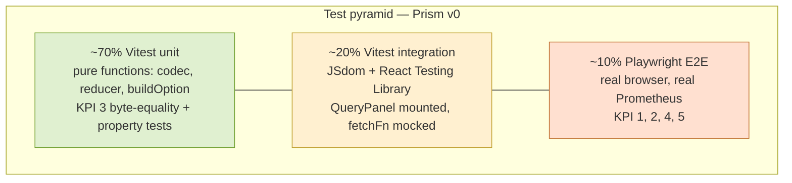
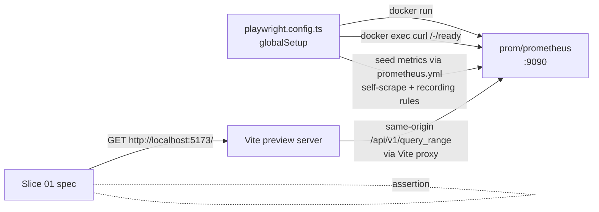
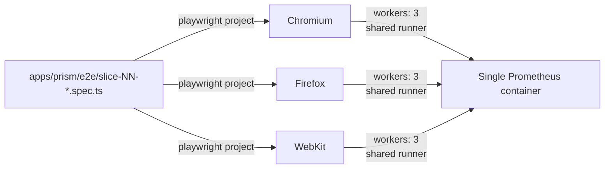

# Prism v0 — Test strategy

- **Wave**: DISTILL
- **Author**: `@nw-acceptance-designer` (Scholar, dispatched by Bea)
- **Date**: 2026-05-08
- **Inputs**: ADRs 0026-0032; `component-design.md`;
  `outcome-kpis.md`; `kpi-instrumentation.md`; `ci-cd-pipeline.md`;
  the six slice briefs.
- **Companion**: `wave-decisions.md`, `test-mapping.md`.

---

## 1. Pyramid shape (DISTILL contract)



Numerical target by test count (across all six slices and the three
cross-cutting invariants):

| Layer | Approx. count | KPIs anchored | Runtime footprint |
|---|---|---|---|
| Vitest unit (pure functions) | ~70 | KPI 3 (fidelity), KPI 4 (codec property) | <2s per file, 0 external deps |
| Vitest integration (JSdom + RTL) | ~20 | KPI 5 (some renders) | <5s per file, fetchFn mocked |
| Playwright E2E (real browser + real Prometheus) | ~10 | KPI 1, KPI 2, KPI 4 (cross-tab), KPI 5 (cross-mode) | 30-90s per spec on CI runner |

The bulk is unit because the three modules carrying the v0
invariants (codec, reducer, option builder) are pure functions
(ADR-0028, ADR-0029, ADR-0030 all explicitly call this out). Pure-
function tests run fastest, mutate-test-cleanest, and pin the
load-bearing behaviours.

The integration layer (~20%) covers `<QueryPanel>` mounted in JSdom
with `fetchFn` mocked at the architectural seam. This catches:
* "the QueryPanel reads URL state correctly on mount"
* "the QueryPanel writes URL state on every state-affecting picker
  change"
* "the parse-error rendering arm wires the verbatim backend.error to
  the inline banner"
* "the empty-state rendering arm produces the calm message, NOT a
  warning banner"

The E2E layer (~10%) covers what only a real browser can prove:
* "the URL roundtrips byte-for-byte across two browser tabs against
  the same Prometheus" (KPI 4)
* "the bundle paints a chart in under 2 s p95 over 20 runs" (KPI 1)
* "iterate-press paints in under 800 ms p95 over 20 runs" (KPI 2)
* "switching the visibility of the tab pauses and resumes the auto-
  refresh tick"
* "axe-core finds zero AA violations on the cumulative Slices 01-05
  surface" (Slice 06)

---

## 2. Three-layer Earned-Trust enforcement (per scenario)

Mandate from the orchestrator brief: every load-bearing scenario
names a subtype check (TS catches at compile time), a structural
check (mutation testing kills it; CI fails it), and a behavioural
check (runtime / E2E test fires the user-observable behaviour).
Cheaper scenarios may live in one or two layers.

The mapping is:

| Scenario kind | Subtype | Structural | Behavioural |
|---|---|---|---|
| Codec roundtrip | `UrlState` discriminated union types every arm | Vitest property test | (subsumed; codec is pure) |
| Auto-refresh transition | `AutoRefreshState` is a tagged union; `never` exhaustive switch | Vitest test of every transition | Playwright tab-visibility pause/resume |
| ECharts option fidelity | `EChartsOption` typed | Vitest byte-equality on `buildOption` output | Playwright visual-regression baseline (Slice 06) |
| Error rendering arm | `QueryOutcome.kind` exhaustive switch | Vitest mounts QueryPanel with mocked `fetchFn`, asserts the rendered banner / empty / chart | Playwright drives the failure mode against a real browser |
| URL roundtrip | `URLSearchParams` typed; `Result<UrlState, UrlParseError>` | Vitest `decode(encode(state)) === state` | Playwright cross-tab byte-equality on rendered series JSON |
| Bundle size | n/a | Gate 8 ceiling check | n/a (build artefact) |
| Accessibility | n/a | axe-core integration in Playwright | manual screen-reader audit (operator-side) |
| First-chart latency | n/a | Gate 7 fixture asserts p95 across 20 runs | browser-emitted gauge (production) |

Every load-bearing concern lands in at least two layers; KPIs 3, 4, 5
land in all three.

---

## 3. Mocking discipline (D2)

Mock at the seam only:

| Module | Seam | What we mock |
|---|---|---|
| `lib/promql/queryRange` | `QueryRangeContext.fetchFn?: typeof fetch` | a function returning the four canonical `Response` shapes from the JSON fixtures |
| `lib/auto-refresh` reducer | the reducer is pure; nothing to mock | (n/a) |
| `lib/auto-refresh` effects runner | `Scheduler.{schedule, cancel}` | a fake scheduler with a controllable clock |
| `lib/config/loader` | `loadConfig` accepts `fetchFn?` | same shape as `queryRange` |
| `lib/echarts/EChart` | the wrapper is exercised against the real ECharts library in JSdom; if `node-canvas` is missing in CI, the test migrates to Playwright | (n/a — see also D2) |

Tests NEVER mock `react`, `react-dom`, `react-router-dom`,
`history.replaceState`, `window.location`, `URLSearchParams`,
`document.addEventListener`, or `window.matchMedia`. The seam is the
adapter; deeper mocks would be Testing Theater (mandate 1).

---

## 4. Strategy C "real local" Prometheus posture (D1)

Walking skeleton's Prometheus is real. `playwright.config.ts >
globalSetup` starts a `prom/prometheus@<digest>` container; specs
fetch through it.



The container's lifecycle is workflow-scoped (one per Playwright run,
shared across the three browser projects). Vitest's contract test
(Gate 11) starts its own container as a `services:` block (different
job).

The fidelity-anchor fixture (`promql-fidelity-anchor.json`) is NOT
sourced from this container — its NaN distribution is hand-authored
(D15).

---

## 5. Mutation evidence — slice-by-slice baseline failure pattern (D6)

Stryker's `--in-diff` posture mirrors cargo-mutants' baseline cascade
from ADR-0005 Gate 5. Per-slice DELIVER cycle:

```mermaid
sequenceDiagram
    participant S as DISTILL output
    participant DS01 as DELIVER Slice 01
    participant DS02 as DELIVER Slice 02
    participant DS06 as DELIVER Slice 06
    participant Stryker as Gate 10 (--in-diff)

    S->>DS01: 12 test files, all RED for slices ≥ 01
    DS01->>Stryker: Slice 01 diff: implementation + 1 RED-to-GREEN
    Stryker-->>DS01: 100% kill rate on slice 01 diff
    DS01->>DS02: slice 02..06 still RED (not in diff)
    DS02->>Stryker: Slice 02 diff: implementation + 1 RED-to-GREEN
    Stryker-->>DS02: 100% kill rate on slice 02 diff
    DS06->>Stryker: Slice 06 diff: a11y + final remediations
    Stryker-->>DS06: 100% kill rate; full-suite green
```

A FULL Stryker run (no `--since`) would fail until Slice 06 lands
because the not-yet-implemented slices' tests do not kill mutants
(they throw before reaching assertions). The in-diff posture
constrains the gate to the surface that matters.

This pattern is identical to Aperture / Spark / Sieve / Codex; Andrea
hit it on every prior feature and resolved it the same way.

---

## 6. Mutation-evidence anchors — per-slice surface

Each slice's test file pins specific mutation surfaces:

| Slice | Mutation surface (StrykerJS targets) | Anchor test file |
|---|---|---|
| 01 | `lib/promql/queryRange` classification (5 arms × `if` statements); `lib/url-state/codec` (encode/decode); `lib/echarts/buildOption` (option fields) | `slice-01-walking-skeleton.test.ts`, `invariant-fidelity.test.ts` |
| 02 | `lib/url-state/codec` relative-range decode/encode; QueryPanel range-picker effect | `slice-02-time-range-and-relative-presets.test.ts` |
| 03 | `lib/promql/queryRange` 400-with-status-error special case; QueryPanel error-rendering arm dispatch | `slice-03-error-and-empty-states.test.ts` |
| 04 | `lib/auto-refresh/reduce` transitions (every state × every event); backoff curve (5/10/20/30 capped); AbortController integration | `slice-04-auto-refresh.test.ts` |
| 05 | `lib/url-state/codec` absolute-range decode/encode; from-before-to validation; refresh-disabled invariant on absolute | `slice-05-absolute-time-range-and-permalink.test.ts` |
| 06 | `lib/echarts/palette` swap; `buildOption` a11y fields; reduced-motion gating | `slice-06-accessibility.spec.ts` (E2E + axe-core) |

Stryker's HTML report at `apps/prism/reports/mutation/` shows per-file
killed/survived/timeout counts; surviving mutants point the crafter
at missing tests, slice-by-slice.

---

## 7. Fixture freshness policy

Three of the four KPI fixtures (`promql-success.json`,
`promql-parse-error.json`, `promql-empty.json`) are RECORDED against
a real Prometheus and may drift if Prometheus ever changes the wire
shape. The fixture-freshness ritual:

1. **Trigger**: a Prometheus version bump in
   `environments.yaml > external_fixtures > prometheus_container`.
2. **Procedure**: re-record the three fixtures from a real Prometheus
   container running the new version, on the same query / range that
   produced the original fixture (the queries are documented inline in
   each fixture's `_recording_provenance` field — D-quality
   self-documentation).
3. **Diff review**: a contributor reviews the diff. If the wire shape
   changed, the contract-test gate (Gate 11) catches it and routes to
   a coordinated DESIGN revisit.
4. **Hand-authored fixture untouched**: `promql-fidelity-anchor.json`
   is hand-authored; do not regenerate (D15).

This is the same posture Aperture / Sieve / Codex use for their
recorded fixtures.

---

## 8. Browser engine coverage (D14)



`playwright.config.ts` declares three projects. A single spec file
runs three times, once per engine. `environments.yaml > runtime-
matrix > parallel_execution_inside_one_job > workers: 3` keeps the
matrix on a single CI runner. WebKit covers Safari for cross-browser
purposes; the Slice 06 manual a11y audit on a real Mac+Safari is the
operator-side spot check.

---

## 9. Test-file map (the 12 + 3 + 4 hand-off)

```
apps/prism/
├── tests/
│   ├── slice-01-walking-skeleton.test.ts            -- US-PR-01, US-PR-03, US-PR-04, US-PR-06; KPI 3 (fidelity unit), KPI 4 (codec property)
│   ├── slice-02-time-range-and-relative-presets.test.ts
│   ├── slice-03-error-and-empty-states.test.ts      -- KPI 5 (rendering arms)
│   ├── slice-04-auto-refresh.test.ts                -- ADR-0029 reducer
│   ├── slice-05-absolute-time-range-and-permalink.test.ts
│   ├── invariant-public-api.test.ts                 -- compile-time public type smoke
│   ├── invariant-licence-headers.test.ts            -- AGPL header runtime audit
│   ├── invariant-fidelity.test.ts                   -- KPI 3 byte-equality
│   └── fixtures/
│       ├── promql-success.json
│       ├── promql-parse-error.json
│       ├── promql-empty.json
│       └── promql-fidelity-anchor.json              -- KPI 3 NaN-bearing anchor
└── e2e/
    ├── slice-01-walking-skeleton.spec.ts            -- KPI 1 (latency p95 < 2s)
    ├── slice-02-time-range-and-relative-presets.spec.ts -- KPI 4 (relative cross-tab)
    ├── slice-03-error-and-empty-states.spec.ts      -- KPI 5 (cross-mode failures)
    ├── slice-04-auto-refresh.spec.ts                -- tab visibility, AbortController
    ├── slice-05-absolute-time-range-and-permalink.spec.ts -- KPI 4 (absolute cross-tab)
    └── slice-06-accessibility.spec.ts               -- US-PR-07; axe-core
```

Total: 9 Vitest files (5 slice + 3 invariant + 1 fixtures dir), 6
Playwright specs, 4 fixture JSONs.

---

## 10. RED-state hand-off contract (D7, D8)

At DISTILL hand-off, every Vitest test body that exercises a not-yet-
implemented module throws:

```ts
throw new Error('UNIMPLEMENTED — Slice 03 DELIVER');
```

Every test file imports the public types declared in ADR-0026's
module catalogue. Tests do not import internal helpers — only the
public surface (`queryRange`, `decode`, `encode`, `buildOption`,
`reduce`, `loadConfig`).

The crafter's first DELIVER step (Slice 01) writes stub-export files
under `apps/prism/src/` for each module. Stubs throw the same
`'UNIMPLEMENTED — Slice NN DELIVER'` marker. TypeScript's strict mode
is therefore satisfied (the imports resolve to typed function
signatures), but every test fails on the first call.

The crafter then turns RED into GREEN one slice at a time. Each
slice's commit:
1. Replaces stub bodies with real implementation for the slice's
   modules.
2. Removes the slice-N RED-marker throws from the slice-N test
   bodies.
3. Runs `pnpm test`; the slice-N tests pass; slice-(N+1) onwards still
   RED.

---

## 11. Cross-references

- **DESIGN ADRs**: 0026 (component layout), 0027 (HTTP client),
  0028 (URL state codec), 0029 (auto-refresh reducer), 0030
  (ECharts integration), 0031 (workspace tooling), 0032 (licence
  headers).
- **Component design**: `docs/feature/prism-v0/design/component-design.md`.
- **DEVOPS pipeline**: `docs/feature/prism-v0/devops/ci-cd-pipeline.md`.
- **DEVOPS environments**: `docs/feature/prism-v0/devops/environments.yaml`.
- **DEVOPS KPI instrumentation**: `docs/feature/prism-v0/devops/kpi-instrumentation.md`.
- **DISCUSS user stories**: `docs/feature/prism-v0/discuss/user-stories.md`.
- **DISCUSS journey Gherkin**: `docs/feature/prism-v0/discuss/journey-incident-response.feature`.
- **DISCUSS outcome KPIs**: `docs/feature/prism-v0/discuss/outcome-kpis.md`.
- **DISCUSS shared artefacts**: `docs/feature/prism-v0/discuss/shared-artifacts-registry.md`.
- **Per-slice briefs**: `docs/feature/prism-v0/slices/slice-{01..06}-*.md`.
- **DISTILL companion**: `wave-decisions.md`, `test-mapping.md`.
