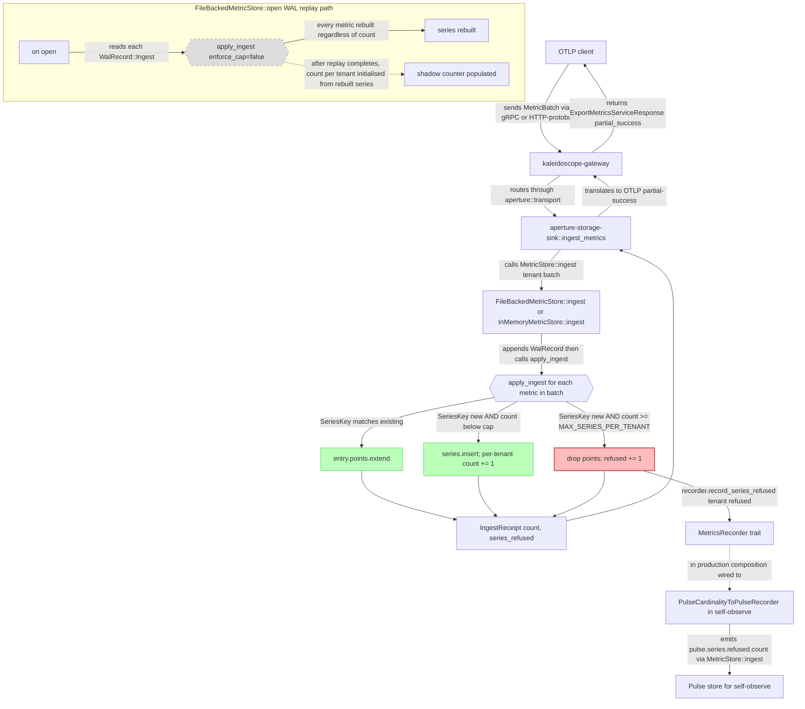
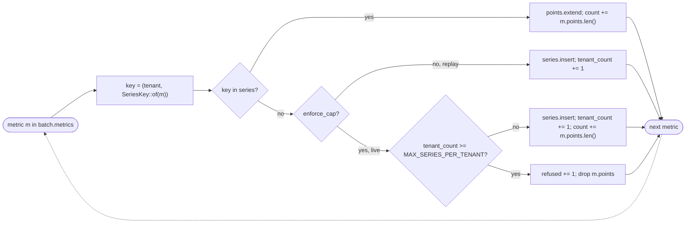

# Application Architecture: pulse-cardinality-watermark-v0

British English. No em dashes. No emoji.

Author: `@nw-solution-architect` (Morgan), DESIGN wave, 2026-05-27.
Feature: M-4 in the residuality analysis; item 3 of 3 in the
residuality follow-up roadmap. Walking-skeleton slice 01 adds a
per-tenant soft cardinality watermark inside pulse's shared
`apply_ingest` seam, refusing NEW `SeriesKey`s above
`MAX_SERIES_PER_TENANT = 10_000` and counting refusals on both the
synchronous `IngestReceipt` and a new `MetricsRecorder` hook.

## C4 L2 Container view of the cap-bearing path

The cap is one new arm inside the existing per-metric loop. Nothing
upstream of `apply_ingest` changes; nothing downstream of the
`IngestReceipt` and recorder seams changes. The diagram below pins
the per-metric arm with its three outcomes (existing-extend,
new-insert, new-refused) and the two observability surfaces.

The red arm is the new behaviour. The green arms are the existing
behaviour, structurally unchanged. The dashed sub-graph is the WAL
replay path, which calls `apply_ingest` with `enforce_cap=false` so
the cap never refuses on replay (US-04, D5).

## Per-metric decision flow

Key invariants visible in the flow:

- The cap check fires ONLY when the key is NEW AND `enforce_cap` is
  true (live ingest). On replay, the cap check is bypassed and every
  metric is rebuilt.
- The loop NEVER aborts on `RefuseMetric`; the next metric is
  processed normally. This is partial-apply (D3, US-05).
- The shadow counter (`tenant_count`) is incremented on insert (both
  live and replay) and untouched on extend or refuse.
- The receipt's `count` field accumulates points across the extend
  and live-insert arms; the refuse arm does NOT contribute to
  `count` (those points are not stored).
- The receipt's `series_refused` field is the local `refused`
  accumulator at the end of the loop.

## Changes per file

| File | Change type | Scope |
|---|---|---|
| `crates/pulse/src/lib.rs` | **Add 1 line** | `pub const MAX_SERIES_PER_TENANT: usize = 10_000;`. Re-exported via the existing `pub use` block if needed; the constant is module-level. |
| `crates/pulse/src/store.rs` | **Extend `IngestReceipt`; extend `InnerState`; edit `InMemoryMetricStore::ingest`** | (1) Add `pub series_refused: usize` to `IngestReceipt`. (2) Add `series_count_per_tenant: HashMap<TenantId, usize>` to `InnerState`. (3) In the per-metric loop, lookup existing first; on no-match, check `series_count_per_tenant.get(tenant).copied().unwrap_or(0) >= MAX_SERIES_PER_TENANT`; if yes, increment local `refused`, skip; else insert and increment shadow counter. (4) Call `self.recorder.record_series_refused(tenant, refused)` if `refused > 0`. (5) Return `IngestReceipt { count, series_refused: refused }`. |
| `crates/pulse/src/file_backed.rs` | **Extend `Inner`; edit `open`; edit `apply_ingest`; edit `FileBackedMetricStore::ingest`** | (1) Add `series_count_per_tenant: HashMap<TenantId, usize>` to `Inner`. (2) In `open()`, after WAL replay completes (line 162), build the shadow counter by iterating `series.keys()` and counting per tenant. (3) Change `apply_ingest` signature to `fn apply_ingest(series, tenant_count, tenant, metrics, enforce_cap: bool) -> usize`, returning the refused count. WAL-replay call site (line 158) passes `enforce_cap=false`; live-ingest call site (line 273) passes `enforce_cap=true`. (4) In `apply_ingest`'s per-metric loop, mirror the in-memory cap arm. (5) Two `IngestReceipt` construction sites (line 264 for empty batch, line 280 for normal ingest) become `IngestReceipt { count, series_refused: refused }` (with `refused = 0` on the empty path). (6) Call `self.recorder.record_series_refused(tenant, refused)` if `refused > 0`. |
| `crates/pulse/src/metrics.rs` | **Extend `MetricsRecorder`; extend `RecordedEvent`; override on `CapturingRecorder`** | (1) Add `fn record_series_refused(&self, _tenant: &TenantId, _count: usize) {}` with default no-op body. (2) Add `RecordedEvent::SeriesRefused { tenant: TenantId, count: usize }`. (3) `CapturingRecorder::record_series_refused` pushes onto `events`. `NoopRecorder` does nothing extra (inherits the default). |
| `crates/self-observe/src/pulse_cardinality_bridge.rs` | **New file** | One struct `PulseCardinalityToPulseRecorder` holding `Arc<dyn MetricStore + Send + Sync>`, with `new(pulse)` constructor and `impl pulse::MetricsRecorder` whose `record_series_refused(tenant, count)` emits a one-point `MetricBatch` named `pulse.series.refused.count`, value=`count as f64`, kind `Sum`, point attribute `{tenant}`. `record_ingest` and `record_query` are no-ops in this bridge (the existing `LumenToPulseRecorder` covers those for lumen; pulse-on-pulse for ingest/query would loop). |
| `crates/self-observe/src/lib.rs` | **Add 1 re-export** | `pub use pulse_cardinality_bridge::PulseCardinalityToPulseRecorder;` and `mod pulse_cardinality_bridge;`. |
| `crates/pulse/tests/` | **DISTILL/DELIVER wave artefacts** | New integration tests asserting US-01 through US-05 scenarios (see `discuss/user-stories.md`). Not Morgan's deliverable; this row is informational so the next wave knows where the tests land. |
| `crates/self-observe/tests/` | **DISTILL/DELIVER wave artefact** | New integration test asserting the bridge emits `pulse.series.refused.count` on `record_series_refused`. Informational. |

## Out of scope (declared)

Reproduced from DISCUSS for clarity:

- Runtime-tuned cap (env-driven configurability). Compile-time
  constant only at slice 01.
- Structured event log beyond the counter. No new event, no Prism
  panel.
- Any change to the `MetricStore` trait method signatures. The
  receipt grows a field; the trait stays the same shape.
- Global (cross-tenant) cap. Per-tenant only.
- Eviction of existing series. The cap refuses; it does not displace.
- Per-(tenant, metric-name) sub-caps. Future feature.
- Per-tenant weighting (e.g. by resource-attribute count). Future
  feature.
- Caps on points per series, attribute size per key, or
  `MetricBatch` size. Out of scope.
- Special-casing the self-observe metric tenant. The cap applies
  uniformly; the operator sizes around the natural self-observe
  cardinality (10_000 has comfortable headroom).
- A separate per-tenant cumulative refused-since-start counter
  inside `Inner`. The longitudinal view lives in the recorder
  emission seam; querying the bridge's pulse points over a window
  returns the cumulative view.

## Quality-attribute notes

The cap design touches three ISO 25010 attributes explicitly:

- **Reliability (fault tolerance, recoverability)**. The cap converts
  an unobservable OOM kill into a named per-tenant refusal that the
  operator can act on. WAL-replay coherence (D5) keeps recovery
  lossless for already-accepted data. Mutation testing on the
  changed files (gate-5) gives 100% kill at the boundary mutants
  that would silently break the contract.
- **Maintainability (modifiability, testability)**. The cap rides
  outside the `MetricStore` trait so the trait stays byte-identical
  to the prior tag. The `enforce_cap: bool` parameter on
  `apply_ingest` is testable directly (the WAL-replay scenario in
  US-04 calls `open()` after a snapshot; the live-ingest scenario in
  US-01 calls `store.ingest`).
- **Performance efficiency**. The shadow counter is O(1) per
  cap-check. The change adds one `HashMap` lookup and one increment
  per metric in the batch; this is well below the existing
  `entry().or_insert_with()` cost on the same path.

The cap does not touch security (the tenancy-based fail-closed
posture is preserved; tenant A's bomb does not affect tenant B by
construction, US-02), portability (no platform-specific behaviour),
or compatibility (no new envelope; no wire-side renegotiation;
aperture's OTLP partial-success translation is unaffected).

## Earned-Trust position

This is the third leg of the Earned-Trust trilogy on the ingest /
read boundary:

- **ADR-0049** (write-side durability): the probe must honour fsync.
  The composition root proves the WAL append actually reaches stable
  storage before binding the listener.
- **ADR-0050** (read-side caps): the handler refuses out loud on a
  window or result that would self-DoS.
- **ADR-0051** (write-side cardinality, this slice): the ingest
  path refuses out loud on a per-tenant cardinality bomb.

All three honour the same shape: a compile-time constant, a
named-class refusal, no truncation, no silent loss, full coverage by
the existing gate-5 mutation kill at 100% on changed files.
