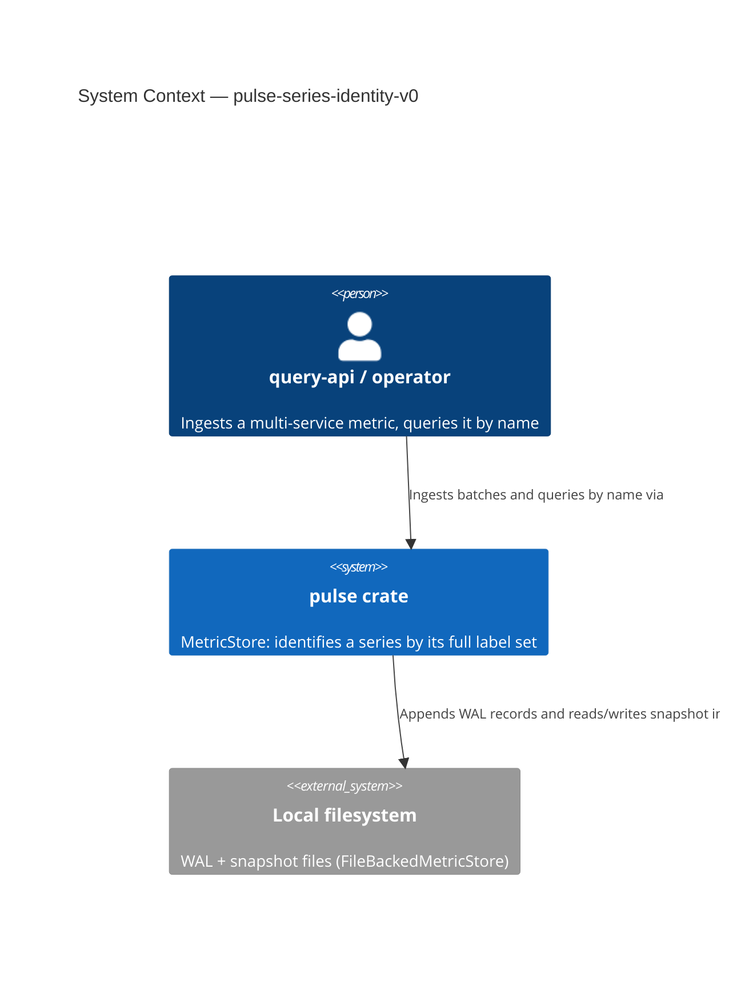
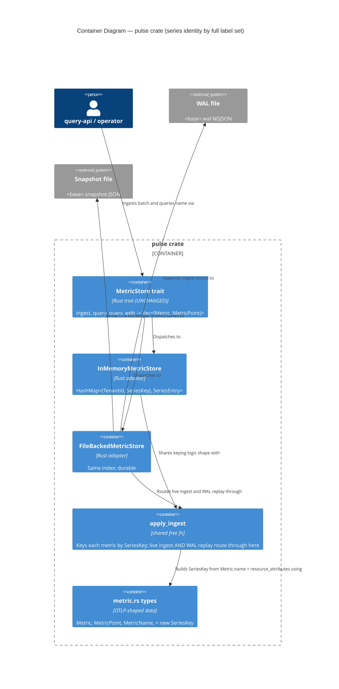

# Application Architecture: pulse-series-identity-v0

British English. No em dashes.

Author: `nw-solution-architect` (Morgan), DESIGN wave, 2026-05-22.

A data-model correction inside the existing `pulse` crate: the series index is
re-keyed from `(tenant, MetricName)` to `(tenant, SeriesKey)`, where `SeriesKey`
is the full label set (`MetricName` + `resource_attributes`). The
`resource_attributes` overwrite at ingest is removed; `query` fans out across all
series sharing a name. No new component, no new crate, no trait signature change.

## C4 Level 1 — System Context

## C4 Level 2 — Container (ingest / query / recovery path)

The change point is the series-index KEY shared by the in-memory adapter and the
durable adapter's `apply_ingest`. Arrows are labelled with verbs; the relabelled
key is annotated where it changes.

Note on query fan-out: `query(name)` now iterates the series whose
`SeriesKey.name` matches within the tenant and returns each row with its own
series' `resource_attributes`. At v0/v1 in-memory scale this linear pass is fine;
it is a known characteristic, not a problem solved here (no secondary index).

L3 is not produced: the change is to keying logic inside two existing adapters,
not a new multi-component subsystem.

## Changes Per File

| File | Change | Decision |
|------|--------|----------|
| `crates/pulse/src/metric.rs` | Add derived `SeriesKey { name: MetricName, resource_attributes: BTreeMap<String, String> }` with `Hash`/`Eq`/`PartialEq`/`Ord`/`PartialOrd`/`Clone`/`Debug`. No builder, no extra methods. | D2 |
| `crates/pulse/src/store.rs` | Re-key `InnerState.series` to `HashMap<(TenantId, SeriesKey), SeriesEntry>`; build the key in `ingest` (line ~144); remove `entry.metric.resource_attributes = ...` (line ~161); fan `query` (line ~176) and `query_with` (line ~203) out across series whose `SeriesKey.name` matches the queried name. | D3, D4, D5 |
| `crates/pulse/src/file_backed.rs` | Re-key `Inner.series` and `apply_ingest` to `(TenantId, SeriesKey)` (key build line ~303); remove the overwrite (line ~318); rebuild snapshot buckets into `(tenant, SeriesKey::from(&bucket.metric))` on `open` (line ~111); fan `query` (line ~242) and `query_with` (line ~269) out; snapshot iteration (line ~168) keyed by full label set. Re-sort after replay unchanged. | D3, D4, D5, D6 |

The `MetricStore` trait (`store.rs` lines 66-93, re-exported in `lib.rs`) is
unchanged. The on-disk `WalRecord` / `Snapshot` / `SeriesBucket` shapes need no
new serde field; only the in-memory rebuild key changes (D7: snapshot format may
change freely regardless, no migration).
