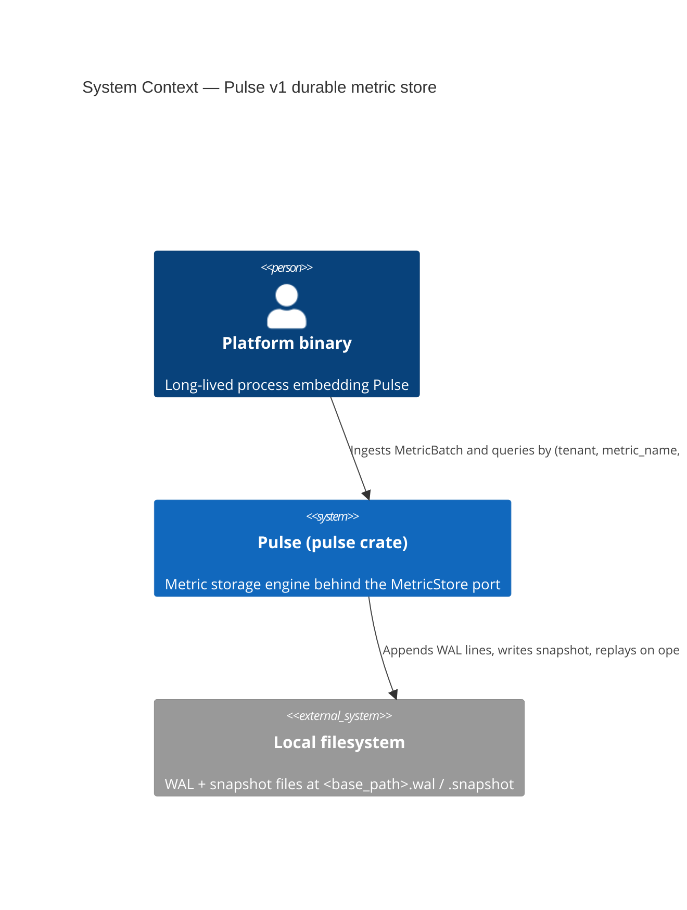
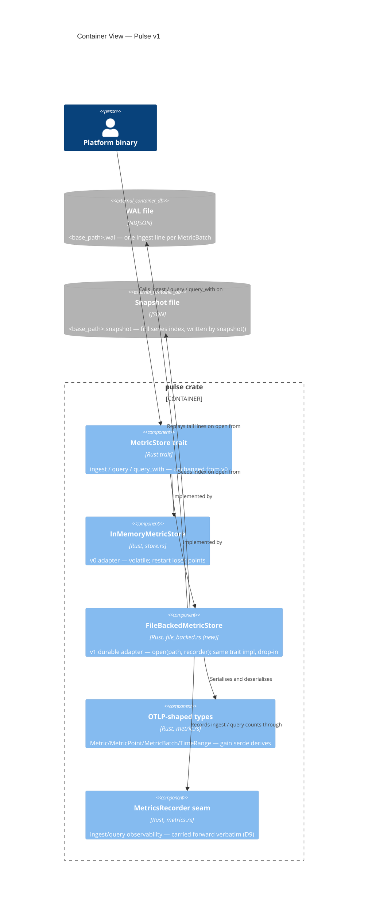

# Pulse v1 — application architecture (C4)

Author: `@nw-solution-architect` (Morgan), DESIGN wave, 2026-05-20.

Scope: one new adapter, `FileBackedMetricStore`, joining
`InMemoryMetricStore` behind the unchanged `MetricStore` trait in
the `pulse` crate. Durability via NDJSON WAL + JSON snapshot,
mirroring `crates/lumen/src/file_backed.rs`. See `wave-decisions.md`
DD1..DD6 for rationale.

## C4 — System Context (Level 1)

The platform binary is the only actor; the job is durability —
metrics survive a process restart (DISCUSS D4a). The filesystem is
the single driven dependency. No network, no third-party service,
no external API: external integrations = none.

## C4 — Container View (Level 2)

### Container deltas

| Container | Delta |
|---|---|
| `MetricStore` trait | **Unchanged.** No method added; v1 is a pure adapter addition (DISCUSS D2-arch). |
| `InMemoryMetricStore` | **Unchanged.** v0 adapter stays as the volatile option. |
| `FileBackedMetricStore` | **New.** `open` + `snapshot` + the three trait methods. In-memory `(tenant, metric_name)` index + append `BufWriter<File>` under one `Mutex<Inner>` (DD1). |
| OTLP types (`metric.rs`) | **Extended.** Six types gain `Serialize + Deserialize` derives for WAL/snapshot round-trip (DD2 / DISCUSS D5). |
| `MetricStoreError` (`store.rs`) | **Extended.** Empty enum grows one `PersistenceFailed { reason }` variant; Display rewritten (DD-Error). |
| WAL file | **New.** NDJSON, one `Ingest` record per batch; flush-only (D7). |
| Snapshot file | **New.** Full-state JSON written by explicit `snapshot()`; truncates the WAL (D8). |

## C4 — Component View (Level 3)

**Not produced.** L3 reification conditions: a sharded/columnar
index (v2), a separate write-ahead vs read-index split, or a
compaction scheduler with multiple internal collaborators. None
apply at v1 — the adapter is a single `Mutex<Inner>` holding a
`HashMap` index plus one `BufWriter`, structurally identical to
`FileBackedLogStore`. The two-container WAL/snapshot split above is
the full internal picture.

## Quality attribute coverage (ISO 25010)

| Attribute | How addressed |
|---|---|
| Functional Suitability | KPI 3 durability completeness (100% of pre- and post-snapshot points survive drop-and-reopen; zero loss, zero duplication). v0 query semantics preserved — half-open range, predicate AND range, `Vec<(Metric, MetricPoint)>` shape, ascending time order. |
| Performance Efficiency | KPI 1 ingest p95 ≤ 2 ms (clone + JSON-encode + flush over the v0 sort-after-extend); KPI 2 recovery p95 ≤ 2.5 s for 10 000 points. Both calibrated against CI substrate from commit one (D10). |
| Reliability | Recovery is the empirical probe: snapshot-first + WAL-tail replay equals pure-WAL replay (parallel-store equality). Corrupt WAL line surfaces as `PersistenceFailed` naming the line number — fail-loud, never silent partial recovery. Honest scope: flush-only, fsync deferred to v2. |
| Maintainability | One new file mirroring a thrice-proven template; serde derives + one Error variant. Per-feature mutation testing scoped to the diff at 100% kill rate. |
| Compatibility | `MetricStore` trait unchanged; `FileBackedMetricStore` is a drop-in for `InMemoryMetricStore`. Existing pulse v0 tests untouched. |
| Portability | No new external crate; no platform-specific syscall; std filesystem + `serde_json` only. |
