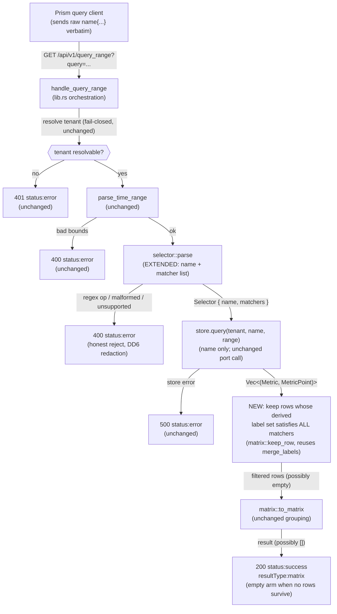

# Application Architecture: query-api-label-matchers-v0 (DESIGN)

British English. No em dashes. Author: `nw-solution-architect` (Morgan).
Scope: application. Interaction mode: propose. DISCUSS pinned at commit 5feadeb.

## Summary

This slice thickens one existing rib of the already-shipped `query-range-api-v0`
read loop: the selector parse step gains a label-matcher section, and a new
filter step runs between `pulse.query` and `matrix::to_matrix`. No new crate,
no new dependency, no new HTTP surface, no envelope change. The metric name
still selects the metric; the other matchers filter the translated rows by each
series' derived label set.

The architectural posture is unchanged from ADR-0042: hexagonal, the
`MetricStore` driven port the only collaborator, parser and translation the
only mutable logic, both unit- and mutation-testable in isolation. The work
lands entirely in `crates/query-api/src/`.

## Where the change lives

| Concern | File | Change |
|---------|------|--------|
| Selector grammar (name + matcher list) | `crates/query-api/src/selector.rs` | Extend `parse` to accept `name{ matcher_list }`; return `Selector { name, matchers }` instead of a bare `MetricName`. New honest-400 reject arms. |
| Series filter (the matcher predicate) | `crates/query-api/src/matrix.rs` | New pure `matches(labels, matcher)` and `keep_row(metric, point, matchers)` helpers; filter rows before `to_matrix` grouping, reusing the existing `merge_labels` label derivation. |
| Orchestration wiring | `crates/query-api/src/lib.rs` | `handle_query_range` calls `selector::parse` (now yielding name + matchers), passes the name to `store.query`, applies the matcher filter to the returned rows, then `to_matrix`. |

The composition root (`composition.rs`), tenancy seam, time-bounds parsing,
response/error serialisation, the probe, and the Prism contract are all
untouched.

## Component flow (C2/C3 in one, the data plane through the handler)



Two facts the diagram pins: (1) the matcher filter sits BEFORE `to_matrix`,
operating on the raw `(Metric, MetricPoint)` rows so the predicate sees the
same derived label set that grouping later folds on; (2) an all-excluded
filter result flows to the success arm as `result: []`, never an error.

## The selector grammar (DD1)

After trimming surrounding ASCII whitespace, the query is one of:

```
selector    := metric_name [ "{" matcher_list "}" ]
matcher_list := ws* ( matcher ( ws* "," ws* matcher )* ws* ","? )? ws*
matcher     := label_name ws* op ws* string_literal
op          := "=" | "!="
label_name  := [a-zA-Z_:][a-zA-Z0-9_:.]*        (note the trailing dot, see below)
string_literal := '"' ( any char except '"' or '\' | '\' escape )* '"'
escape      := '"' | '\' | 'n' | 't'
metric_name := [a-zA-Z_:][a-zA-Z0-9_:]*          (unchanged bare-name production)
```

Decided points:

- **The bare-name form remains valid.** A query with no `{` is parsed exactly
  as slice 01 today and yields `Selector { name, matchers: [] }`. An empty
  brace section `name{}` is also valid and yields an empty matcher list (it
  filters nothing, equivalent to the bare name). This keeps US-06's "bare name
  unchanged" acceptance criterion true by construction.

- **Dotted label names ARE allowed (deliberate divergence from strict PromQL).**
  Strict Prometheus label names are `[a-zA-Z_][a-zA-Z0-9_]*` (no dot). But
  Kaleidoscope's derived label set is OTel-shaped: keys like `service.name`,
  `tenant.id`, `http.route` are dotted (`crates/pulse/src/metric.rs`,
  `BTreeMap<String,String>`; verified-fact 5). A matcher that could not name a
  dotted key could not filter on `service.name` at all, which is the headline
  use case (US-06 elevator pitch is literally `{service.name="checkout"}`). So
  the label-name production extends the metric-name continuation class with `.`:
  `[a-zA-Z_:][a-zA-Z0-9_:.]*`. The leading char keeps the metric-name start
  class (`[a-zA-Z_:]`), so a leading dot is still rejected. This divergence is
  documented in the ADR as the OTel-shaped-label-set justification. It is
  forward-compatible: strict PromQL names are a subset, so a future tightening
  would only ever reject inputs we currently accept, never the reverse.

- **String literals are double-quoted; minimal escapes at v0.** Values are
  `"..."`. Escape support is the minimal Prometheus-compatible set: `\"`, `\\`,
  `\n`, `\t`. An unknown escape (`\x`) is a malformed-value 400 rather than a
  silent literal, keeping the honest-reject discipline. Single-quoted and
  backtick literals are OUT (return malformed 400); they can be added later
  without breaking the double-quoted form. A value may be empty (`""`), which is
  the load-bearing absent-label case, not an error.

- **Whitespace and commas.** ASCII whitespace is permitted around the braces,
  around each `op`, between matchers, and a single trailing comma before `}` is
  tolerated (Prometheus tolerates it). Whitespace inside a metric name or label
  name is still rejected (it splits tokens). Whitespace inside a quoted value is
  part of the value.

### Reject arms (all HTTP 400 status:error, DD6 redaction, never echo the raw query)

| Form | Reason text (shape) |
|------|---------------------|
| Regex op `=~` or `!~` | `"unsupported query: regex matchers (=~, !~) are not supported at v0; use = or !="` |
| Unterminated `{` (no closing `}`) | `"malformed query: the label matcher section is not closed"` |
| Value not double-quoted (e.g. `name=checkout`) | `"malformed query: matcher values must be double-quoted"` |
| Empty label name (e.g. `{="x"}`) | `"malformed query: a matcher is missing its label name"` |
| Unknown operator / junk between matchers / trailing junk after `}` | `"malformed query: unrecognised label matcher syntax"` |
| Bad escape inside a value | `"malformed query: unrecognised string escape in a matcher value"` |
| Any other unsupported form already rejected by slice 01 (functions, range vectors, operators outside braces) | unchanged slice-01 reason |

A malformed brace section is NEVER silently degraded to a bare-name query or a
partial filter (US-08 acceptance criterion). The whole selector either parses
into `Selector { name, matchers }` or returns one 400.

## The types (DD1)

```rust
// in selector.rs
pub struct Selector {
    pub name: MetricName,
    pub matchers: Vec<LabelMatcher>,
}

pub struct LabelMatcher {
    pub name: String,       // a derived-label-set key, dotted form allowed
    pub op: MatchOp,        // Equal | NotEqual
    pub value: String,      // the unquoted, unescaped literal (may be empty)
}

pub enum MatchOp { Equal, NotEqual }

// parse signature changes from -> Result<MetricName, String>
//                              to -> Result<Selector, String>
```

`pub fn parse(raw: &str) -> Result<Selector, String>`. The orchestration uses
`selector.name` to drive `store.query` and `selector.matchers` to filter. The
reason string contract (never echo the raw query) is unchanged.

## The filter (DD2)

The filter is a pure function in `matrix.rs`, exercised by unit tests
independently of the store and the server:

```rust
// matches one matcher against one already-derived label set
fn matches(labels: &BTreeMap<String, String>, m: &LabelMatcher) -> bool;
// true iff the row's derived label set satisfies ALL matchers
fn keep_row(metric: &Metric, point: &MetricPoint, matchers: &[LabelMatcher]) -> bool;
```

`keep_row` derives the label set with the SAME logic `merge_labels` uses
(`resource_attributes` then `point.attributes` winning, then authoritative
`__name__`), so the predicate sees exactly what `to_matrix` later groups on
(US-06 acceptance criterion). To avoid two divergent copies of the derivation,
`merge_labels` is made callable from the filter path (lifted to a shared
private helper within the module), so a mutation to the derivation is caught
once and the filter inherits it.

The orchestration applies it as `rows.retain(|(m, p)| keep_row(m, p, &matchers))`
before `to_matrix`. Empty `matchers` retains everything (bare-name behaviour).
An empty surviving set produces `result: []` (the calm success arm).

### Matcher semantics (DD2, the correctness-critical part, restated verbatim)

For a single matcher against a derived label set, with `present` meaning the key
exists in the set and `v` its value:

- **`label="value"`** (`Equal`, non-empty value): keep iff `present AND v == value`.
- **`label=""`** (`Equal`, empty value): keep iff `(NOT present) OR v == ""`.
  An absent label satisfies `=` ONLY when the matcher value is empty.
- **`label!="value"`** (`NotEqual`, non-empty value): keep iff `(NOT present) OR v != value`.
  An absent label satisfies `!=` against any non-empty value.
- **`label!=""`** (`NotEqual`, empty value): keep iff `present AND v != ""`.
  Only present, non-empty labels survive.

Because `BTreeMap::get` returns `Option<&String>`, the four arms collapse to:
`Equal` keeps iff `get(name).map(|v| v.as_str()).unwrap_or("") == value`;
`NotEqual` keeps iff `get(name).map(|v| v.as_str()).unwrap_or("") != value`.
Treating an absent label as the empty string yields exactly the Prometheus
semantics above for both operators and both the empty and non-empty value cases.
This is the single subtle invariant the mutation gate must protect; each of the
four arms has a dedicated DISCUSS UAT scenario (US-06 examples 1-3, US-07
examples 1-3) so a flipped decision is caught.

Multiple matchers AND: `matchers.iter().all(|m| matches(labels, m))`.

## Quality attributes (ISO 25010, the ones this slice touches)

- **Functional suitability (correctness)**: the matcher-semantics matrix above
  is the oracle; 100% mutation kill on `selector.rs` + `matrix.rs` via the
  existing gate is the enforcement (KPI 2).
- **Reliability (no silent wrong answer)**: every unsupported/malformed form is
  a tested honest 400, never a partial filter or a degraded bare-name query
  (KPI 3, US-08). The empty result is a calm success arm, not an error (KPI 1).
- **Security (no leak)**: the 400 reason never echoes the raw query or a
  forwarded header value (DD6 redaction symmetry; ADR-0027 section 6). Tenancy
  fail-closed and within-tenant filtering are unchanged (inherited US-04
  guardrail).
- **Performance efficiency**: the filter is a single `retain` pass over the
  already-fetched rows, O(rows x matchers). KPI 5's 500 ms p95 budget on
  ubuntu-latest is not expected to move; the added work is negligible against
  the store read.
- **Maintainability (testability)**: parser and filter are pure functions in
  the lib seam, exercised without a server (the established query-api shape).

## Enforcement tooling (principle 11)

No new style boundary is introduced, so no new enforcement tool is needed.
The existing project enforcement applies unchanged: `cargo clippy`,
`cargo fmt --check`, and `cargo mutants` scoped to `crates/query-api/src/` via
`--in-diff` at the 100% kill-rate gate (ADR-0005 Gate 5; CLAUDE.md). The
matcher predicate's four boundary arms are exactly the kind of equality/
inequality boundaries mutation testing exists to protect; this is the
language-appropriate enforcement and it already covers the changed scope.

## Earned Trust note (principle 12)

This slice introduces NO new external dependency, adapter, or driven port. The
only driven port (`MetricStore`) and its startup probe (`composition::probe`,
ADR-0042 Decision 8, the three-orthogonal-layer enforcement) are unchanged. The
new logic (parse + filter) is pure, in-process, and deterministic over its
inputs, so it has no substrate that could lie; its honesty is established by the
mutation gate, not a runtime probe. No probe change is required, and the
wire-then-probe-then-use composition-root invariant is preserved untouched.
```
