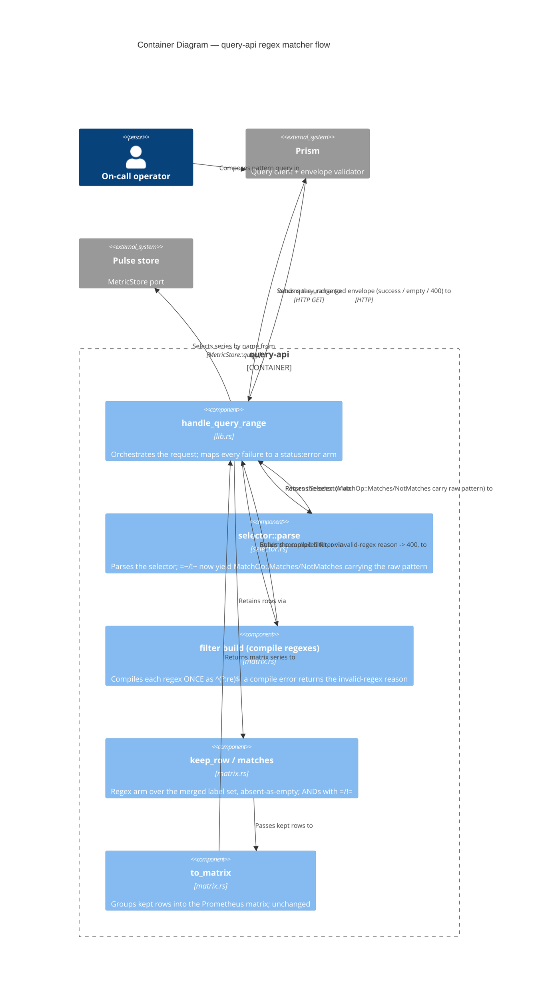

# Application Architecture: query-api-regex-matchers-v0 (DESIGN)

British English. No em dashes. Author: `nw-solution-architect` (Morgan).

Scope: add the regex label matchers `=~` and `!~` to the existing query-api
PromQL selector, on top of the shipped `=`/`!=` matchers (commit 0171388). The
public `query_api::router` signature is UNCHANGED; the behaviour rides the
existing `/api/v1/query_range` handler. See `wave-decisions.md` for the Key
Decisions and the Reuse Analysis; ADR-0046 for the rationale.

## C4 Level 1 — System Context

The actors and the one driven dependency are unchanged from ADR-0042 /
ADR-0044. The operator composes a pattern query; Prism forwards it verbatim;
query-api reads name-selected series from the durable Pulse store and filters
them.

```mermaid
C4Context
  title System Context — query-api regex matchers
  Person(operator, "On-call operator (Priya)", "Composes name{label=~\"re\"} mid-incident")
  System(prism, "Prism", "Browser query client; forwards the raw query, validates the envelope")
  System(queryapi, "query-api", "Serves /api/v1/query_range; parses the selector, filters by regex, translates to the Prometheus matrix")
  System_Ext(pulse, "Pulse store", "Durable per-tenant metric store (local WAL + snapshot)")
  Rel(operator, prism, "Types a pattern query into")
  Rel(prism, queryapi, "Forwards query_range to", "HTTP GET")
  Rel(queryapi, pulse, "Selects series by name from", "MetricStore::query")
```

## C4 Level 2 — Container / internal flow (the change point)

The change is entirely inside the `query-api` container, along the existing
parse -> compile -> filter -> translate path. The new element is the
compile-regex step between parse and filter; the regex arm in the filter; and
the compile-error mapping to the 400. Pulse name-selection and the matrix
grouping are unchanged.



C4 Level 3 is NOT produced: the change is two new variants and one regex arm
inside two existing files, not a new multi-component subsystem. L1 + L2 are the
proportionate depth for a small focused feature.

## Changes Per File

| File | Change | Detail |
|------|--------|--------|
| `crates/query-api/src/selector.rs` | Extended | `MatchOp` gains `Matches` and `NotMatches`. `read_operator` returns `MatchOp::Matches` for `=~` and `MatchOp::NotMatches` for `!~` (the two `Err(regex_reason())` arms flip to `Ok(...)`); the third `=~`-after-`!=` arm is impossible after `!=` is consumed and stays a malformed 400 if reached. `LabelMatcher` carries the raw pattern in its existing `value` field; `regex_reason()` is removed or retained only if no longer referenced (crafter's call). Grammar, escapes, label-name class, all other reject arms unchanged. `MatchOp` keeps `Eq`/`Hash` (no compiled `Regex` lives in it). |
| `crates/query-api/src/matrix.rs` | Extended | A small filter-build helper compiles each regex matcher's raw pattern ONCE, wrapped as `^(?:{pattern})$`, returning either a compiled filter value or the `"invalid regex matcher"` reason. `matches`/`keep_row` gain a regex arm: `Matches` keeps iff the compiled anchored regex matches the absent-as-empty label value (`labels.get(name).unwrap_or("")`); `NotMatches` is its exact negation. The compiled `Regex` lives only in the filter value, never in `LabelMatcher`/`MatchOp`. `merge_labels`, `to_matrix`, value formatting unchanged. |
| `crates/query-api/src/lib.rs` | Extended | One compile-and-map step inserted between `selector::parse` and the existing `retain`: build the compiled filter, and on a compile error return `error_response(StatusCode::BAD_REQUEST, "invalid regex matcher")` (reusing the existing seam, DD6 redaction). The `retain` then uses the compiled filter. Tenancy, bounds parsing, success/empty serialisation, the probe, and the `router` signature unchanged. |
| `crates/query-api/Cargo.toml` | Extended | Add `regex` as a direct `[dependencies]` entry, pinned (no wildcard) to the version already in `Cargo.lock` (1.12.3). The only dependency change; DEVOPS verifies Gate 4 (see `wave-decisions.md` DEVOPS handoff). |

## Quality attribute coverage (ISO 25010)

| Attribute | How addressed |
|---|---|
| Security | The `regex` crate is RE2-derived and backtracking-free, so a hostile user pattern cannot trigger catastrophic backtracking (ReDoS). The invalid-regex 400 never echoes the pattern or a forwarded header (DD6). |
| Functional Suitability | Matrix A (full anchoring via `^(?:re)$`) and Matrix B (the five-arm absent-label/empty-pattern matrix via absent-as-empty) are the explicit correctness oracle, each arm pinned by a DISCUSS scenario plus pure-predicate unit tests. |
| Reliability | An invalid pattern is an honest 400, never a panic, a 500, or a silent match-everything/match-nothing. A valid-but-never-matching pattern is the calm 200 empty arm. |
| Performance Efficiency | Each regex compiles ONCE per query at filter-build, not per row, so the per-row scan stays linear in row count; well within the inherited p95 < 500 ms budget for short per-query patterns. |
| Maintainability | Three files extended in one crate; the compiled regex is isolated filter-side so the parsed types stay pure and comparable. Per-feature mutation testing scoped to the diff at 100% kill rate (ADR-0005 Gate 5). |
| Compatibility | The response envelope is byte-shape-unchanged; Prism's pinned `isPromSuccess`/`isPromError` validators accept every arm including the new 400. The `query_api::router` signature is unchanged. |
| Portability | `regex` is a pure-Rust crate already in the lock; no platform-specific code, no new external substrate. |

## Architecture Enforcement

Style: Hexagonal (unchanged). Language: Rust.

The structural rule that matters here is the dependency direction: the parsed
selector types (`selector.rs`) must NOT depend on the regex engine, and the
compiled `Regex` must live filter-side (`matrix.rs`), never in `LabelMatcher`
or `MatchOp`. In Rust this is enforced naturally by the type system: a compiled
`regex::Regex` is not `Eq`/`Hash`, so it cannot be a field of the `Eq`/`Hash`
deriving `LabelMatcher`/`MatchOp` without a compile error. No extra
architecture-test tool is warranted for a two-file change in a single crate;
the compiler IS the enforcement. The `cargo deny` Gate 4 enforces the
dependency-supply-chain rule for the new `regex` direct dependency.
