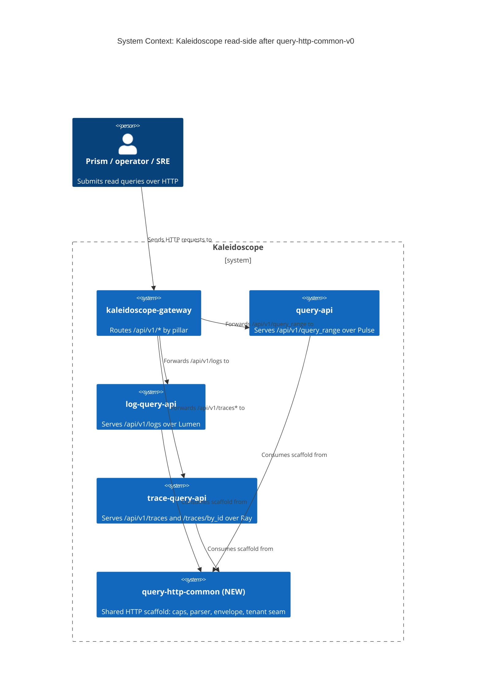
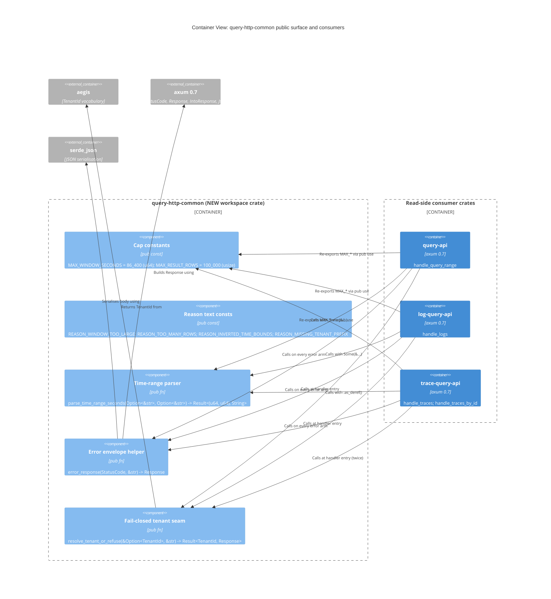

# Application Architecture — query-http-common-v0

Author: `@nw-solution-architect` (Morgan), DESIGN wave, 2026-05-27.

This document is the C4 view, the public API table, the per-file
change table, and the reason-text catalogue for the
`query-http-common-v0` extraction. It is the artefact DELIVER reads to
know exactly what surface to land in the new crate; it is the artefact
DISTILL reads to confirm no behaviour change requires new acceptance
scenarios.

## System context (C4 L1)

The user-visible boundary (`kaleidoscope-gateway` and the three read
APIs) is UNCHANGED by this feature. The only diagram delta is the
addition of the `query-http-common` box with three inbound arrows.

## Container view (C4 L2)

A C4 L3 component diagram is NOT produced. The new crate is a flat
~60-line `src/lib.rs` of free functions with no internal structure
worth visualising; the L2 container view is the developer's view.

## Public API

| Symbol | Kind | Signature | Doc |
|--------|------|-----------|-----|
| `MAX_WINDOW_SECONDS` | `pub const u64` | `= 86_400` | maximum half-open window in whole seconds (ADR-0050 Decision 1); inclusive boundary; consumer's window-cap arm fires on a STRICT excess |
| `MAX_RESULT_ROWS` | `pub const usize` | `= 100_000` | maximum response-vector length (ADR-0050 Decision 2); REFUSE-not-TRUNCATE; consumer's result-cap arm fires on a STRICT excess |
| `REASON_WINDOW_TOO_LARGE` | `pub const &'static str` | `= "window exceeds 86400 seconds"` | the literal 400 reason text for the window-cap arm; consumers pass it verbatim to `error_response` |
| `REASON_TOO_MANY_ROWS` | `pub const &'static str` | `= "result exceeds 100000 rows"` | the literal 400 reason text for the result-cap arm; consumers pass it verbatim to `error_response` |
| `REASON_INVERTED_TIME_BOUNDS` | `pub const &'static str` | `= "invalid time bounds: end is earlier than start"` | the literal 400 reason emitted from inside `parse_time_range_seconds` on `end < start`; exported for inline-test addressability |
| `REASON_MISSING_TENANT_PREFIX` | `pub const &'static str` | `= "no tenant resolvable: the "` | the literal 401 reason prefix emitted from inside `resolve_tenant_or_refuse`; the helper joins this with `service_label` and the suffix `" service refuses unscoped requests"` |
| `parse_time_range_seconds` | `pub fn` | `fn(start: Option<&str>, end: Option<&str>) -> Result<(u64, u64), String>` | the canonical parser; rejects missing (`required`), non-numeric (`is not a number`), out-of-range (`is out of range`), inverted (`end is earlier than start`); float-tolerant via `f64` parse + truncate; redaction-symmetric (never echoes the raw value); the cap-arm consumer computes `end.saturating_sub(start) > MAX_WINDOW_SECONDS` itself |
| `error_response` | `pub fn` | `fn(status: StatusCode, reason: &str) -> Response` | returns `(status, Json(json!({"status":"error","error":reason}))).into_response()`; the wire shape is the contract; both `&'static str` consts and interpolated `String`s (via `&reason`) pass through |
| `resolve_tenant_or_refuse` | `pub fn` | `fn(tenant: &Option<TenantId>, service_label: &str) -> Result<TenantId, Response>` | returns `Ok(t.clone())` on `Some(t)`; returns `Err(error_response(UNAUTHORIZED, &format!("{REASON_MISSING_TENANT_PREFIX}{service_label} service refuses unscoped requests")))` on `None`; the cloned `TenantId` matches the four call sites' existing usage; the `service_label` is a static literal supplied by each handler (`"query"`, `"log query"`, `"trace query"`) |

`parse_epoch_seconds` is a PRIVATE helper of `parse_time_range_seconds`
inside the new crate; not exported.

`seconds_to_nanos` is NOT in the new crate. Each consumer keeps its
own copy because each builds a pillar-specific `TimeRange`
(`pulse::TimeRange`, `lumen::TimeRange`, `ray::TimeRange`).

## Reason text constants (catalogue)

| Const name | Literal value | Pre-extraction call-site count | Post-extraction call-site count |
|------------|---------------|--------------------------------|---------------------------------|
| `REASON_WINDOW_TOO_LARGE` | `"window exceeds 86400 seconds"` | 3 (one per consumer crate, inside the window-cap arm) | 3 call sites pass the const; the literal lives in 1 place |
| `REASON_TOO_MANY_ROWS` | `"result exceeds 100000 rows"` | 4 (query-api x1, log-query-api x1, trace-query-api x2) | 4 call sites pass the const; the literal lives in 1 place |
| `REASON_INVERTED_TIME_BOUNDS` | `"invalid time bounds: end is earlier than start"` | 3 (one per consumer; emitted from `parse_time_range_seconds`) | inside the canonical parser; 0 consumer-side references |
| `REASON_MISSING_TENANT_PREFIX` | `"no tenant resolvable: the "` | 4 (one per inline tenant `match` block) | inside `resolve_tenant_or_refuse`; 0 consumer-side references |

K3 (LOC reduction) is driven primarily by the consumer-side
collapse of the four arms (`MAX_*` declarations, `parse_*` helpers,
`error_response` body, inline tenant `match`). The post-feature
consumer-side scaffold is the call-site one-liners; ≤ 30 LOC total
across the three crates (K3 baseline ~90).

## Changes per file

| Path | Kind | Summary | LOC delta |
|------|------|---------|-----------|
| `Cargo.toml` (workspace root) | EXTEND | Add `"crates/query-http-common"` to the `members` array | +1 |
| `crates/query-http-common/Cargo.toml` | NEW | Workspace-internal library crate: name, version `0.1.0`, edition.workspace, rust-version.workspace, AGPL-3.0-or-later, `publish = false`, deps on `axum 0.7` (default-features off, features = `["http1", "tokio", "query", "json"]`), `serde { workspace = true, features = ["derive"] }`, `serde_json { workspace = true }`, `aegis = { path = "../aegis", version = "0.1.0" }`, `#![forbid(unsafe_code)]` lint section | +~40 |
| `crates/query-http-common/src/lib.rs` | NEW | `#![forbid(unsafe_code)]`; pub consts (caps + reason texts); `parse_time_range_seconds` (`Option<&str>` shape); `parse_epoch_seconds` (private); `error_response`; `resolve_tenant_or_refuse`; `#[cfg(test)] mod tests` covering all error paths; AGPL header | +~180 (including tests and doc comments) |
| `crates/query-api/Cargo.toml` | EXTEND | Add `query-http-common = { path = "../query-http-common", version = "0.1.0" }` | +1 |
| `crates/query-api/src/lib.rs` | EXTEND | Remove local `MAX_WINDOW_SECONDS`, `MAX_RESULT_ROWS`, `parse_time_range_seconds`, `parse_epoch_seconds`, `error_response`; add `pub use query_http_common::{MAX_WINDOW_SECONDS, MAX_RESULT_ROWS};`; replace inline tenant `match` with `let tenant = match query_http_common::resolve_tenant_or_refuse(&state.tenant, "query") { Ok(t) => t, Err(resp) => return resp };`; replace parser call with `query_http_common::parse_time_range_seconds(Some(&params.start), Some(&params.end))`; replace cap-arm reason literals with `query_http_common::REASON_WINDOW_TOO_LARGE` and `REASON_TOO_MANY_ROWS`; remove inline tests for the migrated helpers | -~50 (net; bulk of the scaffolding leaves) |
| `crates/log-query-api/Cargo.toml` | EXTEND | Add `query-http-common = { path = "../query-http-common", version = "0.1.0" }` | +1 |
| `crates/log-query-api/src/lib.rs` | EXTEND | Same shape as `query-api/src/lib.rs`; service label is `"log query"`; preserves `parse_min_severity` (pillar-specific, stays per-crate) | -~50 |
| `crates/trace-query-api/Cargo.toml` | EXTEND | Add `query-http-common = { path = "../query-http-common", version = "0.1.0" }` | +1 |
| `crates/trace-query-api/src/lib.rs` | EXTEND | Same shape; service label is `"trace query"`; TWO handler arms (`handle_traces`, `handle_traces_by_id`) call `resolve_tenant_or_refuse`; preserves `parse_trace_id` and `read_required_service` (pillar-specific); parser call uses `params.start.as_deref()` / `params.end.as_deref()` (already the canonical shape) | -~60 (two arms collapse; parser body removed) |
| `docs/product/architecture/adr-0054-query-http-common-extraction.md` | NEW | Standard ADR, Status Accepted, Date 2026-05-27 | +~140 |
| `docs/product/architecture/brief.md` | EXTEND | Append `## Application Architecture — query-http-common-v0` | +~30 |

NO file in the three consumer crates' `src/main.rs`, `src/composition.rs`,
`src/matrix.rs`, or `src/selector.rs` is touched. NO ADR predating
0054 is touched (ADR immutability).

## Order-of-checks preserved per consumer

The Mikado plan (`mikado-plan.md`) is structural: it changes WHERE
the code lives, not WHET happens at runtime. Each consumer keeps its
existing handler order of checks verbatim:

- **`query-api::handle_query_range`** (unchanged order):
  resolve-tenant -> parse-bounds -> window-cap -> parse-selector ->
  build-filter -> store query -> result-cap -> serialise. (lines
  162-229 today.)
- **`log-query-api::handle_logs`** (unchanged): resolve-tenant ->
  parse-bounds -> window-cap -> parse-min-severity -> store query
  -> result-cap -> serialise. (lines 126-197 today.)
- **`trace-query-api::handle_traces`** (unchanged): resolve-tenant
  -> read-required-service -> parse-bounds -> window-cap -> store
  query -> result-cap -> serialise. (lines 136-198 today.)
- **`trace-query-api::handle_traces_by_id`** (unchanged):
  resolve-tenant -> parse-trace-id -> store get_trace -> result-cap
  -> serialise. (lines 233-288 today.)

The K2 byte-identity gate (every 400 and 401 acceptance test green
pre and post) verifies the order is preserved.

## Non-goals

- NO Axum `FromRequestParts` extractor for tenant. The DISCUSS US-04
  Technical Note explicitly defers this to a future story.
- NO structured `ErrorBody` newtype. DISCUSS Flag 3 / DD3 pin.
- NO promotion of `seconds_to_nanos` to the shared crate. DISCUSS
  Flag 2 / DD2 pin (forces a domain type across the boundary).
- NO change to any existing ADR. ADR immutability is a project
  convention.
- NO change to the three consumer crates' `pub` surface. The
  re-exported `MAX_WINDOW_SECONDS` and `MAX_RESULT_ROWS` preserve
  the backward-compatible path for any downstream caller reading
  `query_api::MAX_RESULT_ROWS` (DISCUSS US-01 AC).
- NO `1.0.0` bump on any crate. Project policy.
