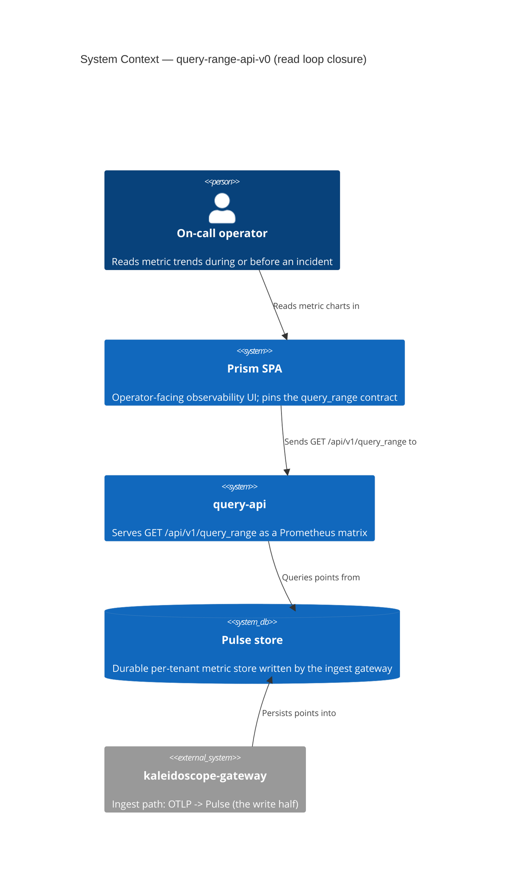
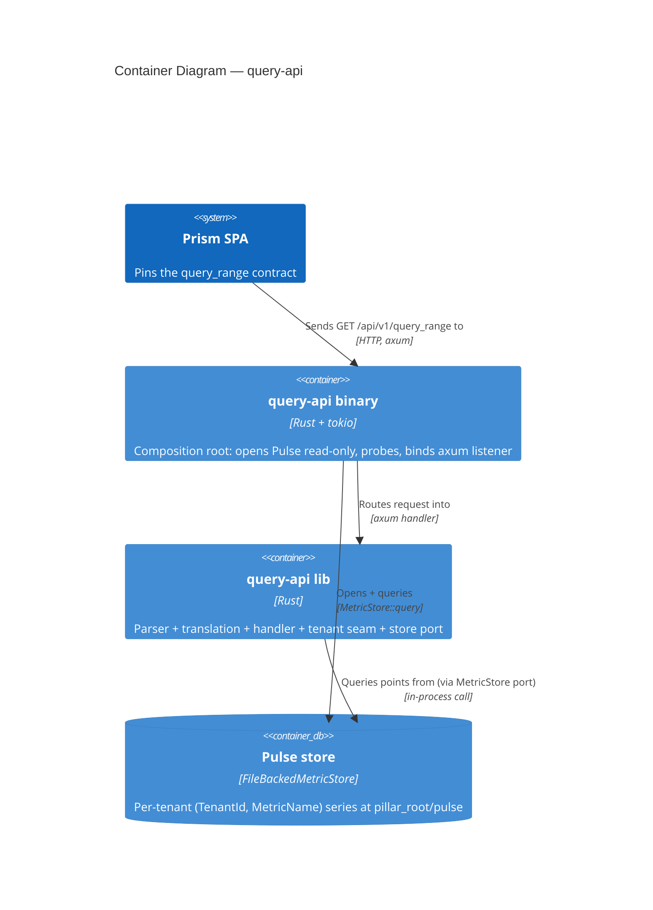
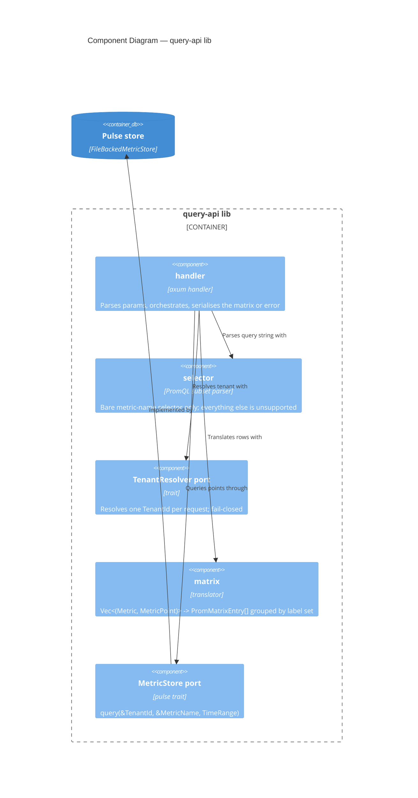
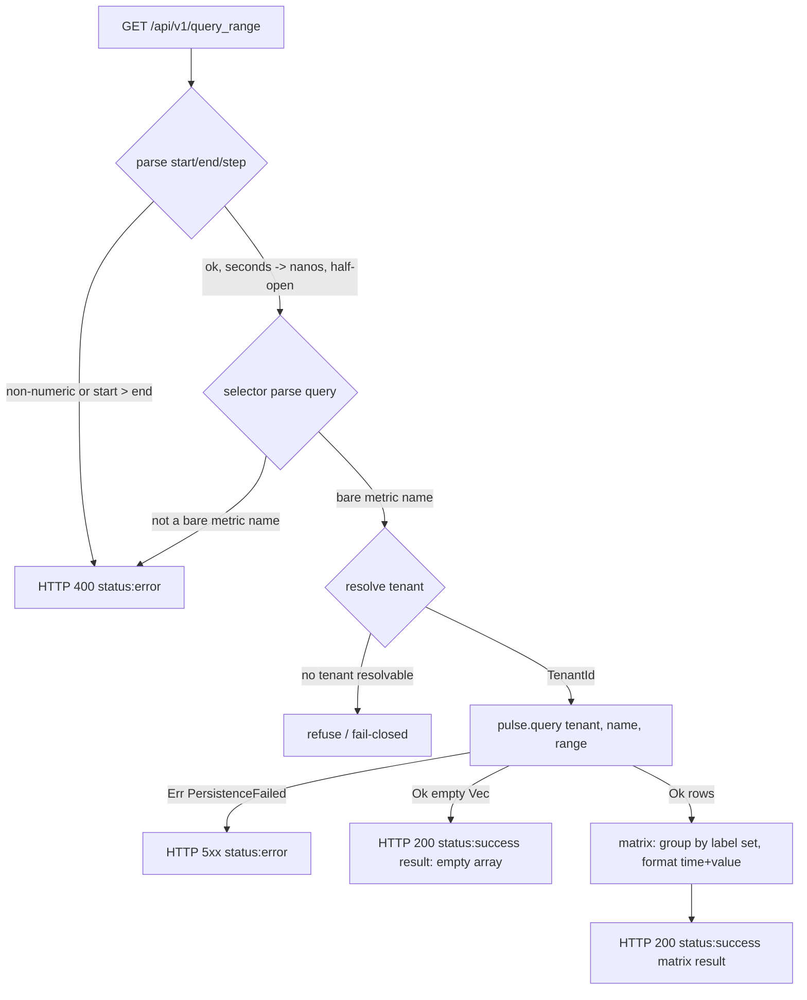

# Application Architecture: query-range-api-v0

Architect: Morgan (`nw-solution-architect`). British English. No em dashes.

This document closes the read loop ingest -> store -> query -> visualise.
A new `query-api` crate serves Prism's pinned `/api/v1/query_range`
contract out of the durable Pulse store. The response shape is an external
contract (ADR-0027 + `apps/prism/src/lib/promql/queryRange.ts`); this
backend serves what Prism already requests.

## System context

- **Primary consumer**: Prism's HTTP query client (`queryRange.ts`), a
  machine consumer with a pinned validator, plus the on-call operator
  behind it.
- **System under design**: `query-api` (a new crate: lib + thin binary).
- **Dependency (driven)**: the durable Pulse store
  (`FileBackedMetricStore`) at `pillar_root/pulse`, written by the
  gateway's ingest path.
- **Vocabulary dependency**: `aegis::TenantId`.

### C4 Level 1 — System Context



### C4 Level 2 — Container



### C4 Level 3 — Component (the lib's internals)

The lib has five components; L3 is justified because the parser and
translation carry the only mutable logic and must be testable in isolation.



## The pinned contract (frozen, verbatim)

Request: `GET /api/v1/query_range?query=<raw PromQL>&start=<epoch_seconds>&end=<epoch_seconds>&step=15s`.
The route path is `/api/v1/query_range` because Prism's `backend.url`
prefix is `/api/v1` and `buildUrl` appends `/query_range` (verified in
`queryRange.ts` and `types.ts`).

Success / empty response (HTTP 200):

```json
{ "status": "success",
  "data": { "resultType": "matrix",
            "result": [ { "metric": { "__name__": "process_cpu_utilization", "service.name": "checkout" },
                          "values": [ [1716200000, "0.4"], [1716200015, "0.55"] ] } ] } }
```

Empty arm: `result: []` (still `status:'success'`). Error arm (HTTP 400):
`{ "status": "error", "error": "<reason>" }`. The string `"NaN"` is honoured.

Prism validators that MUST accept the output (frozen):

- `isPromSuccess`: `status === 'success'` AND `Array.isArray(data.result)`.
- `isPromError`: `status === 'error'` AND `typeof error === 'string'`.

## Component responsibilities

| Component | Owns (WHAT) | Notes |
|-----------|-------------|-------|
| `handler` | Extract `query`/`start`/`end`/`step`; orchestrate parse -> resolve -> query -> translate -> serialise; map every failure to an arm | axum `get` handler; never panics on bad input |
| `selector` | Accept a bare metric name `[a-zA-Z_:][a-zA-Z0-9_:]*` after trimming; reject everything else as unsupported | The v0 PromQL boundary (DD3) |
| `TenantResolver` (port) | Resolve exactly one `TenantId` per request; fail-closed when none | Slice-01 adapter reads `KALEIDOSCOPE_QUERY_TENANT`; header/Bearer adapter is a later swap |
| `matrix` | Group `Vec<(Metric, MetricPoint)>` into `PromMatrixEntry[]` by merged label set; format time and value | The translation logic (DD4) |
| `MetricStore` (port) | `query(&TenantId, &MetricName, TimeRange)` | Existing `pulse` trait; in-memory double for lib tests |

The crafter owns all internal structure beyond these boundaries (Rust
idiomatic: data + free functions + traits; no inheritance, no `dyn` where
generics suffice, per CLAUDE.md).

## Request flow (slice 01)



## Label-set derivation rule (DD4a)

For each `(Metric, MetricPoint)` row, the Prometheus label map is the union:

1. `metric.resource_attributes` (e.g. `service.name`),
2. `point.attributes` (e.g. `route`, `http.status_code`) — win on key clash,
3. `"__name__": metric.name` — always present (Prometheus convention),
   and authoritative for the name key.

Rows sharing the identical merged label map form one `PromMatrixEntry`;
its `values` array is ascending in time (Pulse returns ascending; grouping
preserves order). Time: `time_unix_nano / 1_000_000_000` as an integer
seconds number. Value: `f64` -> minimal-decimal string, `NaN` -> `"NaN"`,
`0.0` -> `"0"` (US-01 example 4).

## Quality attributes (ISO 25010)

- **Functional suitability**: output passes Prism's `isPromSuccess` /
  `isPromError`; round-trip is the KPI.
- **Reliability**: fail-closed tenancy; persistence error -> HTTP 5xx, never
  a fabricated empty success; wire-then-probe-then-use refuses a half-up
  start (DD9).
- **Security**: per-tenant isolation (one `TenantId` per query, zero
  cross-tenant leak); status:error never echoes a forwarded header value.
- **Maintainability / testability**: lib seam isolates parser and
  translation; `MetricStore` and `TenantResolver` ports allow doubles;
  cargo mutants at 100% kill-rate on the new crate.
- **Performance**: v0 returns raw points (no re-stepping); a single
  in-process store query per request. Step-alignment is v1.

## Deployment

A single long-lived process (the `query-api` binary) behind the operator's
reverse proxy, which serves Prism's static bundle at `/` and forwards
`/api/v1/*` to this backend (same-origin posture, ADR-0027 §5). Reads the
Pulse store at `KALEIDOSCOPE_PILLAR_ROOT/pulse`; resolves the tenant from
`KALEIDOSCOPE_QUERY_TENANT` (fail-closed). AGPL-3.0-or-later, symmetric
with the rest of the platform plane.

## Earned-Trust probe (DD9)

The composition root, before binding the listener, runs `probe()`: a
trivial `query` against the resolved tenant for a sentinel metric over an
empty range, asserting `Ok`. A failure emits `event=health.startup.refused`
and exits non-zero. Enforced three orthogonal ways (ADR-0042 Verification):
subtype at the composition-root boundary, an AST structural check, and a
behavioural gold-test that exercises a store that lies (open succeeds, read
fails). This mirrors the gateway's `sink.probe()` and ADR-0041.

## Traceability

| Story | Components / DDs |
|-------|------------------|
| US-01 serve matrix | handler, selector, matrix, MetricStore; DD3, DD4, DD5, DD6 |
| US-02 calm empty | handler, matrix (empty arm); DD6 |
| US-03 reject unparseable | selector, handler; DD3, DD6 |
| US-04 fail-closed tenancy | TenantResolver, handler; DD7 |
| US-05 hold scope boundary | selector; DD3 |
```
</content>
