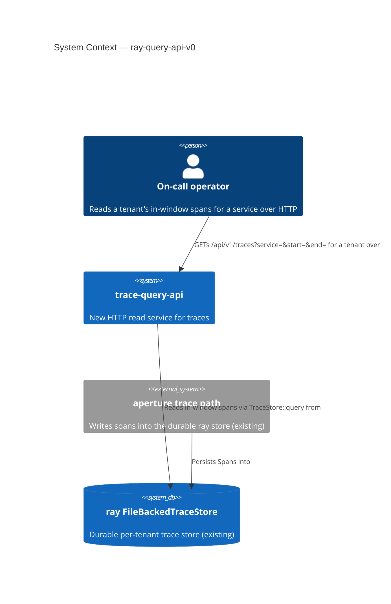
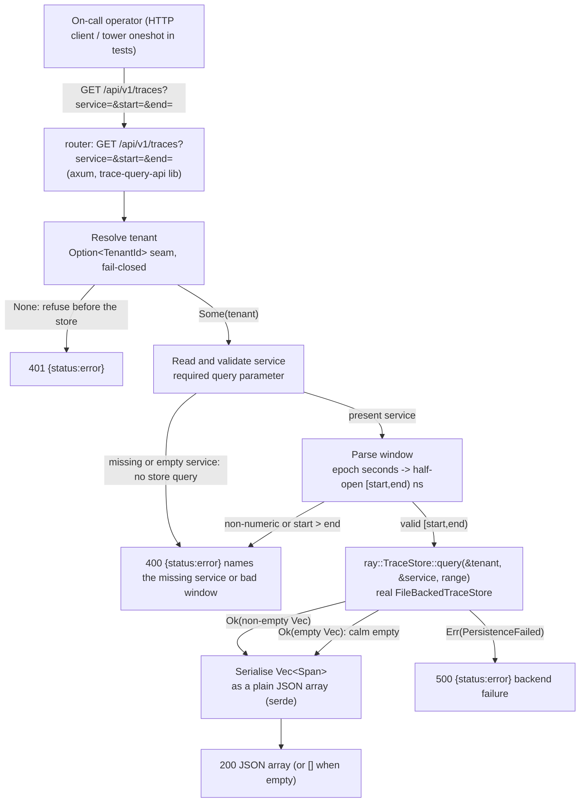

# Application Architecture: ray-query-api-v0

Author: `@nw-solution-architect` (Morgan), DESIGN wave, 2026-05-22.
Interaction mode: propose. British English. No em dashes.

This is the read half of the traces pillar, the third and final
observability pillar: an HTTP endpoint that, given a resolved tenant, a
required `service`, and a half-open window `[start, end)`, returns the
in-window `Span`s as a plain JSON array, read from the real durable ray
`FileBackedTraceStore` through the existing `TraceStore::query`. Unlike
logs and metrics, the ray range query REQUIRES a `&ServiceName`: there is
no tenant+range-only trace query, so `service` is an explicit required
request parameter and a missing/empty `service` is a 400, not an empty
result. Decisions are recorded in
`docs/product/architecture/adr-0048-ray-trace-query-api-contract-and-crate-layout.md`
and `wave-decisions.md` in this directory.

## C4 Level 1 — System Context



## C4 Level 2 — Container / handler flow

The whole change lives inside the new `trace-query-api` container,
reading the existing `ray` store. The flow is the pinned orchestration:
resolve tenant (fail-closed) -> read and validate `service` -> parse
window -> query -> serialise. The one structural divergence from the logs
read path is the required-`service` step, which sits before the store and
yields a 400 on missing/empty.



L3 (component) is NOT produced: the crate is a thin lib + binary with one
handler, one fail-closed seam, one required-`service` check, one bounds
parser, and one serialise step over the existing store trait, not a
multi-component subsystem. ADR-0042's metrics endpoint and ADR-0047's logs
endpoint, the directly analogous precedents, also did not need an L3 for
this shape.

## Crate layout (recommended)

```
crates/
└── trace-query-api/                # NEW thin crate, lib + binary
    ├── Cargo.toml
    ├── src/
    │   ├── lib.rs                  # pub fn router(store, tenant) -> Router;
    │   │                           #   handle_traces handler; required-service
    │   │                           #   check; parse_time_range; success
    │   │                           #   (plain array) + error_response
    │   ├── composition.rs          # resolve_tenant / resolve_pillar_root /
    │   │                           #   resolve_addr / probe (testable seam)
    │   └── main.rs                 # thin composition root: open
    │                               #   FileBackedTraceStore, resolve tenant,
    │                               #   probe, bind axum listener
    └── tests/
        └── slice_01_traces_walking_read.rs   # tower oneshot acceptance suite
```

## Changes Per File / New Files

| File | New / Changed | What |
|---|---|---|
| `crates/trace-query-api/Cargo.toml` | NEW | New workspace crate; deps axum 0.7 + hyper + tokio + serde + serde_json + tracing + mutants (all already in the workspace lock), `ray` and `aegis` by path; dev-dep tower (oneshot). No `regex`, no `pulse`, no `lumen`. |
| `crates/trace-query-api/src/lib.rs` | NEW | `pub fn router(store: Arc<dyn TraceStore + Send + Sync>, tenant: Option<TenantId>) -> Router` over route `GET /api/v1/traces`; `handle_traces` handler (resolve tenant -> read and validate required `service`, 400 on missing/empty before the store -> parse bounds -> `query(&tenant, &service, range)` -> serialise); `parse_time_range` (epoch seconds, float-tolerant, inversion check, produces `ray::TimeRange`); `success` (plain JSON array of `Span`s); `error_response` (`{status,error}`). |
| `crates/trace-query-api/src/composition.rs` | NEW | Testable composition seam: `resolve_tenant` (`KALEIDOSCOPE_TRACE_QUERY_TENANT`, fail-closed), `resolve_pillar_root`, `resolve_addr`, `probe` (trivial empty-range query against the resolved tenant and a probe service name before binding). |
| `crates/trace-query-api/src/main.rs` | NEW | Thin composition root: open durable `FileBackedTraceStore` at `pillar_root/ray`, resolve tenant, run `probe` (wire -> probe -> use, `health.startup.refused` on failure), bind axum listener. `#[mutants::skip]` on `main` (unkillable wiring mutant). |
| `crates/trace-query-api/tests/slice_01_traces_walking_read.rs` | NEW | tower `oneshot` acceptance suite: ingest in/out-of-window spans for a tenant/service into a real `FileBackedTraceStore`, query, assert in-window only / ascending `start_time_unix_nano` / full field fidelity (US-01); calm empty `[]` for empty window and unknown `(tenant, service)` (US-02); two-tenant isolation + no-tenant 401 (US-03); missing/empty `service` 400, bad-window 400, `PersistenceFailed` 500, redaction (US-04). |
| Workspace `Cargo.toml` (members) | CHANGED | Add `crates/trace-query-api` to the workspace members list. |
| `crates/ray/src/store.rs` | UNCHANGED | `TraceStore::query(&tenant, &service, range)` is reused as-is; NO trait change. `get_trace` and `query_with(predicate)` exist but are out of scope for slice 01. |
| `crates/ray/src/span.rs` | UNCHANGED | `Span` already derives `serde::Serialize`; the array serialises faithfully with no hand-written mapping. |
| `crates/query-api/**`, `crates/log-query-api/**` | UNCHANGED | The metrics and logs crates are not touched; traces are a separate domain in a separate crate. |

## Reuse note (pattern, not types)

The lib+binary split, the fail-closed `Option<TenantId>` router seam, the
`error_response` shape, the epoch-seconds bounds parser, the tower
`oneshot` test posture, and the wire-then-probe-then-use composition root
are all REPRODUCED from the proven `query-api` (ADR-0042) and
`log-query-api` (ADR-0047) precedents, not imported: the metrics types
(`MetricStore`, the PromQL `selector`, the `matrix` translator, the
Prometheus envelope) and the logs types (`LogStore`, `LogRecord`) are NOT
reused. Traces use `ray::TraceStore`, `ray::Span`, `ray::TimeRange`, a
plain array, and the one structural divergence unique to them: the
required `service` parameter (the store mandates a `&ServiceName`). This
is the THIRD clone of the HTTP scaffolding, the rule-of-three trigger, so
the ~30 genuinely shared lines are DUPLICATED in place and a dedicated
`query-http-common` extraction is RECORDED as a forward-looking
recommendation for AFTER this crate ships, not done as a rider on this
thin slice (the three `TimeRange` types differ and the three contracts
differ in body shape). See the Reuse Analysis table in `wave-decisions.md`.

## Quality attribute coverage (ISO 25010)

| Attribute | How addressed |
|---|---|
| Functional Suitability | In-window spans returned in ascending `start_time_unix_nano` order via `TraceStore::query`; half-open `[start,end)` boundary (start included, end excluded); every `Span` field round-trips via the existing `serde::Serialize` derive (hex `trace_id`/`span_id`, status, attribute maps, events, links), no hand-written mapping to drift. |
| Reliability | Honest outcomes: a calm 200 `[]` for empty (empty window OR unknown `(tenant, service)`), a 400 for a missing/empty `service` or a bad window (no store query run), a 500 for `PersistenceFailed` that never fabricates an empty success; no panic on bad input. |
| Security | Fail-closed tenancy (no tenant -> 401, refused before the store); zero cross-tenant leak; the error text never echoes a forwarded header/credential value nor the raw `service`/`start`/`end` values (DD redaction symmetry with ADR-0047 / ADR-0042 / ADR-0027 §6). |
| Maintainability | One thin new crate, clean domain boundary from the metrics `query-api` and logs `log-query-api`; the only polymorphism is the `Arc<dyn TraceStore>` seam; per-feature mutation testing scoped to the diff at 100% kill rate (ADR-0005 Gate 5). |
| Performance Efficiency | The read path is a single `TraceStore::query` over the store's natural ascending order plus a serde serialise; no per-row super-linear step; slice 01 adds no filtering. |
| Portability | Pure-Rust deps already in the workspace lock; no new external substrate, no platform-specific code. |
| Compatibility | A plain JSON array of raw OTLP-shaped spans is consumable by any HTTP client; no speculative consumer envelope; trace assembly or Grafana Tempo shaping can be added behind the same route, additively, when a real consumer needs it. |

## Handoffs

DISTILL (`@nw-acceptance-designer`): translate the slice-01 ACs (US-01
in-window + ascending order + field fidelity, US-02 calm empty, US-03
tenant scoping + fail-closed, US-04 missing-service 400 + bad-window 400 +
store-failure 500 + redaction) into `#[test]` functions driving `router`
via tower `oneshot` against a real `FileBackedTraceStore` and a failing
store double. Required reading: this document; `wave-decisions.md`;
ADR-0048; the DISCUSS user stories and `discuss/wave-decisions.md`.

DEVOPS (`@nw-platform-architect`, Apex): see the DEVOPS Handoff Annotation
in `wave-decisions.md` (new `gate-5-mutants-trace-query-api` job, new
per-crate tag at graduation, no new external dependency, new Earned-Trust
probe, per-feature mutation 100%, external integrations none, and the
forward-looking `query-http-common` extraction flag).
