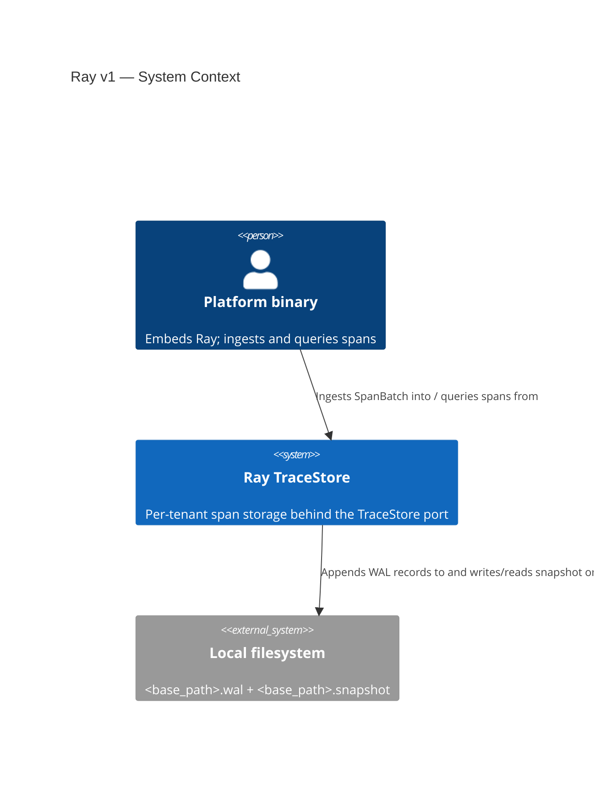
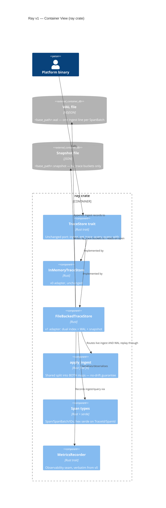

# Ray v1 — Application Architecture (C4 L1 + L2)

Author: `@nw-solution-architect` (Morgan), DESIGN wave, 2026-05-21.

`FileBackedTraceStore` adds durability to the `ray` crate behind the
unchanged `TraceStore` port, alongside `InMemoryTraceStore`. NDJSON WAL
+ JSON snapshot, dual index (`by_trace`, `by_service`) rebuilt on
recovery through one shared `apply_ingest` routine. Structural carry-
forward of `crates/pulse/src/file_backed.rs`.

## C4 Level 1 — System Context

The filesystem is the single driven dependency. Recovery is the
Earned-Trust probe: `open` parses every persisted line and fails loud
on the first corruption rather than trusting the substrate.

## C4 Level 2 — Container View

### Key shape notes

- **Dual index, single writer.** `Inner` holds `by_trace:
  HashMap<(TenantId, TraceId), Vec>` and `by_service:
  HashMap<(TenantId, ServiceName), Vec>` behind one `Mutex`.
  Both are populated only by `apply_ingest`.
- **No-drift guarantee.** Live `ingest` and WAL `replay` call the same
  `apply_ingest`; there is exactly one place that decides which map a
  span enters. Empty-`service.name` spans enter `by_trace` only.
- **Derived service index.** The snapshot persists `by_trace` buckets
  only; `by_service` is rebuilt from those spans on recovery. The
  on-disk format never duplicates a span.
- **Hex IDs.** `TraceId`/`SpanId` serialise as lowercase hex strings
  via a hand-rolled `hex` module; all other span types use plain serde
  derives.

### L3 — not produced

Single-`Mutex<Inner>` adapter; the reification conditions
(columnar/trace_id-partitioned index, write/read-index split,
compaction scheduler) are all v2. Two maps behind one lock with one
shared writer do not warrant a component-level decomposition.
