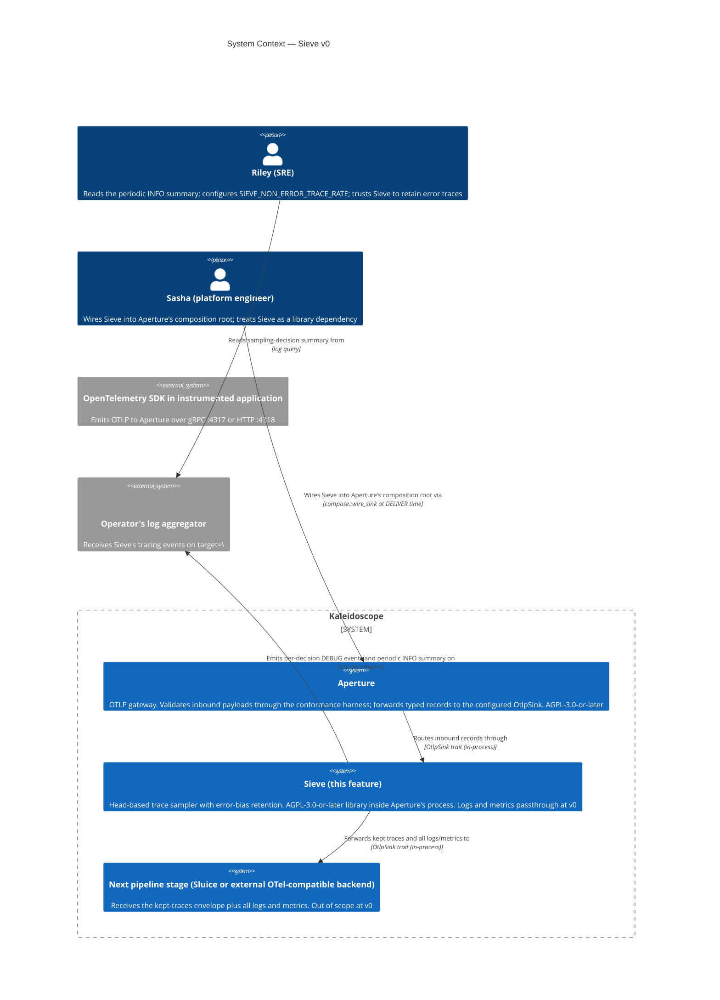

# Sieve v0 — C4 System Context (L1)

The system context shows Sieve's place in the Kaleidoscope pipeline at
v0. Sieve is a library inside Aperture's process boundary; the
operator-facing personas are Riley (SRE) and Sasha (platform
engineer) per `docs/feature/sieve/discuss/journey-sieve.yaml`.

## Notes

- Sieve is **inside Aperture's process boundary** at v0. The L1 box
  shows it as a separate system because the AGPL-licensed library is
  a separate compilation unit with its own ADRs and CI gates, but the
  data flow between Aperture and Sieve is in-process function calls,
  not network hops.
- The "Next pipeline stage" is Sluice or an external OTel-compatible
  backend. Sluice is out of scope at v0; the integration is via
  whatever inner `OtlpSink` Aperture's composition root constructs.
- The operator-facing flow has two arrows from Riley: one to
  configure the rate, one to read the summary. Riley does not
  interact with Sieve directly; she interacts with the deployment
  manifest (env var) and the log aggregator (summary readout).
- Sasha interacts with Aperture's composition root, not Sieve
  directly. The DELIVER-wave wiring is the platform-engineering
  touchpoint.
