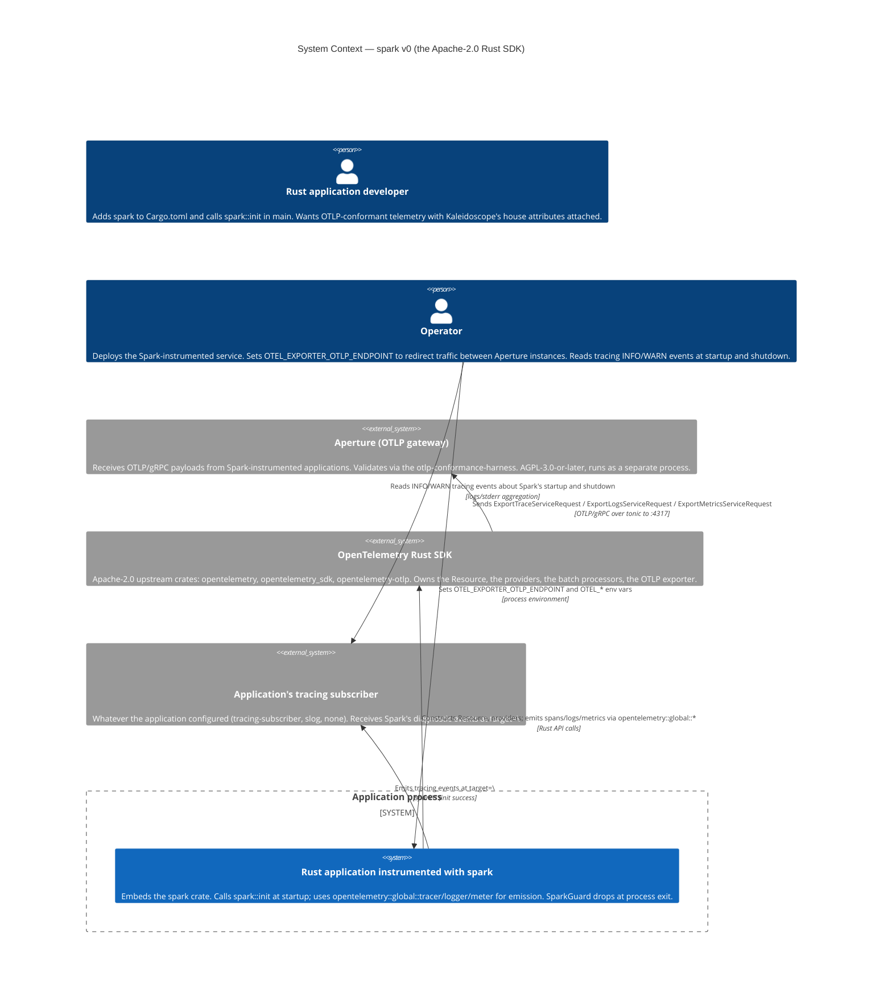

# C4 Level 1 — System Context for `spark` v0

> **Wave**: DESIGN.
> **Author**: Morgan (`nw-solution-architect`).
> **Date**: 2026-05-06.
> **Companion documents**: `c4-container.md`, `c4-component.md`,
> `wave-decisions.md`, `technology-choices.md`.

This is the highest-level view of where `spark` sits in the
Kaleidoscope integration plane. The actors are the people / systems
who interact with a Spark-instrumented application, **not** with
Spark itself — `spark` is a library; it has no operator surface and
no runtime persona of its own.

The diagram answers: who is involved when an application calls
`spark::init(...)` and starts emitting telemetry?

---

## Diagram

---

## Reading the diagram

### Personas

- **Rust application developer** — the primary persona. Adds Spark to
  their `Cargo.toml`, calls `spark::init` in `main`, then uses the
  standard OTel API for span/log/metric emission. Spark's value
  proposition lands here: one function call replaces a page of OTel
  SDK setup.
- **Operator** — the secondary persona. Does not write application
  code; sets `OTEL_*` env vars on the deployment manifest to redirect
  traffic between Aperture instances (Slice 04). Reads `tracing`
  events at startup (resolved-config) and shutdown (drained / deadline)
  via whatever logging stack the application's tracing subscriber
  emits to.

### The application-process boundary

The dashed boundary ("Application process") is critical: `spark` lives
**inside** this process. It is not a service. It does not bind to a
port. It does not run a daemon. The application calls Spark's `init`
synchronously; the OTel SDK + OTLP exporter inside the same process
do the network work.

### External systems

Three external systems Spark interacts with:

1. **Aperture (OTLP gateway)** — the Phase-1 receiver Spark sends to.
   Aperture is a separate AGPL process; Spark's licensing posture
   (Apache-2.0) is preserved because the AGPL crate is a `dev-dependency`
   (integration tests only) per ADR-0013.
2. **OpenTelemetry Rust SDK** — the substrate Spark wraps. Spark
   does NOT redefine, wrap, or re-export OTLP types; consumers import
   from `opentelemetry`, `opentelemetry_sdk`, `opentelemetry-otlp`
   directly (ADR-0011 §"Public surface" `pub use` discipline).
3. **Application's tracing subscriber** — Spark's diagnostic channel.
   Per D5 (no telemetry from telemetry), Spark's own events
   (`spark::init succeeded`, `spark: shutdown initiated`, etc.) go
   here, never through the OTel pipeline Spark configured.

### The wire

The single solid arrow `Application -> Aperture` is OTLP/gRPC over
tonic at `=0.27` family pin (ADR-0013 §1). Wire bytes are decodable
by the harness Aperture runs because both share `opentelemetry-proto
=0.27.0` (harness ADR-0003).

---

## Why this is the right Level-1 picture

The C4 Level 1 diagram answers "who interacts with the system?". For
a library, the system is the application that embeds the library —
**not** the library itself. The Spark-instrumented application is
therefore the central actor; Spark is one of the substrates inside it.

Rejecting the alternative shape ("show `spark::init` and `SparkGuard`
as nodes at L1"): that would be a Level-3 component view collapsed
into Level 1, mixing abstraction layers and confusing the
stakeholder-view audience.

The L2 (Container) diagram zooms inside the application-process
boundary. The L3 (Component) diagram zooms inside `spark`'s own
internal modules. See the companion files.

---

## What this diagram does not show

- **Code-level details** — `spark::init` is at L3, not L1.
- **The harness or its corpus** — the harness is inside Aperture's
  boundary at L1; Spark interacts with Aperture, not directly with
  the harness. (Spark depends on the harness only transitively via
  Aperture's dev-dep chain; Spark itself does not import the harness
  crate.)
- **Future Aegis / Loom / Codex / Sieve consumers** — they are Phase
  2+ external systems that will read the house attributes from the
  wire bytes Spark emits via Aperture's downstream sinks. At v0 they
  do not exist as deployed systems and are not L1 actors.
- **Spark's own internal structure** — see `c4-component.md`.
