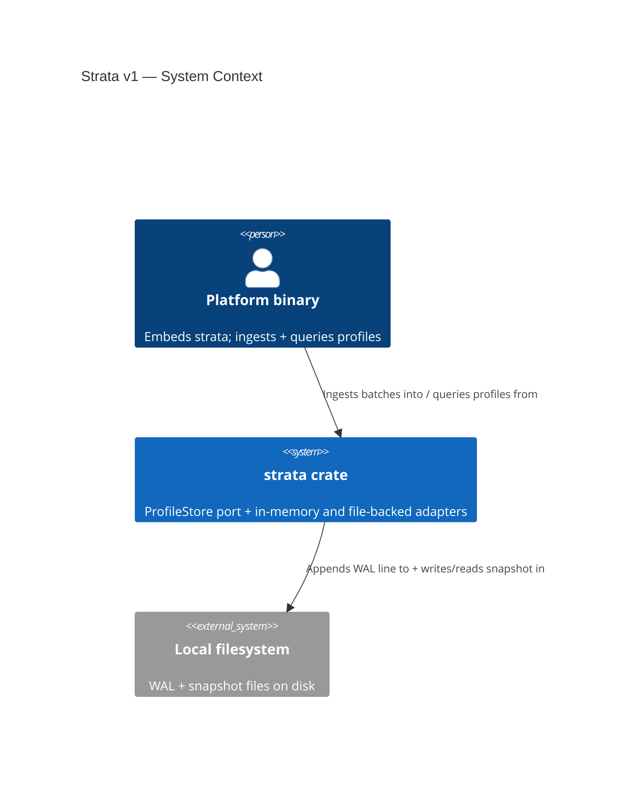
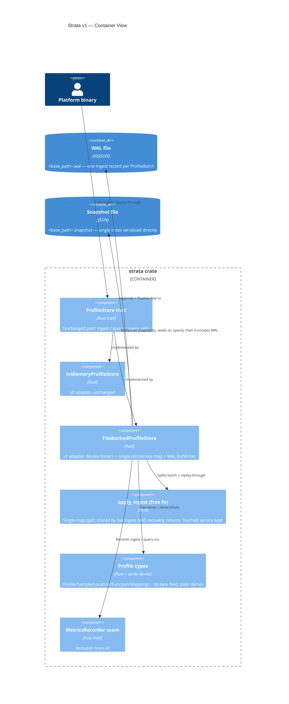

# Strata v1 — Application Architecture (C4 L1 + L2)

Author: `@nw-solution-architect` (Morgan), DESIGN wave, 2026-05-21.
Feature: `strata-v1` — `FileBackedProfileStore` behind the unchanged
`ProfileStore` trait. Sixth and final v0 to v1 durable-adapter
carry-forward. AGPL-3.0-or-later.

## Level 1 — System Context

The platform binary embedding `strata` ingests and queries profiles
through the `ProfileStore` port. The single driven dependency is the
local filesystem (`<base_path>.wal` and `<base_path>.snapshot`). No
network, no daemon, no third-party service.

## Level 2 — Container View

Within the `strata` crate, the `ProfileStore` trait (unchanged) is
implemented by two adapters: `InMemoryProfileStore` (v0, unchanged) and
`FileBackedProfileStore` (v1, new). The new adapter routes both live
ingest and WAL replay through one shared `apply_ingest` over the single
per-service map — the no-drift guarantee. The profile types gain serde
derives only. Two new on-disk data stores appear: the WAL file and the
snapshot file.

## Level 3 — not produced

Single-`Mutex<Inner>` adapter; one map behind one lock with one shared
writer. There is no second derived index (the contrast with Ray) and no
internal sub-structure that an L3 would clarify. Reification conditions
(columnar `service`-partitioned index, write/read split, compaction
scheduler, gimli/addr2line symbolisation) are all v2.

## Earned Trust — driven adapter probe

The filesystem is the one driven dependency. The empirical probe is
recovery itself: `open()` replays the WAL through the SAME
`apply_ingest` the live path uses, so a recovery that diverged from
live state would be caught by the KPI 3 durability acceptance test
(drop-and-reopen, profile-for-profile equality across WAL-only and
snapshot+WAL paths). A corrupt WAL line fails loud as
`ProfileStoreError::PersistenceFailed { reason }` naming the line
number, rather than silently truncating. Honest scope for v1:
`BufWriter::flush` only — fsync, atomic snapshot rename and file
locking are explicitly v2, so the probe does not yet assert
crash-during-write survival (documented limitation, not a hidden one).
